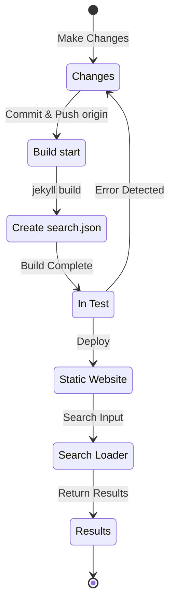

## አጠቃላይ እይታ
በ12024 ዓ.ም. 7ኛ ወር መጀመሪያ ላይ፣ በJekyll ላይ የተመሠረተና በGithub Pages የሚስተናገድ ይህ ብሎግ ላይ [Polyglot](https://github.com/untra/polyglot) ፕላግን በመተግበር የብዙ ቋንቋ ድጋፍ ታክሎበታል።
ይህ ተከታታይ በChirpy ገጽታ ላይ የPolyglot ፕላግንን ሲተገብር የተፈጠሩ ብግኖችን እና የመፍትሄ ሂደታቸውን፣ እንዲሁም SEOን ከግምት ውስጥ ያስገባ የhtml ራስጌ እና sitemap.xml መጻፍ መንገድን ያካፍላል።
ተከታታዩ ከ3 ጽሁፎች የተዋቀረ ሲሆን፣ እያነበቡት ያለው ይህ ጽሁፍ የተከታታዩ ሶስተኛው ነው።
- ክፍል 1: [የPolyglot ፕላግን መተግበር & html ራስጌ እና sitemap ማስተካከል](/posts/how-to-support-multi-language-on-jekyll-blog-with-polyglot-1)
- ክፍል 2: [የቋንቋ ምርጫ አዝራር መተግበር & የአቀማመጥ ቋንቋ አካባቢያዊ ማድረግ](/posts/how-to-support-multi-language-on-jekyll-blog-with-polyglot-2)
- ክፍል 3: የChirpy ገጽታ የbuild አልተሳካም እና የፍለጋ ባህሪ ስህተት መፍትሄ (ዋና ጽሁፍ)

> መጀመሪያ ላይ በጠቅላላ 2 ክፍሎች እንዲሆን ተዘጋጅቶ ነበር፣ ነገር ግን በኋላ በርካታ ጊዜ ይዘቱ ሲደገፍ መጠኑ በጣም ስለጨመረ ወደ 3 ክፍሎች ተደርጎ ተደራጀ።
{: .prompt-info }

## መስፈርቶች
- [x] የbuild ውጤቱ(ድረ ገጾች) በቋንቋ የተለዩ መንገዶች(ex. `/posts/ko/`{: .filepath}, `/posts/ja/`{: .filepath}) ሊቀርቡ ይገባል።
- [x] ለብዙ ቋንቋ ድጋፍ ተጨማሪ የሚፈልጉትን ጊዜና ጥረት በተቻለ መጠን ለመቀነስ፣ በተጻፈው የመነሻ markdown ፋይል YAML front matter ውስጥ `lang` እና `permalink` ታጎችን አንድ በአንድ ሳይገልጹ በbuild ጊዜ ፋይሉ በሚገኝበት አካባቢያዊ መንገድ(ex. `/_posts/ko/`{: .filepath}, `/_posts/ja/`{: .filepath}) መሠረት ቋንቋውን በራስ-ሰር ሊለይ ይገባል።
- [x] በጣቢያው ውስጥ ያሉ እያንዳንዱ ገጽ ራስጌ ክፍሎች ተገቢ የContent-Language ሜታ ታግ፣ hreflang አማራጭ ታጎች እና canonical link መያዝ አለባቸው እንዲሁም ለብዙ ቋንቋ ፍለጋ የGoogle SEO መመሪያዎችን ሊያሟሉ ይገባል።
- [x] በጣቢያው ውስጥ ያሉ የእያንዳንዱ ቋንቋ ስሪት ገጽ ማገናኛዎች ሳይቀሩ በ`sitemap.xml`{: .filepath} መቅረብ አለባቸው፣ እና `sitemap.xml`{: .filepath} ራሱ ድግግሞሽ ሳይኖርበት በroot መንገድ ላይ አንድ ብቻ ሊኖር ይገባል።
- [x] [Chirpy ገጽታ](https://github.com/cotes2020/jekyll-theme-chirpy) የሚሰጣቸው ሁሉም ባህሪያት በእያንዳንዱ ቋንቋ ገጽ ላይ በመደበኛነት መስራት አለባቸው፣ ካልሆነም እንዲሰሩ መሻሻል አለባቸው።
  - [x] 'Recently Updated', 'Trending Tags' ባህሪያት በመደበኛነት መስራት
  - [x] በGitHub Actions የbuild ሂደት ውስጥ ስህተት እንዳይፈጠር
  - [x] በብሎጉ ቀኝ ላይ ከላይ ያለው የፖስት ፍለጋ ባህሪ በመደበኛነት መስራት

## ከመጀመርዎ በፊት
ይህ ጽሁፍ ከ[ክፍል 1](/posts/how-to-support-multi-language-on-jekyll-blog-with-polyglot-1) እና [ክፍል 2](/posts/how-to-support-multi-language-on-jekyll-blog-with-polyglot-2) የሚቀጥል ስለሆነ፣ እስካሁን ካላነበቡት በመጀመሪያ ከቀደሙት ጽሁፎች ጀምረው እንዲያነቡ እመክራለሁ።

## ችግር መፍትሄ ('relative_url_regex': target of repeat operator is not specified)

(+ 12025.10.08. ዝማኔ) [ይህ ብግ በPolyglot 1.11 ስሪት ተፈትቷል](https://polyglot.untra.io/2025/09/20/polyglot.1.11.0/).

ከቀደሙት ደረጃዎች በኋላ `bundle exec jekyll serve` ትዕዛዝን በማስኬድ build ሙከራ ሲደረግ፣ `'relative_url_regex': target of repeat operator is not specified` የሚል ስህተት ተፈጥሮ የbuild ሂደቱ አልተሳካም።

```shell
...(ከፊል ተዘለለ)
                    ------------------------------------------------
      Jekyll 4.3.4   Please append `--trace` to the `serve` command 
                     for any additional information or backtrace. 
                    ------------------------------------------------
/Users/yunseo/.gem/ruby/3.2.2/gems/jekyll-polyglot-1.8.1/lib/jekyll/polyglot/
patches/jekyll/site.rb:234:in `relative_url_regex': target of repeat operator 
is not specified: /href="?\/((?:(?!*.gem)(?!*.gemspec)(?!tools)(?!README.md)(
?!LICENSE)(?!*.config.js)(?!rollup.config.js)(?!package*.json)(?!.sass-cache)
(?!.jekyll-cache)(?!gemfiles)(?!Gemfile)(?!Gemfile.lock)(?!node_modules)(?!ve
ndor\/bundle\/)(?!vendor\/cache\/)(?!vendor\/gems\/)(?!vendor\/ruby\/)(?!en\/
)(?!ko\/)(?!es\/)(?!pt-BR\/)(?!ja\/)(?!fr\/)(?!de\/)[^,'"\s\/?.]+\.?)*(?:\/[^
\]\[)("'\s]*)?)"/ (RegexpError)

...(የቀረው ተዘለለ)
```

ተመሳሳይ ችግር ከዚህ በፊት ተመዝግቦ እንደነበር ለማየት ከፈለግሁ በኋላ፣ በPolyglot ሪፖዚቶሪ ውስጥ [በትክክል ተመሳሳይ ጉዳይ](https://github.com/untra/polyglot/issues/204) እንደተመዘገበ እና መፍትሄውም እንዳለ አግኝቻለሁ።

በዚህ ብሎግ ላይ በሥራ ላይ የሚገኘው [የChirpy ገጽታ `_config.yml`{: .filepath}](https://github.com/cotes2020/jekyll-theme-chirpy/blob/master/_config.yml) ፋይል ውስጥ የሚከተለው ኮድ አለ።

```yml
exclude:
  - "*.gem"
  - "*.gemspec"
  - docs
  - tools
  - README.md
  - LICENSE
  - "*.config.js"
  - package*.json
```
{: file='\_config.yml'}

የችግሩ ምክንያት በ[Polyglot `site.rb`{: .filepath}](https://github.com/untra/polyglot/blob/master/lib/jekyll/polyglot/patches/jekyll/site.rb) ፋይል ውስጥ ያሉት የሚከተሉት ሁለት ተግባራት የregular expression አጻጻፍ በላይ እንደታየው `"*.gem"`, `"*.gemspec"`, `"*.config.js"` ያሉ ዋይልድካርድ ያላቸው የglobbing ንድፎችን በመደበኛነት ማስተናገድ አልቻሉም።


```ruby
    # a regex that matches relative urls in a html document
    # matches href="baseurl/foo/bar-baz" href="/foo/bar-baz" and others like it
    # avoids matching excluded files.  prepare makes sure
    # that all @exclude dirs have a trailing slash.
    def relative_url_regex(disabled = false)
      regex = ''
      unless disabled
        @exclude.each do |x|
          regex += "(?!#{x})"
        end
        @languages.each do |x|
          regex += "(?!#{x}\/)"
        end
      end
      start = disabled ? 'ferh' : 'href'
      %r{#{start}="?#{@baseurl}/((?:#{regex}[^,'"\s/?.]+\.?)*(?:/[^\]\[)("'\s]*)?)"}
    end

    # a regex that matches absolute urls in a html document
    # matches href="http://baseurl/foo/bar-baz" and others like it
    # avoids matching excluded files.  prepare makes sure
    # that all @exclude dirs have a trailing slash.
    def absolute_url_regex(url, disabled = false)
      regex = ''
      unless disabled
        @exclude.each do |x|
          regex += "(?!#{x})"
        end
        @languages.each do |x|
          regex += "(?!#{x}\/)"
        end
      end
      start = disabled ? 'ferh' : 'href'
      %r{(?<!hreflang="#{@default_lang}" )#{start}="?#{url}#{@baseurl}/((?:#{regex}[^,'"\s/?.]+\.?)*(?:/[^\]\[)("'\s]*)?)"}
    end
```
{: file='(polyglot root path)/lib/jekyll/polyglot/patches/jekyll/site.rb'}


ይህን ችግር ለመፍታት ሁለት መንገዶች አሉ።

### 1. Polyglotን fork ካደረጉ በኋላ ችግሩ ያለበትን ክፍል አስተካክለው መጠቀም
ይህን ጽሁፍ በምጽፍበት ጊዜ(12024.11.) መሠረት [የJekyll ኦፊሴላዊ ሰነዶች](https://jekyllrb.com/docs/configuration/options/#global-configuration) የ`exclude` ቅንብር የglobbing ንድፎችን መጠቀም እንደሚደግፍ በግልጽ ይገልጻሉ።

>"This configuration option supports Ruby's File.fnmatch filename globbing patterns to match multiple entries to exclude."

ማለትም፣ የችግሩ መንስኤ Chirpy ገጽታ አይደለም፤ ይልቁንም በPolyglot ውስጥ ያሉ `relative_url_regex()`, `absolute_url_regex()` ሁለቱ ተግባራት ናቸው፣ ስለዚህ ችግር እንዳይፈጠር በሚገባ ማስተካከል መሠረታዊ መፍትሄ ነው።

~~በPolyglot ውስጥ ይህ ብግ ገና አልተፈታም፣~~ ላይ እንደተገለጸው [ከPolyglot 1.11 ስሪት ጀምሮ ይህ ችግር ተፈትቷል](https://polyglot.untra.io/2025/09/20/polyglot.1.11.0/). ችግሩ በወቅቱ ሲፈጠር ግን ~~[ይህን ብሎግ ጽሁፍ](https://hionpu.com/posts/github_blog_4#4-polyglot-%EC%9D%98%EC%A1%B4%EC%84%B1-%EB%AC%B8%EC%A0%9C)(ጣቢያው ጠፍቷል) እና~~ [በላይ በተጠቀሰው የGitHub issue ላይ የተጻፈውን መልስ](https://github.com/untra/polyglot/issues/204#issuecomment-2143270322) በመመርኮዝ Polyglot ሪፖዚቶሪን fork ካደረግሁ በኋላ ችግሩ ያለበትን ክፍል እንደሚከተለው በማስተካከል ከመነሻው Polyglot ይልቅ ተጠቅሜ መፍትሄ ማግኘት ተችሏል።


```ruby
    def relative_url_regex(disabled = false)
      regex = ''
      unless disabled
        @exclude.each do |x|
          escaped_x = Regexp.escape(x)
          regex += "(?!#{escaped_x})"
        end
        @languages.each do |x|
          escaped_x = Regexp.escape(x)
          regex += "(?!#{escaped_x}\/)"
        end
      end
      start = disabled ? 'ferh' : 'href'
      %r{#{start}="?#{@baseurl}/((?:#{regex}[^,'"\s/?.]+\.?)*(?:/[^\]\[)("'\s]*)?)"}
    end

    def absolute_url_regex(url, disabled = false)
      regex = ''
      unless disabled
        @exclude.each do |x|
          escaped_x = Regexp.escape(x)
          regex += "(?!#{escaped_x})"
        end
        @languages.each do |x|
          escaped_x = Regexp.escape(x)
          regex += "(?!#{escaped_x}\/)"
        end
      end
      start = disabled ? 'ferh' : 'href'
      %r{(?<!hreflang="#{@default_lang}" )#{start}="?#{url}#{@baseurl}/((?:#{regex}[^,'"\s/?.]+\.?)*(?:/[^\]\[)("'\s]*)?)"}
    end
```
{: file='(polyglot root path)/lib/jekyll/polyglot/patches/jekyll/site.rb'}


### 2. በChirpy ገጽታ '\_config.yml' ቅንብር ፋይል ውስጥ ያሉ የglobbing ንድፎችን በትክክለኛ የፋይል ስሞች መተካት
በእርግጥ መደበኛና ተስማሚ መንገድ ይህ ፓች በPolyglot ዋና ፕሮጀክት ውስጥ እንዲካተት መሆኑ ነው። ነገር ግን እስከዚያ ድረስ fork የተደረገውን ስሪት መጠቀም ያስፈልጋል፤ ይህ ግን Polyglot upstream በሚዘምን ጊዜ ሁሉ ያን ዝማኔ ሳይቀር መከታተል እና ማካተት አስቸጋሪ ስለሆነ እኔ ሌላ መንገድ ተጠቀምሁ።

በ[Chirpy ገጽታ ሪፖዚቶሪ](https://github.com/cotes2020/jekyll-theme-chirpy) ውስጥ በፕሮጀክት root መንገድ ላይ ያሉ ፋይሎች መካከል `"*.gem"`, `"*.gemspec"`, `"*.config.js"` ንድፎችን የሚመለከቱትን ፋይሎች ብንመለከት በእርግጥ ከታች ያሉት 3 ብቻ ናቸው።
- `jekyll-theme-chirpy.gemspec`{: .filepath}
- `purgecss.config.js`{: .filepath}
- `rollup.config.js`{: .filepath}

ስለዚህ `_config.yml`{: .filepath} ፋይል ውስጥ ባለው `exclude` ኮድ ከglobbing ንድፎች አስወግደው እንደሚከተለው ቢተኩት Polyglot ያለምንም ችግር ሊያስተናግደው ይችላል።

```yml
exclude: # የተሻሻለው https://github.com/untra/polyglot/issues/204 ጉዳይን በማጣቀስ ነው።
  # - "*.gem"
  - jekyll-theme-chirpy.gemspec # - "*.gemspec"
  - tools
  - README.md
  - LICENSE
  - purgecss.config.js # - "*.config.js"
  - rollup.config.js
  - package*.json
```
{: file='\_config.yml'}

## የፍለጋ ባህሪ ማስተካከል
ከቀደሙት ደረጃዎች በኋላ አብዛኞቹ የጣቢያው ባህሪያት ተፈለገው እንደነበረው በጣም አርኪ ሁኔታ እንደሚሰሩ ታየ። ነገር ግን፣ በChirpy ገጽታ ያለው ገጽ በቀኝ ላይ ከላይ የሚገኘው የፍለጋ አሞሌ ከ`site.default_lang`(በዚህ ብሎግ ሁኔታ እንግሊዝኛ) ውጪ ባሉ ቋንቋዎች የተጻፉ ገጾችን መረጃ ማድረግ እንደማይችል፣ እንዲሁም ከእንግሊዝኛ ውጪ ባሉ ቋንቋ ገጾች ላይ ፍለጋ ሲደረግ የፍለጋ ውጤት እንግሊዝኛ ገጽ ማገናኛዎችን እንደሚያሳይ በኋላ ተገነዘብሁ።

ምክንያቱን ለማወቅ፣ በፍለጋ ባህሪው ውስጥ የሚሳተፉት ፋይሎች ምን እንደሆኑ እና ከእነዚህ መካከል ችግሩ በየት እንደሚፈጠር እንመልከት።

### '\_layouts/default.html'
በብሎጉ ውስጥ ያሉ ሁሉንም ገጾች አወቃቀር የሚያስተናግደው [`_layouts/default.html`{: .filepath}](https://github.com/cotes2020/jekyll-theme-chirpy/blob/master/_layouts/default.html) ፋይል ውስጥ፣ በ`<body>` ኤለመንት ውስጥ `search-results.html`{: .filepath} እና `search-loader.html`{: .filepath} የሚባሉ ፋይሎች ይጫናሉ መሆኑን ማረጋገጥ ይቻላል።


```liquid
  <body>
    

    <div id="main-wrapper" class="d-flex justify-content-center">
      <div class="container d-flex flex-column px-xxl-5">
        
        (...መካከለኛ ክፍል ተዘለለ...)

        
      </div>

      <aside aria-label="Scroll to Top">
        <button id="back-to-top" type="button" class="btn btn-lg btn-box-shadow">
          <i class="fas fa-angle-up"></i>
        </button>
      </aside>
    </div>

    (...መካከለኛ ክፍል ተዘለለ...)

    
  </body>
```
{: file='\_layouts/default.html'}


### '\_includes/search-result.html'
[`_includes/search-result.html`{: .filepath}](https://github.com/cotes2020/jekyll-theme-chirpy/blob/master/_includes/search-results.html) በፍለጋ መስኮቱ ውስጥ ቃል ሲገባ ለዚያ ቁልፍ ቃል የሚዛመዱ የፍለጋ ውጤቶች የሚቀመጡበት `search-results` ኮንቴነርን ያዋቅራል።


```html
<!-- The Search results -->

<div id="search-result-wrapper" class="d-flex justify-content-center d-none">
  <div class="col-11 content">
    <div id="search-hints">
      
    </div>
    <div id="search-results" class="d-flex flex-wrap justify-content-center text-muted mt-3"></div>
  </div>
</div>
```
{: file='\_includes/search-result.html'}


### '\_includes/search-loader.html'
[`_includes/search-loader.html`{: .filepath}](https://github.com/cotes2020/jekyll-theme-chirpy/blob/master/_includes/search-loader.html) በትክክል [Simple-Jekyll-Search](https://github.com/christian-fei/Simple-Jekyll-Search) ቤተ-መጽሐፍት ላይ የተመሠረተ ፍለጋን የሚተገብረው ዋና ክፍል ነው፣ ይህም [`search.json`{: .filepath}](#assetsjsdatasearchjson) የindex ፋይል ውስጥ ካለው ይዘት ጋር የሚዛመዱ የገቡትን ቁልፍ ቃላት ፈልጎ ተዛማጅ የፖስት ማገናኛዎችን እንደ `<article>` ኤለመንት የሚመልስ JavaScript በጎብኚው አሳሽ ላይ እንደሚያስኬድ ስለሆነ Client-Side እንደሚሰራ መረዳት ይቻላል።


```js

  <article class="px-1 px-sm-2 px-lg-4 px-xl-0">
    <header>
      <h2><a href="{url}">{title}</a></h2>
      <div class="post-meta d-flex flex-column flex-sm-row text-muted mt-1 mb-1">
        {categories}
        {tags}
      </div>
    </header>
    <p>{snippet}</p>
  </article>


<p class="mt-5">{{ site.data.locales[include.lang].search.no_results }}</p>

<script>
   Note: dependent library will be loaded in `js-selector.html` 
  document.addEventListener('DOMContentLoaded', () => {
    SimpleJekyllSearch({
      searchInput: document.getElementById('search-input'),
      resultsContainer: document.getElementById('search-results'),
      json: '{{ '/assets/js/data/search.json' | relative_url }}',
      searchResultTemplate: '{{ result_elem | strip_newlines }}',
      noResultsText: '{{ not_found }}',
      templateMiddleware: function(prop, value, template) {
        if (prop === 'categories') {
          if (value === '') {
            return `${value}`;
          } else {
            return `<div class="me-sm-4"><i class="far fa-folder fa-fw"></i>${value}</div>`;
          }
        }

        if (prop === 'tags') {
          if (value === '') {
            return `${value}`;
          } else {
            return `<div><i class="fa fa-tag fa-fw"></i>${value}</div>`;
          }
        }
      }
    });
  });
</script>
```
{: file='\_includes/search-loader.html'}


### '/assets/js/data/search.json'

```liquid
---
layout: compress
swcache: true
---

[
  
  {
    "title": {{ post.title | jsonify }},
    "url": {{ post.url | relative_url | jsonify }},
    "categories": {{ post.categories | join: ', ' | jsonify }},
    "tags": {{ post.tags | join: ', ' | jsonify }},
    "date": "{{ post.date }}",
    
    
    "snippet": {{ _content | truncate: 200 | jsonify }},
    "content": {{ _content | jsonify }}
  },
  
]
```
{: file='/assets/js/data/search.json'}


የJekyll Liquid አጻጻፍን በመጠቀም በጣቢያው ውስጥ ያሉ ሁሉንም ፖስቶች ርዕስ፣ URL፣ ካቴጎሪዎችና ታጎች መረጃ፣ የተጻፈበት ቀን፣ ከዋና ጽሁፉ ውስጥ የመጀመሪያ 200 ፊደላት ስኒፔት፣ እና ሙሉ ይዘቱን የያዘ JSON ፋይል ተገልጿል።

### የፍለጋ ባህሪው የሚሰራበት መዋቅር እና ችግሩ የሚፈጠርበትን ክፍል መለየት
ማለትም በአጭሩ እንደምናጠቃልል፣ GitHub Pages ላይ Chirpy ገጽታ እየተስተናገደ ሲሆን የፍለጋ ባህሪው በሚከተለው ሂደት ይሰራል።



እዚህ `search.json`{: .filepath} በPolyglot እንደሚከተለው በእያንዳንዱ ቋንቋ እንደሚፈጠር ተረጋግጧል።
- `/assets/js/data/search.json`{: .filepath}
- `/ko/assets/js/data/search.json`{: .filepath}
- `/ja/assets/js/data/search.json`{: .filepath}
- `/zh-TW/assets/js/data/search.json`{: .filepath}
- `/es/assets/js/data/search.json`{: .filepath}
- `/pt-BR/assets/js/data/search.json`{: .filepath}
- `/fr/assets/js/data/search.json`{: .filepath}
- `/de/assets/js/data/search.json`{: .filepath}

ስለዚህ የችግሩ መንስኤ የሆነው ክፍል "Search Loader" ነው። ከእንግሊዝኛ ውጪ ያሉ ሌሎች ቋንቋ ስሪቶች ገጾች እንዳይፈለጉ የሚያደርገው ችግር፣ `_includes/search-loader.html`{: .filepath} ውስጥ በአሁኑ ጊዜ የሚታየው ገጽ ቋንቋ ምንም ይሁን ምን የእንግሊዝኛውን የindex ፋይል(`/assets/js/data/search.json`{: .filepath}) ብቻ በstatic መንገድ ስለሚጫን ነው። 

> - ነገር ግን markdown ወይም html ፋይሎች እንዳሉ አይደለም፤ JSON ፋይሎች ላይ `post.title`, `post.content` ያሉ በJekyll የሚሰጡ ተለዋዋጮች ላይ የPolyglot wrapper ይሰራል ነገር ግን [Relativized Local Urls](https://github.com/untra/polyglot?tab=readme-ov-file#relativized-local-urls) ባህሪ የማይሰራ ይመስላል። 
> - እንዲሁም JSON ፋይል template ውስጥ ከJekyll መደበኛ ተለዋዋጮች ውጪ [Polyglot በተጨማሪ የሚሰጣቸው `{{ site.default_lang }}`, `{{ site.active_lang }}` liquid tags](https://github.com/untra/polyglot?tab=readme-ov-file#features) እንደማይደረስባቸው በሙከራ ሂደት ተረጋግጧል።
>
> ስለዚህ በindex ፋይሉ ውስጥ ያሉ `title`, `snippet`, `content` ያሉ እሴቶች በቋንቋ መሠረት በተለያዩ መንገዶች ይፈጠራሉ፣ ነገር ግን `url` እሴቱ ቋንቋውን ያላገናዘበ መደበኛ መንገድ ይመልሳል፣ እና ለዚህ "Search Loader" ክፍል ውስጥ ተገቢ አስተካክል መጨመር ያስፈልጋል።
{: .prompt-warning }

### ችግሩን መፍታት
ይህን ለመፍታት `_includes/search-loader.html`{: .filepath} ውስጥ ያለውን ይዘት እንደሚከተለው ማስተካከል ይበቃል።


```

  <article class="px-1 px-sm-2 px-lg-4 px-xl-0">
    <header>
      
      <h2><a href="/{{ site.active_lang }}{url}">{title}</a></h2>
      
      <h2><a href="{url}">{title}</a></h2>
      

(...መካከለኛ ክፍል ተዘለለ...)

<script>
   Note: dependent library will be loaded in `js-selector.html` 
  document.addEventListener('DOMContentLoaded', () => {
    
    
      
    
    
    SimpleJekyllSearch({
      searchInput: document.getElementById('search-input'),
      resultsContainer: document.getElementById('search-results'),
      json: '{{ search_path | relative_url }}',
      searchResultTemplate: '{{ result_elem | strip_newlines }}',

(...የቀረው ተዘለለ)
```
{: file='\_includes/search-loader.html'}


- `site.active_lang`(የአሁኑ ገጽ ቋንቋ) እና `site.default_lang`(የጣቢያው መደበኛ ቋንቋ) እኩል ካልሆኑ ከJSON ፋይሉ የሚጫነው የፖስት URL በፊት `"/{{ site.active_lang }}"` prefix እንዲጨመርበት የ`` ክፍሉ የliquid አጻጻፍ ተሻሽሏል።
- በተመሳሳይ መንገድ፣ በbuild ሂደት ውስጥ የአሁኑ ገጽ ቋንቋን ከጣቢያው መደበኛ ቋንቋ ጋር እያነጻጸረ እኩል ከሆኑ መደበኛ መንገዱን(`/assets/js/data/search.json`{: .filepath})፣ ካልሆኑ ደግሞ ከዚያ ቋንቋ ጋር የሚስማማውን መንገድ(e.g. `/ko/assets/js/data/search.json`{: .filepath}) `search_path` እንዲሆን የ`<script>` ክፍሉ ተሻሽሏል።

እንዲህ አድርጎ ከማስተካከሉ በኋላ ድረ ገጹን እንደገና build ሲደረግ፣ የፍለጋ ውጤቶቹ በእያንዳንዱ ቋንቋ መሠረት በመደበኛነት እንደሚታዩ ተረጋግጧል።

> `{url}` በኋላ ፍለጋ ሲካሄድ በJS በJSON ፋይሉ ውስጥ ከተነበበው URL እሴት የሚተካበት ቦታ ነው እንጂ በbuild ጊዜ ላይ ትክክለኛ URL አይደለም፣ ስለዚህ Polyglot እንደ localization ዒላማ አይመለከተውም እና በቋንቋ መሠረት በቀጥታ መስተካከል አለበት። ችግሩ ግን እንዲህ ተስተካክሎ የተጻፈው `"/{{ site.active_lang }}{url}"` template በbuild ጊዜ relative URL እንደሆነ ይታወቃል፣ እና localization አስቀድሞ ቢጠናቀቅም Polyglot ይህን አያውቅም ስለዚህ እንደገና localization ለማድረግ ይሞክራል(e.g. `"/ko/ko/posts/example-post"`{: .filepath})። ይህን ለመከላከል [`` tag](https://github.com/untra/polyglot?tab=readme-ov-file#disabling-url-relativizing) በግልጽ ተጠቅመናል።
{: .prompt-tip }
