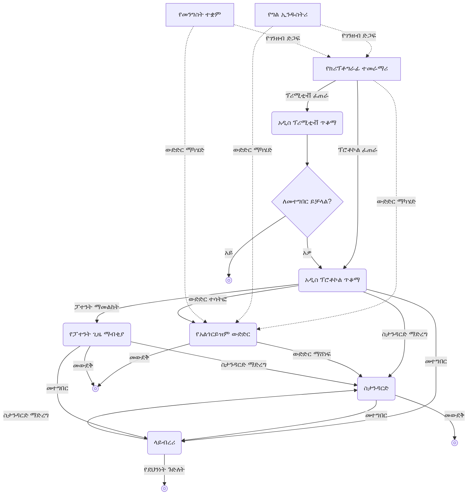

## ክሪፕቶግራፊ ምንድን ነው

**ክሪፕቶግራፊ(cryptography)** በመሠረቱ፣ **ፕሮቶኮል(protocol)**ን ከጠላታዊ ተግባራት ለመከላከል የሚያተኩር የሳይንስ ንዑስ ዘርፍ ነው።

እዚህ ላይ ፕሮቶኮል ማለት አንድ ወይም ከአንድ በላይ ሰዎች አንድ ነገር ለማሳካት መከተል ያለባቸው የደረጃዎች ዝርዝር ሲሆን፣ ለምሳሌ በመሣሪያዎች መካከል ክሊፕቦርድ መጋራት እንፈልጋለን ብንል የሚከተለው ለክሊፕቦርድ መጋራት ፕሮቶኮል ነው።

1. በአንዱ መሣሪያ ላይ በክሊፕቦርድ ውስጥ ለውጥ ሲኖር፣ ያንን የክሊፕቦርድ ይዘት ቅጂ በማድረግ ወደ ሰርቨር ይላካል።
2. ሰርቨሩ በተጋራው ክሊፕቦርድ ላይ ለውጥ እንደተፈጠረ ለቀሩት መሣሪያዎች ያሳውቃል።
3. ቀሪዎቹ መሣሪያዎች የተጋራውን የክሊፕቦርድ ይዘት ከሰርቨሩ ያወርዳሉ።

ነገር ግን ይህ ጥሩ ፕሮቶኮል አይደለም፣ ምክንያቱም የክሊፕቦርድ ይዘቱን በግልጽ ጽሑፍ ቅጽ ወደ ሰርቨር እንደሚላክ እና እንደሚወርድ ከሆነ በመገናኛ ሂደቱ መካከል አንድ ሰው ወይም ሰርቨሩ ራሱ የክሊፕቦርድ ይዘቱን ሊሰርቅ ሊያይ ይችላል። እዚህ ላይ የክሊፕቦርድ ይዘቱን ለመሰለይ የሚሞክር ጠላት መኖሩን በመገመት መከላከል የክሪፕቶግራፊ ሚና ነው።

## ሲሜትሪክ ክሪፕቶግራፊ

### ሲሜትሪክ ምስጠራ

> አሊስ(Alice) ለቦብ(Bob) ደብዳቤ መላክ ያለባት ሁኔታ እንዳለ እንያስብ። አሊስ ለቦብ ሚስጥራዊ መረጃ ለማስተላለፍ ደብዳቤውን እንዲወስድ እና እንዲያደርስ ለመልእክተኛ(messenger) ትእዛዝ ትሰጣለች።
> ነገር ግን አሊስ መልእክተኛውን ሙሉ በሙሉ አትታመነውም፣ እና እየተላለፈ ያለው መልእክት ደብዳቤውን ከሚወስደው መልእክተኛ ጨምሮ ከቦብ በስተቀር ለማንም ሰው ሚስጥር እንዲቆይ ትፈልጋለች።

እንዲህ ያለ ሁኔታ ለመጠቀም ከብዙ ዘመን በፊት የተፈጠረው የክሪፕቶግራፊ አልጎርይዝም የሚባለው **ሲሜትሪክ የምስጠራ አልጎርይዝም(symmetric encryption algorithm)** ነው።

> **ፕሪሚቲቭ(primitive)**  
> ፕሪሚቲቭ(primitive) የሚለው ቃል በመደበኛ ትርጉሙ ‘መሠረታዊ’, ‘ቀዳማዊ ነገር’ ማለት ነው።
> ነገር ግን በክሪፕቶግራፊም ይህ ፕሪሚቲቭ የሚለው ቃል ብዙ ጊዜ ይጠቀማል፣ እዚህ ላይ ፕሪሚቲቭ ማለት የክሪፕቶግራፊ ስርዓትን የሚያቀናብሩ ትንሹ የሆኑ ተግባሮች ወይም አልጎርይዝሞች ማለት ነው።
> ‘መሠረታዊ አካል’, ‘መሠረታዊ ሎጂክ’ እንደሚለው ማስተዋል ይቻላል።
{: .prompt-info }

የሚከተሉትን ሁለት ተግባሮች የሚሰጥ አንድ ፕሪሚቲቭ እንዳለ እንመልከት።
- `ENCRYPT`: **ሚስጥራዊ ቁልፍ(secret key)**ን(ብዙ ጊዜ ትልቅ ቁጥር) እና **መልእክት(message)**ን እንደ ግቤት በመቀበል፣ ተከታታይ የቁጥር ሕብረትን እንደ የተመሰጠረ መልእክት ይወጣል
- `DECRYPT`: የ`ENCRYPT` ተቃራኒ ተግባር ሲሆን፣ ተመሳሳይ ሚስጥራዊ ቁልፍ እና የተመሰጠረ መልእክትን እንደ ግቤት በመቀበል ዋናውን መልእክት ይወጣል

እንዲህ ያለ የምስጠራ ፕሪሚቲቭ በመጠቀም መልእክተኛውን ጨምሮ ሶስተኛ ወገኖች የአሊስን መልእክት እንዳያነቡ ለመደበቅ፣ መጀመሪያ አሊስ እና ቦብ ቀድሞ በመገናኘት የትኛውን ሚስጥራዊ ቁልፍ እንደሚጠቀሙ መወሰን አለባቸው። ከዚያ በኋላ አሊስ `ENCRYPT` ተግባሩን በመጠቀም በተስማሙበት ሚስጥራዊ ቁልፍ መልእክቷን ማመስጠር ትችላለች፣ እና ይህን የተመሰጠረ መልእክት በመልእክተኛው አማካኝነት ለቦብ ታደርሳለች። ከዚያም ቦብ ተመሳሳይ ሚስጥራዊ ቁልፍን በመጠቀም `DECRYPT` ተግባሩ አማካኝነት ዋናውን መልእክት ያገኛል።

እንዲህ በሚስጥራዊ ቁልፍ ዒላማውን ማመስጠር እና በውጫዊ እይታ ከማይረባ ድምፅ ጋር ለመለየት የማይቻል ማድረግ በክሪፕቶግራፊ ውስጥ ፕሮቶኮሎችን ለመጠበቅ የተለመደ ዘዴ ነው።

ሲሜትሪክ ምስጠራ የ**ሲሜትሪክ ክሪፕቶግራፊ(symmetric cryptography)** ወይም **ሚስጥራዊ ቁልፍ ክሪፕቶግራፊ(secret key cryptography)** ተብሎ በሚጠራ ትልቅ የክሪፕቶግራፊ አልጎርይዝሞች ምድብ ውስጥ ይገባል፣ እና እንደ ሁኔታው ከአንድ በላይ ቁልፎች ሊኖሩ ይችላሉ።

## የኬርክሆፍስ መርህ

ዛሬ እኛ ከወረቀት ደብዳቤ እጅግ የበለጠ ኃይለኛ የሆኑ ኮምፒውተርና ኢንተርኔት የሚባሉ የመገናኛ መንገዶችን በመጠቀም በቅርብ ወይም እስከ ቅጽበታዊ ጊዜ ድረስ መግባባት እንችላለን። ነገር ግን ይህን በሌላ አገላለጽ ማለት ክፉ አላማ ያላቸው መልእክተኞችም ከዚህ በላይ ኃይለኛ ሆነዋል ማለት ነው፤ እነሱ ካፌ ወይም ተመሳሳይ ያልተጠበቁ የህዝብ Wi‑Fi ሊሆኑ ይችላሉ፣ ወይም የመገናኛ ኩባንያዎች(ISP)ን ጨምሮ ኢንተርኔቱን የሚያቀናብሩ እና መልእክቶችን የሚያስተላልፉ የተለያዩ የመገናኛ መሳሪያዎችና ሰርቨሮች፣ የመንግስት ተቋማት፣ እንዲሁም አልጎርይዝሙን የሚያስኬድ የራስዎ መሣሪያ ውስጥ እንኳ ሊገኙ ይችላሉ። ጠላቶች ብዙ መልእክቶችን በቅጽበት ማየት ይችላሉ፣ እና ሰዎች ሳያስተውሉ መልእክቶችን በናኖ ሰከንድ ደረጃ ሊቀይሩ፣ ሊያዳምጡ ወይም ሊሰናክሉ ይችላሉ።

ክሪፕቶግራፊ በረጅም የሙከራና የስህተት ሂደት ውስጥ አስተማማኝ ደህንነት ለማግኘት የወጣ አንድ ታላቅ መርህ አለ፤ <u>ፕሪሚቲቮች በግልጽ ሁኔታ ለትንተና መቀረብ አለባቸው</u> የሚለው ነው። ከዚህ ጋር ተቃራኒ የሆነው ዘዴ **በግልጽ አለመሆን ላይ የተመሰረተ ደህንነት(security by obscurity)** ሊባል ይችላል፣ እና ገደቦቹ ግልጽ ስለሆኑ ዛሬ ተተውቷል።

ይህ ታላቅ መርህ በ11883 ዓመት በኔዘርላንድስ የቋንቋ ምሁርና ክሪፕቶግራፈር የነበረው ኦጉስት ኬርክሆፍስ(Auguste Kerckhoffs) ለመጀመሪያ ጊዜ የቀየረው ሲሆን፣ **የኬርክሆፍስ መርህ(Kerckhoffs's principle)** ተብሎ ይጠራል። ተመሳሳይ መርህን የአሜሪካ የሂሳብ ምሁር፣ የኮምፒውተር ሳይንስ ምሁር፣ ክሪፕቶግራፈር እና የመረጃ ንድፈ ሐሳብ አባት የሆነው ክሎድ ሻኖን(Claude Shannon) “ጠላት ስርዓቱን ያውቃል(The enemy knows the system)” በማለት፣ ማለትም “ማንኛውንም ስርዓት ሲነድፉ ጠላት ያንን ስርዓት እንደሚያውቀው መገመት አለብዎት” ብሎ ገልጿል፣ ይህም **የሻኖን ንግግር(Shannon's maxim)** ተብሎ ይጠራል።

የክሪፕቶ ስርዓት ደህንነት በቁልፉ ሚስጥራዊነት ላይ ብቻ መመስረት አለበት፣ እና የክሪፕቶ ስርዓቱ ራሱ ቢታወቅም ችግር መፍጠር የለበትም፣ እንዲሁም በAES ምሳሌ እንደሚታየው ብዙ **ክሪፕቶ ተንታኞች(cryptanalyst)** ሊያረጋግጡት እንዲችሉ በንቃት ሊገለጥ ይገባል። ሚስጥር ሁልጊዜ የመፈሳቱ አደጋ አለው፣ ስለዚህ እሱ የሚችል የውድቀት ነጥብ ነው፤ ስለዚህ ሚስጥር ሆኖ መቆየት ያለበት ክፍል ትንሽ እየሆነ ሄደ በመጠኑ ለመከላከያ በተሻለ ሁኔታ ይጠቅማል። እንደ ክሪፕቶ ስርዓት ያለ ትልቅና ውስብስብ ስርዓትን በሙሉ ለረጅም ጊዜ ሚስጥር አድርጎ ማቆየት በጣም ከባድ ነው፣ ነገር ግን ቁልፉን ብቻ ሚስጥር አድርጎ ማቆየት አንፃራዊ ቀላል ነው። ከዚህ በላይ ሚስጥሩ ቢፈስም እንኳ፣ ሙሉ የክሪፕቶ ስርዓትን ከመቀየር ይልቅ የፈሰሰውን ቁልፍ በአዲስ ቁልፍ መቀየር እጅግ ቀላል ነው።

## አሲሜትሪክ ክሪፕቶግራፊ

ብዙ ፕሮቶኮሎች በእውነት በሲሜትሪክ ክሪፕቶግራፊ ላይ ተመስርተው ይሰራሉ፣ ነገር ግን ይህ ዘዴ ቁልፉን ለመወሰን ሁለቱም ተሳታፊዎች ቢያንስ አንድ ጊዜ ቀድሞ በተናጠል መገናኘት እንዳለባቸው ይገምታል። ስለዚህ ቁልፉን እንዴት እንደሚወስኑ እና በደህና እንዴት እንደሚጋሩ ችግር ይፈጠራል፣ ይህንንም **ቁልፍ ስርጭት(key distribution)** ይላሉ። የቁልፍ ስርጭት ችግር ለረጅም ጊዜ አስቸጋሪ ጉዳይ ነበር፣ እና በ11970ዎቹ መጨረሻ **አሲሜትሪክ ክሪፕቶግራፊ(asymmetric cryptography)** ወይም **የሕዝብ ቁልፍ ክሪፕቶግራፊ(public key cryptography)** ተብሎ የሚጠራ የክሪፕቶግራፊ አልጎርይዝም ሲፈጠር ብቻ ተፈታ።

የአሲሜትሪክ ክሪፕቶግራፊ ዋና ዋና ፕሪሚቲቮች **ቁልፍ ልውውጥ(key exchange)**፣ **አሲሜትሪክ ምስጠራ(asymmetric encryption)**፣ **ዲጂታል ፊርማ(digital signature)** ናቸው።

### ቁልፍ ልውውጥ

**ቁልፍ ልውውጥ** በአጠቃላይ እንዲህ ይሰራል።

1. አሊስ እና ቦብ አንድ የመለኪያ ስብስብ $G$ በጋራ ለመጠቀም ይስማማሉ
2. አሊስ እና ቦብ እያንዳንዳቸው የሚጠቀሙትን **ሚስጥራዊ ቁልፍ(private key)** $a, b$ ይወስናሉ
3. አሊስ እና ቦብ መጀመሪያ ለመጠቀም በተስማሙበት የጋራ መለኪያ $G$ ላይ የራሳቸውን ሚስጥራዊ ቁልፎች $a$, $b$ በማጣመር **የሕዝብ ቁልፍ(public key)** $A = f(G,a)$, $B = f(G,b)$ ያስላሉ፣ ከዚያም እነዚህን በግልጽ ያጋራሉ
4. አሊስ የቦብን የሕዝብ ቁልፍ $B = f(G,b)$ እና የራሷን ሚስጥራዊ ቁልፍ $a$ በመጠቀም $f(B,a) = f(f(G,b),a)$ ታስላለች፣ ቦብም በተመሳሳይ የአሊስን የሕዝብ ቁልፍ $A = f(G,a)$ እና የራሱን ሚስጥራዊ ቁልፍ $b$ በመጠቀም $f(A,b) = f(f(G,a),b)$ ያስላል
5. እዚህ $f(f(G,a),b) = f(f(G,b),a)$ የሚሆን ባህሪ ያለው ተስማሚ $f$ ከተጠቀሙ፣ በመጨረሻ አሊስ እና ቦብ አንድ ዓይነት ሚስጥር ይጋራሉ፣ ሶስተኛ ወገንም $G$ እና የሕዝብ ቁልፎች $A = f(G,a)$, $B = f(G,b)$ን ቢያውቅም በዚህ ብቻ $f(A,b)$ን ማወቅ አይችልም ስለዚህ ሚስጥሩ ይጠበቃል

ብዙ ጊዜ እንዲህ የተጋራው ሚስጥር ለወደፊት ሌሎች መልእክቶችን ለመለዋወጥ [ሲሜትሪክ ምስጠራ](#ሲሜትሪክ-ምስጠራ) ሚስጥራዊ ቁልፍ ሆኖ ይጠቀማል።

ለመጀመሪያ ጊዜ የታተመው እና እጅግ የታወቀው የቁልፍ ልውውጥ አልጎርይዝም በፈጣሪዎቹ ሁለት ሰዎች የቤተሰብ ስም ዲፊ(Diffie) እና ሄልማን(Hellman) የተሰየመው የዲፊ-ሄልማን ቁልፍ ልውውጥ አልጎርይዝም ነው።

ነገር ግን የዲፊ-ሄልማን ቁልፍ ልውውጥም ገደቦች አሉት። አጥቂ በየሕዝብ ቁልፍ ልውውጥ ደረጃ ላይ የሕዝብ ቁልፎች $A = f(G,a)$, $B = f(G,b)$ን መካከል በመያዝ በራሱ ቁልፍ $M = f(G,m)$ ቀይሮ ለአሊስ እና ለቦብ የሚላክበትን ሁኔታ እንያስብ። በዚህ ጊዜ አሊስ እና አጥቂው የሐሰት ሚስጥር $f(M, a) = f(A, m)$ ይጋራሉ፣ ቦብ እና አጥቂውም ሌላ የሐሰት ሚስጥር $f(M, b) = f(B, m)$ ይጋራሉ። እንዲህ ከሆነ አጥቂው ለአሊስ ፊት ቦብ መስሎ፣ ለቦብ ፊት ደግሞ አሊስ መስሎ መታየት ይችላል። እንዲህ ያለ ሁኔታ ሲፈጠር <u><strong>መካከለኛ ሰው(man-in-the-middle, MITM)</strong> ፕሮቶኮሉን በስኬት ጥቃት አድርጎበታል</u> ተብሎ ይባላል። በዚህ ምክንያት ቁልፍ ልውውጥ የመተማመን ችግርን ሙሉ በሙሉ አያስወግድም፤ ግን ተሳታፊዎች ብዙ ሲሆኑ ሂደቱን ለማቀላጠፍ ይረዳል።

### አሲሜትሪክ ምስጠራ

የዲፊ-ሄልማን ቁልፍ ልውውጥ አልጎርይዝም ከተፈጠረ በኋላ በፍጥነት ተከታይ ፈጠራ ተደረገ፣ ይህም በፈጣሪዎቹ ሮናልድ ሪቨስት(Ronald Rivest)፣ አዲ ሻሚር(Adi Shamir)፣ ሌነርድ አድልማን(Leonard Adleman) የቤተሰብ ስም የተሰየመው **RSA አልጎርይዝም(RSA algorithm)** ነው። RSA ሁለት ፕሪሚቲቮችን፣ የሕዝብ ቁልፍ ምስጠራ(አሲሜትሪክ ምስጠራ) እና ዲጂታል ፊርማን ያካትታል፣ ሁለቱም የአሲሜትሪክ ክሪፕቶግራፊ ክፍሎች ናቸው።

**አሲሜትሪክ ምስጠራ** ሲመጣ፣ ሚስጥራዊነትን ለማረጋገጥ መልእክትን ማመስጠር የሚለው መሠረታዊ ዓላማ ከ[ሲሜትሪክ ምስጠራ](#ሲሜትሪክ-ምስጠራ) ጋር ተመሳሳይ ነው። ነገር ግን ተመሳሳይ ሲሜትሪክ ቁልፍን ለምስጠራና ለፍቺ ሁለቱም የሚጠቀም ሲሜትሪክ ምስጠራ ከሚለየው በተቃራኒ፣ አሲሜትሪክ ምስጠራ የሚከተሉትን ባህሪያት አሉት።
- በሁለት ዓይነት ቁልፎች፣ የሕዝብ ቁልፍ እና ሚስጥራዊ ቁልፍ ይሰራል
- ማንም በየሕዝብ ቁልፉ ማመስጠር ይችላል፣ ነገር ግን ፍቺ የሚቻለው ሚስጥራዊ ቁልፉን ባለው ሰው ብቻ ነው

1. ማንም ሰው መልእክት ውስጡ አስገብቶ መቆለፍ የሚችልበት፣ ነገር ግን አንዴ ከተቆለፈ በኋላ ቦብ ባለው ቁልፍ(ሚስጥራዊ ቁልፍ) ብቻ ሊከፈት የሚችል ክፍት ሣጥን(የሕዝብ ቁልፍ) አለ
2. አሊስ የምታስተላልፈውን መልእክት በሣጥኑ ውስጥ አስገብታ ከቆለፈች በኋላ(ከመሰጠረች በኋላ) ለቦብ ታደርሰዋለች
3. ቦብ የተቆለፈውን ሣጥን(የተመሰጠረ መልእክት) ከተቀበለ በኋላ፣ በራሱ ያለውን ቁልፍ(ሚስጥራዊ ቁልፍ) በመጠቀም ሣጥኑን ይከፍታል እና መልእክቱን ያወጣል(ፍቺ ያደርጋል)

### ዲጂታል ፊርማ

RSA ከአሲሜትሪክ ምስጠራ በተጨማሪ **ዲጂታል ፊርማ**ም ይሰጣል፣ እና ይህ የዲጂታል ፊርማ ፕሪሚቲቭ በአሊስና በቦብ መካከል መተማመንን ለመገንባት እጅግ ትልቅ እገዛ አድርጓል። መልእክት ላይ ሲፈርሙ የራሳቸውን ሚስጥራዊ ቁልፍ ይጠቀማሉ፣ ሌሎች ሰዎች ደግሞ የዚያን ፊርማ እውነተኛነት ለመረጋገጥ የተፈረመውን መልእክት፣ ፊርማውን፣ እና የፈራሚውን የሕዝብ ቁልፍ በመጠቀም ያረጋግጣሉ።

## የክሪፕቶግራፊ ጥቅም

የክሪፕቶግራፊ ዓላማ ፕሮቶኮልን ከጠላታዊ ተግባራት መጠበቅ ስለሆነ፣ ያ ፕሮቶኮል ሊያሳካ የሚፈልገው ግብ ምን እንደሆነ የክሪፕቶግራፊ ጥቅምን ይወስናል። አብዛኞቹ የክሪፕቶግራፊ ፕሪሚቲቮችና ፕሮቶኮሎች ከሚከተሉት አንዱን ወይም ከዚያ በላይ ባህሪያት አላቸው።
- **ሚስጥራዊነት(confidentiality)**: መረጃውን ማየት የማይገባቸው ሰዎች ላይ ከፊሉን መረጃ በመደበቅ መጠበቅ
- **ማረጋገጫ(authentication)**: የውይይት አጋሩን መለየት(e.g. የተቀበሉት መልእክት በእውነት አሊስ የላከችው መሆኑን ማረጋገጥ)

## የክሪፕቶግራፊ ኢኮሲስተም

