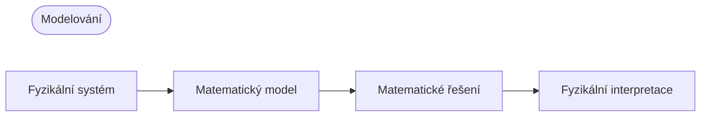

## Modelování (Modeling)

- **model (model)**: matematická formulace (pomocí proměnných, funkcí, rovnic apod.) inženýrského problému, který chceme řešit
- **matematické modelování (mathematical modeling)** neboli **modelování (modeling)**: proces sestavení modelu, jeho matematického vyřešení a interpretace výsledků

Protože mnoho fyzikálních veličin, jako je rychlost nebo zrychlení, jsou derivace, má model často tvar rovnice obsahující derivaci neznámé funkce, tj. **diferenciální rovnice (differential equation)**.

## Obyčejné diferenciální rovnice (ODE) a parciální diferenciální rovnice (PDE)

### Obyčejná diferenciální rovnice (ODE)

**obyčejná diferenciální rovnice (ordinary differential equation; ODE)**: rovnice obsahující $n$-tou derivaci neznámé funkce

Příklady)

$$y' = \cos x$$

$$ y'' + 9y = e^{-2x} $$

$$ y'y''' - \frac{3}{2}y'^{2} = 0 $$

### Parciální diferenciální rovnice (PDE)

**parciální diferenciální rovnice (partial differential equation; PDE)**: rovnice obsahující parciální derivace neznámé funkce se dvěma nebo více proměnnými

Příklad)

$$ \frac{\partial^2 u}{\partial x^2} + \frac{\partial^2 u}{\partial y^2} = 0 $$

## Řešení (Solution)

Je-li funkce $h(x)$ definovaná na nějakém otevřeném intervalu $(a, b)$ a je-li diferencovatelná, a pokud po dosazení $y\mapsto h$ a $y'\mapsto h'$ se daná obyčejná diferenciální rovnice stane identitou, pak funkci

$$ y = h(x) $$

nazýváme **řešením (solution)** dané ODR na intervalu $(a, b)$ a křivku funkce $h$ nazýváme **křivkou řešení (solution curve)**.

Příklady)

$$ y'=\cos x \Leftrightarrow y=\sin x+c $$

$$ y'=0.2y \Leftrightarrow y=ce^{0.2t} $$

Takové řešení obsahující libovolnou konstantu $c$ se nazývá **obecné řešení (general solution)** obyčejné diferenciální rovnice.

Geometricky je obecné řešení ODR množina nekonečně mnoha křivek řešení; každé hodnotě konstanty $c$ odpovídá právě jedna křivka. Zvolením konkrétní hodnoty $c$ získáme **partikulární řešení (particular solution)** ODR.

## Počáteční úloha (Initial Value Problem)

Abychom získali partikulární řešení daného problému, musíme určit hodnotu libovolné konstanty $c$. V mnoha případech ji lze určit pomocí **počáteční podmínky (initial condition)**, např. $y(x_{0})=y_{0}$ nebo $y(t_{0})=y_{0}$ (i když nezávislá proměnná není čas nebo i když $t_{0}\neq0$, říká se tomu stále počáteční podmínka). ODR s počáteční podmínkou se nazývá **počáteční úloha (initial value problem)**.

Příklad)

$$ y'=f(x,y),\qquad y(x_{0})=y_{0} $$

## Příklad modelování: exponenciální rozpad radioaktivní látky

Je dáno, že množství radioaktivní látky je 0,5 g. Určete množství, které zůstane po čase $t$.
> Podle experimentu se radioaktivní látka v každém okamžiku rozpadá rychlostí úměrnou množství látky, které v daném okamžiku zbývá, a proto se s časem zmenšuje.
{: .prompt-info }

### 1. Sestavení matematického modelu

Označme množství látky zbývající v čase $t$ jako $y(t)$. Protože $y'(t)$ je úměrné $y(t)$, dostaneme **ODR 1. řádu**

$$ \frac {dy}{dt} = -ky$$

(konstanta $k>0$).

Dále známe **počáteční podmínku** $y(0)=0.5$. Matematický model tedy můžeme zapsat jako následující **počáteční úlohu**:

$$ \frac {dy}{dt} = -ky, \qquad y(0)=0.5 $$

### 2. Matematické řešení

Obecné řešení výše sestavené ODR je následující (viz [metoda separace proměnných](/posts/Separation-of-Variables/#priklad-modelovani-radiokarbonove-datovani-radiocarbon-dating)).

$$ y(t)=ce^{-kt} $$

Protože $y(0)=c$, z počáteční podmínky dostaneme $y(0)=c=0.5$. Hledané partikulární řešení je tedy

$$ y(t)=0.5e^{-kt} \quad(k>0).$$

### 3. Fyzikální interpretace řešení

Nalezené řešení udává množství radioaktivní látky v libovolném čase $t$. Množství radioaktivní látky začíná na počáteční hodnotě 0,5 (g) a s časem klesá; pro $t \to \infty$ je limita $y$ rovna $0$.
