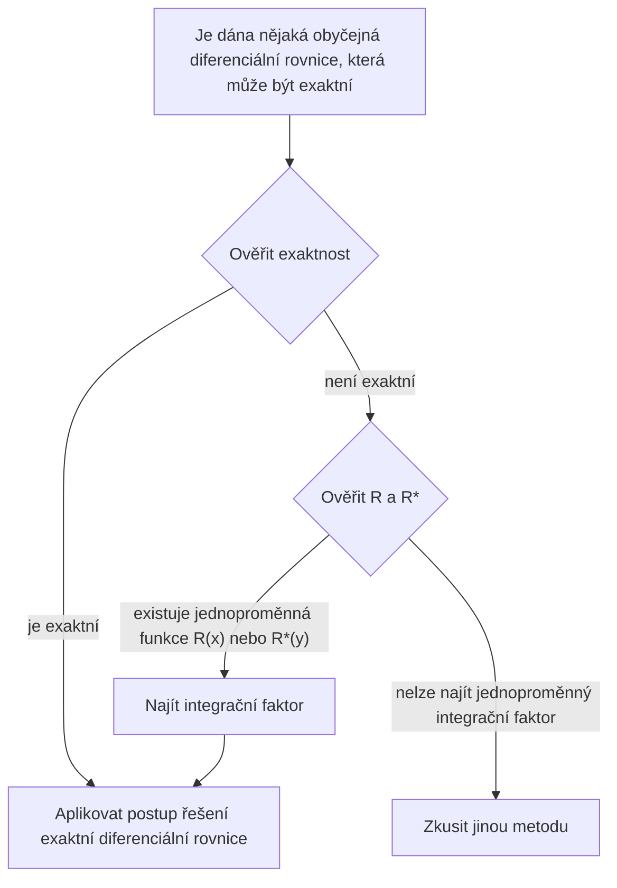

## TL;DR

## Exaktní diferenciální rovnice (Exact Differential Equation)

Diferenciální rovnice 1. řádu $M(x,y)+N(x,y)y'=0$ se dá zapsat jako

$$ M(x,y)dx+N(x,y)dy=0 \tag{1} $$

Pokud

$$ \exists u(x,y): \frac{\partial u}{\partial x}=M(x,y) \land \frac{\partial u}{\partial y}=N(x,y) \tag{2} $$

pak

$$ M(x,y)dx+N(x,y)dy=\frac{\partial u}{\partial x}dx+\frac{\partial u}{\partial y}dy=du \tag{3} $$

a v tom případě rovnici $M(x,y)dx+N(x,y)dy=0$ nazýváme **exaktní diferenciální rovnice (exact differential equation)**. Pak ji lze psát jako

$$ du=0 $$

a po integraci dostaneme obecné řešení přímo ve tvaru

$$ u(x,y)=c \tag{4} $$

## Test exaktnosti

V uzavřené oblasti v rovině $xy$, jejíž hranicí je uzavřená křivka neprotínající sama sebe, nechť jsou $M$ a $N$ i jejich první parciální derivace spojité. Podmínku (2) si znovu přepišme:

$$ \begin{align*}
\frac {\partial u}{\partial x}&=M(x,y) \tag{2a}
\\ \frac {\partial u}{\partial y}&=N(x,y) \tag{2b}
\end{align*}$$

Zparciálním derivováním dostaneme

$$ \begin{align*}
\frac {\partial M}{\partial y} &= \frac{\partial^2 u}{\partial y \partial x}
\\ \frac {\partial N}{\partial x} &= \frac{\partial^2 u}{\partial x \partial y}
\end{align*}$$

Protože předpokládáme spojitost, jsou tyto dvě druhé parciální derivace stejné, tedy

$$ \therefore \frac {\partial M}{\partial y}=\frac {\partial N}{\partial x} \tag{5}$$

Podmínka (5) je tedy nutnou podmínkou, aby se rovnice (1) stala exaktní; (zde to nedokazujeme) ve skutečnosti je to i podmínka postačující. Jinými slovy: ověřením této podmínky lze rozhodnout, zda jde o exaktní diferenciální rovnici.

## Řešení exaktní diferenciální rovnice

Z (2a) integrujme podle $x$ za předpokladu, že $y$ je konstanta:

$$ u = \int M(x,y) dx + k(y) \tag{6} $$

Protože $y$ bereme jako konstantu, hraje zde $k(y)$ roli integrační konstanty. Nyní vezměme $x$ jako konstantu a (6) zderivujme podle $y$, čímž získáme $\partial u/\partial y$:

$$ \frac{\partial u}{\partial y} = \frac{\partial}{\partial y}\int M(x,y) dx + \frac{dk}{dy} $$

Porovnáním s (2b) můžeme určit $dk/dy$:

$$ \frac{\partial}{\partial y}\int M(x,y) dx + \frac{dk}{dy} = N(x,y) $$

$$ \frac{dk}{dy} = N(x,y) - \frac{\partial}{\partial y}\int M(x,y) dx $$

Nakonec tuto rovnici zintegrováním určíme $k(y)$ a dosazením do (6) získáme implicitní řešení $u(x,y)=c$.

$$ k(y) = \int N(x,y)dy - \int \left(\frac{\partial}{\partial y}\int Mdx\right)dy + c^* $$

$$ \int M(x,y)dx + \int N(x,y)dy - \int \left(\frac{\partial}{\partial y}\int Mdx\right)dy = c $$

> Důležitější než naučit se tento tvar obecného řešení jako „vzorec“ je rozumět tomu, jakými kroky se k němu dojde.
{: .prompt-tip }

## Integrační faktor (Integrating Factor)

Předpokládejme, že je dána nějaká neexaktní (inexact) obyčejná diferenciální rovnice:

$$ P(x,y)dx+Q(x,y)dy = 0 \quad \left( \frac {\partial P}{\partial y} \neq \frac {\partial Q}{\partial x} \right) \tag{7} $$

Jestliže

$$ \exists F(x,y): \frac {\partial}{\partial y}(FP) = \frac {\partial}{\partial x}(FQ) \tag{8} $$

pak vynásobením rovnice (7) funkcí $F$ získáme následující exaktní diferenciální rovnici:

$$ FP\ dx+FQ\ dy = 0 \tag{9} $$

Funkci $F(x,y)$ v tom případě nazýváme **integrační faktor (integrating factor)** rovnice (7).

## Jak najít integrační faktor

Na (8) aplikujme pravidlo pro derivaci součinu a parciální derivace zapisujme dolním indexem:

$$ F_y P + FP_y = F_x Q + FQ_x $$

V mnoha praktických případech existuje integrační faktor závislý jen na jedné proměnné. Nechť $F=F(x)$. Pak $F_y=0$ a $F_x=F'=dF/dx$, takže dostaneme

$$ FP_y = F'Q + FQ_x $$

Po vydělení obou stran $FQ$ a úpravě členů vyjde

$$ \begin{align*}
\frac{1}{F} \frac{dF}{dx} &= \frac{P_y}{Q} - \frac{Q_x}{Q}
\\ &= \frac{1}{Q}\left(\frac{\partial P}{\partial y}-\frac{\partial Q}{\partial x} \right)
\end{align*} \tag{10} $$

Tedy platí:

> Pro danou rovnici (7), je-li pravá strana $R$ ve (10) funkcí pouze proměnné $x$, pak má (7) integrační faktor $F=F(x)$.
>
> $$ F(x)=e^{\int R(x)dx}, \quad \text{kde }R=\frac{1}{Q}\left(\frac{\partial P}{\partial y}-\frac{\partial Q}{\partial x} \right) \tag{11} $$
{: .prompt-info }

Podobně, jestliže $F^\*=F^\*(y)$, dostaneme místo (10)

$$ \frac{1}{F^*} \frac{dF^*}{dy} = \frac{1}{P}\left(\frac{\partial Q}{\partial x}-\frac{\partial P}{\partial y} \right) \tag{12} $$

a tedy:

> Pro danou rovnici (7), je-li pravá strana $R^*$ ve (12) funkcí pouze proměnné $y$, pak má (7) integrační faktor $F^\*=F^\*(y)$.
>
> $$ F^*(y)=e^{\int R^*(y)dy}, \quad \text{kde }R^*=\frac{1}{P}\left(\frac{\partial Q}{\partial x}-\frac{\partial P}{\partial y} \right) \tag{13} $$
{: .prompt-info }
