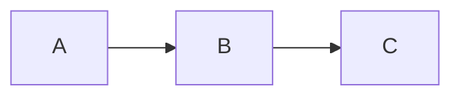

## TL;DR

> **Aktivita v libovolném čase t**
>
> $$\begin{align*}
> \alpha (t) &= \lambda n(t)
> \\ &= \alpha_0 e^{-\lambda t}
> \\ &= \alpha_0 e^{-0.693t/T_{1/2}}
> \end{align*}$$
{: .prompt-info }

> **Vztah mezi rozpadovou konstantou, poločasem a střední dobou života**
>
> $$ \begin{align*}
> T_{1/2}&=\frac {\ln 2}{\lambda} = \frac {0.693}{\lambda}
> \\
> \\ \overline{t}&=\frac {1}{\lambda}
> \\ &=\frac {T_{1/2}}{0.693}=1.44T_{1/2}
> \end{align*} $$
{: .prompt-info }

## Rozpadová konstanta (Decay Constant)

- pravděpodobnost, že se dané jádro rozpadne za jednotku času
- konstanta nezávislá na čase, určená pouze druhem nuklidu
- značí se symbolem $\lambda$

## Aktivita (Radioactivity)

Označme $n(t)$ počet jader, která se v čase $t$ ještě nerozpadla. Pak v průměru během intervalu $dt$ mezi časy $t$ a $t+dt$ zanikne $\lambda n(t)$ jader. Tato rychlost rozpadu se nazývá *aktivita (radioactivity)* daného vzorku a značí se symbolem $\alpha$. Aktivita v čase $t$ je tedy

$$ \alpha (t)=\lambda n(t) \tag{1}$$

## Jednotky aktivity

### Curie (Ci)

- tradiční jednotka používaná před zavedením jednotky becquerel
- aktivita 1 g radia-226
- $3.7\times 10^{10}$ jaderných rozpadů za sekundu ($3.7\times 10^{10}\text{Bq}$)

### Becquerel (Bq)

- jednotka soustavy SI
- 1 jaderný rozpad za sekundu
- $1 \text{Bq} = 2.703\times 10^{-11}\text{Ci} = 27\text{pCi}$

## Výpočet změny aktivity v čase

Během času $dt$ se rozpadne $\lambda n(t)$ jader, takže úbytek počtu nerozpadlých jader ve vzorku za dobu $dt$ lze vyjádřit jako

$$ -dn(t)=\lambda n(t)dt $$

Integrací dostaneme

$$ n(t)=n_0e^{-\lambda t} \tag{2} $$

Vynásobením obou stran $\lambda$ získáme pro aktivitu

$$ \alpha (t)=\alpha_0e^{-\lambda t} \tag{3} $$

Protože se aktivita během *poločasu rozpadu (half-life)* zmenší na polovinu,

$$ \alpha (T_{1/2})=\alpha_0/2 $$

dosadíme do (3):

$$ \alpha_0/2=\alpha_0e^{-\lambda T_{1/2}} $$

Po zlogaritmování obou stran a vyjádření $T_{1/2}$ dostaneme

$$ T_{1/2}=\frac {\ln 2}{\lambda}=\frac {0.693}{\lambda} \tag{4}$$

Když předchozí vztah vyjádříme pro $\lambda$ a dosadíme do (3), získáme

$$ \alpha (t)=\alpha_0e^{-0.693t/T_{1/2}} \tag{5} $$

Rovnice (5) je často pro výpočty radioaktivního rozpadu praktičtější než (3), protože častěji bývá zadán poločas než rozpadová konstanta.

*Střední doba života (mean-life)* radioaktivního jádra $\overline{t}$ je převrácená hodnota rozpadové konstanty:

$$ \overline{t}=1/\lambda $$

Z (3) plyne, že během jedné střední doby života klesne aktivita na $1/e$ své počáteční hodnoty. Ze vztahu (4) vyplývá mezi střední dobou života a poločasem následující vztah:

$$ \overline{t}=\frac {T_{1/2}}{0.693}=1.44T_{1/2} \tag{6} $$

### ※ Odvození střední doby života $\overline{t}$

$$ \begin{align*}
\overline{t}&=\frac {\int_0^\infty t\alpha(t)}{\int_0^\infty t} = \frac {\int_0^\infty t\alpha(t)}{n_0}
\\ &= \frac {\int_0^\infty n_0 \lambda te^{-\lambda t}}{n_0}
\\ &= \int_0^\infty \lambda te^{-\lambda t}
\\ &= \left[-te^{-\lambda t}\right]_0^\infty +\int_0^\infty e^{-\lambda t}
\\ &=\left[-\frac {1}{\lambda} e^{-\lambda t}\right]_0^\infty
\\ &=\frac {1}{\lambda}
\end{align*}$$

## Příklad: Radioaktivní rozpadový řetězec 1

Předpokládejme, že se určitý radioaktivní nuklid vytváří rychlostí $R$ atom/s. Tento nuklid se začne radioaktivně rozpadat okamžitě po vzniku. Určete aktivitu tohoto nuklidu v libovolném čase $t$.

### 1. Sestavení modelu

$$ \text{rychlost změny počtu nuklidů v čase} = \text{rychlost tvorby}-\text{rychlost ztráty} $$

Matematicky:

$$ dn/dt = -\lambda n + R $$

### 2. Obecné řešení

Převeďme všechny členy s $n$ na levou stranu a vynásobme obě strany $e^{\lambda t}$.

$$ \frac {dn}{dt} + \lambda n = R $$

$$ e^{\lambda t}\frac {dn}{dt} + \lambda e^{\lambda t}n = Re^{\lambda t} $$

Protože $\lambda e^{\lambda t}=\frac {d}{dt} e^{\lambda t}$, lze to upravit na

$$ e^{\lambda t}\frac {dn}{dt}+\left(\frac {d}{dt} e^{\lambda t}\right)n = Re^{\lambda t} $$

Integrací obou stran dostaneme obecné řešení

$$ e^{\lambda t}n=\frac {R}{\lambda}e^{\lambda t}+c $$

$$ n=ce^{-\lambda t}+\frac {R}{\lambda} $$

### 3. Partikulární řešení

Nechť v čase $t=0$ je počet těchto nuklidů $n_0$; určeme konstantu $c$.

$$ n(0)=c+\frac {R}{\lambda}=n_0 $$

$$ c=n_0-\frac {R}{\lambda} $$

Partikulární řešení odpovídající dané situaci je tedy

$$ n = n_0e^{-\lambda t}+\frac {R}{\lambda}(1-e^{-\lambda t}) \tag{7} $$

Aktivitu získáme vynásobením obou stran $\lambda$:

$$ \alpha = \alpha_0e^{-\lambda t}+R(1-e^{-\lambda t}) \tag{8} $$

Tedy pro $t\to\infty$ konverguje $\alpha_{\text{max}}=R$ a $n_{\text{max}}=R/\lambda$.

## Příklad: Radioaktivní rozpadový řetězec 2

V rozpadovém řetězci níže vypočtěte aktivitu radionuklidu B.

### 1. Sestavení modelu

$$ \text{rychlost změny počtu jader B}=\text{rychlost tvorby rozpadem A}-\text{rychlost rozpadu B na C} $$

$$ \frac {dn_B}{dt} = -\lambda_B n_B + \lambda_A n_A $$

Dosazením (2) pro $n_A$ dostaneme pro $n_B$ následující diferenciální rovnici:

$$  \frac {dn_B}{dt} = -\lambda_B n_B + \lambda_A n_{A0}e^{-\lambda_A t} \tag{9}$$ 

### 2. Obecné řešení

Pro vyřešení rovnice převedeme všechny členy s $n_B$ na levou stranu a obě strany vynásobíme $e^{\lambda_B t}$.

$$ \frac {dn_B}{dt} + \lambda_B n_B = n_{A0}\lambda_A e^{-\lambda_A t} $$

$$ e^{\lambda_B t}\frac {dn_B}{dt} + \lambda_B e^{\lambda_B t}n_B = n_{A0}\lambda_A e^{(\lambda_B-\lambda_A)t} $$

Protože $\lambda_B e^{\lambda_B t}=\frac {d}{dt} e^{\lambda_b t}$, lze upravit na

$$ e^{\lambda_B t}\frac {dn_B}{dt} + \left(\frac {d}{dt} e^{\lambda_B t}\right)n_B = n_{A0}\lambda_A e^{(\lambda_B-\lambda_A)t} $$

Integrací obou stran dostaneme

$$ e^{\lambda_B t}n_B = \frac {n_{A0}\lambda_A}{\lambda_B-\lambda_A}e^{(\lambda_B-\lambda_A)t}+c $$

Po vydělení obou stran $e^{\lambda_B t}$ dostáváme obecné řešení

$$ n_B = \frac {n_{A0}\lambda_A}{\lambda_B-\lambda_A}e^{-\lambda_A t}+ce^{-\lambda_B t} $$

### 3. Partikulární řešení

Nechť v čase $t=0$ je počet jader B roven $n_{B0}$; určeme konstantu $c$.

$$ n_B(0)=\frac {n_{A0}\lambda_A}{\lambda_B-\lambda_A}+c=n_{B0} $$

$$ c=n_{B0}-\frac{n_{A0}\lambda_A}{\lambda_B-\lambda_A} $$

Partikulární řešení odpovídající dané situaci je tedy

$$ n_B = n_{B0}e^{-\lambda_B t} + \frac {n_{A0}\lambda_A}{\lambda_B - \lambda_A} (e^{-\lambda_A t} - e^{-\lambda_B t}) \tag{10}$$

$$ \therefore \alpha_B = \alpha_{B0} e^{-\lambda_B t} + \frac {\alpha_{A0}\lambda_A}{\lambda_B - \lambda_A} (e^{-\lambda_A t} - e^{-\lambda_B t}) \tag{11}$$
