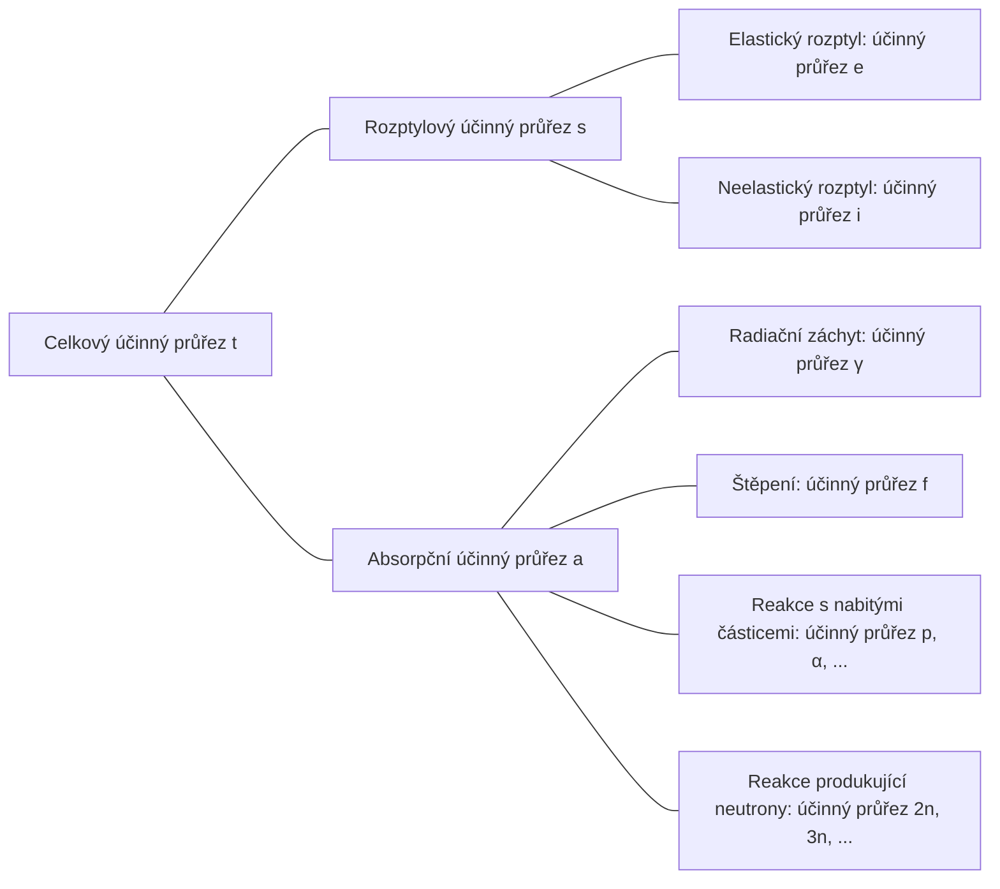

## Účinný průřez (cross-section) neboli mikroskopický účinný průřez (microscopic cross-section)

Uvažujme monoenergetický svazek neutronů dopadající na terč o (velmi malé) tloušťce $\tau$ a ploše $A$; nechť počet neutronů dopadajících na terč za sekundu na jednotku plochy je $I\ \text{neutrons/cm}^2\cdot \text{s}$. Objemový podíl jádra v atomu je velmi malý a protože terč považujeme za velmi tenký, většina neutronů terčem projde bez reakce s jádrem. Pak je počet neutronů, které se za sekundu na jednotku plochy srazí s atomovými jádry, úměrný intenzitě svazku $I$, tloušťce terče $\tau$ a atomové hustotě terče $N$.

$$ \Delta I \propto I\tau N $$

Zavedeme-li konstantu úměrnosti $\sigma$, můžeme psát:

$$ \Delta I = \sigma I\tau N\ \mathrm{[neutrons/cm^2\cdot s]} \label{eqn:microscopic_cross_section}\tag{1} $$

Podíl neutronů dopadajících na terč, které se srazí s jádrem, je:

$$ p = \frac {\Delta I}{I} = \sigma\tau N = \frac {\sigma}{A} A\tau N = \frac {\sigma}{A} N_t \label{eqn:collision_rate}\tag{2} $$

($N_t$: celkový počet atomů v terči)

Z tohoto vztahu je vidět, že $\sigma$ má rozměr plochy. Tato konstanta $\sigma$ se nazývá *účinný průřez (cross-section)* neboli *mikroskopický účinný průřez (microscopic cross-section)*. Fyzikálně vyjadřuje efektivní „cílovou“ plochu, na níž může jádro s neutronem reagovat.

## Jednotka mikroskopického účinného průřezu

Protože cm$^2$ je pro vyjádření mikroskopického účinného průřezu příliš velká jednotka, používá se obvykle jednotka *barn* (b).

$$ 1\ \text{b} = 10^{-24}\ \text{cm}^2 \label{eqn:barn}\tag{3}$$

## Typy mikroskopických účinných průřezů

- celkový (total) účinný průřez: $\sigma_t$
  - rozptylový (scattering) účinný průřez: $\sigma_s$
    - elastický rozptyl (elastic scattering) účinný průřez: $\sigma_e$
    - neelastický rozptyl (inelastic scattering) účinný průřez: $\sigma_i$
  - absorpční (absorption) účinný průřez: $\sigma_a$
    - radiační záchyt (radiative capture) účinný průřez: $\sigma_\gamma$
    - štěpení (fission) účinný průřez: $\sigma_f$
    - reakce s nabitými částicemi (charged-particle reactions) účinný průřez: $\sigma_p, \sigma_\alpha, \cdots$
    - reakce produkující neutrony (neutron-producing reactions) účinný průřez: $\sigma_{2n}, \sigma_{3n}, \cdots$

## Interakce neutronů

Protože jsou neutrony elektricky neutrální, nepodléhají elektrickým vlivům způsobeným elektrony v atomu ani kladným nábojem atomového jádra. Neutrony proto mohou procházet elektronovým obalem a přímo reagovat s jádrem.

### Vznik složeného jádra

Většina reakcí mezi neutrony a látkami probíhá ve dvou krocích:
1. neutron a jádro se spojí a vytvoří složené jádro (compound nucleus)
2. složené jádro se různými způsoby rozpadne

$$ \begin{align*}
\mathrm{^A Z} + \mathrm{n} \to \left( \mathrm{^{A+1}Z} \right)^*
&\to \mathrm{^A Z} + \mathrm{n} \text{ (elastický rozptyl)} \\
&\to \mathrm{^A Z} + \mathrm{n}^\prime \text{ (neelastický rozptyl)} \\
&\to \mathrm{^{A+1}Z} + \gamma \text{ (radiační záchyt)} \\
&\qquad \vdots
\end{align*} $$

Atomové jádro má (v závislosti na uspořádání nukleonů) více kvantovaných energetických hladin. Pokud energie dopadajícího neutronu odpovídá některému excitovanému stavu cílového jádra, složené jádro se vytváří snáze. Proto se pro neutrony s určitými energiemi účinný průřez maximalizuje; tomuto jevu se říká *rezonance (resonance)*.

### Elastický rozptyl (elastic scattering)

- neutron po srážce s jádrem „odskočí“
- jádro zůstává v základním stavu bez změny energie
- značí se $(\mathrm{n}, \mathrm{n})$

Při popisu účinného průřezu elastického rozptylu jako funkce energie dopadajícího neutronu lze rozlišit tři odlišné oblasti.

> **Účinný průřez elastického rozptylu a celkový účinný průřez pro uhlík-12**  
> - zdroj grafu: Korea Atomic Energy Research Institute – Nuclear Data Center at KAERI, Table of Nuclides (<https://atom.kaeri.re.kr/nuchart/>)

> **Účinný průřez elastického rozptylu a celkový účinný průřez pro U-238**  
> - zdroj grafu: Korea Atomic Energy Research Institute – Nuclear Data Center at KAERI, Table of Nuclides (<https://atom.kaeri.re.kr/nuchart/>)

#### Nízká energetická oblast (low-energy region)

V této oblasti je účinný průřez elastického rozptylu aproximativně konstantní. Složené jádro se zde nevytváří; jádro jen působí silou na neutron procházející v jeho blízkosti, což vede k slabému rozptylu. Tomu se říká potenciálový rozptyl (potential scattering) a je-li poloměr jádra $R$, je účinný průřez potenciálového rozptylu

$$ \sigma_e = 4\pi R^2 \label{eqn:potential_scattering}\tag{4}$$

> **Proč účinný průřez rozptylu v extrémně nízkoenergetické oblasti není konstantní**  
> Výše uvedená aproximace je (pro uhlík-12) použitelná přibližně v energetickém intervalu od 0.02 eV do 0.01 MeV; z reálných dat výše je však vidět, že pro ještě nižší, extrémně nízkoenergetickou oblast neplatí.
>
> Podle **Ramsauerova modelu (Ramsauer model)** platí v nízkoenergetické oblasti mezi účinným průřezem rozptylu a energií neutronu vztah:
>
> $$ \sigma(E) = 2\pi \left(R+\lambda(E)\right)^2(1-\alpha \cos\beta). $$
>
> Ze vztahu pro [de Broglieho vlnovou délku neutronu](/posts/Mass-and-Energy-Particles-and-Waves/#pri-zanedbani-relativistickych-efektu-napr-neutron) zde plyne $\lambda(E) \propto \cfrac{1}{\sqrt{E}}$. Ve většině případů platí $\lambda(E) \ll R$, takže v členu $\left(R+\lambda(E)\right)^2$ lze $\lambda(E)$ zanedbat a aproximovat $\sigma(E) \propto R^2$. Ve velmi nízkých energiích se však neutron chová spíše jako vlna než jako částice; jakmile se de Broglieho vlnová délka stane větší než poloměr jádra, začne být $\lambda(E)$ naopak dominantní a uvedená aproximace přestává platit.
{: .prompt-info }

#### Rezonanční oblast (resonance region)

Od této oblasti jádro dočasně neutron pohlcuje a vytváří složené jádro, které následně znovu vyzáří neutron se stejnou energií jako dopadající neutron — dochází tedy k elastickému rezonančnímu rozptylu (elastic resonance scattering). Protože rezonance nastává pro neutrony odpovídající rozdílům energetických hladin cílového jádra, lze pozorovat výrazné špičky účinného průřezu při určitých energiích.

Čím je nuklid těžší, tím při nižších energiích neutronů se rezonanční oblast objevuje. U uranu-238 začíná rezonanční oblast už zhruba od 6 eV a pokračuje přibližně do 1 keV, tedy při mnohem nižších energiích než u uhlíku-12.

#### Vysokoenergetická oblast (smooth region)

Ve vysokoenergetické oblasti jsou rozestupy mezi energetickými hladinami jádra velmi malé, takže jednotlivé rezonance již nelze rozlišit. V této oblasti je $\sigma_e$ spojitou funkcí, která se s energií neutronu mění jen mírně a pozvolna.

### Neelastický rozptyl (inelastic scattering)

- neutron po srážce s jádrem odskočí
- na rozdíl od elastického rozptylu jádro pohltí část energie neutronu a přejde do excitovaného stavu ([endotermická reakce](/posts/nuclear-reactions-and-binding-energy/#exotermicka-reakce-exothermic-reaction--endotermicka-reakce-endothermic-reaction))
- protože energetické hladiny jádra jsou kvantované, může k tomu dojít, pokud neutron narazí s energií větší nebo rovnou rozdílu mezi dvěma hladinami daného jádra
  - u těžkých nuklidů jsou hladiny jemněji rozdělené, takže jev nastává snáze; u lehkých nuklidů je naopak vzácnější
  - z níže uvedených grafů lze ověřit, že prahová energie (threshold energy) pro neelastický rozptyl u uhlíku je 4.80 MeV, zatímco u uranu-238 je 44 keV
- pro energie nad prahem je neelastický účinný průřez $\sigma_i$ zhruba podobný elastickému $\sigma_e$
- značí se $(\mathrm{n}, \mathrm{n}^{\prime})$
- excitované jádro se následně vrací do základního stavu emisí gama záření; takto vzniklé gama záření se nazývá *neelastické gama záření (inelastic $\gamma$-ray)*

> **Účinný průřez elastického a neelastického rozptylu pro C-12**  
> - zdroj grafu: Korea Atomic Energy Research Institute – Nuclear Data Center at KAERI, Table of Nuclides (<https://atom.kaeri.re.kr/nuchart/>)

> **Účinný průřez elastického a neelastického rozptylu pro U-238**  
> - zdroj grafu: Korea Atomic Energy Research Institute – Nuclear Data Center at KAERI, Table of Nuclides (<https://atom.kaeri.re.kr/nuchart/>)

### Radiační záchyt (radiative capture)

- jádro zachytí neutron a vyzáří jedno nebo více gama kvant ([exotermická reakce](/posts/nuclear-reactions-and-binding-energy/#exotermicka-reakce-exothermic-reaction--endotermicka-reakce-endothermic-reaction))
- značí se $(\mathrm{n}, \gamma)$
- takto vzniklé gama záření se nazývá *záchytové gama záření (capture $\gamma$-ray)*
- protože sražený neutron je pohlcen do jádra, jde o typ absorpční reakce

Podobně jako u [elastického rozptylu](#elasticky-rozptyl-elastic-scattering) lze i účinný průřez radiačního záchytu $\sigma_\gamma$ rozdělit do tří oblastí.

> **Účinný průřez radiačního záchytu pro Au-197**  
> - zdroj grafu: Korea Atomic Energy Research Institute – Nuclear Data Center at KAERI, Table of Nuclides (<https://atom.kaeri.re.kr/nuchart/>)

#### Nízká energetická oblast (oblast $1/v$)

V nízkoenergetické oblasti je u většiny nuklidů $\sigma_\gamma$ úměrné $1/\sqrt{E}$, tj. $1/v$. V log-log grafu pro zlato-197 výše lze vidět úsek přímky se sklonem $-1/2$.

U některých důležitých nuklidů však $\sigma_\gamma$ v nízkých energiích nevykazuje přesné chování $1/v$; takové nuklidy se nazývají ne-$1/v$ absorbéry (non-$1/v$ absorber).

#### Rezonanční oblast

Po překročení oblasti $1/v$ se v témže energetickém pásmu jako u rozptylu pozoruje rezonanční oblast. Pokud rezonance nastává při energii $E_r$, pak $\sigma_\gamma$ v okolí této rezonance udává Breitova–Wignerova (Breit-Wigner) jednouúrovňová formule:

$$ \sigma_\gamma = \frac{\gamma_r^2 g}{4\pi}\frac{\Gamma_n\Gamma_g}{(E-E_r)^2 + \Gamma^2/4} \label{eqn:breit_wigner}\tag{5}$$

- $\gamma_r$: [de Broglieho vlnová délka](/posts/Mass-and-Energy-Particles-and-Waves/#pri-zanedbani-relativistickych-efektu-napr-neutron) neutronu o energii $E_r$
- $g$: *statistický faktor (statistical factor)*, konstanta
- $\Gamma \ (=\Gamma_n + \Gamma_\gamma)$: *celková šířka (total width)*, konstanta
  - $\Gamma_n$: *neutronová šířka (neutron width)*, konstanta
  - $\Gamma_\gamma$: *radiační šířka (radiation width)*, konstanta

> Protože $\sigma_\gamma(E_r \pm \Gamma/2) = \cfrac{1}{2}\sigma_\gamma(E_r)$, je $\Gamma$ rezonanční šířka definovaná pomocí dvou bodů, kde účinný průřez klesne na polovinu maxima. Odtud pochází termín *šířka (width)*.
{: .prompt-tip }

#### Vysokoenergetická oblast (above the resonance region)

Po průchodu rezonanční oblastí, ve vyšších energiích (u těžkých nuklidů přibližně nad 1 keV; u lehčích nuklidů se tato oblast objevuje při ještě vyšších energiích), $\sigma_\gamma$ nejprve prudce klesá a poté se pomalu snižuje k velmi malým hodnotám.

### Reakce s nabitými částicemi (charged-particle reactions)

- jádro zachytí neutron a vyzáří nabitou částici, např. alfa částici ($\alpha$) nebo proton ($\mathrm{p}$)
- značí se např. $(\mathrm{n}, \alpha)$, $(\mathrm{n}, \mathrm{p})$
- v závislosti na případě může jít o [exotermickou](/posts/nuclear-reactions-and-binding-energy/#exotermicka-reakce-exothermic-reaction--endotermicka-reakce-endothermic-reaction) i [endotermickou](/posts/nuclear-reactions-and-binding-energy/#exotermicka-reakce-exothermic-reaction--endotermicka-reakce-endothermic-reaction) reakci, obvykle však jde o [endotermickou](/posts/nuclear-reactions-and-binding-energy/#exotermicka-reakce-exothermic-reaction--endotermicka-reakce-endothermic-reaction)
- pod prahovou energií nenastávají a i nad prahem bývá účinný průřez zpravidla malý (tento trend je zvlášť výrazný u těžkých jader)

Reakce s nabitými částicemi tedy vyžadují překročení prahové energie a jejich účinné průřezy jsou většinou malé. Přesto existuje několik důležitých reakcí tohoto typu u lehkých jader.

#### Exotermické reakce

##### $^{10}\mathrm{B}(\mathrm{n},\alpha){^7\mathrm{Li}}$

> **Účinný průřez reakce $^{10}\mathrm{B}(\mathrm{n},\alpha){^7\mathrm{Li}}$**  
> - zdroj grafu: Korea Atomic Energy Research Institute – Nuclear Data Center at KAERI, Table of Nuclides (<https://atom.kaeri.re.kr/nuchart/>)

- lze ověřit, že pro energie do $100\ \mathrm{keV}$ platí $\sigma_\alpha \propto 1/v$
- v nízkých energiích neutronů je $\sigma_\alpha$ velmi velké; této vlastnosti se využívá pro pohlcování nízkoenergetických neutronů

> V reaktorech, které používají vodu jako chladivo i moderátor, se toho využívá k regulaci reakce nebo k rychlému odstavení: do moderátoru se přimíchá bor, aby pohltil přebytečné neutrony.
{: .prompt-tip }

##### $^{6}\mathrm{Li}(\mathrm{n},\alpha){^3\mathrm{H}}$

> **Účinný průřez reakce $^{6}\mathrm{Li}(\mathrm{n},\alpha){^3\mathrm{H}}$**  
> - zdroj grafu: Korea Atomic Energy Research Institute – Nuclear Data Center at KAERI, Table of Nuclides (<https://atom.kaeri.re.kr/nuchart/>)

- obdobně lze ověřit, že zhruba pro energie do $100\ \mathrm{keV}$ platí $\sigma_\alpha \propto 1/v$
- používá se k produkci tritia ($^3\mathrm{H}$)

> Tato reakce je zvlášť významná v blanketové vrstvě (blanket) fúzních reaktorů. [Protože tritium má krátký poločas a v přírodě se prakticky nevyskytuje](/posts/Nuclear-Stability-and-Radioactive-Decay/#tritium), musí se ve fúzním reaktoru vyrábět „in situ“. Proto se fúzní nádoba obklopí lithiovým blanketem; lithium v blanketu po pohlcení neutronů z fúzních reakcí vyvolá tuto reakci a přemění se na tritium, které se následně shromažďuje a využívá jako fúzní palivo.  
> Protože jde navíc o exotermickou reakci, část energie neutronů z fúze se touto reakcí mění na teplo; u fúzní elektrárny se pak toto teplo převádí na elektrickou energii.
{: .prompt-tip }

#### Endotermické reakce

##### $^{16}\mathrm{O}(\mathrm{n},\mathrm{p}){^{16}\mathrm{N}}$

> **Účinný průřez reakce $^{16}\mathrm{O}(\mathrm{n},\mathrm{p}){^{16}\mathrm{N}}$**  
> - zdroj grafu: Korea Atomic Energy Research Institute – Nuclear Data Center at KAERI, Table of Nuclides (<https://atom.kaeri.re.kr/nuchart/>)

- má prahovou energii kolem 9 MeV, tedy výrazně vyšší než průměrná energie neutronů ze štěpení uranu-235 (2–3 MeV); frekvence reakce je proto nízká (řádově 1 z několika tisíc neutronů)
- přesto je důležitá, protože v reaktorech používajících vodu jako chladivo i moderátor je hlavní příčinou aktivace vody
  - $^{16}\mathrm{O}$ ve vodních molekulách se touto reakcí mění na $^{16}\mathrm{N}$; $^{16}\mathrm{N}$ se pak s poločasem zhruba 7 s rozpadá [beta rozpadem](/posts/Nuclear-Stability-and-Radioactive-Decay/#beta-rozpad-beta-decay) a zároveň [vyzařuje gama záření o energii 6–7 MeV](/posts/Nuclear-Stability-and-Radioactive-Decay/#izomerni-prechod-isomeric-transition)

### Reakce produkující neutrony (neutron-producing reactions)

- srážka vysokoenergetického neutronu s jádrem způsobí emisi dvou nebo více nových neutronů (endotermická reakce)
- značí se (n, 2n), (n, 3n) apod.
- reakce (n, 2n) je zvlášť důležitá v reaktorech obsahujících těžkou vodu nebo berylium, protože u $^2\text{H}$ a $^9\text{Be}$ je vazebná energie neutronů malá, takže se snadno uvolňují i při srážkách s relativně nízkoenergetickými neutrony

> **Účinný průřez reakce $\mathrm{D}(\mathrm{n},\mathrm{2n})\mathrm{p}$ a $^{9}\mathrm{Be}(\mathrm{n},\mathrm{2n}){^{8}\mathrm{Be}}$**  
> - zdroj grafu: Korea Atomic Energy Research Institute – Nuclear Data Center at KAERI, Table of Nuclides (<https://atom.kaeri.re.kr/nuchart/>)

### Štěpení (fission)

- neutron narazí do jádra a způsobí jeho rozštěpení na dvě či více dceřiných jader

> Štěpení a účinný průřez štěpení sepíšu v samostatném článku.
{: .prompt-info }

### Celkový účinný průřez

#### Nízká energetická oblast

$$ \sigma_t = 4\pi R^2 + \frac{C}{\sqrt{E}} \label{eqn:total_cross_section}\tag{6}$$

- první člen odpovídá [účinnému průřezu elastického rozptylu](#nizka-energeticka-oblast-low-energy-region), druhý člen odpovídá [radiačnímu záchytu](#nizka-energeticka-oblast-oblast-1v) a všem exotermickým reakcím, které jsou při dané energii možné
- pokud dominuje první člen, bude $\sigma_t$ v nízkých energiích konstantní; v opačném případě bude vykazovat chování $1/v$

#### Rezonanční oblast

Zahrnuje rezonance pozorované v [$\sigma_s$](#rezonancni-oblast-resonance-region) a v [$\sigma_\gamma$](#rezonancni-oblast-1); rezonanční oblast se objevuje ve stejných energiích jako u těchto dvou účinných průřezů. U lehčích nuklidů se rezonance objevují ve vyšším a širším energetickém pásmu; u těžších nuklidů se rezonanční oblast objevuje v relativně nižším a užším pásmu energií.

#### Vysokoenergetická oblast

Ve vysokých energiích nad rezonanční oblastí $\sigma_t$ s energií pozvolna klesá.

## Účinné průřezy vodíku a deuteria

V mnoha reaktorech se vyskytuje velké množství jader $^1\mathrm{H}$ a $^2\mathrm{H}$\*; tato jádra reagují s neutrony poněkud odlišně než většina ostatních jader.
- nevytvářejí [složené jádro](#vznik-slozeneho-jadra)
- nemají [rezonanční oblast](#rezonancni-oblast-1)
  - [účinný průřez elastického rozptylu je konstantní](#nizka-energeticka-oblast-low-energy-region)
  - [účinný průřez radiačního záchytu vykazuje chování $1/v$ pro všechny energie neutronů](#nizka-energeticka-oblast-oblast-1v)
- zejména pro $^1\mathrm{H}$: protože je tvořen jediným protonem a nemá excitované stavy, nevzniká ani [neelastický rozptyl](#neelasticky-rozptyl-inelastic-scattering)

> \* Obvykle se v reaktorech používajících vodu jako chladivo a moderátor vyskytují hlavně ve formě lehké vody ($\mathrm{H_2O}$) nebo těžké vody ($\mathrm{D_2O}$).
{: .prompt-info }

> **Účinné průřezy pro H-1**  
> - zdroj grafu: Korea Atomic Energy Research Institute – Nuclear Data Center at KAERI, Table of Nuclides (<https://atom.kaeri.re.kr/nuchart/>)

> **Účinné průřezy pro H-2**  
> - zdroj grafu: Korea Atomic Energy Research Institute – Nuclear Data Center at KAERI, Table of Nuclides (<https://atom.kaeri.re.kr/nuchart/>)

## Makroskopický účinný průřez (macroscopic cross-section)

Ze vztahu ($\ref{eqn:collision_rate}$) lze určit pravděpodobnost srážky na jednotku dráhy neutronového svazku takto:

$$ \frac {p}{\tau} = \frac {1}{\tau} \frac {\Delta I}{I} = \sigma N \equiv \Sigma\ \text{[cm}^{-1}\text{]} \label{eqn:macroscopic_cross_section}\tag{7}$$

*Makroskopický účinný průřez (macroscopic cross-section)* se tedy definuje jako součin atomové hustoty $N$ a [účinného průřezu](#ucinny-prurez-cross-section-neboli-mikroskopicky-ucinny-prurez-microscopic-cross-section). Fyzikálně vyjadřuje míru srážek na jednotku dráhy neutronu uvnitř daného terče. Podobně jako mikroskopický účinný průřez lze i makroskopický dále dělit:

- makroskopický celkový účinný průřez $\Sigma_t=N\sigma_t$
  - makroskopický rozptylový účinný průřez $\Sigma_s=N\sigma_s$
  - makroskopický absorpční účinný průřez $\Sigma_a=N\sigma_a$

Obecně platí, že makroskopický účinný průřez pro libovolnou reakci je $\Sigma_{\text{reaction}}=N\sigma_{\text{reaction}}$.

## Hustota srážek (collision density), tj. reakční rychlost (reaction rate)

*Hustota srážek (collision density)*, neboli *reakční rychlost (reaction rate)*, znamená počet srážek na jednotku času a jednotku objemu v terči. Ze vztahů ($\ref{eqn:microscopic_cross_section}$) a ($\ref{eqn:macroscopic_cross_section}$) plyne definice:

$$ F = \frac {\Delta I}{\tau} = I\sigm a N = I\Sigma \label{eqn:reaction_rate}\tag{8} $$
