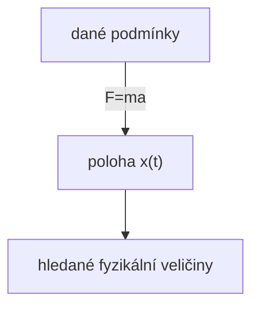
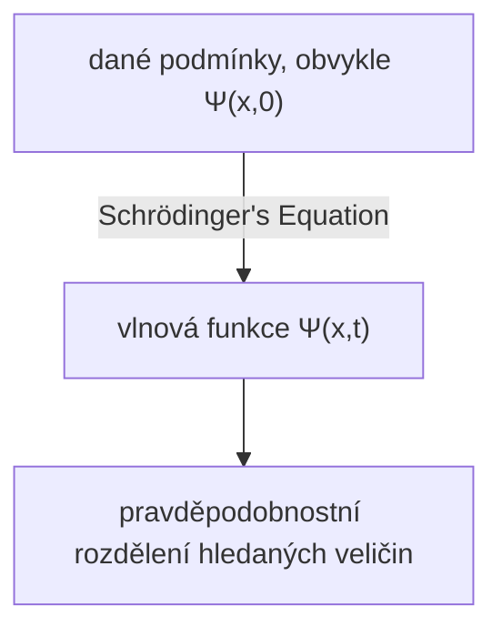

## TL;DR
> - (časově závislá) Schrödingerova rovnice:
>
> $$ i\hbar\frac{\partial \Psi}{\partial t} = - \frac{\hbar^2}{2m}\frac{\partial^2 \Psi}{\partial x^2} + V\Psi $$
>
> - Statistická interpretace vlnové funkce $\Psi(x,t)$ (Bornova interpretace): druhá mocnina absolutní hodnoty vlnové funkce $\|\Psi(x,t)\|^2$ je **hustota pravděpodobnosti** nalezení částice v čase $t$ na pozici $x$.
> - Normalizace vlnové funkce:
>   - $\int_{-\infty}^{\infty} \|\Psi(x,t)\|^2 dx = 1$
>   - Je-li $\Psi(x,t)$ řešením Schrödingerovy rovnice, pak pro libovolnou komplexní konstantu $A$ je řešením i $A\Psi(x,t)$; určení konstanty $A$ tak, aby platil výše uvedený vztah, se nazývá normalizace (normalization)
>   - **Nenormalizovatelná řešení (non-normalizable solutions)** nemohou popisovat částici, a tedy nejsou platnou vlnovou funkcí; fyzikálně přípustné jsou pouze **kvadraticky integrovatelné (square-integrable)** řešení
>   - Vlnová funkce normalizovaná v jednom okamžiku zůstává normalizovaná i v čase, i když se $\Psi$ vyvíjí
> - Pravděpodobnostní proud:
>   - $J(x,t) \equiv \cfrac{i\hbar}{2m}\left(\Psi\cfrac{\partial \Psi^\*}{\partial x}-\Psi^\*\cfrac{\partial \Psi}{\partial x}\right)$
>   - „Průtok“ pravděpodobnosti nalezení částice přes bod $x$ (pravděpodobnost za jednotku času)
>   - Označíme-li $P_{ab}(t)$ pravděpodobnost nalezení částice v čase $t$ v oblasti $a<x<b$, pak $\cfrac{dP_{ab}}{dt} = J(a,t) - J(b,t)$
{: .prompt-info }

## Prerequisites
- spojité rozdělení pravděpodobnosti a hustota pravděpodobnosti

## Schrödingerova rovnice (Schrödinger equation)
Uvažujme situaci, kdy částice o hmotnosti $m$ se pohybuje po ose $x$ a působí na ni daná síla $F(x,t)$.

V klasické mechanice je hlavním cílem použít Newtonovu pohybovou rovnici $F=ma$ a určit polohu částice $x(t)$ v libovolném čase. Tento proces lze zhruba znázornit následujícím diagramem.

V kvantové mechanice se ke stejnému problému přistupuje velmi odlišně: přístup kvantové mechaniky spočívá v řešení následující **Schrödingerovy rovnice (Schrödinger equation)** a určení **vlnové funkce** částice $\Psi(x,t)$.

$$ \begin{gather*}
i\hbar\frac{\partial \Psi}{\partial t} = - \frac{\hbar^2}{2m}\frac{\partial^2 \Psi}{\partial x^2} + V\Psi. \label{eqn:schrodinger_eqn}\tag{1}\\
\text{(} i=\sqrt{-1}\text{, } \hbar=\frac{h}{2\pi}=1.054573\times10^{-34}\text{, } h\text{: Planckova konstanta, } V(x)\text{: potenciální energie)}
\end{gather*} $$

> *Zdroj obrázku*
> - autor: uživatel Wikimedia Xcodexif
> - licence: [CC BY-SA 4.0](https://creativecommons.org/licenses/by-sa/4.0/)

## Statistická interpretace vlnové funkce $\Psi(x,t)$ (Bornova interpretace)
Zatímco v klasické mechanice je částice umístěna v jediném bodě, v kvantové mechanice je vlnová funkce popisující stav částice pro dané $t$ funkcí proměnné $x$, tj. je prostorově rozprostřená. Jaký je fyzikální význam tohoto tvrzení?

Podle Bornovy **statistické interpretace** je druhá mocnina absolutní hodnoty vlnové funkce $\|\Psi(x,t)\|^2$ hustotou pravděpodobnosti nalezení částice v čase $t$ na pozici $x$. Samotná vlnová funkce $\Psi$ je komplexní, ale $\|\Psi\|^2=\Psi^\*\Psi$ (kde $\Psi^\*$ je komplexně sdružená hodnota $\Psi$) je reálné číslo nezáporné, takže taková interpretace dává smysl. Lze to vyjádřit takto:

$$ \int_a^b |\Psi(x,t)|^2 dx = \text{pravděpodobnost, že v čase }t\text{ najdeme částici mezi }a\text{ a }b. \tag{2}$$

Tato statistická interpretace znamená, že kvantová mechanika v sobě nese jistou **neurčitost (indeterminacy)**. I kdybychom věděli o částici vše (tj. znali vlnovou funkci), dozvíme se pouze rozdělení pravděpodobnosti možných výsledků — nelze určit konkrétní hodnotu.

Protože je to intuitivně těžko přijatelné, přirozeně vyvstala otázka, zda je tato neurčitost důsledkem nějaké nedokonalosti kvantové mechaniky, nebo zda jde o podstatnou vlastnost přírody.

## Pohledy na kvantovou neurčitost (quantum indeterminacy)
Změřme polohu částice a zjistěme, že se nachází v bodě $C$. Kde tedy byla částice těsně před měřením?

### Realistický (realist) postoj

> „Bůh nehraje v kostky.“ („God does not play dice.“)  
> *Albert Einstein*

Částice byla od začátku v bodě $C$. To je i pohled Einsteina (Einstein) a Schrödingera (Schrödinger). V tomto pojetí však platí, že částice ve skutečnosti přesně v $C$ byla, jen kvůli omezením teorie dokážeme před měřením určit její polohu pouze jako pravděpodobnostní rozdělení — a kvantová mechanika je tedy neúplná teorie. Jinými slovy: neurčitost není podstatnou vlastností přírody, ale důsledkem omezení kvantové mechaniky; kromě $\Psi$ existují ještě další skryté proměnné, které je třeba znát, aby bylo možné částici popsat dokonale.

> Schrödinger (Schrödinger) byl Einsteinovým (Einstein) žákem a určitou dobu u něj pracoval jako asistent; i později s Einsteinem udržoval kontakty. Je pravděpodobné, že Schrödingerův realistický a deterministický postoj byl tímto vlivem formován.
{: .prompt-info }

### Ortodoxní (orthodox) postoj

> „Přestaňte Bohu říkat, co má dělat se svými kostkami.“ („Stop telling God what to do with his dice.“)  
> *Niels Bohr, odpověď na Einsteinův dřívější citát*
>
> „Pozorování nejen ruší to, co má být měřeno, ale také to vytváří.“ („Observations not only disturb what is to be measured, they produce it“)  
> ...  
> „Nutíme ji zaujmout určitou polohu.“ („We compel to assume a definite position.“)  
> *Pascual Jordan*

Až do okamžiku měření částice existuje pouze ve formě pravděpodobnostního rozdělení, není „nikde“, a teprve měřicí akt způsobí, že se částice objeví v určité poloze. Tento výklad se nazývá **kodaňská interpretace** a byl navržen především Bohrem (Bohr) a Heisenbergem (Heisenberg) v prostředí Kodaňské univerzity.

> Zajímavé je, že podobně jako vztah Einsteina a Schrödingera byl i Heisenberg (Heisenberg) Bohrův (Bohr) žák.
{: .prompt-info }

### Agnostický (agnostic) postoj

> „Neměl by si člověk lámat hlavu nad otázkou, zda něco, o čem nemůže vůbec nic vědět, přece jen existuje, o nic více než nad starou otázkou, kolik andělů se může posadit na špičku jehly.“ („One should no more rack one’s brain about the problem of whether something one cannot know anything about exists all the same, than about the ancient question of how many angels are able to sit on the point of a needle.“)  
> *Wolfgang Pauli*

Odmítá odpovědět. Jaký má smysl cokoliv tvrdit o stavu částice před měřením, pokud jediný způsob, jak ověřit pravdivost takového tvrzení, je měření? V tom okamžiku už nejde o „před měřením“. Jde jen o metafyzické dohadování o něčem, co nelze principiálně testovat ani poznat.

### Dnešní konsenzus
V roce [11964 lidského letopočtu](https://en.wikipedia.org/wiki/Holocene_calendar) John Bell (John Bell) prokázal, že existuje pozorovatelný rozdíl podle toho, zda částice má přesnou polohu před měřením či až po něm. Tím byl agnostický postoj vyloučen a následné experimenty vedly k tomu, že kodaňská interpretace se stala hlavním proudem. Není-li uvedeno jinak, při pojednávání o kvantové mechanice se obvykle tato kodaňská interpretace předpokládá.

> Stále však existují i jiné interpretace než kodaňská, které mohou být správné, například nelokální teorie skrytých proměnných (nonlocal hidden variable theories) nebo mnohosvětová interpretace (many worlds interpretation).
{: .prompt-info }

## Měření a kolaps vlnové funkce
Částice před měřením nemá přesnou polohu, a teprve měřením získá konkrétní polohu $C$ (jak bude probráno jinde, ani tato poloha ve skutečnosti není dokonale přesná, ale má jisté rozpětí kvůli Heisenbergovu principu neurčitosti). Nicméně když bezprostředně po prvním měření provedeme další měření, nedostáváme pokaždé jiné hodnoty, ale nutně stejný výsledek. To se vysvětluje následovně.

V okamžiku prvního měření se vlnová funkce měřeného systému prudce změní a vytvoří úzký, špičatý profil grafu $\|\Psi(x,t)\|^2$ soustředěný kolem bodu $C$. Říká se, že vlnová funkce se působením měření **zhroutila (collapse)** do bodu $C$.

Fyzikální procesy lze tedy rozdělit na dva odlišné typy.
- běžný (ordinary) proces, v němž se vlnová funkce pomalu mění podle Schrödingerovy rovnice
- měřicí (measurement) proces, v němž $\Psi$ náhle a nespojitě kolabuje

> Vlnová funkce, která zkolabovala měřením, se s časem podle Schrödingerovy rovnice znovu prostorově rozprostře. Chceme-li tedy reprodukovat stejný výsledek měření, musíme druhé měření provést bezprostředně.
{: .prompt-tip }

## Normalizace vlnové funkce (Normalization)
Protože $\|\Psi(x,t)\|^2$ je hustota pravděpodobnosti nalezení částice v čase $t$ na pozici $x$, musí integrál $\|\Psi\|^2$ přes všechna $x$ vyjít 1.

$$ \int_{-\infty}^{\infty} |\Psi(x,t)|^2 dx = 1. \label{eqn:wavefunction_norm}\tag{3} $$

Ze vztahu ($\ref{eqn:schrodinger_eqn}$) plyne, že je-li $\Psi(x,t)$ řešením, pak pro libovolnou komplexní konstantu $A$ je řešením i $A\Psi(x,t)$. Proto je třeba určit $A$ tak, aby platil vztah ($\ref{eqn:wavefunction_norm}$); tomuto postupu se říká normalizace (normalization). Některá řešení Schrödingerovy rovnice mají integrál divergentní (jde do nekonečna), a v takovém případě neexistuje žádná konstanta $A$, která by splnila ($\ref{eqn:wavefunction_norm}$). Totéž platí i pro triviální řešení (trivial solution) $\Psi=0$. Taková **nenormalizovatelná řešení (non-normalizable solutions)** nemohou popisovat částici, a tedy nejsou platnou vlnovou funkcí. Fyzikálně možné stavy odpovídají **kvadraticky integrovatelným (square-integrable)** řešením Schrödingerovy rovnice.

Důležitou vlastností Schrödingerovy rovnice dále je, že <u>vlnová funkce normalizovaná v jednom okamžiku zůstává normalizovaná i po čase (tj. $\int_{-\infty}^{\infty} |\Psi(x,t)|^2 dx = 1$), i když se $\Psi$ vyvíjí</u>. Kdybychom museli vlnovou funkci v každém okamžiku znovu normalizovat jinou hodnotou $A$, stalo by se z $A$ (místo konstanty) funkcí času $t$, a pak by už nebylo možné řešit Schrödingerovu rovnici. Díky této vlastnosti je hodnota $A$ určená z počáteční podmínky ($t=0$) zachována pro všechna $t$.

### Důkaz

$$ \frac{d}{dt}\int_{-\infty}^{\infty} |\Psi(x,t)|^2 dx = \int_{-\infty}^{\infty} \frac{\partial}{\partial t}|\Psi(x,t)|^2 dx. \label{eqn:norm_proof_1}\tag{4} $$

> Integrál $\|\Psi\|^2$ podle $x$ je funkcí pouze času $t$, takže na levé straně používáme úplnou derivaci ($d/dt$). Naproti tomu $\|\Psi\|^2$ je sama o sobě funkcí dvou proměnných $x$ a $t$, proto na pravé straně používáme parciální derivaci ($\partial/\partial t$).
{: .prompt-tip }

Podle pravidla pro derivaci součinu můžeme výše uvedené přepsat takto:

$$ \frac{\partial}{\partial t}|\Psi|^2 = \frac{\partial}{\partial t}(\Psi^*\Psi) = \Psi^*\frac{\partial \Psi}{\partial t} + \frac{\partial \Psi^*}{\partial t}\Psi. \label{eqn:norm_proof_2}\tag{5}$$

Vynásobíme-li obě strany Schrödingerovy rovnice ($\ref{eqn:schrodinger_eqn}$) faktorem $-\cfrac{i}{\hbar}$, dostaneme

$$ \frac{\partial \Psi}{\partial t} = \frac{i\hbar}{2m}\frac{\partial^2 \Psi}{\partial x^2}-\frac{i}{\hbar}V\Psi \label{eqn:norm_proof_3}\tag{6}$$

a vezmeme-li v tomto vztahu komplexně sdruženou hodnotu $\cfrac{\partial \Psi}{\partial t}$, obdržíme

$$ \frac{\partial \Psi^*}{\partial t} = -\frac{i\hbar}{2m}\frac{\partial^2 \Psi^*}{\partial x^2}+\frac{i}{\hbar}V\Psi^* \label{eqn:norm_proof_4}\tag{7}$$

Dosadíme-li nyní ($\ref{eqn:norm_proof_3}$) a ($\ref{eqn:norm_proof_4}$) do ($\ref{eqn:norm_proof_2}$), dostaneme

$$\begin{align*}
\frac{\partial}{\partial t}|\Psi|^2 &= \frac{i\hbar}{2m}\left(\Psi^*\frac{\partial^2\Psi}{\partial x^2}-\frac{\partial^2\Psi^*}{\partial x^2}\Psi\right) \\
&= \frac{\partial}{\partial x}\left[\frac{i\hbar}{2m}\left(\Psi^*\frac{\partial\Psi}{\partial x}-\frac{\partial\Psi^*}{\partial x}\Psi \right) \right] 
\end{align*} \label{eqn:norm_proof_5}\tag{8}$$

a dosadíme-li to do pravé strany původního vztahu ($\ref{eqn:norm_proof_1}$), vyjde

$$ \frac{d}{dt}\int_{-\infty}^{\infty} |\Psi(x,t)|^2 dx = \frac{i\hbar}{2m}\left(\Psi^*\frac{\partial\Psi}{\partial x}-\frac{\partial\Psi^*}{\partial x}\Psi \right)\Bigg|_{-\infty}^{\infty}. \label{eqn:norm_proof_6}\tag{9} $$

Aby byla vlnová funkce normalizovaná a fyzikálně platná, musí pro $x\to\pm\infty$ platit $\Psi(x,t)\to 0$. Tedy

$$ \frac{d}{dt}\int_{-\infty}^{\infty} |\Psi(x,t)|^2 dx = 0 \label{eqn:norm_proof_fin}\tag{10} $$

a proto je $\int_{-\infty}^{\infty} \|\Psi(x,t)\|^2 dx$ konstantou nezávislou na čase.

$$ \therefore \Psi \text{ je-li normalizována v nějakém okamžiku }t\text{, je normalizována i ve všech ostatních časech }t. \blacksquare $$

## Pravděpodobnostní proud (probability current)
Označme nyní $P_{ab}(t)$ pravděpodobnost nalezení částice v čase $t$ v oblasti $a<x<b$. Pak

$$ P_{ab}(t) = \int_a^b |\Psi(x,t)|^2 dx \tag{11}$$

a

$$ \begin{align*}
\frac{dP_{ab}}{dt} &= \frac{d}{dt}\int_a^b |\Psi(x,t)|^2 dx \\
&= \int_a^b \frac{\partial}{\partial t}|\Psi(x,t)|^2 dx \quad \text{(}\because\text{viz rovnice }\ref{eqn:norm_proof_1}\text{)}\\
&= \int_a^b \left(\frac{\partial \Psi^*}{\partial t}\Psi + \Psi^*\frac{\partial \Psi}{\partial t} \right)dx \quad \text{(}\because\text{viz rovnice }\ref{eqn:norm_proof_2}\text{)} \\
&= \frac{i\hbar}{2m}\int_a^b \left(\Psi^*\frac{\partial^2\Psi}{\partial x^2}-\frac{\partial^2\Psi^*}{\partial x^2}\Psi\right)dx \\
&= \frac{i\hbar}{2m}\int_a^b\frac{\partial}{\partial x}\left(\Psi^*\frac{\partial\Psi}{\partial x}-\frac{\partial\Psi^*}{\partial x}\Psi \right)dx \quad \text{(}\because\text{viz rovnice }\ref{eqn:norm_proof_3},\ref{eqn:norm_proof_4},\ref{eqn:norm_proof_5}\text{)}\\
&= \frac{i\hbar}{2m}\left(\Psi^*\frac{\partial \Psi}{\partial x}-\frac{\partial \Psi^*}{\partial x}\Psi \right)\Bigg|^b_a \\
&= \frac{i\hbar}{2m}\left(\Psi\frac{\partial \Psi^*}{\partial x}-\Psi^*\frac{\partial \Psi}{\partial x} \right)\Bigg|^a_b
\end{align*} $$

Zavedeme-li

$$ J(x,t) \equiv \frac{i\hbar}{2m}\left(\Psi\frac{\partial \Psi^*}{\partial x}-\Psi^*\frac{\partial \Psi}{\partial x}\right) \label{eqn:probability_current}\tag{12}$$

pak platí

$$ \frac{dP_{ab}}{dt} = J(a,t) - J(b,t) \label{eqn:probability_over_time}\tag{13}$$

Veličina $J(x,t)$ definovaná ve vztahu ($\ref{eqn:probability_current}$) se nazývá **pravděpodobnostní proud (probability current)** a znamená „průtok“ pravděpodobnosti nalezení částice přes bod $x$ (tj. pravděpodobnost za jednotku času). Ve vztahu ($\ref{eqn:probability_over_time}$) platí: je-li v určitém čase $t$ proud pravděpodobnosti vtékající na jednom konci $J(a,t)$ větší než proud vytékající na druhém konci $J(b,t)$, pak $P_{ab}$ roste; v opačném případě klesá.

> *V hydrodynamickém průtoku (flow rate) si místo hmotnosti či objemu tekutiny stačí představit pravděpodobnost.
{: .prompt-info }
