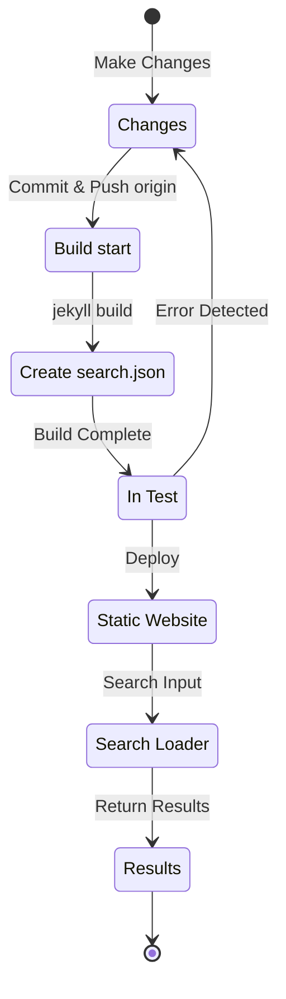

## Přehled
Na začátku července 12024 jsem na tento blog (hostovaný přes Github Pages a postavený na Jekyllu) nasadil plugin [Polyglot](https://github.com/untra/polyglot) a doplnil podporu více jazyků.  
Tato série sdílí bugy, které se objevily při aplikaci Polyglot na téma Chirpy, jejich řešení, a také postup tvorby HTML hlavičky a `sitemap.xml`{: .filepath} s ohledem na SEO.  
Série má 3 články a tento, který právě čtete, je třetí díl.
- 1. díl: [Nasazení pluginu Polyglot & úprava HTML hlavičky a sitemap](/posts/how-to-support-multi-language-on-jekyll-blog-with-polyglot-1)
- 2. díl: [Implementace tlačítka volby jazyka & lokalizace jazyka layoutu](/posts/how-to-support-multi-language-on-jekyll-blog-with-polyglot-2)
- 3. díl: Troubleshooting selhání buildu tématu Chirpy a chyby vyhledávání (tento článek)

> Původně to měly být jen 2 díly, ale později jsem obsah několikrát doplnil, rozsah výrazně narostl, a proto jsem sérii přepracoval na 3 díly.
{: .prompt-info }

## Požadavky
- [x] Musí být možné poskytovat build (webové stránky) odděleně podle jazyka pomocí cest (např. `/posts/ko/`{: .filepath}, `/posts/ja/`{: .filepath}).
- [x] Aby se minimalizoval dodatečný čas a práce kvůli vícejazyčnosti, při buildu se musí jazyk automaticky rozpoznat podle lokální cesty souboru (např. `/_posts/ko/`{: .filepath}, `/_posts/ja/`{: .filepath}) bez nutnosti ručně vyplňovat tagy `lang` a `permalink` ve YAML front matter každého markdown souboru.
- [x] Hlavička každé stránky musí obsahovat vhodný meta tag Content-Language, alternativní tagy hreflang a canonical link tak, aby splnila Google SEO doporučení pro vícejazyčné vyhledávání.
- [x] Pro každou jazykovou verzi musí být v `sitemap.xml`{: .filepath} poskytnuty odkazy bez vynechání; zároveň samotný `sitemap.xml`{: .filepath} nesmí být duplicitní a musí existovat pouze jednou v root cestě.
- [x] Všechny funkce poskytované [tématem Chirpy](https://github.com/cotes2020/jekyll-theme-chirpy) musí fungovat korektně na stránkách všech jazyků; pokud ne, je potřeba je upravit tak, aby fungovaly.
  - [x] Funkce „Recently Updated“ a „Trending Tags“ fungují správně
  - [x] Během buildu přes GitHub Actions nevznikají chyby
  - [x] Vyhledávání příspěvků vpravo nahoře funguje správně

## Než začnete
Tento článek navazuje na [1. díl](/posts/how-to-support-multi-language-on-jekyll-blog-with-polyglot-1) a [2. díl](/posts/how-to-support-multi-language-on-jekyll-blog-with-polyglot-2). Pokud jste je ještě nečetli, doporučuji nejdřív přečíst předchozí části.

## Troubleshooting („relative_url_regex“: target of repeat operator is not specified)

(+ aktualizace 12025.10.08.) [Tento bug byl opraven ve verzi Polyglot 1.11](https://polyglot.untra.io/2025/09/20/polyglot.1.11.0/).

Po dokončení předchozích kroků jsem spustil `bundle exec jekyll serve` pro otestování buildu, ale build selhal s chybou `'relative_url_regex': target of repeat operator is not specified`.

```shell
...(vynecháno)
                    ------------------------------------------------
      Jekyll 4.3.4   Please append `--trace` to the `serve` command 
                     for any additional information or backtrace. 
                    ------------------------------------------------
/Users/yunseo/.gem/ruby/3.2.2/gems/jekyll-polyglot-1.8.1/lib/jekyll/polyglot/
patches/jekyll/site.rb:234:in `relative_url_regex': target of repeat operator 
is not specified: /href="?\/((?:(?!*.gem)(?!*.gemspec)(?!tools)(?!README.md)(
?!LICENSE)(?!*.config.js)(?!rollup.config.js)(?!package*.json)(?!.sass-cache)
(?!.jekyll-cache)(?!gemfiles)(?!Gemfile)(?!Gemfile.lock)(?!node_modules)(?!ve
ndor\/bundle\/)(?!vendor\/cache\/)(?!vendor\/gems\/)(?!vendor\/ruby\/)(?!en\/
)(?!ko\/)(?!es\/)(?!pt-BR\/)(?!ja\/)(?!fr\/)(?!de\/)[^,'"\s\/?.]+\.?)*(?:\/[^
\]\[)("'\s]*)?)"/ (RegexpError)

...(zkráceno)
```

Když jsem hledal, zda už někdo hlásil podobný problém, zjistil jsem, že v repozitáři Polyglot už existuje [naprosto stejný issue](https://github.com/untra/polyglot/issues/204) a také řešení.

V souboru [Chirpy tématu `_config.yml`{: .filepath}](https://github.com/cotes2020/jekyll-theme-chirpy/blob/master/_config.yml) použitým na tomto blogu je mimo jiné následující část:

```yml
exclude:
  - "*.gem"
  - "*.gemspec"
  - docs
  - tools
  - README.md
  - LICENSE
  - "*.config.js"
  - package*.json
```
{: file='\_config.yml'}

Příčina problému je v tom, že regulární výrazy ve dvou funkcích níže v souboru [Polyglot `site.rb`{: .filepath}](https://github.com/untra/polyglot/blob/master/lib/jekyll/polyglot/patches/jekyll/site.rb) neumí správně zpracovat globbing patterny s wildcardy jako `"*.gem"`, `"*.gemspec"`, `"*.config.js"`.


```ruby
    # a regex that matches relative urls in a html document
    # matches href="baseurl/foo/bar-baz" href="/foo/bar-baz" and others like it
    # avoids matching excluded files.  prepare makes sure
    # that all @exclude dirs have a trailing slash.
    def relative_url_regex(disabled = false)
      regex = ''
      unless disabled
        @exclude.each do |x|
          regex += "(?!#{x})"
        end
        @languages.each do |x|
          regex += "(?!#{x}\/)"
        end
      end
      start = disabled ? 'ferh' : 'href'
      %r{#{start}="?#{@baseurl}/((?:#{regex}[^,'"\s/?.]+\.?)*(?:/[^\]\[)("'\s]*)?)"}
    end

    # a regex that matches absolute urls in a html document
    # matches href="http://baseurl/foo/bar-baz" and others like it
    # avoids matching excluded files.  prepare makes sure
    # that all @exclude dirs have a trailing slash.
    def absolute_url_regex(url, disabled = false)
      regex = ''
      unless disabled
        @exclude.each do |x|
          regex += "(?!#{x})"
        end
        @languages.each do |x|
          regex += "(?!#{x}\/)"
        end
      end
      start = disabled ? 'ferh' : 'href'
      %r{(?<!hreflang="#{@default_lang}" )#{start}="?#{url}#{@baseurl}/((?:#{regex}[^,'"\s/?.]+\.?)*(?:/[^\]\[)("'\s]*)?)"}
    end
```
{: file='(polyglot root path)/lib/jekyll/polyglot/patches/jekyll/site.rb'}


Jak to opravit? Jsou dvě možnosti.

### 1. Polyglot forknout a upravit problematickou část
K datu psaní tohoto článku (12024.11.) [oficiální dokumentace Jekyll](https://jekyllrb.com/docs/configuration/options/#global-configuration) uvádí, že volba `exclude` podporuje globbing patterny Ruby `File.fnmatch`.

>"This configuration option supports Ruby's File.fnmatch filename globbing patterns to match multiple entries to exclude."

Jinými slovy: problém není v tématu Chirpy, ale ve dvou funkcích Polyglotu `relative_url_regex()`, `absolute_url_regex()`. Fundamentální řešení je upravit je tak, aby nezpůsobovaly chybu.

~~V době, kdy jsem problém řešil, tento bug v Polyglotu ještě opraven nebyl,~~ ale jak už bylo zmíněno výše, [od verze Polyglot 1.11 je to opraveno](https://polyglot.untra.io/2025/09/20/polyglot.1.11.0/). V době výskytu jsem se řídil ~~[tímto blog postem](https://hionpu.com/posts/github_blog_4#4-polyglot-%EC%9D%98%EC%A1%B4%EC%84%B1-%EB%AC%B8%EC%A0%9C)(web už neexistuje) a~~ [odpovědí v uvedeném GitHub issue](https://github.com/untra/polyglot/issues/204#issuecomment-2143270322): forknout Polyglot a upravit problémové místo takto, a používat upravenou verzi místo originálu.


```ruby
    def relative_url_regex(disabled = false)
      regex = ''
      unless disabled
        @exclude.each do |x|
          escaped_x = Regexp.escape(x)
          regex += "(?!#{escaped_x})"
        end
        @languages.each do |x|
          escaped_x = Regexp.escape(x)
          regex += "(?!#{escaped_x}\/)"
        end
      end
      start = disabled ? 'ferh' : 'href'
      %r{#{start}="?#{@baseurl}/((?:#{regex}[^,'"\s/?.]+\.?)*(?:/[^\]\[)("'\s]*)?)"}
    end

    def absolute_url_regex(url, disabled = false)
      regex = ''
      unless disabled
        @exclude.each do |x|
          escaped_x = Regexp.escape(x)
          regex += "(?!#{escaped_x})"
        end
        @languages.each do |x|
          escaped_x = Regexp.escape(x)
          regex += "(?!#{escaped_x}\/)"
        end
      end
      start = disabled ? 'ferh' : 'href'
      %r{(?<!hreflang="#{@default_lang}" )#{start}="?#{url}#{@baseurl}/((?:#{regex}[^,'"\s/?.]+\.?)*(?:/[^\]\[)("'\s]*)?)"}
    end
```
{: file='(polyglot root path)/lib/jekyll/polyglot/patches/jekyll/site.rb'}


### 2. V tématu Chirpy nahradit globbing patterny v `\_config.yml` konkrétními názvy souborů
Správné a ideální by bylo, aby se výše uvedený patch dostal do mainstream Polyglotu. Do té doby by ale bylo nutné používat fork, což je nepohodlné: při každém update upstream Polyglotu je otravné hlídat změny a přenášet je. Proto jsem zvolil jiný přístup.

Když se v repozitáři [Chirpy](https://github.com/cotes2020/jekyll-theme-chirpy) podíváte na soubory v rootu projektu, které odpovídají patternům `"*.gem"`, `"*.gemspec"`, `"*.config.js"`, jsou to stejně jen tyto tři:
- `jekyll-theme-chirpy.gemspec`{: .filepath}
- `purgecss.config.js`{: .filepath}
- `rollup.config.js`{: .filepath}

Proto stačí z `exclude` v `_config.yml`{: .filepath} odstranit globbing patterny a nahradit je konkrétními názvy takto — a Polyglot to pak zvládne bez problémů:

```yml
exclude: # Upraveno s ohledem na issue https://github.com/untra/polyglot/issues/204 .
  # - "*.gem"
  - jekyll-theme-chirpy.gemspec # - "*.gemspec"
  - tools
  - README.md
  - LICENSE
  - purgecss.config.js # - "*.config.js"
  - rollup.config.js
  - package*.json
```
{: file='\_config.yml'}

## Oprava vyhledávání
Po provedení předchozích kroků fungovala téměř celá webová stránka přesně tak, jak jsem chtěl. Později jsem ale zjistil problém: vyhledávací lišta vpravo nahoře (v tématu Chirpy) nedokáže indexovat stránky v jiném jazyce než `site.default_lang` (v mém případě angličtina) a i při hledání na neanglických stránkách vrací odkazy na anglické verze.

Abychom našli příčinu, projděme si soubory, které se vyhledávání týkají, a kde přesně to selhává.

### '\_layouts/default.html'
Když se podíváte na soubor [`_layouts/default.html`{: .filepath}](https://github.com/cotes2020/jekyll-theme-chirpy/blob/master/_layouts/default.html), který definuje šablonu všech stránek, uvidíte, že do `<body>` elementu vkládá obsah `search-results.html`{: .filepath} a `search-loader.html`{: .filepath}.


```liquid
  <body>
    

    <div id="main-wrapper" class="d-flex justify-content-center">
      <div class="container d-flex flex-column px-xxl-5">
        
        (...vynecháno...)

        
      </div>

      <aside aria-label="Scroll to Top">
        <button id="back-to-top" type="button" class="btn btn-lg btn-box-shadow">
          <i class="fas fa-angle-up"></i>
        </button>
      </aside>
    </div>

    (...vynecháno...)

    
  </body>
```
{: file='\_layouts/default.html'}


### '\_includes/search-result.html'
[`_includes/search-result.html`{: .filepath}](https://github.com/cotes2020/jekyll-theme-chirpy/blob/master/_includes/search-results.html) sestaví kontejner `search-results`, do kterého se ukládají výsledky vyhledávání po zadání dotazu.


```html
<!-- The Search results -->

<div id="search-result-wrapper" class="d-flex justify-content-center d-none">
  <div class="col-11 content">
    <div id="search-hints">
      
    </div>
    <div id="search-results" class="d-flex flex-wrap justify-content-center text-muted mt-3"></div>
  </div>
</div>
```
{: file='\_includes/search-result.html'}


### '\_includes/search-loader.html'
Soubor [`_includes/search-loader.html`{: .filepath}](https://github.com/cotes2020/jekyll-theme-chirpy/blob/master/_includes/search-loader.html) je klíčová část: implementuje vyhledávání založené na knihovně [Simple-Jekyll-Search](https://github.com/christian-fei/Simple-Jekyll-Search). V prohlížeči návštěvníka běží JavaScript, který v indexu `search.json`{: .filepath} (viz níže) najde shody a vrátí odkazy na příspěvky jako `<article>` elementy — jde tedy o client-side vyhledávání.


```js

  <article class="px-1 px-sm-2 px-lg-4 px-xl-0">
    <header>
      <h2><a href="{url}">{title}</a></h2>
      <div class="post-meta d-flex flex-column flex-sm-row text-muted mt-1 mb-1">
        {categories}
        {tags}
      </div>
    </header>
    <p>{snippet}</p>
  </article>


<p class="mt-5">{{ site.data.locales[include.lang].search.no_results }}</p>

<script>
   Note: dependent library will be loaded in `js-selector.html` 
  document.addEventListener('DOMContentLoaded', () => {
    SimpleJekyllSearch({
      searchInput: document.getElementById('search-input'),
      resultsContainer: document.getElementById('search-results'),
      json: '{{ '/assets/js/data/search.json' | relative_url }}',
      searchResultTemplate: '{{ result_elem | strip_newlines }}',
      noResultsText: '{{ not_found }}',
      templateMiddleware: function(prop, value, template) {
        if (prop === 'categories') {
          if (value === '') {
            return `${value}`;
          } else {
            return `<div class="me-sm-4"><i class="far fa-folder fa-fw"></i>${value}</div>`;
          }
        }

        if (prop === 'tags') {
          if (value === '') {
            return `${value}`;
          } else {
            return `<div><i class="fa fa-tag fa-fw"></i>${value}</div>`;
          }
        }
      }
    });
  });
</script>
```
{: file='\_includes/search-loader.html'}


### '/assets/js/data/search.json'

```liquid
---
layout: compress
swcache: true
---

[
  
  {
    "title": {{ post.title | jsonify }},
    "url": {{ post.url | relative_url | jsonify }},
    "categories": {{ post.categories | join: ', ' | jsonify }},
    "tags": {{ post.tags | join: ', ' | jsonify }},
    "date": "{{ post.date }}",
    
    
    "snippet": {{ _content | truncate: 200 | jsonify }},
    "content": {{ _content | jsonify }}
  },
  
]
```
{: file='/assets/js/data/search.json'}


Pomocí Liquid syntaxe Jekyllu se zde definuje JSON soubor, který obsahuje u všech postů na webu: název, URL, kategorie a tagy, datum, 200-znakový snippet z obsahu a kompletní obsah.

### Struktura vyhledávání a identifikace místa, kde vzniká problém
Shrnuto: když hostujete téma Chirpy na GitHub Pages, vyhledávání funguje zhruba tímto procesem.



Zde jsem ověřil, že `search.json`{: .filepath} je Polyglotem generován pro každý jazyk zvlášť:
- `/assets/js/data/search.json`{: .filepath}
- `/ko/assets/js/data/search.json`{: .filepath}
- `/ja/assets/js/data/search.json`{: .filepath}
- `/zh-TW/assets/js/data/search.json`{: .filepath}
- `/es/assets/js/data/search.json`{: .filepath}
- `/pt-BR/assets/js/data/search.json`{: .filepath}
- `/fr/assets/js/data/search.json`{: .filepath}
- `/de/assets/js/data/search.json`{: .filepath}

Proto je problém v části „Search Loader“. Neanglické stránky se neindexují, protože `_includes/search-loader.html`{: .filepath} vždy staticky načítá pouze anglický index (`/assets/js/data/search.json`{: .filepath}) bez ohledu na jazyk právě navštívené stránky.

> - Nicméně se zdá, že pro JSON soubory (na rozdíl od markdown/HTML) funguje Polyglot wrapper pro Jekyll proměnné typu `post.title`, `post.content` apod., ale nefunguje funkce [Relativized Local Urls](https://github.com/untra/polyglot?tab=readme-ov-file#relativized-local-urls).
> - Stejně tak jsem během testování ověřil, že v šabloně JSON souboru nelze (kromě základních Jekyll proměnných) přistupovat k [Liquid tagům přidaným Polyglotem `{{ site.default_lang }}`, `{{ site.active_lang }}`](https://github.com/untra/polyglot?tab=readme-ov-file#features).
>
> Proto se hodnoty jako `title`, `snippet`, `content` generují pro každý jazyk správně, ale `url` vrací základní cestu bez ohledu na jazyk — a je potřeba to vhodně ošetřit v části „Search Loader“.
{: .prompt-warning }

### Řešení
Oprava spočívá v úpravě `_includes/search-loader.html`{: .filepath} následovně.


```

  <article class="px-1 px-sm-2 px-lg-4 px-xl-0">
    <header>
      
      <h2><a href="/{{ site.active_lang }}{url}">{title}</a></h2>
      
      <h2><a href="{url}">{title}</a></h2>
      

(...vynecháno...)

<script>
   Note: dependent library will be loaded in `js-selector.html` 
  document.addEventListener('DOMContentLoaded', () => {
    
    
      
    
    
    SimpleJekyllSearch({
      searchInput: document.getElementById('search-input'),
      resultsContainer: document.getElementById('search-results'),
      json: '{{ search_path | relative_url }}',
      searchResultTemplate: '{{ result_elem | strip_newlines }}',

(...zkráceno)
```
{: file='\_includes/search-loader.html'}


- Pokud se `site.active_lang` (jazyk aktuální stránky) nerovná `site.default_lang` (výchozí jazyk webu), upravil jsem Liquid v části `` tak, aby před URL příspěvku načtenou z JSON přidal prefix `"/{{ site.active_lang }}"`.
- Stejným způsobem jsem v `<script>` části upravil `search_path`: při buildu se porovná jazyk aktuální stránky s výchozím jazykem webu; pokud jsou stejné, použije se základní cesta (`/assets/js/data/search.json`{: .filepath}), jinak se použije jazyková cesta (např. `/ko/assets/js/data/search.json`{: .filepath}).

Po této úpravě a rebuildu webu jsem ověřil, že vyhledávání zobrazuje výsledky správně pro každý jazyk.

> `{url}` je místo, kam se při samotném vyhledávání dosadí URL načtená z JSON souboru pomocí JS; v čase buildu to není platná URL. Polyglot ji tedy nebere jako lokalizovatelný cíl a je nutné ji ošetřit ručně dle jazyka. Problém je, že takto ošetřená šablona `"/{{ site.active_lang }}{url}"` je při buildu považována za relativní URL; a protože Polyglot neví, že už je lokalizace „vyřešená“, snaží se ji lokalizovat znovu (např. `"/ko/ko/posts/example-post"`{: .filepath}). Aby se tomu zabránilo, explicitně jsem použil tag [``](https://github.com/untra/polyglot?tab=readme-ov-file#disabling-url-relativizing).
{: .prompt-tip }
