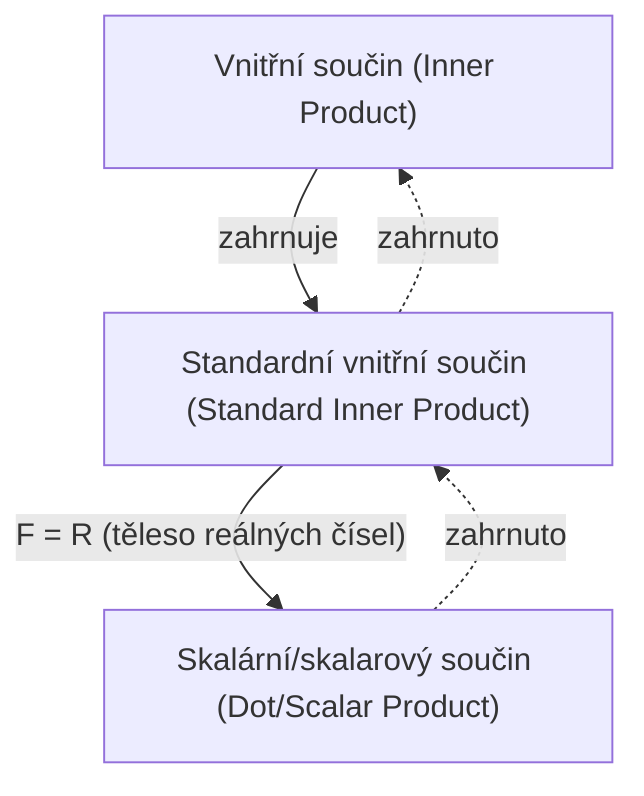

## Předpoklady
- [Vektory a lineární kombinace](/posts/vectors-and-linear-combinations/)

## Vnitřní součin

Definice **vnitřního součinu (inner product)** na obecném $F$-vektorovém prostoru je následující.

> **Definice vnitřního součinu (inner product) a prostoru s vnitřním součinem (inner product space)**  
> Uvažujme $F$-vektorový prostor $\mathbb{V}$. **Vnitřní součin (inner product)** $\langle \mathbf{x},\mathbf{y} \rangle$ na $\mathbb{V}$ definujeme jako funkci, která každé uspořádané dvojici libovolných vektorů $\mathbf{x}$ a $\mathbf{y}$ z $\mathbb{V}$ přiřadí skalár z $F$ a splňuje následující podmínky.
>
> Pro libovolné $\mathbf{x},\mathbf{y},\mathbf{z} \in \mathbb{V}$ a libovolné $c \in F$ platí
> 1. $\langle \mathbf{x}+\mathbf{z}, \mathbf{y} \rangle = \langle \mathbf{x}, \mathbf{y} \rangle + \langle \mathbf{z}, \mathbf{y} \rangle$
> 2. $\langle c\mathbf{x}, \mathbf{y} \rangle = c \langle \mathbf{x}, \mathbf{y} \rangle$
> 3. $\overline{\langle \mathbf{x}, \mathbf{y} \rangle} = \langle \mathbf{y}, \mathbf{x} \rangle$ ($\overline{\mathbf{z}}$ je komplexně sdružené číslo k $\mathbf{z}$)
> 4. Pokud $\mathbf{x} \neq \mathbf{0}$, pak $\langle \mathbf{x}, \mathbf{x} \rangle$ je kladné.
>
> $F$-vektorový prostor $\mathbb{V}$ vybavený vnitřním součinem se nazývá **prostor s vnitřním součinem (inner product space)**. Zejména pro $F=\mathbb{C}$ jde o **komplexní prostor s vnitřním součinem (complex inner product space)** a pro $F=\mathbb{R}$ o **reálný prostor s vnitřním součinem (real inner product space)**.
{: .prompt-info }

Zvlášť důležitý je následující vnitřní součin, kterému se říká **standardní vnitřní součin (standard inner product)**. Lze ověřit, že splňuje všechny čtyři výše uvedené podmínky.

> **Definice standardního vnitřního součinu (standard inner product)**  
> Pro dva vektory $\mathbf{x}=(a_1, a_2, \dots, a_n)$, $\mathbf{y}=(b_1, b_2, \dots, b_n)$ v $F^n$ definujeme **standardní vnitřní součin (standard inner product)** na $F^n$ takto:
>
> $$\langle \mathbf{x}, \mathbf{y} \rangle = \sum_{i=1}^n a_i \overline{b_i} $$
>
{: .prompt-info }

Je-li $F=\mathbb{R}$, pak komplexně sdružené číslo k reálnému číslu je ono samo, takže standardní vnitřní součin má tvar $\sum_{i=1}^n a_i b_i$. V tomto speciálním případě se standardní vnitřní součin často značí místo $\langle \mathbf{x}, \mathbf{y} \rangle$ jako $\mathbf{x} \cdot \mathbf{y}$ a nazývá se **skalární součin (dot product)** nebo **skalarový součin (scalar product)**.

> **Definice skalárního součinu (dot product) / skalarového součinu (scalar product)**  
> Pro $\mathbf{v}=(v_1, v_2, \dots, v_n)$, $\mathbf{w}=(w_1, w_2, \dots, w_n)$ v $\mathbb{R}^n$ definujeme **skalární součin (dot product)** neboli **skalarový součin (scalar product)** na $\mathbb{R}^n$ takto:
>
> $$ \mathbf{v} \cdot \mathbf{w} = \sum_{i=1}^n v_i w_i = v_1 w_1 + v_2 w_2 + \cdots + v_n w_n $$
> 
{: .prompt-info }

> Zde uvedený „skalarový součin (**scalar product**)“ je operace mezi vektory a liší se od operace „skalární násobení (**scalar multiplication**)“ mezi skalárem a vektorem, kterou jsme probírali v článku [Vektory a lineární kombinace](/posts/vectors-and-linear-combinations/). Protože anglické výrazy jsou si podobné a navíc [v terminologii Korejské matematické společnosti se korejský překlad dokonce shoduje](https://www.kms.or.kr/mathdict/list.html?key=kname&keyword=%EC%8A%A4%EC%B9%BC%EB%9D%BC%EA%B3%B1), je třeba dávat pozor, aby nedošlo k záměně.
>
> Abychom předešli nejasnostem, budeme dále pokud možno používat označení **skalární součin (dot product)**.
{: .prompt-warning }

> V eukleidovském prostoru vnitřní součin (inner product) splývá se skalárním součinem (dot product), a proto se často (pokud to kontext dovolí) skalární součin zkráceně označuje jako vnitřní součin. Přísně vzato je však vnitřní součin obecnější pojem, který skalární součin zahrnuje.
{: .prompt-tip }

## Délka / norma vektoru

Pro vektor $\mathbf{v}=(v_1, v_2, \dots, v_n)$ v $\mathbb{R}^n$ definujeme eukleidovskou délku vektoru $\mathbf{v}$ pomocí skalárního součinu takto:

$$ \| \mathbf{v} \| = \sqrt{\mathbf{v} \cdot \mathbf{v}} = \left[ \sum_{i=1}^n |v_i|^2 \right]^{1/2} = \sqrt{v_1^2 + v_2^2 + \cdots + v_n^2} $$

Obecněji, v libovolném prostoru s vnitřním součinem definujeme **délku (length)** neboli **normu (norm)** vektoru takto:

$$ \| \mathbf{x} \| = \sqrt{\langle \mathbf{x}, \mathbf{x} \rangle} $$

V obecném prostoru s vnitřním součinem platí pro normu vektoru následující důležité vlastnosti.

> **Věta**  
> Nechť $\mathbb{V}$ je $F$-prostor s vnitřním součinem, $\mathbf{x}, \mathbf{y} \in \mathbb{V}$ jsou libovolné vektory a $c \in F$ je skalár. Pak platí:
> 1. $\\|c\mathbf{x}\\| = \|c\| \cdot \\|\mathbf{x}\\|$
> 2. Platí obojí:
>    - $\\|\mathbf{x}\\| = 0 \iff \mathbf{x}=\mathbf{0}$
>    - $\\|\mathbf{x}\\| \geq 0 \ \forall \mathbf{x}$
> 3. **Cauchyho–Schwarzova nerovnost (Cauchy-Schwarz inequality)**: $\| \langle \mathbf{x}, \mathbf{y} \rangle \| \leq \\|\mathbf{x}\\| \cdot \\|\mathbf{y}\\|$ (rovnost nastává tehdy, když je jeden z vektorů $\mathbf{x}$ a $\mathbf{y}$ skalárním násobkem druhého)
> 4. **Trojúhelníková nerovnost (triangle inequality)**: $\\| \mathbf{x} + \mathbf{y} \\| \leq \\|\mathbf{x}\\| + \\|\mathbf{y}\\|$ (rovnost nastává tehdy, když je jeden z vektorů $\mathbf{x}$ a $\mathbf{y}$ skalárním násobkem druhého a oba mají stejný směr)
{: .prompt-info }

## Úhel mezi vektory a jednotkový vektor

Vektor délky $1$ se nazývá **jednotkový vektor (unit vector)**. Dále, pro dva vektory $\mathbf{v}=(v_1, v_2, \dots, v_n)$, $\mathbf{w}=(w_1, w_2, \dots, w_n)$ v $\mathbb{R}^n$ platí $\mathbf{v} \cdot \mathbf{w} = \\|\mathbf{v}\\| \cdot \\|\mathbf{w}\\| \cos\theta$, a odtud lze určit úhel $\theta$ ($0 \leq \theta \leq \pi$) mezi vektory $\mathbf{v}$ a $\mathbf{w}$.

$$ \theta = \arccos{\frac{\mathbf{v} \cdot \mathbf{w}}{\|\mathbf{v}\| \cdot \|\mathbf{w}\|}} $$

Pokud $\mathbf{v} \cdot \mathbf{w} = 0$, říkáme, že jsou dva vektory **kolmé (perpendicular)** neboli **ortogonální (orthogonal)**.

> Jsou-li vektory $\mathbf{v}$ a $\mathbf{w}$ kolmé, pak:
>
> $$ \begin{align*}
> \| \mathbf{v} + \mathbf{w} \|^2 &= (\mathbf{v} + \mathbf{w}) \cdot (\mathbf{v} + \mathbf{w}) \\
> &= \mathbf{v} \cdot \mathbf{v} + \mathbf{v} \cdot \mathbf{w} + \mathbf{w} \cdot \mathbf{v} + \mathbf{w} \cdot \mathbf{w} \\
> &= \mathbf{v} \cdot \mathbf{v} + \mathbf{w} \cdot \mathbf{w} \\
> &= \|\mathbf{v}\|^2 + \|\mathbf{w}\|^2.
> \end{align*} $$
>
{: .prompt-tip }

Zobecníme-li to na libovolný prostor s vnitřním součinem, dostaneme následující.

> **Definice**  
> Uvažujme prostor s vnitřním součinem $\mathbb{V}$. Pro vektory $\mathbf{x}, \mathbf{y}$ v $\mathbb{V}$ definujeme, že jsou **ortogonální (orthogonal)** neboli **kolmé (perpendicular)**, jestliže $\langle \mathbf{x}, \mathbf{y} \rangle = 0$. Dále:
> 1. Pro podmnožinu $S$ prostoru $\mathbb{V}$: jsou-li každé dva různé vektory z $S$ navzájem ortogonální, nazývá se $S$ **ortogonální množina (orthogonal set)**.
> 2. Vektor $\mathbf{x} \in \mathbb{V}$ s $\\|\mathbf{x}\\|=1$ se nazývá **jednotkový vektor (unit vector)**.
> 3. Je-li podmnožina $S$ prostoru $\mathbb{V}$ ortogonální množinou a skládá se pouze z jednotkových vektorů, nazývá se $S$ **ortonormální množina (orthonormal set)**.
{: .prompt-info }

Nutná a postačující podmínka pro to, aby množina $S = \{ \mathbf{v}_1, \mathbf{v}_2, \dots \}$ byla ortonormální, je $\langle \mathbf{v}\_i, \mathbf{v}\_j \rangle = \delta\_{ij}$. Násobení vektoru nenulovým skalárem nemění jeho ortogonalitu.

Pro libovolný nenulový vektor $\mathbf{x}$ je $\cfrac{\mathbf{x}}{\\|\mathbf{x}\\|}$ jednotkový vektor; proces, kdy nenulový vektor vynásobíme skalárem rovným převrácené hodnotě jeho délky a tím získáme jednotkový vektor, se nazývá **normalizace (normalizing)**.
