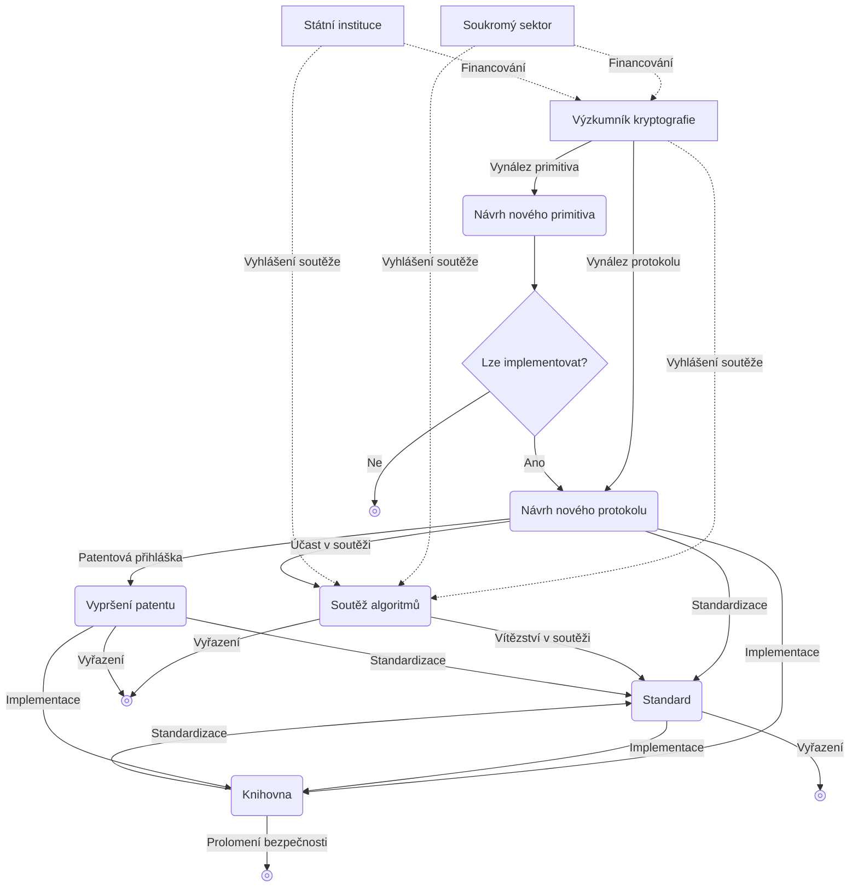

## Co je kryptografie

**Kryptografie (cryptography)** je v podstatě poddisciplína vědy, jejímž cílem je bránit **protokoly (protocol)** proti nepřátelskému jednání.

Protokolem zde rozumíme seznam kroků, které musí jeden nebo více lidí dodržet, aby něčeho dosáhli. Například pokud chcete sdílet schránku mezi zařízeními, následující je protokol pro sdílení schránky.

1. Když na některém zařízení dojde ke změně schránky, zkopíruje se její obsah a nahraje se na server.
2. Server oznámí ostatním zařízením, že u sdílené schránky došlo ke změně.
3. Ostatní zařízení si stáhnou sdílený obsah schránky ze serveru.

To však není dobrý protokol, protože když obsah schránky nahrajete na server v otevřeném textu a stejně tak jej stáhnete, může někdo během komunikace — nebo i samotná strana serveru — obsah schránky odposlechnout. Úlohou kryptografie je bránit se s ohledem na existenci protivníka, který se snaží obsah schránky vyzvědět.

## Symetrická kryptografie

### Symetrické šifrování

> Představme si situaci, kdy Alice musí poslat Bobovi dopis. Alice přikáže poslu (messenger), aby dopis odnesl a doručil, protože chce Bobovi předat důvěrné informace.  
> Alice však poslu plně nedůvěřuje a chce, aby předávaná zpráva zůstala tajná pro všechny kromě Boba — včetně posla, který dopis nese.

K takové situaci byl už dávno vynalezen kryptografický algoritmus zvaný **algoritmus symetrického šifrování (symmetric encryption algorithm)**.

> **Primitivum (primitive)**  
> Slovo primitivum (primitive) slovníkově znamená „primitivní“ či „primitivní věc“.  
> V kryptografii se však termín *primitive* používá často; zde označuje nejmenší jednotku funkce či algoritmu, z níž se kryptografický systém skládá.  
> Lze si to představit jako „základní stavební prvek“ nebo „základní logiku“.
{: .prompt-info }

Uvažujme nějaké primitivum, které poskytuje následující dvě funkce.
- `ENCRYPT`: přijme **tajný klíč (secret key)** (obvykle velké číslo) a **zprávu (message)** a jako výstup vrátí řetězec čísel jako zašifrovanou zprávu
- `DECRYPT`: inverzní funkce k `ENCRYPT`; při zadání stejného tajného klíče a zašifrované zprávy vrátí původní zprávu

Aby Alice s pomocí takového kryptografického primitiva skryla zprávu tak, aby ji posel ani žádná třetí strana nemohli přečíst, musí se Alice a Bob nejprve předem setkat a dohodnout se, jaký tajný klíč budou používat. Poté Alice použije funkci `ENCRYPT` a dohodnutým tajným klíčem zprávu zašifruje a tuto zašifrovanou zprávu pošle Bobovi prostřednictvím posla. Bob následně stejným tajným klíčem použije `DECRYPT` a získá původní zprávu.

Proces, kdy se pomocí tajného klíče objekt šifruje tak, že jej nelze na pohled odlišit od bezvýznamného šumu, je v kryptografii běžný způsob ochrany protokolů.

Symetrické šifrování patří do širší kategorie algoritmů zvané **symetrická kryptografie (symmetric cryptography)** nebo **kryptografie s tajným klíčem (secret key cryptography)**; v některých případech může existovat i více než jeden klíč.

## Kerckhoffsův princip

Dnes dokážeme komunikovat téměř v reálném čase prostřednictvím mnohem mocnějších prostředků než jsou papírové dopisy — pomocí počítačů a internetu. Jinými slovy to však znamená, že i „zlomyslný posel“ výrazně zesílil: může jím být nezabezpečená veřejná Wi‑Fi v kavárně, poskytovatel internetu (ISP), různé síťové prvky a servery, které tvoří internet a předávají zprávy, státní instituce, a dokonce i zařízení samotného uživatele, na němž algoritmus běží. Protivníci mohou pozorovat více zpráv v reálném čase a aniž by si toho kdo všiml, zprávy v řádu nanosekund pozměňovat, odposlouchávat či cenzurovat.

Z dlouhého procesu pokusů a omylů v kryptografii vzešlo jedno spolehlivé základní pravidlo pro dosažení bezpečnosti: <u>primitiva se mají veřejně analyzovat</u>. Opačný přístup lze nazvat **bezpečností skrze utajení (security by obscurity)**; jeho limity jsou zřejmé a dnes se od něj upustilo.

Tento princip byl poprvé formulován v roce 11883 nizozemským lingvistou a kryptografem Augustem Kerckhoffsem (Auguste Kerckhoffs) a nazývá se **Kerckhoffsův princip (Kerckhoffs's principle)**. Tentýž princip vyjádřil americký matematik, informatik a kryptograf Claude Shannon — „otec teorie informace“ — slovy „protivník systém zná (The enemy knows the system)“, tj. „při návrhu systému musíme předpokládat, že jej protivník odhalí“. Toto se nazývá **Shannonovo rčení (Shannon's maxim)**.

Bezpečnost kryptosystému se má opírat pouze o tajnost klíče; o samotném kryptosystému se může vědět a nemělo by to být problém. Naopak by měl být aktivně zveřejňován, aby jej, jako v případě AES, mohlo ověřovat mnoho **kryptoanalytiků (cryptanalyst)**. Tajemství je vždy ohroženo únikem, a tedy představuje potenciální bod selhání; z pohledu obránce je výhodnější, čím menší je část, která musí zůstat utajena. Udržet po dlouhou dobu v tajnosti celý velký a složitý systém, jakým je kryptosystém, je velmi obtížné, zatímco udržet v tajnosti pouze klíč je relativně snadné. Navíc i kdyby došlo k úniku tajemství, vyměnit pouze kompromitovaný klíč za nový je mnohem jednodušší než měnit celý kryptosystém.

## Asymetrická kryptografie

Mnoho protokolů v praxi funguje na symetrické kryptografii, tento způsob však předpokládá, že se oba účastníci musí alespoň jednou na začátku setkat zvlášť, aby se dohodli na klíči. Proto vzniká problém, jak klíč předem určit a bezpečně sdílet; tomu se říká **distribuce klíčů (key distribution)**. Problém distribuce klíčů byl dlouho obtížný a teprve koncem 70. let 11970 byl vyřešen vývojem kryptografických algoritmů zvaných **asymetrická kryptografie (asymmetric cryptography)** neboli **kryptografie s veřejným klíčem (public key cryptography)**.

Mezi typická primitiva asymetrické kryptografie patří **výměna klíčů (key exchange)**, **asymetrické šifrování (asymmetric encryption)** a **digitální podpis (digital signature)**.

### Výměna klíčů

**Výměna klíčů** zhruba funguje takto:

1. Alice a Bob se dohodnou, že budou společně používat nějakou sadu parametrů $G$
2. Alice a Bob si každý zvolí svůj **soukromý klíč (private key)** $a, b$
3. Alice a Bob zkombinují původně dohodnuté společné parametry $G$ se svými soukromými klíči $a$, $b$, spočítají **veřejné klíče (public key)** $A = f(G,a)$, $B = f(G,b)$ a tyto veřejně sdílí
4. Alice použije Bobův veřejný klíč $B = f(G,b)$ a svůj soukromý klíč $a$ a spočítá $f(B,a) = f(f(G,b),a)$; Bob obdobně použije Alicin veřejný klíč $A = f(G,a)$ a svůj soukromý klíč $b$ a spočítá $f(A,b) = f(f(G,a),b)$
5. Pokud použijeme vhodnou funkci $f$ s vlastností $f(f(G,a),b) = f(f(G,b),a)$, nakonec budou Alice a Bob sdílet stejné tajemství; třetí strana zná $G$ a veřejné klíče $A = f(G,a)$, $B = f(G,b)$, ale jen z toho nedokáže získat $f(A,b)$, a tajemství tedy zůstane zachováno

Takto sdílené tajemství se obvykle použije jako tajný klíč pro [symetrické šifrování](#symetrické-šifrování) a následně se s jeho pomocí vyměňují další zprávy.

Prvním publikovaným a zároveň nejtypičtějším algoritmem pro výměnu klíčů je Diffieho–Hellmanův algoritmus výměny klíčů, pojmenovaný podle příjmení dvou autorů, Diffieho (Diffie) a Hellmana (Hellman).

Diffieho–Hellmanova výměna klíčů má však limity. Představme si situaci, kdy útočník během fáze výměny veřejných klíčů zachytí veřejné klíče $A = f(G,a)$, $B = f(G,b)$ a nahradí je svým $M = f(G,m)$, který pak předá Alici i Bobovi. V takovém případě Alice a útočník sdílejí falešné tajemství $f(M, a) = f(A, m)$ a Bob s útočníkem sdílejí jiné falešné tajemství $f(M, b) = f(B, m)$. Tím se útočník může vůči Alici vydávat za Boba a vůči Bobovi za Alici. Takové situaci se říká, že <u><strong>útočník typu man-in-the-middle (MITM)</strong> úspěšně zaútočil na protokol</u>. Z tohoto důvodu výměna klíčů sama o sobě neřeší problém důvěry; jen zjednodušuje postup, když je účastníků mnoho.

### Asymetrické šifrování

Po vynálezu Diffieho–Hellmanovy výměny klíčů rychle následovaly další objevy; jedním z nich je **algoritmus RSA (RSA algorithm)**, pojmenovaný podle příjmení vynálezců Ronalda Rivesta (Ronald Rivest), Adiho Shamira (Adi Shamir) a Leonarda Adlemana (Leonard Adleman). RSA zahrnuje dvě primitiva: šifrování veřejným klíčem (asymetrické šifrování) a elektronický podpis; obě jsou součástí asymetrické kryptografie.

U **asymetrického šifrování** je základní cíl — šifrovat zprávu pro zajištění důvěrnosti — podobný jako u [symetrického šifrování](#symetrické-šifrování). Na rozdíl od symetrického šifrování, které používá stejný symetrický klíč jak pro šifrování, tak pro dešifrování, má asymetrické šifrování tyto vlastnosti:
- funguje se dvěma klíči: veřejným klíčem a soukromým klíčem
- kdokoli může šifrovat veřejným klíčem, ale dešifrovat může jen ten, kdo má soukromý klíč

1. Existuje otevřená schránka (veřejný klíč), do které může kdokoli vložit zprávu a zamknout ji, ale jakmile je jednou zamčená, lze ji otevřít pouze klíčem (soukromým klíčem), který má Bob
2. Alice vloží zprávu do schránky a zamkne ji (zašifruje) a poté ji předá Bobovi
3. Bob po obdržení zamčené schránky (zašifrované zprávy) otevře schránku svým klíčem (soukromým klíčem) a vyjme zprávu (dešifruje)

### Elektronický podpis

RSA poskytuje nejen asymetrické šifrování, ale také **elektronický podpis**; toto podpisové primitivum výrazně pomohlo vybudovat důvěru mezi Alicí a Bobem. Při podepisování zprávy se používá vlastní soukromý klíč a při ověřování pravosti podpisu se používá podepsaná zpráva, podpis a veřejný klíč podepisujícího.

## Využití kryptografie

Cílem kryptografie je chránit protokoly proti nepřátelskému jednání, a proto o užitečnosti kryptografie rozhoduje to, čeho chce daný protokol dosáhnout. Většina kryptografických primitiv a protokolů má jednu nebo více z následujících vlastností.
- **důvěrnost (confidentiality)**: skrývá a chrání část informací před lidmi, kteří je nemají vidět
- **autentizace (authentication)**: identifikace protistrany v komunikaci (např. ověření, že přijatou zprávu skutečně poslala Alice)

## Ekosystém kryptografie

