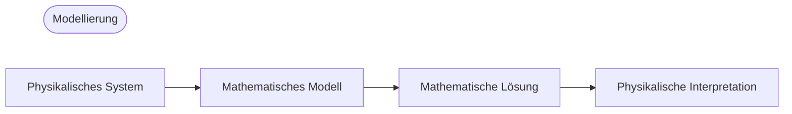

## Modellierung
- **Modell**: Eine mathematische Formulierung eines technischen Problems durch Variablen, Funktionen und Gleichungen
- **Mathematische Modellierung** oder **Modellierung**: Der Prozess der Erstellung eines Modells, dessen mathematische Lösung und Interpretation der Ergebnisse

Da viele physikalische Konzepte wie Geschwindigkeit oder Beschleunigung Ableitungen sind, haben Modelle oft die Form von Gleichungen, die Ableitungen unbekannter Funktionen enthalten, also **Differentialgleichungen**.

## Gewöhnliche Differentialgleichungen (ODE) und Partielle Differentialgleichungen (PDE)
### Gewöhnliche Differentialgleichungen (ODE)
**Gewöhnliche Differentialgleichung (ordinary differential equation; ODE)**: Eine Gleichung, die die n-te Ableitung einer unbekannten Funktion enthält

Beispiele:

$$y' = \cos x$$

$$ y'' + 9y = e^{-2x} $$

$$ y'y''' - \frac{3}{2}y'^{2} = 0 $$

### Partielle Differentialgleichungen (PDE)
**Partielle Differentialgleichung (partial differential equation; PDE)**: Eine Gleichung, die partielle Ableitungen einer unbekannten Funktion mit zwei oder mehr Variablen enthält

Beispiel:

$$ \frac{\partial^2 u}{\partial x^2} + \frac{\partial^2 u}{\partial y^2} = 0 $$

## Lösung
Wenn eine Funktion $h(x)$ in einem offenen Intervall $(a, b)$ definiert und differenzierbar ist und die gegebene gewöhnliche Differentialgleichung zu einer Identität wird, wenn $y$ und $y'$ durch $h$ und $h'$ ersetzt werden, dann wird die Funktion

$$ y = h(x) $$

als **Lösung** der gegebenen gewöhnlichen Differentialgleichung im Intervall $(a, b)$ bezeichnet, und die Kurve von $h$ wird als **Lösungskurve** bezeichnet.

Beispiele:

$$ y'=\cos x \Leftrightarrow y=\sin x+c $$

$$ y'=0.2y \Leftrightarrow y=ce^{0.2t} $$

Eine Lösung, die eine beliebige Konstante $c$ enthält, wird als **allgemeine Lösung** der gewöhnlichen Differentialgleichung bezeichnet.

Geometrisch ist die allgemeine Lösung einer gewöhnlichen Differentialgleichung eine Sammlung unendlich vieler Lösungskurven, wobei jeder Wert der Konstante $c$ einer Kurve entspricht. Durch Auswahl eines bestimmten Wertes für $c$ erhält man eine **spezielle Lösung** der gewöhnlichen Differentialgleichung.

## Anfangswertproblem
Um eine spezielle Lösung des gegebenen Problems zu erhalten, muss der Wert der beliebigen Konstante $c$ bestimmt werden. In vielen Fällen kann dies durch eine **Anfangsbedingung** wie $y(x_{0})=y_{0}$ oder $y(t_{0})=y_{0}$ ermittelt werden (der Begriff Anfangsbedingung wird auch verwendet, wenn die unabhängige Variable nicht die Zeit ist oder $t_{0}\neq0$). Eine gewöhnliche Differentialgleichung mit einer Anfangsbedingung wird als **Anfangswertproblem** bezeichnet.

Beispiel:

$$ y'=f(x,y),\qquad y(x_{0})=y_{0} $$

## Modellierungsbeispiel: Exponentieller Zerfall radioaktiver Substanzen
Bestimmen Sie die verbleibende Menge einer radioaktiven Substanz zu einem späteren Zeitpunkt, wenn anfänglich 0,5g gegeben sind.
> Experimente zeigen, dass radioaktive Substanzen mit einer Geschwindigkeit zerfallen, die proportional zur verbleibenden Menge der Substanz ist, und daher mit der Zeit abnehmen.
{: .prompt-info }

### 1. Aufstellen des mathematischen Modells
Sei $y(t)$ die verbleibende Menge der Substanz zum Zeitpunkt $t$. Da $y'(t)$ proportional zu $y(t)$ ist, erhalten wir die **gewöhnliche Differentialgleichung erster Ordnung**

$$ \frac {dy}{dt} = -ky$$ 

(mit Konstante $k>0$).

Wir kennen auch die **Anfangsbedingung** $y(0)=0.5$. Daher können wir das mathematische Modell als folgendes **Anfangswertproblem** aufstellen:

$$ \frac {dy}{dt} = -ky, \qquad y(0)=0.5 $$

### 2. Mathematische Lösung
Die allgemeine Lösung der oben aufgestellten gewöhnlichen Differentialgleichung lautet (siehe [Trennung der Variablen](/posts/Separation-of-Variables/#modellierungsbeispiel-radiokarbondatierung-radiocarbon-dating)):

$$ y(t)=ce^{-kt} $$

Da $y(0)=c$, erhalten wir aus der Anfangsbedingung $y(0)=c=0.5$. Daher ist die gesuchte spezielle Lösung

$$ y(t)=0.5e^{-kt} \quad(k>0)$$

### 3. Physikalische Interpretation der Lösung
Die gefundene Lösung repräsentiert die Menge der radioaktiven Substanz zu einem beliebigen Zeitpunkt $t$. Die Menge der radioaktiven Substanz beginnt bei einem Anfangswert von 0,5(g) und nimmt mit der Zeit ab, wobei der Grenzwert von $y$ für $t \to \infty$ gleich $0$ ist.