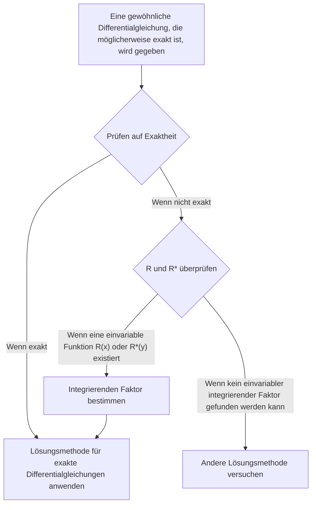

## TL;DR

## Exakte Differentialgleichung
Eine gewöhnliche Differentialgleichung erster Ordnung $M(x,y)+N(x,y)y'=0$ kann geschrieben werden als:

$$ M(x,y)dx+N(x,y)dy=0 \tag{1} $$

Wenn 

$$ \exists u(x,y): \frac{\partial u}{\partial x}=M(x,y) \land \frac{\partial u}{\partial y}=N(x,y) \tag{2} $$

dann gilt 

$$ M(x,y)dx+N(x,y)dy=\frac{\partial u}{\partial x}dx+\frac{\partial u}{\partial y}dy=du \tag{3} $$

und in diesem Fall wird die Differentialgleichung $M(x,y)dx+N(x,y)dy=0$ als **exakte Differentialgleichung** bezeichnet. Dann kann diese Differentialgleichung geschrieben werden als:

$$ du=0 $$

und durch Integration erhalten wir die allgemeine Lösung in der Form:

$$ u(x,y)=c \tag{4} $$

## Bestimmung einer exakten Differentialgleichung
Betrachten wir ein geschlossenes Gebiet in der xy-Ebene mit einer geschlossenen Kurve als Rand, die sich nicht selbst schneidet. Nehmen wir an, dass $M$ und $N$ sowie ihre partiellen Ableitungen erster Ordnung in diesem Gebiet stetig sind. Betrachten wir die Bedingung (2) erneut:

$$ \begin{align*}
\frac {\partial u}{\partial x}&=M(x,y) \tag{2a}
\\ \frac {\partial u}{\partial y}&=N(x,y) \tag{2b}
\end{align*}$$

Wenn wir diese Gleichungen partiell ableiten, erhalten wir:

$$ \begin{align*}
\frac {\partial M}{\partial y} &= \frac{\partial^2 u}{\partial y \partial x}
\\ \frac {\partial N}{\partial x} &= \frac{\partial^2 u}{\partial x \partial y}
\end{align*}$$

Da wir Stetigkeit angenommen haben, sind die beiden partiellen Ableitungen zweiter Ordnung gleich.

$$ \therefore \frac {\partial M}{\partial y}=\frac {\partial N}{\partial x} \tag{5}$$

Daher ist die Bedingung (5) eine notwendige Bedingung dafür, dass die Differentialgleichung (1) exakt ist. Obwohl wir es hier nicht bewiesen haben, ist sie tatsächlich auch eine hinreichende Bedingung. Das bedeutet, dass wir durch Überprüfung dieser Bedingung feststellen können, ob eine Differentialgleichung exakt ist.

## Lösung einer exakten Differentialgleichung
Wenn wir Gleichung (2a) integrieren und dabei y als Konstante betrachten, erhalten wir:

$$ u = \int M(x,y) dx + k(y) \tag{6} $$

Hier fungiert $k(y)$ als Integrationskonstante, da wir y als Konstante betrachtet haben. Nun differenzieren wir Gleichung (6) nach y, wobei wir x als Konstante betrachten, um $\partial u/\partial y$ zu erhalten:

$$ \frac{\partial u}{\partial y} = \frac{\partial}{\partial y}\int M(x,y) dx + \frac{dk}{dy} $$

Jetzt können wir diese Gleichung mit Gleichung (2b) vergleichen, um $dk/dy$ zu bestimmen:

$$ \frac{\partial}{\partial y}\int M(x,y) dx + \frac{dk}{dy} = N(x,y) $$

$$ \frac{dk}{dy} = N(x,y) - \frac{\partial}{\partial y}\int M(x,y) dx $$

Schließlich integrieren wir diese Gleichung, um $k(y)$ zu bestimmen, und setzen es in Gleichung (6) ein, um die implizite Lösung $u(x,y)=c$ zu erhalten:

$$ k(y) = \int N(x,y)dy - \int \left(\frac{\partial}{\partial y}\int Mdx\right)dy + c^* $$

$$ \int M(x,y)dx + \int N(x,y)dy - \int \left(\frac{\partial}{\partial y}\int Mdx\right)dy = c $$

> Es ist wichtiger, den Lösungsprozess zu verstehen, als diese allgemeine Lösungsform als Formel auswendig zu lernen und anzuwenden.
{: .prompt-tip }

## Integrierender Faktor
Betrachten wir eine nicht-exakte Differentialgleichung:

$$ P(x,y)dx+Q(x,y)dy = 0 \quad \left( \frac {\partial P}{\partial y} \neq \frac {\partial Q}{\partial x} \right) \tag{7} $$

Wenn

$$ \exists F(x,y): \frac {\partial}{\partial y}(FP) = \frac {\partial}{\partial x}(FQ) \tag{8} $$

dann können wir die gegebene Differentialgleichung (7) mit der Funktion $F$ multiplizieren, um die folgende exakte Differentialgleichung zu erhalten:

$$ FP\ dx+FQ\ dy = 0 \tag{9} $$

In diesem Fall wird die Funktion $F(x,y)$ als **integrierender Faktor** der Gleichung (7) bezeichnet.

## Methode zur Bestimmung des integrierenden Faktors
Wenn wir die Produktregel der Differentiation auf Gleichung (8) anwenden und partielle Ableitungen mit Indizes darstellen, erhalten wir:

$$ F_y P + FP_y = F_x Q + FQ_x $$

In vielen praktischen Fällen existiert ein integrierender Faktor, der nur von einer Variablen abhängt. Wenn wir $F=F(x)$ annehmen, dann ist $F_y=0$ und $F_x=F'=dF/dx$, und wir erhalten:

$$ FP_y = F'Q + FQ_x $$

Wenn wir beide Seiten durch $FQ$ teilen und die Terme umordnen, erhalten wir:

$$ \begin{align*}
\frac{1}{F} \frac{dF}{dx} &= \frac{P_y}{Q} - \frac{Q_x}{Q}
\\ &= \frac{1}{Q}\left(\frac{\partial P}{\partial y}-\frac{\partial Q}{\partial x} \right)
\end{align*} \tag{10} $$

Daher gilt:

> Für eine gegebene Differentialgleichung (7), wenn die rechte Seite $R$ von Gleichung (10) nur eine Funktion von x ist, dann hat Gleichung (7) einen integrierenden Faktor $F=F(x)$.
>
> $$ F(x)=e^{\int R(x)dx}, \quad \text{wobei }R=\frac{1}{Q}\left(\frac{\partial P}{\partial y}-\frac{\partial Q}{\partial x} \right) \tag{11} $$
{: .prompt-info }

Ähnlich, wenn $F^\*=F^\*(y)$, erhalten wir anstelle von Gleichung (10):

$$ \frac{1}{F^*} \frac{dF^*}{dy} = \frac{1}{P}\left(\frac{\partial Q}{\partial x}-\frac{\partial P}{\partial y} \right) \tag{12} $$

Daher gilt:

> Für eine gegebene Differentialgleichung (7), wenn die rechte Seite $R^*$ von Gleichung (12) nur eine Funktion von y ist, dann hat Gleichung (7) einen integrierenden Faktor $F^\*=F^\*(y)$.
>
> $$ F^*(y)=e^{\int R^*(y)dy}, \quad \text{wobei }R^*=\frac{1}{P}\left(\frac{\partial Q}{\partial x}-\frac{\partial P}{\partial y} \right) \tag{13} $$
{: .prompt-info }
