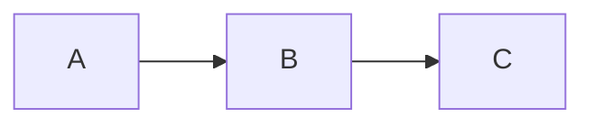

## TL;DR
> **Radioaktivität zu einem beliebigen Zeitpunkt t**
>
> $$\begin{align*}
> \alpha (t) &= \lambda n(t)
> \\ &= \alpha_0 e^{-\lambda t}
> \\ &= \alpha_0 e^{-0,693t/T_{1/2}}
> \end{align*}$$
{: .prompt-info }

> **Beziehung zwischen Zerfallskonstante, Halbwertszeit und mittlerer Lebensdauer**
>
> $$ \begin{align*}
> T_{1/2}&=\frac {\ln 2}{\lambda} = \frac {0,693}{\lambda}
> \\
> \\ \overline{t}&=\frac {1}{\lambda}
> \\ &=\frac {T_{1/2}}{0,693}=1,44T_{1/2}
> \end{align*} $$
{: .prompt-info }

## Zerfallskonstante (Decay Constant)
- Die Wahrscheinlichkeit, dass ein Kern pro Zeiteinheit zerfällt
- Eine Konstante, die unabhängig von der Zeit ist und nur vom Nuklid abhängt
- Mit dem Symbol $\lambda$ bezeichnet

## Radioaktivität (Radioactivity)
Wenn n(t) die Anzahl der Kerne ist, die zum Zeitpunkt t noch nicht zerfallen sind, zerfallen durchschnittlich $\lambda n(t)$ Kerne im Zeitintervall dt zwischen t und t+dt. Diese Zerfallsrate wird als *Radioaktivität* der Probe bezeichnet und mit dem Symbol $\alpha$ gekennzeichnet. Daher ist die Radioaktivität zu einem bestimmten Zeitpunkt t:

$$ \alpha (t)=\lambda n(t) \tag{1}$$

## Einheiten der Radioaktivität
### Curie (Ci)
- Traditionelle Einheit, die vor der Verwendung der Becquerel-Einheit verwendet wurde
- Radioaktivität von 1g Radium-226
- $3,7\times 10^{10}$ Kernzerfälle pro Sekunde ($3,7\times 10^{10}\text{Bq}$)

### Becquerel (Bq)
- Internationale Standardeinheit (SI)
- Ein Kernzerfall pro Sekunde
- $1 \text{Bq} = 2,703\times 10^{-11}\text{Ci} = 27\text{pCi}$

## Berechnung der Änderung der Radioaktivität mit der Zeit
Da $\lambda n(t)$ Kerne während dt zerfallen, kann die Abnahme der nicht zerfallenen Kerne in der Probe während dt wie folgt ausgedrückt werden:

$$ -dn(t)=\lambda n(t)dt $$

Durch Integration erhalten wir:

$$ n(t)=n_0e^{-\lambda t} \tag{2} $$

Wenn wir beide Seiten mit $\lambda$ multiplizieren, erhalten wir für die Radioaktivität:

$$ \alpha (t)=\alpha_0e^{-\lambda t} \tag{3} $$

Da sich die Radioaktivität während der *Halbwertszeit (half-life)* halbiert, gilt:

$$ \alpha (T_{1/2})=\alpha_0/2 $$

Wenn wir dies in Gleichung (3) einsetzen, erhalten wir:

$$ \alpha_0/2=\alpha_0e^{-\lambda T_{1/2}} $$

Wenn wir auf beiden Seiten den Logarithmus nehmen und nach der Halbwertszeit $T_{1/2}$ auflösen, erhalten wir:

$$ T_{1/2}=\frac {\ln 2}{\lambda}=\frac {0,693}{\lambda} \tag{4}$$

Wenn wir diese Gleichung nach $\lambda$ auflösen und in Gleichung (3) einsetzen, erhalten wir:

$$ \alpha (t)=\alpha_0e^{-0,693t/T_{1/2}} \tag{5} $$

Gleichung (5) ist oft nützlicher für Berechnungen des radioaktiven Zerfalls als Gleichung (3), da häufiger Halbwertszeiten als Zerfallskonstanten angegeben werden.

Die *mittlere Lebensdauer (mean-life)* $\overline{t}$ eines radioaktiven Kerns ist der Kehrwert der Zerfallskonstante:

$$ \overline{t}=1/\lambda $$

Aus Gleichung (3) können wir erkennen, dass die Radioaktivität während einer mittleren Lebensdauer auf $1/e$ ihres Anfangswertes abfällt. Aus Gleichung (4) ergibt sich folgende Beziehung zwischen mittlerer Lebensdauer und Halbwertszeit:

$$ \overline{t}=\frac {T_{1/2}}{0,693}=1,44T_{1/2} \tag{6} $$

### ※ Herleitung der mittleren Lebensdauer $\overline{t}$

$$ \begin{align*}
\overline{t}&=\frac {\int_0^\infty t\alpha(t)}{\int_0^\infty t} = \frac {\int_0^\infty t\alpha(t)}{n_0}
\\ &= \frac {\int_0^\infty n_0 \lambda te^{-\lambda t}}{n_0}
\\ &= \int_0^\infty \lambda te^{-\lambda t}
\\ &= \left[-te^{-\lambda t}\right]_0^\infty +\int_0^\infty e^{-\lambda t}
\\ &=\left[-\frac {1}{\lambda} e^{-\lambda t}\right]_0^\infty
\\ &=\frac {1}{\lambda}
\end{align*}$$

## Beispiel: Radioaktive Zerfallskette 1
Nehmen wir an, dass ein Radionuklid mit einer Rate von $R$ Atomen/s erzeugt wird. Diese Kerne beginnen sofort nach ihrer Entstehung zu zerfallen. Berechnen Sie die Radioaktivität dieses Nuklids zu einem beliebigen Zeitpunkt t.

### 1. Modellaufstellung

$$ \text{Änderungsrate des Nuklids mit der Zeit} = \text{Erzeugungsrate} - \text{Verlustrate} $$

In mathematischer Notation:

$$ dn/dt = -\lambda n + R $$

### 2. Allgemeine Lösung
Bringen wir alle Terme mit n auf die linke Seite und multiplizieren beide Seiten mit $e^{\lambda t}$:

$$ \frac {dn}{dt} + \lambda n = R $$

$$ e^{\lambda t}\frac {dn}{dt} + \lambda e^{\lambda t}n = Re^{\lambda t} $$

Da $\lambda e^{\lambda t}=\frac {d}{dt} e^{\lambda t}$, können wir dies wie folgt umformen:

$$ e^{\lambda t}\frac {dn}{dt}+\left(\frac {d}{dt} e^{\lambda t}\right)n = Re^{\lambda t} $$

Durch Integration beider Seiten erhalten wir die allgemeine Lösung:

$$ e^{\lambda t}n=\frac {R}{\lambda}e^{\lambda t}+c $$

$$ n=ce^{-\lambda t}+\frac {R}{\lambda} $$

### 3. Spezielle Lösung
Nehmen wir an, dass zum Zeitpunkt t=0 die Anzahl dieses Nuklids $n_0$ beträgt, und bestimmen wir den Wert der Konstante c:

$$ n(0)=c+\frac {R}{\lambda}=n_0 $$

$$ c=n_0-\frac {R}{\lambda} $$

Daher lautet die spezielle Lösung für die gegebene Situation:

$$ n = n_0e^{-\lambda t}+\frac {R}{\lambda}(1-e^{-\lambda t}) \tag{7} $$

Wenn wir beide Seiten dieser Gleichung mit $\lambda$ multiplizieren, erhalten wir die Radioaktivität dieses Nuklids:

$$ \alpha = \alpha_0e^{-\lambda t}+R(1-e^{-\lambda t}) \tag{8} $$

Das bedeutet, dass für $t\to\infty$ die Radioaktivität gegen $\alpha_{\text{max}}=R$ und die Anzahl der Kerne gegen $n_{\text{max}}=R/\lambda$ konvergiert.

## Beispiel: Radioaktive Zerfallskette 2
Berechnen Sie die Radioaktivität des Radionuklids B in der folgenden Zerfallskette:

### 1. Modellaufstellung

$$ \text{Änderungsrate der Anzahl von B-Kernen} = \text{Erzeugungsrate durch Zerfall von A} - \text{Zerfallsrate von B zu C} $$

$$ \frac {dn_B}{dt} = -\lambda_B n_B + \lambda_A n_A $$

Wenn wir Gleichung (2) für $n_A$ einsetzen, erhalten wir die folgende Differentialgleichung für $n_B$:

$$  \frac {dn_B}{dt} = -\lambda_B n_B + \lambda_A n_{A0}e^{-\lambda_A t} \tag{9}$$ 

### 2. Allgemeine Lösung
Um die Differentialgleichung zu lösen, bringen wir alle Terme mit $n_B$ auf die linke Seite und multiplizieren beide Seiten mit $e^{\lambda_B t}$:

$$ \frac {dn_B}{dt} + \lambda_B n_B = n_{A0}\lambda_A e^{-\lambda_A t} $$

$$ e^{\lambda_B t}\frac {dn_B}{dt} + \lambda_B e^{\lambda_B t}n_B = n_{A0}\lambda_A e^{(\lambda_B-\lambda_A)t} $$

Da $\lambda_B e^{\lambda_B t}=\frac {d}{dt} e^{\lambda_b t}$, können wir dies wie folgt umformen:

$$ e^{\lambda_B t}\frac {dn_B}{dt} + \left(\frac {d}{dt} e^{\lambda_B t}\right)n_B = n_{A0}\lambda_A e^{(\lambda_B-\lambda_A)t} $$

Durch Integration beider Seiten erhalten wir:

$$ e^{\lambda_B t}n_B = \frac {n_{A0}\lambda_A}{\lambda_B-\lambda_A}e^{(\lambda_B-\lambda_A)t}+c $$

Wenn wir beide Seiten durch $e^{\lambda_B t}$ dividieren, erhalten wir die allgemeine Lösung:

$$ n_B = \frac {n_{A0}\lambda_A}{\lambda_B-\lambda_A}e^{-\lambda_A t}+ce^{-\lambda_B t} $$

### 3. Spezielle Lösung
Nehmen wir an, dass zum Zeitpunkt t=0 die Anzahl der B-Elemente $n_{B0}$ beträgt, und bestimmen wir den Wert der Konstante c:

$$ n_B(0)=\frac {n_{A0}\lambda_A}{\lambda_B-\lambda_A}+c=n_{B0} $$

$$ c=n_{B0}-\frac{n_{A0}\lambda_A}{\lambda_B-\lambda_A} $$

Daher lautet die spezielle Lösung für die gegebene Situation:

$$ n_B = n_{B0}e^{-\lambda_B t} + \frac {n_{A0}\lambda_A}{\lambda_B - \lambda_A} (e^{-\lambda_A t} - e^{-\lambda_B t}) \tag{10}$$

$$ \therefore \alpha_B = \alpha_{B0} e^{-\lambda_B t} + \frac {\alpha_{A0}\lambda_A}{\lambda_B - \lambda_A} (e^{-\lambda_A t} - e^{-\lambda_B t}) \tag{11}$$