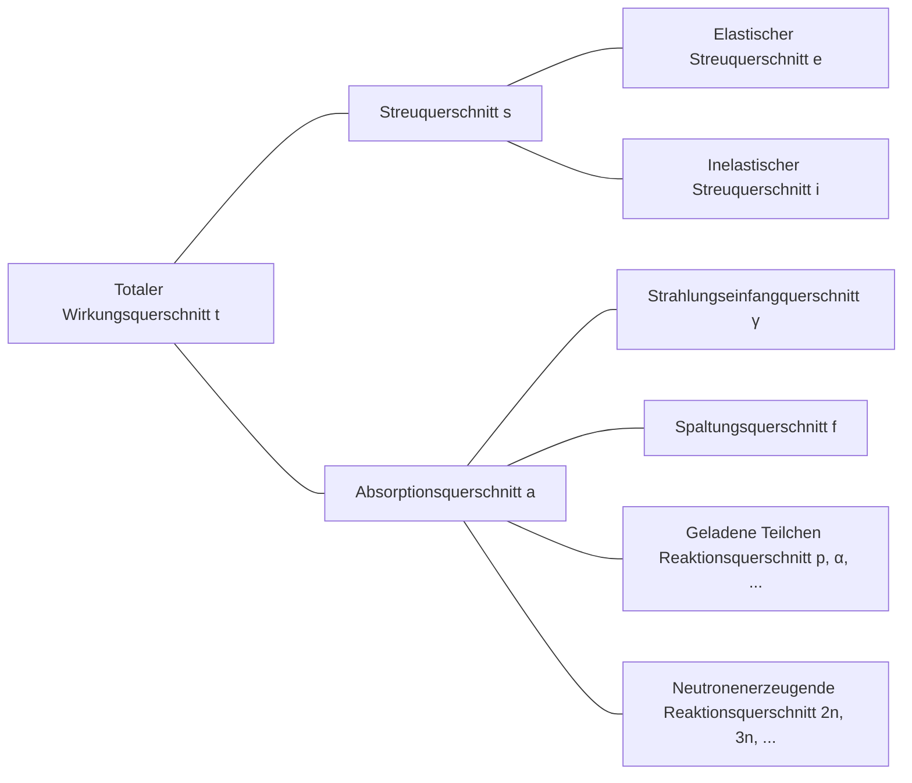

## Neutronenwechselwirkungen
Neutronen sind elektrisch neutral und werden daher nicht von der elektrischen Wirkung der Elektronen oder der positiven Ladung des Atomkerns im Atom beeinflusst. Folglich können Neutronen durch die Elektronenwolke des Atoms hindurchgehen und direkt mit dem Atomkern reagieren.

### Elastische Streuung (elastic scattering)
- Neutron prallt nach der Kollision mit dem Atomkern ab
- Der Atomkern behält seinen Grundzustand ohne Energieänderung bei
- Wird als (n, n) dargestellt

### Inelastische Streuung (inelastic scattering)
- Neutron prallt nach der Kollision mit dem Atomkern ab
- Im Gegensatz zur elastischen Streuung absorbiert der Atomkern einen Teil der Neutronenenergie und geht in einen angeregten Zustand über (endotherme Reaktion)
- Wird als (n, n′) dargestellt
- Der angeregte Atomkern kehrt unter Emission von Gammastrahlung in den Grundzustand zurück, wobei die dabei entstehende Gammastrahlung als *inelastische Gammastrahlung (inelastic γ-ray)* bezeichnet wird

### Strahlungseinfang (radiative capture)
- Der Atomkern fängt ein Neutron ein und emittiert ein oder mehrere Gammastrahlen (exotherme Reaktion)
- Wird als (n, γ) dargestellt
- Die dabei entstehende Gammastrahlung wird als *Einfanggammastrahlung (capture γ-ray)* bezeichnet

### Geladene Teilchen Reaktionen
- Der Atomkern fängt ein Neutron ein und emittiert geladene Teilchen wie Alphateilchen (α) oder Protonen (p)
- Wird als (n, α), (n, p) usw. dargestellt
- Kann je nach Fall eine exotherme oder endotherme Reaktion sein

### Neutronenerzeugende Reaktionen
- Hochenergetische Neutronen kollidieren mit Atomkernen und erzeugen zwei oder mehr neue Neutronen (endotherme Reaktion)
- Wird als (n, 2n), (n, 3n) usw. dargestellt
- Die (n, 2n) Reaktion ist besonders wichtig in Reaktoren, die schweres Wasser oder Beryllium enthalten, da die Neutronen in 2H und 9Be schwach gebunden sind und leicht durch Kollisionen mit Neutronen niedriger Energie freigesetzt werden können

### Kernspaltung (fission)
- Ein Neutron kollidiert mit einem bestimmten Atomkern und spaltet diesen in zwei oder mehr Tochterkerne

## Wirkungsquerschnitt (cross-section) oder mikroskopischer Wirkungsquerschnitt (microscopic cross-section)
Angenommen, ein monoenergetischer Neutronenstrahl trifft auf ein (sehr dünnes) Target mit der Dicke τ und der Fläche A, und die Anzahl der pro Sekunde und Flächeneinheit auf das Target einfallenden Neutronen sei I Neutronen/cm2·s. Da der Volumenanteil des Atomkerns im Atom sehr klein ist und wir ein sehr dünnes Target angenommen haben, passieren die meisten Neutronen das Target, ohne mit den Atomkernen zu reagieren. Die Anzahl der Neutronen, die pro Sekunde und Flächeneinheit mit den Atomkernen kollidieren, ist dann proportional zur Intensität des Neutronenstrahls I, der Dicke des Targets τ und der atomaren Dichte des Targets N.

$$ \Delta I \propto I\tau N $$

Mit der Einführung der Proportionalitätskonstante σ kann dies wie folgt ausgedrückt werden:

$$ \Delta I = \sigma I\tau N\ \text{[Neutronen/cm}^2\cdot\text{s]} \tag{1} $$

Das Verhältnis der mit den Atomkernen kollidierenden Neutronen zu den auf das Target einfallenden Neutronen ergibt sich wie folgt:

$$ p = \frac {\Delta I}{I} = \sigma\tau N = \frac {\sigma}{A} A\tau N = \frac {\sigma}{A} N_t \tag{2} $$

(Nt: Gesamtzahl der Atome im Target)

Aus dieser Gleichung ist ersichtlich, dass σ die Einheit einer Fläche hat. Diese Proportionalitätskonstante σ wird als *Wirkungsquerschnitt (cross-section)* oder *mikroskopischer Wirkungsquerschnitt (microscopic cross-section)* bezeichnet. Physikalisch repräsentiert der Wirkungsquerschnitt die effektive Fläche, mit der ein Atomkern mit Neutronen reagieren kann.

## Einheit des mikroskopischen Wirkungsquerschnitts
Da cm2 eine zu große Einheit ist, um den mikroskopischen Wirkungsquerschnitt auszudrücken, wird üblicherweise die Einheit *barn* (b) verwendet.

$$ 1\ \text{b} = 10^{-24}\ \text{cm}^2 $$

## Arten des mikroskopischen Wirkungsquerschnitts
- Totaler Wirkungsquerschnitt (total): σt
  - Streuquerschnitt (scattering): σs
    - Elastischer Streuquerschnitt (elastic scattering): σe
    - Inelastischer Streuquerschnitt (inelastic scattering): σi
  - Absorptionsquerschnitt (absorption): σa
    - Strahlungseinfangquerschnitt (radiative capture): σγ
    - Spaltungsquerschnitt (fission): σf
    - Geladene Teilchen Reaktionsquerschnitt: σp, σα, ...
    - Neutronenerzeugende Reaktionsquerschnitt: σ2n, σ3n, ...

## Makroskopischer Wirkungsquerschnitt (macroscopic cross-section)
Aus Gleichung (2) ergibt sich die Kollisionsrate pro Längeneinheit des Neutronenstrahls wie folgt:

$$ \frac {p}{\tau} = \frac {1}{\tau} \frac {\Delta I}{I} = \sigma N \equiv \Sigma\ \text{[cm}^{-1}\text{]} \tag{3}$$

Der *makroskopische Wirkungsquerschnitt (macroscopic cross-section)* wird wie oben als Produkt der atomaren Dichte N und des Wirkungsquerschnitts definiert. Physikalisch repräsentiert der makroskopische Wirkungsquerschnitt die Kollisionsrate pro Längeneinheit der Neutronenbewegung in einem bestimmten Target. Ähnlich wie beim mikroskopischen Wirkungsquerschnitt kann er wie folgt unterteilt werden:

- Makroskopischer totaler Wirkungsquerschnitt Σt=Nσt
  - Makroskopischer Streuquerschnitt Σs=Nσs
  - Makroskopischer Absorptionsquerschnitt Σa=Nσa

Im Allgemeinen gilt für den makroskopischen Wirkungsquerschnitt einer bestimmten Reaktion: Σreaction=Nσreaction.

## Kollisionsdichte (collision density), d.h. Reaktionsrate (reaction rate)
Die *Kollisionsdichte (collision density)* oder *Reaktionsrate (reaction rate)* bezeichnet die Anzahl der Kollisionen pro Zeiteinheit und Volumeneinheit im Target. Aus den Gleichungen (1) und (3) kann sie wie folgt definiert werden:

$$ F = \frac {\Delta I}{\tau} = I\sigma N = I\Sigma \tag{4} $$
