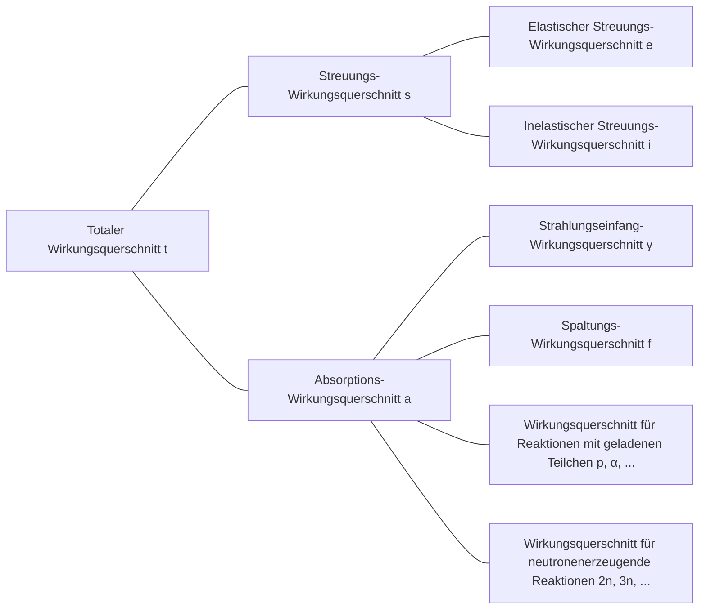

## Wirkungsquerschnitt (cross-section) oder mikroskopischer Wirkungsquerschnitt (microscopic cross-section)
Betrachten wir einen monoenergetischen Neutronenstrahl, der auf ein (sehr dünnes) Target mit der Dicke $\tau$ und der Fläche $A$ trifft, wobei die Anzahl der pro Sekunde und Flächeneinheit auf das Target treffenden Neutronen $I\ \text{neutrons/cm}^2\cdot \text{s}$ beträgt. Da der Atomkern nur einen sehr kleinen Teil des Atomvolumens einnimmt und wir ein sehr dünnes Target angenommen haben, passieren die meisten Neutronen das Target, ohne mit einem Atomkern zu reagieren. Die Anzahl der Neutronen, die pro Sekunde und Flächeneinheit mit Atomkernen kollidieren, ist proportional zur Intensität des Neutronenstrahls $I$, zur Dicke des Targets $\tau$ und zur Atomdichte des Targets $N$.

$$ \Delta I \propto I\tau N $$

Mit der Einführung einer Proportionalitätskonstante $\sigma$ kann dies wie folgt ausgedrückt werden:

$$ \Delta I = \sigma I\tau N\ \mathrm{[neutrons/cm^2\cdot s]} \label{eqn:microscopic_cross_section}\tag{1} $$

Der Anteil der einfallenden Neutronen, die mit Atomkernen kollidieren, ergibt sich zu:

$$ p = \frac {\Delta I}{I} = \sigma\tau N = \frac {\sigma}{A} A\tau N = \frac {\sigma}{A} N_t \label{eqn:collision_rate}\tag{2} $$

($N_t$: Gesamtzahl der Atome im Target)

Aus dieser Gleichung ist ersichtlich, dass $\sigma$ die Einheit einer Fläche hat. Diese Proportionalitätskonstante $\sigma$ wird als *Wirkungsquerschnitt (cross-section)* oder *mikroskopischer Wirkungsquerschnitt (microscopic cross-section)* bezeichnet. Physikalisch repräsentiert der Wirkungsquerschnitt die effektive Fläche, mit der ein Atomkern mit Neutronen wechselwirken kann.

## Einheit des mikroskopischen Wirkungsquerschnitts
Da cm$^2$ eine zu große Einheit für die Darstellung des mikroskopischen Wirkungsquerschnitts ist, wird üblicherweise die Einheit *barn* (b) verwendet.

$$ 1\ \text{b} = 10^{-24}\ \text{cm}^2 \label{eqn:barn}\tag{3}$$

## Arten des mikroskopischen Wirkungsquerschnitts
- Totaler (total) Wirkungsquerschnitt: $\sigma_t$
  - Streuungs- (scattering) Wirkungsquerschnitt: $\sigma_s$
    - Elastischer Streuungs- (elastic scattering) Wirkungsquerschnitt: $\sigma_e$
    - Inelastischer Streuungs- (inelastic scattering) Wirkungsquerschnitt: $\sigma_i$
  - Absorptions- (absorption) Wirkungsquerschnitt: $\sigma_a$
    - Strahlungseinfang- (radiative capture) Wirkungsquerschnitt: $\sigma_\gamma$
    - Spaltungs- (fission) Wirkungsquerschnitt: $\sigma_f$
    - Wirkungsquerschnitt für Reaktionen mit geladenen Teilchen (charged-particle reactions): $\sigma_p, \sigma_\alpha, \cdots$
    - Wirkungsquerschnitt für neutronenerzeugende Reaktionen (neutron-producing reactions): $\sigma_{2n}, \sigma_{3n}, \cdots$

## Neutronenwechselwirkungen
Da Neutronen elektrisch neutral sind, werden sie weder von den Elektronen noch von der positiven Ladung des Atomkerns elektrisch beeinflusst. Daher können Neutronen die Elektronenhülle des Atoms durchdringen und direkt mit dem Atomkern wechselwirken.

### Bildung eines Compoundkerns
Die meisten Wechselwirkungen zwischen Neutronen und Materie erfolgen in zwei Schritten:
1. Das Neutron und der Atomkern verschmelzen zu einem Compoundkern (compound nucleus)
2. Der Compoundkern zerfällt auf verschiedene Arten

$$ \begin{align*}
\mathrm{^A Z} + \mathrm{n} \to \left( \mathrm{^{A+1}Z} \right)^*
&\to \mathrm{^A Z} + \mathrm{n} \text{ (elastische Streuung)} \\
&\to \mathrm{^A Z} + \mathrm{n}^\prime \text{ (inelastische Streuung)} \\
&\to \mathrm{^{A+1}Z} + \gamma \text{ (Strahlungseinfang)} \\
&\qquad \vdots
\end{align*} $$

Atomkerne besitzen quantisierte Energieniveaus, die von der Anordnung ihrer Nukleonen abhängen. Wenn die Energie des einfallenden Neutrons einem angeregten Zustand des Zielkerns entspricht, wird die Bildung eines Compoundkerns begünstigt. Dadurch wird der Wirkungsquerschnitt für bestimmte Neutronenenergien maximiert, ein Phänomen, das als *Resonanz (resonance)* bezeichnet wird.

### Elastische Streuung (elastic scattering)
- Das Neutron kollidiert mit dem Atomkern und wird abgelenkt
- Der Atomkern bleibt im Grundzustand ohne Energieänderung
- Wird als $(\mathrm{n}, \mathrm{n})$ bezeichnet

Der elastische Streuungs-Wirkungsquerschnitt als Funktion der Neutronenenergie kann in drei verschiedene Bereiche unterteilt werden.

> **Elastischer Streuungs- und totaler Wirkungsquerschnitt von Kohlenstoff-12**  
> - Grafik bereitgestellt von: Nuclear Data Center at KAERI (Korea Atomic Energy Research Institute), Table of Nuclides (<https://atom.kaeri.re.kr/nuchart/>)

> **Elastischer Streuungs- und totaler Wirkungsquerschnitt von U-238**  
> - Grafik bereitgestellt von: Nuclear Data Center at KAERI (Korea Atomic Energy Research Institute), Table of Nuclides (<https://atom.kaeri.re.kr/nuchart/>)

#### Niederenergiebereich (low-energy region)
In diesem Bereich ist der elastische Streuungs-Wirkungsquerschnitt näherungsweise konstant. Es bildet sich kein Compoundkern, sondern der Atomkern übt eine Kraft auf das vorbeifliegende Neutron aus, was zu einer geringfügigen Streuung führt. Dies wird als Potentialstreuung (potential scattering) bezeichnet. Wenn $R$ der Atomradius ist, beträgt der Potentialstreuungs-Wirkungsquerschnitt:

$$ \sigma_e = 4\pi R^2 \label{eqn:potential_scattering}\tag{4}$$

> **Warum der Streuungs-Wirkungsquerschnitt im extrem niedrigen Energiebereich nicht konstant ist**  
> Die obige Näherungsformel gilt für Kohlenstoff-12 etwa im Bereich von 0,02 eV bis 0,01 MeV. In noch niedrigeren Energiebereichen zeigen die realen Daten, dass $\sigma_e \propto 1/E$ gilt.
>
> Nach dem **Ramsauer-Modell (Ramsauer model)** besteht im niedrigen Energiebereich folgende Beziehung zwischen dem Streuungs-Wirkungsquerschnitt und der Neutronenenergie:
>
> $$ \sigma(E) \propto \left(R+\lambda(E)\right)^2. $$
>
> Gemäß der [de-Broglie-Wellenlängenformel für Neutronen](/posts/Mass-and-Energy-Particles-and-Waves/#ohne-berücksichtigung-relativistischer-effekte-zb-neutronen) gilt hier $\lambda(E) \propto \cfrac{1}{\sqrt{E}}$. In den meisten Fällen ist $\lambda(E) \ll R$, sodass $\lambda(E)$ vernachlässigt und $\sigma(E) \propto R^2$ angenommen werden kann. Bei sehr niedrigen Energien verhält sich das Neutron jedoch eher wie eine Welle als wie ein Teilchen, und die de-Broglie-Wellenlänge wird größer als der Atomradius. Dann wird $\lambda(E)$ zum dominierenden Term, und es gilt $\sigma(E) \propto \lambda(E)^2 \propto \cfrac{1}{E}$.
{: .prompt-info }

#### Resonanzbereich (resonance region)
In diesem Bereich absorbiert der Atomkern das Neutron kurzzeitig und bildet einen Compoundkern, der anschließend ein Neutron mit der gleichen Energie wie das einfallende Neutron wieder emittiert. Dies wird als elastische Resonanzstreuung (elastic resonance scattering) bezeichnet. Da Resonanzen bei Neutronenenergien auftreten, die den Energieniveaudifferenzen des Zielkerns entsprechen, zeigt der Wirkungsquerschnitt bei bestimmten Energiewerten deutliche Spitzen.

Je schwerer der Kern, desto niedriger liegt der Resonanzbereich. Bei Uran-238 beginnt der Resonanzbereich bereits bei etwa 6 eV und erstreckt sich bis etwa 1 keV, deutlich niedriger als bei Kohlenstoff-12.

#### Hochenergiebereich (smooth region)
Im Hochenergiebereich werden die Abstände zwischen den Energieniveaus des Atomkerns so klein, dass die einzelnen Resonanzen nicht mehr unterscheidbar sind. In diesem Bereich ändert sich $\sigma_e$ nur leicht und kontinuierlich mit der Neutronenenergie.

### Inelastische Streuung (inelastic scattering)
- Das Neutron kollidiert mit dem Atomkern und wird abgelenkt
- Im Gegensatz zur elastischen Streuung absorbiert der Atomkern einen Teil der Neutronenenergie und geht in einen angeregten Zustand über ([endotherme Reaktion](/posts/nuclear-reactions-and-binding-energy/#exotherme-reaktion-exothermic-reaction--endotherme-reaktion-endothermic-reaction))
- Da die Energieniveaus des Atomkerns quantisiert sind, kann diese Reaktion nur stattfinden, wenn das einfallende Neutron eine Energie hat, die mindestens so groß ist wie die Differenz zwischen zwei Energieniveaus des Kerns
  - Bei schweren Kernen sind die Energieniveaus feiner unterteilt, sodass inelastische Streuung leichter auftritt, während sie bei leichten Kernen seltener vorkommt
  - Wie in den unten stehenden Grafiken zu sehen ist, liegt die Schwellenenergie für inelastische Streuung bei Kohlenstoff bei 4,80 MeV, während sie bei Uran-238 nur 44 keV beträgt
- Oberhalb der Schwellenenergie ist der inelastische Streuungs-Wirkungsquerschnitt $\sigma_i$ ungefähr gleich groß wie der elastische Streuungs-Wirkungsquerschnitt $\sigma_e$
- Wird als $(\mathrm{n}, \mathrm{n}^{\prime})$ bezeichnet
- Der angeregte Atomkern kehrt später durch Emission von Gammastrahlung in den Grundzustand zurück. Diese Gammastrahlung wird als *inelastische Gammastrahlung (inelastic $\gamma$-ray)* bezeichnet

> **Elastischer und inelastischer Streuungs-Wirkungsquerschnitt von C-12**  
> - Grafik bereitgestellt von: Nuclear Data Center at KAERI (Korea Atomic Energy Research Institute), Table of Nuclides (<https://atom.kaeri.re.kr/nuchart/>)

> **Elastischer und inelastischer Streuungs-Wirkungsquerschnitt von U-238**  
> - Grafik bereitgestellt von: Nuclear Data Center at KAERI (Korea Atomic Energy Research Institute), Table of Nuclides (<https://atom.kaeri.re.kr/nuchart/>)

### Strahlungseinfang (radiative capture)
- Der Atomkern fängt ein Neutron ein und emittiert ein oder mehrere Gammaquanten ([exotherme Reaktion](/posts/nuclear-reactions-and-binding-energy/#exotherme-reaktion-exothermic-reaction--endotherme-reaktion-endothermic-reaction))
- Wird als $(\mathrm{n}, \gamma)$ bezeichnet
- Die dabei entstehende Gammastrahlung wird als *Einfang-Gammastrahlung (capture $\gamma$-ray)* bezeichnet
- Da das kollidierende Neutron im Atomkern absorbiert wird, handelt es sich um eine Absorptionsreaktion

Ähnlich wie bei der [elastischen Streuung](#elastische-streuung-elastic-scattering) kann der Strahlungseinfang-Wirkungsquerschnitt $\sigma_\gamma$ in drei Bereiche unterteilt werden.

> **Strahlungseinfang-Wirkungsquerschnitt von Au-197**  
> - Grafik bereitgestellt von: Nuclear Data Center at KAERI (Korea Atomic Energy Research Institute), Table of Nuclides (<https://atom.kaeri.re.kr/nuchart/>)

#### Niederenergiebereich ($1/v$-Bereich)
Im Niederenergiebereich ist $\sigma_\gamma$ für die meisten Nuklide proportional zu $1/\sqrt{E}$, also zu $1/v$. In der obigen log-log-Darstellung des Strahlungseinfang-Wirkungsquerschnitts von Gold-197 ist ein linearer Abschnitt mit einer Steigung von $-1/2$ zu erkennen.

Einige wichtige Nuklide zeigen im niedrigen Energiebereich nicht exakt ein $1/v$-Verhalten. Diese Nuklide werden als Nicht-$1/v$-Absorber (non-$1/v$ absorber) bezeichnet.

#### Resonanzbereich
Jenseits des $1/v$-Bereichs tritt der Resonanzbereich im gleichen Energiebereich auf wie bei Streuungsreaktionen. In der Nähe einer Resonanz bei der Energie $E_r$ wird $\sigma_\gamma$ durch die Breit-Wigner-Formel (Breit-Wigner) für eine einzelne Stufe beschrieben:

$$ \sigma_\gamma = \frac{\gamma_r^2 g}{4\pi}\frac{\Gamma_n\Gamma_g}{(E-E_r)^2 + \Gamma^2/4} \label{eqn:breit_wigner}\tag{5}$$

- $\gamma_r$: de-Broglie-Wellenlänge eines Neutrons mit der Energie $E_r$
- $g$: *statistischer Faktor (statistical factor)*, eine Konstante
- $\Gamma \ (=\Gamma_n + \Gamma_\gamma)$: *Gesamtbreite (total width)*, eine Konstante
  - $\Gamma_n$: *Neutronenbreite (neutron width)*, eine Konstante
  - $\Gamma_\gamma$: *Strahlungsbreite (radiation width)*, eine Konstante

> Die Breite $\Gamma$ ist definiert durch $\sigma_\gamma(E_r \pm \Gamma/2) = \cfrac{1}{2}\sigma_\gamma(E_r)$, also als der Energiebereich, in dem der Wirkungsquerschnitt auf die Hälfte seines Maximalwerts abfällt. Dies ist der Ursprung des Begriffs *Breite (width)*.
{: .prompt-tip }

#### Hochenergiebereich (oberhalb des Resonanzbereichs)
Oberhalb des Resonanzbereichs (bei schweren Kernen etwa ab 1 keV, bei leichteren Kernen bei höheren Energien) nimmt $\sigma_\gamma$ zunächst stark ab und fällt dann langsam auf einen sehr kleinen Wert.

### Reaktionen mit geladenen Teilchen (charged-particle reactions)
- Der Atomkern fängt ein Neutron ein und emittiert ein geladenes Teilchen wie ein Alpha-Teilchen ($\alpha$) oder ein Proton ($\mathrm{p}$)
- Werden als $(\mathrm{n}, \alpha)$, $(\mathrm{n}, \mathrm{p})$ usw. bezeichnet
- Können je nach Fall [exotherm](/posts/nuclear-reactions-and-binding-energy/#exotherme-reaktion-exothermic-reaction--endotherme-reaktion-endothermic-reaction) oder [endotherm](/posts/nuclear-reactions-and-binding-energy/#exotherme-reaktion-exothermic-reaction--endotherme-reaktion-endothermic-reaction) sein, sind aber meist [endotherm](/posts/nuclear-reactions-and-binding-energy/#exotherme-reaktion-exothermic-reaction--endotherme-reaktion-endothermic-reaction)
- Treten unterhalb der Schwellenenergie nicht auf und haben auch oberhalb der Schwellenenergie meist kleine Wirkungsquerschnitte (besonders bei schweren Kernen)

Obwohl Reaktionen mit geladenen Teilchen eine Schwellenenergie benötigen und generell kleine Wirkungsquerschnitte haben, gibt es einige wichtige Reaktionen dieser Art bei leichten Kernen.

#### Exotherme Reaktionen
##### $^{10}\mathrm{B}(\mathrm{n},\alpha){^7\mathrm{Li}}$

> **Wirkungsquerschnitt der $^{10}\mathrm{B}(\mathrm{n},\alpha){^7\mathrm{Li}}$-Reaktion**  
> - Grafik bereitgestellt von: Nuclear Data Center at KAERI (Korea Atomic Energy Research Institute), Table of Nuclides (<https://atom.kaeri.re.kr/nuchart/>)

- Für Energien unter $100\ \mathrm{keV}$ ist $\sigma_\alpha \propto 1/v$, wie in der Grafik zu sehen
- $\sigma_\alpha$ ist im niedrigen Energiebereich sehr groß, weshalb diese Reaktion häufig zur Absorption niederenergetischer Neutronen genutzt wird

> In Reaktoren mit Wasser als Kühlmittel und Moderator wird Bor oft dem Moderator zugesetzt, um überschüssige Neutronen zu absorbieren und so die Reaktion zu steuern oder den Reaktor im Notfall abzuschalten.
{: .prompt-tip }

##### $^{6}\mathrm{Li}(\mathrm{n},\alpha){^3\mathrm{H}}$

> **Wirkungsquerschnitt der $^{6}\mathrm{Li}(\mathrm{n},\alpha){^3\mathrm{H}}$-Reaktion**  
> - Grafik bereitgestellt von: Nuclear Data Center at KAERI (Korea Atomic Energy Research Institute), Table of Nuclides (<https://atom.kaeri.re.kr/nuchart/>)

- Auch hier gilt für Energien unter etwa $100\ \mathrm{keV}$ die Beziehung $\sigma_\alpha \propto 1/v$
- Wird zur Erzeugung von Tritium ($^3\mathrm{H}$) verwendet

> Diese Reaktion spielt eine wichtige Rolle im Blanket (Brutmantel) von Fusionsreaktoren. [Da Tritium eine kurze Halbwertszeit hat und in der Natur kaum vorkommt](/posts/Nuclear-Stability-and-Radioactive-Decay/#tritium), muss es in Fusionsreaktoren selbst erzeugt werden. Der Fusionsreaktor wird daher mit einem Lithium-Blanket umgeben, das die bei der Fusion entstehenden Neutronen absorbiert. Durch diese Reaktion wird das Lithium im Blanket in Tritium umgewandelt, das dann als Fusionsbrennstoff genutzt werden kann.  
> Da es sich um eine exotherme Reaktion handelt, wird ein Teil der Energie der Fusionsneutronen durch diese Reaktion in Wärmeenergie umgewandelt, die in Fusionskraftwerken zur Stromerzeugung genutzt wird.
{: .prompt-tip }

#### Endotherme Reaktionen
##### $^{16}\mathrm{O}(\mathrm{n},\mathrm{p}){^{16}\mathrm{N}}$

> **Wirkungsquerschnitt der $^{16}\mathrm{O}(\mathrm{n},\mathrm{p}){^{16}\mathrm{N}}$-Reaktion**  
> - Grafik bereitgestellt von: Nuclear Data Center at KAERI (Korea Atomic Energy Research Institute), Table of Nuclides (<https://atom.kaeri.re.kr/nuchart/>)

- Die Schwellenenergie von etwa 9 MeV ist deutlich höher als die durchschnittliche Energie der bei der Spaltung von Uran-235 entstehenden Neutronen (2-3 MeV), daher ist die Reaktionsrate relativ niedrig (etwa 1 von mehreren tausend Neutronen)
- Trotz der geringen Häufigkeit ist diese Reaktion wichtig, da sie die Hauptursache für die Aktivierung des Wassers in Reaktoren mit Wasser als Kühlmittel und Moderator ist
  - Das $^{16}\mathrm{O}$ im Wassermolekül wird durch diese Reaktion in $^{16}\mathrm{N}$ umgewandelt, das mit einer Halbwertszeit von etwa 7 Sekunden [beta-zerfällt](/posts/Nuclear-Stability-and-Radioactive-Decay/#beta-zerfall-beta-zerfall) und dabei auch [hochenergetische Gammastrahlung von 6-7 MeV emittiert](/posts/Nuclear-Stability-and-Radioactive-Decay/#isomerer-übergang-isomeric-transition)

### Neutronenerzeugende Reaktionen (neutron-producing reactions)
- Hochenergetische Neutronen kollidieren mit einem Atomkern und erzeugen zwei oder mehr neue Neutronen (endotherme Reaktion)
- Werden als (n, 2n), (n, 3n) usw. bezeichnet
- Die (n, 2n)-Reaktion ist besonders wichtig in Reaktoren mit Schwerwasser oder Beryllium, da die Neutronen in $^2\text{H}$ und $^9\text{Be}$ schwach gebunden sind und leicht durch Kollisionen mit Neutronen freigesetzt werden können

> **Wirkungsquerschnitte der $\mathrm{D}(\mathrm{n},\mathrm{2n})\mathrm{p}$-Reaktion und der $^{9}\mathrm{Be}(\mathrm{n},\mathrm{2n}){^{8}\mathrm{Be}}$-Reaktion**  
> - Grafik bereitgestellt von: Nuclear Data Center at KAERI (Korea Atomic Energy Research Institute), Table of Nuclides (<https://atom.kaeri.re.kr/nuchart/>)

### Kernspaltung (fission)
- Ein Neutron kollidiert mit einem Atomkern und spaltet diesen in zwei oder mehr Tochterkerne

> Die Kernspaltung und der Spaltungs-Wirkungsquerschnitt werden in einem separaten Artikel behandelt.
{: .prompt-info }

### Totaler Wirkungsquerschnitt
#### Niederenergiebereich

$$ \sigma_t = 4\pi R^2 + \frac{C}{\sqrt{E}} \label{eqn:total_cross_section}\tag{6}$$

- Der erste Term repräsentiert den [elastischen Streuungs-Wirkungsquerschnitt](#niederenergiebereich-low-energy-region), der zweite Term den [Strahlungseinfang-Wirkungsquerschnitt](#niederenergiebereich-1v-bereich) und alle anderen bei dieser Energie möglichen exothermen Reaktionen
- Wenn der erste Term dominiert, wird der totale Wirkungsquerschnitt im niedrigen Energiebereich konstant sein; dominiert der zweite Term, zeigt er ein $1/v$-Verhalten

#### Resonanzbereich
Der totale Wirkungsquerschnitt umfasst die Resonanzen, die in [$\sigma_s$](#resonanzbereich-resonance-region) und [$\sigma_\gamma$](#resonanzbereich) auftreten, und zeigt Resonanzen bei den gleichen Energien. Bei leichten Kernen treten Resonanzen in höheren und breiteren Energiebereichen auf, während sie bei schweren Kernen in niedrigeren und engeren Energiebereichen zu finden sind.

#### Hochenergiebereich
Oberhalb des Resonanzbereichs nimmt $\sigma_t$ mit steigender Energie allmählich ab.

## Wirkungsquerschnitte von Wasserstoff und Deuterium
In vielen Reaktoren sind $^1\mathrm{H}$ und $^2\mathrm{H}$ in großen Mengen vorhanden\*, und diese Kerne wechselwirken etwas anders mit Neutronen als andere Kerne:
- Sie bilden keinen [Compoundkern](#bildung-eines-compoundkerns)
- Sie haben keinen [Resonanzbereich](#resonanzbereich-1)
  - Der [elastische Streuungs-Wirkungsquerschnitt ist konstant](#niederenergiebereich-low-energy-region)
  - Der [Strahlungseinfang-Wirkungsquerschnitt zeigt für alle Neutronenenergien ein $1/v$-Verhalten](#niederenergiebereich-1v-bereich)
- Insbesondere $^1\mathrm{H}$ besteht aus nur einem Proton und hat keine angeregten Zustände, daher tritt auch keine [inelastische Streuung](#inelastische-streuung-inelastic-scattering) auf

> \* In Reaktoren mit Wasser als Kühlmittel und Moderator sind sie hauptsächlich in Form von Leichtwasser ($\mathrm{H_2O}$) oder Schwerwasser ($\mathrm{D_2O}$) vorhanden.
{: .prompt-info }

> **Wirkungsquerschnitte von H-1**  
> - Grafik bereitgestellt von: Nuclear Data Center at KAERI (Korea Atomic Energy Research Institute), Table of Nuclides (<https://atom.kaeri.re.kr/nuchart/>)

> **Wirkungsquerschnitte von H-2**  
> - Grafik bereitgestellt von: Nuclear Data Center at KAERI (Korea Atomic Energy Research Institute), Table of Nuclides (<https://atom.kaeri.re.kr/nuchart/>)

## Makroskopischer Wirkungsquerschnitt (macroscopic cross-section)
Aus Gleichung ($\ref{eqn:collision_rate}$) ergibt sich die Kollisionsrate pro Weglängeneinheit:

$$ \frac {p}{\tau} = \frac {1}{\tau} \frac {\Delta I}{I} = \sigma N \equiv \Sigma\ \text{[cm}^{-1}\text{]} \label{eqn:macroscopic_cross_section}\tag{7}$$

Der *makroskopische Wirkungsquerschnitt (macroscopic cross-section)* wird als Produkt der Atomdichte $N$ und des [Wirkungsquerschnitts](#wirkungsquerschnitt-cross-section-oder-mikroskopischer-wirkungsquerschnitt-microscopic-cross-section) definiert. Physikalisch repräsentiert der makroskopische Wirkungsquerschnitt die Kollisionsrate pro Weglängeneinheit eines Neutrons in einem Material. Analog zum mikroskopischen Wirkungsquerschnitt kann er unterteilt werden in:

- Makroskopischer totaler Wirkungsquerschnitt $\Sigma_t=N\sigma_t$
  - Makroskopischer Streuungs-Wirkungsquerschnitt $\Sigma_s=N\sigma_s$
  - Makroskopischer Absorptions-Wirkungsquerschnitt $\Sigma_a=N\sigma_a$

Allgemein gilt für jede Reaktion: $\Sigma_{reaction}=N\sigma_{reaction}$.

## Kollisionsdichte (collision density), d.h. Reaktionsrate (reaction rate)
Die *Kollisionsdichte (collision density)* oder *Reaktionsrate (reaction rate)* gibt die Anzahl der Kollisionen pro Zeit- und Volumeneinheit in einem Material an. Aus den Gleichungen ($\ref{eqn:microscopic_cross_section}$) und ($\ref{eqn:macroscopic_cross_section}$) ergibt sich:

$$ F = \frac {\Delta I}{\tau} = I\sigma N = I\Sigma \label{eqn:reaction_rate}\tag{8} $$
