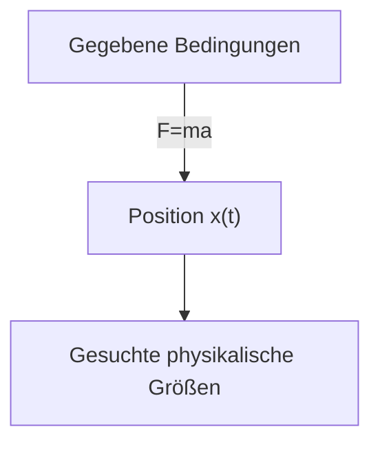
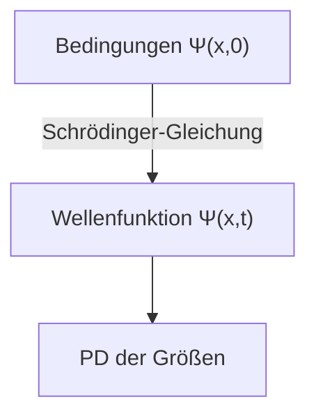

## TL;DR
> - (Zeitabhängige) Schrödinger-Gleichung: 
>
> $$ i\hbar\frac{\partial \Psi}{\partial t} = - \frac{\hbar^2}{2m}\frac{\partial^2 \Psi}{\partial x^2} + V\Psi $$
>
> - Statistische Interpretation der Wellenfunktion $\Psi(x,t)$ (Born-Interpretation): Das Quadrat des Betrags der Wellenfunktion $\|\Psi(x,t)\|^2$ ist die **Wahrscheinlichkeitsdichtefunktion**, ein Teilchen zur Zeit $t$ am Ort $x$ zu finden.
> - Normierung der Wellenfunktion:
>   - $\int_{-\infty}^{\infty} \|\Psi(x,t)\|^2 dx = 1$
>   - Wenn $\Psi(x,t)$ eine Lösung der Schrödinger-Gleichung ist, dann ist auch $A\Psi(x,t)$ für jede komplexe Konstante $A$ eine Lösung. Die Bestimmung von $A$ so, dass die obige Gleichung erfüllt wird, nennt man Normierung (normalization)
>   - **Nicht normierbare Lösungen (non-normalizable solutions)** können kein Teilchen darstellen und sind daher keine gültigen Wellenfunktionen; nur **quadratisch integrierbare (square-integrable)** Lösungen sind physikalisch mögliche Zustände
>   - Eine zu einem bestimmten Zeitpunkt normierte Wellenfunktion bleibt auch mit fortschreitender Zeit normiert, selbst wenn sich $\Psi$ ändert
> - Wahrscheinlichkeitsstrom:
>   - $J(x,t) \equiv \cfrac{i\hbar}{2m}\left(\Psi\cfrac{\partial \Psi^\*}{\partial x}-\Psi^\*\cfrac{\partial \Psi}{\partial x}\right)$
>   - Der Fluss der Wahrscheinlichkeit, ein Teilchen zu finden, durch den Punkt $x$ (Wahrscheinlichkeit pro Zeiteinheit)
>   - Wenn $P_{ab}(t)$ die Wahrscheinlichkeit ist, ein Teilchen zur Zeit $t$ im Bereich $a<x<b$ zu finden, dann gilt $\cfrac{dP_{ab}}{dt} = J(a,t) - J(b,t)$
{: .prompt-info }

## Prerequisites
- Stetige Wahrscheinlichkeitsverteilungen und Wahrscheinlichkeitsdichte

## Die Schrödinger-Gleichung (Schrödinger equation)
Betrachten wir ein Teilchen mit der Masse $m$, das sich unter dem Einfluss einer Kraft $F(x,t)$ entlang der $x$-Achse bewegt.

In der klassischen Mechanik besteht das Hauptziel darin, Newtons Bewegungsgleichung $F=ma$ anzuwenden, um die Position des Teilchens $x(t)$ zu einem beliebigen Zeitpunkt zu bestimmen. Dieser Prozess kann ungefähr durch das folgende Diagramm dargestellt werden:

In der Quantenmechanik wird dasselbe Problem auf eine völlig andere Weise angegangen. Der quantenmechanische Ansatz besteht darin, die folgende **Schrödinger-Gleichung** zu lösen, um die **Wellenfunktion** $\Psi(x,t)$ des Teilchens zu bestimmen:

$$ \begin{gather*}
i\hbar\frac{\partial \Psi}{\partial t} = - \frac{\hbar^2}{2m}\frac{\partial^2 \Psi}{\partial x^2} + V\Psi. \label{eqn:schrodinger_eqn}\tag{1}\\
\text{(} i=\sqrt{-1}\text{, } \hbar=\frac{h}{2\pi}=1.054573\times10^{-34}\text{, } h\text{: Planck-Konstante, } V(x)\text{: potentielle Energie)}
\end{gather*} $$

> *Bildquelle*
> - Autor: Wikimedia-Benutzer Xcodexif
> - Lizenz: [CC BY-SA 4.0](https://creativecommons.org/licenses/by-sa/4.0/)

## Statistische Interpretation der Wellenfunktion $\Psi(x,t)$ (Born-Interpretation)
Während ein Teilchen in der klassischen Mechanik an einem Punkt lokalisiert ist, ist die Wellenfunktion, die den Zustand eines Teilchens in der Quantenmechanik beschreibt, für ein gegebenes $t$ eine Funktion von $x$ und somit im Raum ausgedehnt. Wie ist die physikalische Bedeutung davon zu interpretieren?

Nach Borns **statistischer Interpretation** ist das Quadrat des Betrags der Wellenfunktion $\|\Psi(x,t)\|^2$ die Wahrscheinlichkeitsdichtefunktion, ein Teilchen zur Zeit $t$ am Ort $x$ zu finden. Die Wellenfunktion $\Psi$ selbst ist komplex, aber $\|\Psi\|^2=\Psi^\*\Psi$ ($\Psi^\*$ ist die komplexe Konjugation von $\Psi$) ist eine reelle Zahl größer oder gleich 0, was diese Interpretation ermöglicht. Das kann wie folgt ausgedrückt werden:

$$ \int_a^b |\Psi(x,t)|^2 dx = \text{Wahrscheinlichkeit, das Teilchen zur Zeit }t\text{ zwischen }a\text{ und }b\text{ zu finden}. \tag{2}$$

Diese statistische Interpretation impliziert, dass die Quantenmechanik eine Art **Unbestimmtheit (indeterminacy)** beinhaltet. Selbst wenn man alles über ein Teilchen (seine Wellenfunktion) kennt, kann man nur die Wahrscheinlichkeitsverteilung möglicher Ergebnisse kennen, nicht aber einen bestimmten Wert vorhersagen.

Da dies intuitiv schwer zu akzeptieren war, stellte sich natürlich die Frage, ob diese Unbestimmtheit auf einen Mangel in der Quantenmechanik zurückzuführen ist oder eine grundlegende Eigenschaft der Natur darstellt.

## Perspektiven zur quantenmechanischen Unbestimmtheit (quantum indeterminacy)
Angenommen, wir messen die Position eines Teilchens und stellen fest, dass es sich am Punkt $C$ befindet. Wo war das Teilchen unmittelbar vor der Messung?

### Realistische (realist) Position

> "Gott würfelt nicht." ("God does not play dice.")  
> *von Albert Einstein*

Das Teilchen befand sich bereits an der Stelle $C$. Dies ist auch die Sichtweise von Einstein und Schrödinger. Aus dieser Perspektive betrachtet, befand sich das Teilchen tatsächlich genau bei $C$, aber aufgrund der Grenzen der Theorie können wir die Position des Teilchens bis zur Messung nur als Wahrscheinlichkeitsverteilung kennen, was die Quantenmechanik zu einer unvollständigen Theorie macht. Nach dieser Ansicht ist die Unbestimmtheit keine grundlegende Eigenschaft der Natur, sondern eine Folge der Grenzen der Quantenmechanik, und es müssen zusätzlich zu $\Psi$ noch verborgene Variablen existieren, die man kennen müsste, um das Teilchen vollständig zu beschreiben.

> Schrödinger war einst Assistent unter Einstein und stand auch später mit ihm in Kontakt. Es ist wahrscheinlich, dass Schrödingers realistische und deterministische Position von diesem Einfluss geprägt wurde.
{: .prompt-info }

### Orthodoxe (orthodox) Position

> "Hören Sie auf, Gott zu sagen, was er mit seinen Würfeln tun soll." ("Stop telling God what to do with his dice.")  
> *von Niels Bohr, als Antwort auf Einsteins früheres Zitat*
>
> "Beobachtungen stören nicht nur das zu Messende, sie erzeugen es" ("Observations not only disturb what is to be measured, they produce it")  
> ...  
> "Wir zwingen es, eine bestimmte Position einzunehmen." ("We compel to assume a definite position.")  
> *von Pascual Jordan*

Bis unmittelbar vor der Messung existiert das Teilchen nur in Form einer Wahrscheinlichkeitsverteilung und befindet sich nirgendwo; erst durch den Messvorgang erscheint das Teilchen an einer bestimmten Position. Diese Interpretation wird als **Kopenhagener Deutung** bezeichnet und wurde an der Universität Kopenhagen von Bohr und Heisenberg vorgeschlagen.

> Interessanterweise besteht, ähnlich wie bei der Beziehung zwischen Einstein und Schrödinger, auch eine Lehrer-Schüler-Beziehung zwischen Bohr und Heisenberg.
{: .prompt-info }

### Agnostische (agnostic) Position

> "Man sollte sich nicht den Kopf darüber zerbrechen, ob etwas, worüber man nichts wissen kann, trotzdem existiert, genauso wenig wie über die alte Frage, wie viele Engel auf einer Nadelspitze sitzen können." ("One should no more rack one's brain about the problem of whether something one cannot know anything about exists all the same, than about the ancient question of how many angels are able to sit on the point of a needle.")  
> *von Wolfgang Pauli*

Diese Position verweigert eine Antwort. Welche Behauptung man auch immer über den Zustand eines Teilchens vor der Messung aufstellt, wenn die einzige Möglichkeit, diese Behauptung zu überprüfen, eine Messung ist, dann ist es nicht mehr "vor der Messung". Welchen Sinn hat es also? Es ist lediglich Metaphysik, über etwas zu spekulieren, das grundsätzlich nicht überprüfbar und nicht erkennbar ist.

### Heutige Auffassung
Im Jahr [11964 der Menschheitsgeschichte](https://en.wikipedia.org/wiki/Holocene_calendar) bewies John Bell, dass es beobachtbare Unterschiede gibt, je nachdem, ob ein Teilchen vor oder nach der Messung an einer bestimmten Position existiert. Damit wurde die agnostische Position ausgeschlossen, und spätere Experimente führten dazu, dass die Kopenhagener Deutung zur vorherrschenden Interpretation wurde. Daher wird, wenn nicht anders angegeben, in der Regel die Kopenhagener Deutung vorausgesetzt, wenn es um Quantenmechanik geht.

> Es gibt immer noch andere mögliche Interpretationen neben der Kopenhagener Deutung, wie die nichtlokale Theorie verborgener Variablen (nonlocal hidden variable theories) oder die Viele-Welten-Interpretation (many worlds interpretation).
{: .prompt-info }

## Messung und Kollaps der Wellenfunktion
Ein Teilchen hat bis zur Messung keine genaue Position, sondern erhält erst durch die Messung eine bestimmte Position $C$ (aufgrund der Heisenbergschen Unschärferelation, die in einem anderen Artikel behandelt wird, hat selbst diese Position einen gewissen Fehlerbereich). Wenn jedoch unmittelbar nach dieser ersten Messung eine weitere Messung durchgeführt wird, erhält man nicht bei jeder Messung unterschiedliche Werte, sondern stets dasselbe Ergebnis. Dies wird wie folgt erklärt:

Im Moment der ersten Messung ändert sich die Wellenfunktion des gemessenen Objekts drastisch und konzentriert sich in einer schmalen, spitzen Form von $\|\Psi(x,t)\|^2$ um den Punkt $C$. Man sagt, die Wellenfunktion sei durch die Messung zum Punkt $C$ **kollabiert (collapse)**.

Physikalische Prozesse können also in zwei unterschiedliche Arten eingeteilt werden:
- Gewöhnliche (ordinary) Prozesse, bei denen sich die Wellenfunktion gemäß der Schrödinger-Gleichung langsam verändert
- Messprozesse (measurement), bei denen $\Psi$ plötzlich und diskontinuierlich kollabiert

> Eine durch Messung kollabierte Wellenfunktion breitet sich mit der Zeit gemäß der Schrödinger-Gleichung wieder räumlich aus. Um dasselbe Messergebnis zu reproduzieren, muss die zweite Messung daher unmittelbar erfolgen.
{: .prompt-tip }

## Normierung der Wellenfunktion (Normalization)
Da das Quadrat des Betrags der Wellenfunktion $\|\Psi(x,t)\|^2$ die Wahrscheinlichkeitsdichte ist, ein Teilchen zur Zeit $t$ am Ort $x$ zu finden, muss das Integral von $\|\Psi\|^2$ über alle $x$ gleich 1 sein.

$$ \int_{-\infty}^{\infty} |\Psi(x,t)|^2 dx = 1. \label{eqn:wavefunction_norm}\tag{3} $$

Aus Gleichung ($\ref{eqn:schrodinger_eqn}$) ist ersichtlich, dass wenn $\Psi(x,t)$ eine Lösung ist, dann ist auch $A\Psi(x,t)$ für jede komplexe Konstante $A$ eine Lösung. Daher muss $A$ so bestimmt werden, dass Gleichung ($\ref{eqn:wavefunction_norm}$) erfüllt wird, und dieser Prozess wird als Normierung (normalization) der Wellenfunktion bezeichnet. Einige Lösungen der Schrödinger-Gleichung divergieren bei Integration gegen Unendlich, und in diesem Fall existiert keine Konstante $A$, die Gleichung ($\ref{eqn:wavefunction_norm}$) erfüllt. Dasselbe gilt für die triviale Lösung $\Psi=0$. Solche **nicht normierbaren Lösungen (non-normalizable solutions)** können kein Teilchen darstellen und sind daher keine gültigen Wellenfunktionen. Physikalisch mögliche Zustände entsprechen **quadratisch integrierbaren (square-integrable)** Lösungen der Schrödinger-Gleichung.

Eine wichtige Eigenschaft der Schrödinger-Gleichung ist außerdem, dass <u>eine zu einem bestimmten Zeitpunkt normierte Wellenfunktion auch mit fortschreitender Zeit normiert bleibt ($\int_{-\infty}^{\infty} |\Psi(x,t)|^2 dx = 1$), selbst wenn sich $\Psi$ ändert</u>. Wenn die Wellenfunktion zu jedem Zeitpunkt mit einem anderen Wert von $A$ normiert werden müsste, wäre $A$ keine Konstante, sondern eine Funktion der Zeit $t$, und es wäre nicht mehr möglich, Lösungen der Schrödinger-Gleichung zu finden. Dank dieser Eigenschaft bleibt der für die Anfangsbedingung ($t=0$) normierte Wert von $A$ unabhängig von der Zeit $t$ erhalten.

### Beweis

$$ \frac{d}{dt}\int_{-\infty}^{\infty} |\Psi(x,t)|^2 dx = \int_{-\infty}^{\infty} \frac{\partial}{\partial t}|\Psi(x,t)|^2 dx. \label{eqn:norm_proof_1}\tag{4} $$

> Das Integral von $\|\Psi\|^2$ über $x$ ist eine Funktion von $t$ allein, daher verwenden wir auf der linken Seite die totale Ableitung ($d/dt$), während $\|\Psi\|^2$ selbst eine Funktion von zwei Variablen, $x$ und $t$, ist, weshalb wir auf der rechten Seite die partielle Ableitung ($\partial/\partial t$) verwenden.
{: .prompt-tip }

Die obige Gleichung kann nach der Produktregel der Differentiation wie folgt umgeschrieben werden:

$$ \frac{\partial}{\partial t}|\Psi|^2 = \frac{\partial}{\partial t}(\Psi^*\Psi) = \Psi^*\frac{\partial \Psi}{\partial t} + \frac{\partial \Psi^*}{\partial t}\Psi. \label{eqn:norm_proof_2}\tag{5}$$

Wenn wir beide Seiten der Schrödinger-Gleichung ($\ref{eqn:schrodinger_eqn}$) mit $-\cfrac{i}{\hbar}$ multiplizieren, erhalten wir:

$$ \frac{\partial \Psi}{\partial t} = \frac{i\hbar}{2m}\frac{\partial^2 \Psi}{\partial x^2}-\frac{i}{\hbar}V\Psi \label{eqn:norm_proof_3}\tag{6}$$

Wenn wir die komplexe Konjugation von $\cfrac{\partial \Psi}{\partial t}$ aus der obigen Gleichung nehmen, erhalten wir:

$$ \frac{\partial \Psi^*}{\partial t} = -\frac{i\hbar}{2m}\frac{\partial^2 \Psi^*}{\partial x^2}+\frac{i}{\hbar}V\Psi^* \label{eqn:norm_proof_4}\tag{7}$$

Wenn wir nun ($\ref{eqn:norm_proof_3}$) und ($\ref{eqn:norm_proof_4}$) in ($\ref{eqn:norm_proof_2}$) einsetzen, erhalten wir:

$$\begin{align*}
\frac{\partial}{\partial t}|\Psi|^2 &= \frac{i\hbar}{2m}\left(\Psi^*\frac{\partial^2\Psi}{\partial x^2}-\frac{\partial^2\Psi^*}{\partial x^2}\Psi\right) \\
&= \frac{\partial}{\partial x}\left[\frac{i\hbar}{2m}\left(\Psi^*\frac{\partial\Psi}{\partial x}-\frac{\partial\Psi^*}{\partial x}\Psi \right) \right] 
\end{align*} \label{eqn:norm_proof_5}\tag{8}$$

Wenn wir dies in die rechte Seite von Gleichung ($\ref{eqn:norm_proof_1}$) einsetzen, erhalten wir:

$$ \frac{d}{dt}\int_{-\infty}^{\infty} |\Psi(x,t)|^2 dx = \frac{i\hbar}{2m}\left(\Psi^*\frac{\partial\Psi}{\partial x}-\frac{\partial\Psi^*}{\partial x}\Psi \right)\Bigg|_{-\infty}^{\infty}. \label{eqn:norm_proof_6}\tag{9} $$

Damit eine Wellenfunktion normiert und physikalisch gültig ist, muss $\Psi(x,t)$ gegen $0$ konvergieren, wenn $x$ gegen $\pm\infty$ geht. Daher gilt:

$$ \frac{d}{dt}\int_{-\infty}^{\infty} |\Psi(x,t)|^2 dx = 0 \label{eqn:norm_proof_fin}\tag{10} $$

Das bedeutet, dass $\int_{-\infty}^{\infty} \|\Psi(x,t)\|^2 dx$ eine zeitunabhängige Konstante ist.

$$ \therefore \text{Wenn }\Psi\text{ zu einem bestimmten Zeitpunkt }t\text{ normiert ist, dann ist es auch zu allen anderen Zeitpunkten }t\text{ normiert. } \blacksquare $$

## Wahrscheinlichkeitsstrom (probability current)
Betrachten wir nun die Wahrscheinlichkeit $P_{ab}(t)$, ein Teilchen zur Zeit $t$ im Bereich $a<x<b$ zu finden. Dann gilt:

$$ P_{ab}(t) = \int_a^b |\Psi(x,t)|^2 dx \tag{11}$$

und

$$ \begin{align*}
\frac{dP_{ab}}{dt} &= \frac{d}{dt}\int_a^b |\Psi(x,t)|^2 dx \\
&= \int_a^b \frac{\partial}{\partial t}|\Psi(x,t)|^2 dx \quad \text{(}\because\text{siehe Gleichung }\ref{eqn:norm_proof_1}\text{)}\\
&= \int_a^b \left(\frac{\partial \Psi^*}{\partial t}\Psi + \Psi^*\frac{\partial \Psi}{\partial t} \right)dx \quad \text{(}\because\text{siehe Gleichung }\ref{eqn:norm_proof_2}\text{)} \\
&= \frac{i\hbar}{2m}\int_a^b \left(\Psi^*\frac{\partial^2\Psi}{\partial x^2}-\frac{\partial^2\Psi^*}{\partial x^2}\Psi\right)dx \\
&= \frac{i\hbar}{2m}\int_a^b\frac{\partial}{\partial x}\left(\Psi^*\frac{\partial\Psi}{\partial x}-\frac{\partial\Psi^*}{\partial x}\Psi \right)dx \quad \text{(}\because\text{siehe Gleichungen }\ref{eqn:norm_proof_3},\ref{eqn:norm_proof_4},\ref{eqn:norm_proof_5}\text{)}\\
&= \frac{i\hbar}{2m}\left(\Psi^*\frac{\partial \Psi}{\partial x}-\frac{\partial \Psi^*}{\partial x}\Psi \right)\Bigg|^b_a \\
&= \frac{i\hbar}{2m}\left(\Psi\frac{\partial \Psi^*}{\partial x}-\Psi^*\frac{\partial \Psi}{\partial x} \right)\Bigg|^a_b
\end{align*} $$

Wenn wir

$$ J(x,t) \equiv \frac{i\hbar}{2m}\left(\Psi\frac{\partial \Psi^*}{\partial x}-\Psi^*\frac{\partial \Psi}{\partial x}\right) \label{eqn:probability_current}\tag{12}$$

setzen, dann gilt:

$$ \frac{dP_{ab}}{dt} = J(a,t) - J(b,t) \label{eqn:probability_over_time}\tag{13}$$

$J(x,t)$, wie in Gleichung ($\ref{eqn:probability_current}$) definiert, wird als **Wahrscheinlichkeitsstrom (probability current)** bezeichnet und repräsentiert den Fluss der Wahrscheinlichkeit, ein Teilchen zu finden, durch den Punkt $x$ (d.h. Wahrscheinlichkeit pro Zeiteinheit). Aus Gleichung ($\ref{eqn:probability_over_time}$) folgt, dass wenn der an einem Ende einfließende Wahrscheinlichkeitsstrom $J(a,t)$ zu einem bestimmten Zeitpunkt $t$ größer ist als der am anderen Ende ausfließende Strom $J(b,t)$, dann nimmt $P_{ab}$ zu, und umgekehrt.

> *Man kann sich das vorstellen wie den Durchfluss (flow rate) in der Strömungsmechanik, wobei die Masse oder das Volumen der Flüssigkeit hier durch die Wahrscheinlichkeit ersetzt wird.
{: .prompt-info }
