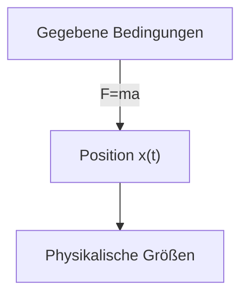
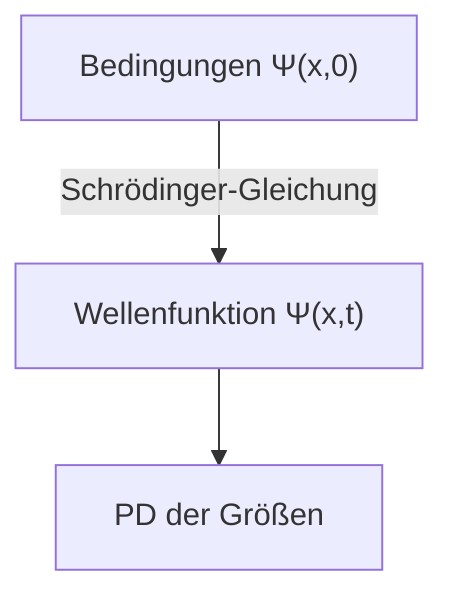

## Voraussetzungen
- Stetige Wahrscheinlichkeitsverteilung und Wahrscheinlichkeitsdichte

## Die Schrödinger-Gleichung (Schrödinger equation)
Betrachten wir eine Situation, in der sich ein Teilchen mit der Masse $m$ unter dem Einfluss einer gegebenen Kraft $F(x,t)$ entlang der $x$-Achse bewegt.

In der klassischen Mechanik ist das Hauptziel, Newtons Bewegungsgleichung $F=ma$ anzuwenden, um die Position $x(t)$ des Teilchens zu einem beliebigen Zeitpunkt zu bestimmen. Dieser Prozess kann grob durch das folgende Diagramm dargestellt werden:

In der Quantenmechanik wird dasselbe Problem auf eine sehr unterschiedliche Weise angegangen. Der quantenmechanische Ansatz besteht darin, die folgende **Schrödinger-Gleichung (Schrödinger equation)** zu lösen, um die **Wellenfunktion** $\Psi(x,t)$ des Teilchens zu erhalten:

$$ \begin{gather*}
i\hbar\frac{\partial \Psi}{\partial t} = - \frac{\hbar^2}{2m}\frac{\partial^2 \Psi}{\partial x^2} + V\Psi. \label{eqn:schrodinger_eqn}\tag{1}\\
\text{(} i=\sqrt{-1}\text{, } \hbar=\frac{h}{2\pi}=1.054573\times10^{-34}\text{, } h\text{: Planck-Konstante, } V(x)\text{: potentielle Energie)}
\end{gather*} $$

> *Bildquelle*
> - Autor: Wikimedia-Benutzer Xcodexif
> - Lizenz: [CC BY-SA 4.0](https://creativecommons.org/licenses/by-sa/4.0/)

## Statistische Interpretation der Wellenfunktion $\Psi(x,t)$ (Born-Interpretation)
Während ein Teilchen in der klassischen Mechanik an einem Punkt lokalisiert ist, ist die Wellenfunktion, die den Zustand eines Teilchens in der Quantenmechanik beschreibt, eine Funktion von $x$ für ein gegebenes $t$ und somit im Raum ausgedehnt. Wie soll man diese physikalische Bedeutung interpretieren?

Nach Borns **statistischer Interpretation** ist das Betragsquadrat der Wellenfunktion $\|\Psi(x,t)\|^2$ die Wahrscheinlichkeitsdichtefunktion, das Teilchen zur Zeit $t$ am Ort $x$ zu finden. Obwohl die Wellenfunktion $\Psi$ selbst komplexwertig ist, ist $\|\Psi\|^2=\Psi^\*\Psi$ ($\Psi^\*$ ist die komplex Konjugierte von $\Psi$) eine reelle Zahl größer oder gleich Null, was diese Interpretation ermöglicht. Dies kann wie folgt ausgedrückt werden:

$$ \int_a^b |\Psi(x,t)|^2 dx = \text{Wahrscheinlichkeit, das Teilchen zur Zeit }t\text{ zwischen }a\text{ und }b\text{ zu finden}. \tag{2}$$

Diese statistische Interpretation impliziert, dass die Quantenmechanik eine Art **Unbestimmtheit (indeterminacy)** beinhaltet. Selbst wenn man alles über das Teilchen (die Wellenfunktion) weiß, kann man nur die Wahrscheinlichkeitsverteilung möglicher Ergebnisse kennen, nicht aber einen bestimmten Wert festlegen.

Da dies intuitiv schwer zu akzeptieren war, stellte sich natürlich die Frage, ob diese Unbestimmtheit auf einen Mangel in der Quantenmechanik zurückzuführen oder eine wesentliche Eigenschaft der Natur sei.

## Perspektiven auf die quantenmechanische Unbestimmtheit (quantum indeterminacy)
Angenommen, wir messen die Position eines Teilchens und stellen fest, dass es sich am Punkt $C$ befindet. Wo war das Teilchen unmittelbar vor der Messung?

### Realistische Position

> "Gott würfelt nicht." ("God does not play dice.")  
> *von Albert Einstein*

Das Teilchen war schon immer bei $C$. Dies ist auch die Sichtweise von Einstein und Schrödinger. Aus dieser Perspektive betrachtet, war das Teilchen tatsächlich genau bei $C$, aber aufgrund der Grenzen der Theorie konnte die Position des Teilchens bis zur Messung nur als Wahrscheinlichkeitsverteilung bekannt sein, was bedeutet, dass die Quantenmechanik eine unvollständige Theorie ist. Nach dieser Ansicht ist die Unbestimmtheit also keine wesentliche Eigenschaft der Natur, sondern eine Folge der Grenzen der Quantenmechanik, und es müssen zusätzlich zu $\Psi$ noch einige verborgene Variablen existieren, die man kennen muss, um das Teilchen vollständig zu beschreiben.

> Schrödinger war einst Assistent unter Einstein und stand auch danach in Kontakt mit ihm. Es ist wahrscheinlich, dass Schrödingers realistische und deterministische Position auch darauf zurückzuführen ist.
{: .prompt-info }

### Orthodoxe Position

> "Hören Sie auf, Gott vorzuschreiben, was er mit seinen Würfeln tun soll." ("Stop telling God what to do with his dice.")  
> *von Niels Bohr, als Antwort auf Einsteins früheres Zitat*
>
> "Beobachtungen stören nicht nur das zu Messende, sie erzeugen es" ("Observations not only disturb what is to be measured, they produce it")  
> ...  
> "Wir zwingen es, eine bestimmte Position einzunehmen." ("We compel to assume a definite position.")  
> *von Pascual Jordan*

Bis zur Messung existiert das Teilchen nur in Form einer Wahrscheinlichkeitsverteilung und ist nirgendwo, erst durch den Akt der Messung erscheint das Teilchen an einer bestimmten Position. Diese Interpretation wird als **Kopenhagener Deutung** bezeichnet und wurde von Bohr und Heisenberg an der Universität Kopenhagen vorgeschlagen.

> Interessanterweise war Heisenberg, ähnlich wie die Beziehung zwischen Einstein und Schrödinger, auch ein Schüler von Bohr.
{: .prompt-info }

### Agnostische Position

> "Man sollte sich nicht mehr den Kopf darüber zerbrechen, ob etwas, über das man überhaupt nichts wissen kann, trotzdem existiert, als über die alte Frage, wie viele Engel auf einer Nadelspitze Platz haben." ("One should no more rack one's brain about the problem of whether something one cannot know anything about exists all the same, than about the ancient question of how many angels are able to sit on the point of a needle.")  
> *von Wolfgang Pauli*

Man verweigert die Antwort. Was auch immer man über den Zustand des Teilchens vor der Messung behauptet, wenn die einzige Möglichkeit, die Richtigkeit dieser Behauptung zu überprüfen, eine Messung ist, dann ist es nicht mehr "vor der Messung" - welchen Sinn hat das dann? Es ist lediglich Metaphysik, über etwas zu spekulieren, das grundsätzlich nicht überprüft oder erkannt werden kann.

### Heutige Auffassung
1964 bewies John Bell, dass es einen beobachtbaren Unterschied gibt, je nachdem, ob ein Teilchen vor oder nach der Messung eine genaue Position hat oder nicht. Damit wurde zunächst die agnostische Position ausgeschlossen, und durch anschließende Experimente wurde die Kopenhagener Deutung zur vorherrschenden Interpretation. Daher wird, wenn nicht anders angegeben, in der Regel diese Kopenhagener Deutung vorausgesetzt, wenn es um Quantenmechanik geht.

> Es gibt immer noch andere mögliche Interpretationen neben der Kopenhagener Deutung, wie die nichtlokale Theorie verborgener Variablen (nonlocal hidden variable theories) oder die Viele-Welten-Interpretation (many worlds interpretation).
{: .prompt-info }

## Messung und Kollaps der Wellenfunktion
Ein Teilchen hat bis zur Messung keine genaue Position, sondern erhält erst durch die Messung eine bestimmte Position $C$ (tatsächlich hat auch diese Position aufgrund der Heisenbergschen Unschärferelation, die wir in einem späteren Artikel behandeln werden, einen gewissen Fehlerbereich und ist nicht perfekt genau). Wenn jedoch unmittelbar nach dieser ersten Messung eine weitere Messung durchgeführt wird, erhält man nicht bei jeder Messung einen anderen Wert, sondern immer das gleiche Ergebnis. Dies wird wie folgt erklärt:

Im Moment der ersten Messung ändert sich die Wellenfunktion des Messobjekts drastisch und konzentriert sich zu einer schmalen, spitzen Form des $\|\Psi(x,t)\|^2$-Graphen in der Nähe des Punktes $C$. Man sagt, die Wellenfunktion sei durch die Messung zum Punkt $C$ **kollabiert (collapse)**.

Das heißt, physikalische Prozesse können in zwei unterschiedliche Arten unterteilt werden:
- Gewöhnliche (ordinary) Prozesse, bei denen sich die Wellenfunktion langsam gemäß der Schrödinger-Gleichung ändert
- Messprozesse (measurement), bei denen $\Psi$ plötzlich und diskontinuierlich kollabiert

> Eine durch Messung kollabierte Wellenfunktion breitet sich mit der Zeit gemäß der Schrödinger-Gleichung wieder räumlich aus. Um das gleiche Messergebnis zu reproduzieren, muss die zweite Messung daher unmittelbar erfolgen.
{: .prompt-tip }

## Normierung der Wellenfunktion (Normalization)
Da das Betragsquadrat der Wellenfunktion $\|\Psi(x,t)\|^2$ die Wahrscheinlichkeitsdichte ist, das Teilchen zur Zeit $t$ am Ort $x$ zu finden, muss das Integral von $\|\Psi\|^2$ über alle $x$ gleich 1 sein.

$$ \int_{-\infty}^{\infty} |\Psi(x,t)|^2 dx = 1. \label{eqn:wavefunction_norm}\tag{3} $$

Aus Gleichung ($\ref{eqn:schrodinger_eqn}$) ist ersichtlich, dass wenn $\Psi(x,t)$ eine Lösung ist, auch $A\Psi(x,t)$ für jede beliebige komplexe Konstante $A$ eine Lösung ist. Daher muss dieses $A$ so bestimmt werden, dass Gleichung ($\ref{eqn:wavefunction_norm}$) erfüllt ist. Dieser Prozess wird als Normierung (normalization) der Wellenfunktion bezeichnet. Einige Lösungen der Schrödinger-Gleichung divergieren bei Integration gegen Unendlich, und in diesem Fall existiert keine Konstante $A$, die Gleichung ($\ref{eqn:wavefunction_norm}$) erfüllt. Dasselbe gilt für die triviale Lösung $\Psi=0$. Solche **nicht normierbaren Lösungen (non-normalizable solutions)** können kein Teilchen darstellen und sind daher keine gültigen Wellenfunktionen. Physikalisch mögliche Zustände entsprechen **quadratintegrierbaren (square-integrable)** Lösungen der Schrödinger-Gleichung.

Eine wichtige Eigenschaft der Schrödinger-Gleichung ist außerdem, dass <u>eine zu einem Zeitpunkt normierte Wellenfunktion auch mit fortschreitender Zeit und sich änderndem $\Psi$ normiert bleibt ($\int_{-\infty}^{\infty} |\Psi(x,t)|^2 dx = 1$)</u>. Wenn die Wellenfunktion zu jedem Zeitpunkt mit einem anderen $A$-Wert normiert werden müsste, wäre $A$ keine Konstante, sondern eine Funktion der Zeit $t$, und es wäre nicht mehr möglich, die Lösung der Schrödinger-Gleichung zu finden. Dank dieser Eigenschaft bleibt jedoch der $A$-Wert, der für die Anfangsbedingung ($t=0$) normiert wurde, unabhängig von der Zeit $t$ erhalten.

### Beweis

$$ \frac{d}{dt}\int_{-\infty}^{\infty} |\Psi(x,t)|^2 dx = \int_{-\infty}^{\infty} \frac{\partial}{\partial t}|\Psi(x,t)|^2 dx. \label{eqn:norm_proof_1}\tag{4} $$

> Da das Integral von $\|\Psi\|^2$ über $x$ nur eine Funktion von $t$ ist, verwenden wir auf der linken Seite die totale Ableitung ($d/dt$), während $\|\Psi\|^2$ selbst eine Funktion von zwei Variablen $x$ und $t$ ist, weshalb wir auf der rechten Seite die partielle Ableitung ($\partial/\partial t$) verwenden.
{: .prompt-tip }

Die obige Gleichung kann nach der Produktregel der Differentiation wie folgt umgeschrieben werden:

$$ \frac{\partial}{\partial t}|\Psi|^2 = \frac{\partial}{\partial t}(\Psi^*\Psi) = \Psi^*\frac{\partial \Psi}{\partial t} + \frac{\partial \Psi^*}{\partial t}\Psi. \label{eqn:norm_proof_2}\tag{5}$$

Wenn wir beide Seiten der Schrödinger-Gleichung ($\ref{eqn:schrodinger_eqn}$) mit $-\cfrac{i}{\hbar}$ multiplizieren, erhalten wir

$$ \frac{\partial \Psi}{\partial t} = \frac{i\hbar}{2m}\frac{\partial^2 \Psi}{\partial x^2}-\frac{i}{\hbar}V\Psi \label{eqn:norm_proof_3}\tag{6}$$

und wenn wir die komplex Konjugierte von $\cfrac{\partial \Psi}{\partial t}$ in der obigen Gleichung nehmen, erhalten wir

$$ \frac{\partial \Psi^*}{\partial t} = -\frac{i\hbar}{2m}\frac{\partial^2 \Psi^*}{\partial x^2}+\frac{i}{\hbar}V\Psi^* \label{eqn:norm_proof_4}\tag{7}$$

Wenn wir nun ($\ref{eqn:norm_proof_3}$) und ($\ref{eqn:norm_proof_4}$) in Gleichung ($\ref{eqn:norm_proof_2}$) einsetzen, erhalten wir

$$\begin{align*}
\frac{\partial}{\partial t}|\Psi|^2 &= \frac{i\hbar}{2m}\left(\Psi^*\frac{\partial^2\Psi}{\partial x^2}-\frac{\partial^2\Psi^*}{\partial x^2}\Psi\right) \\
&= \frac{\partial}{\partial x}\left[\frac{i\hbar}{2m}\left(\Psi^*\frac{\partial\Psi}{\partial x}-\frac{\partial\Psi^*}{\partial x}\Psi \right) \right] 
\end{align*} \label{eqn:norm_proof_5}\tag{8}$$

und wenn wir dies in die rechte Seite der ursprünglichen Gleichung ($\ref{eqn:norm_proof_1}$) einsetzen, erhalten wir

$$ \frac{d}{dt}\int_{-\infty}^{\infty} |\Psi(x,t)|^2 dx = \frac{i\hbar}{2m}\left(\Psi^*\frac{\partial\Psi}{\partial x}-\frac{\partial\Psi^*}{\partial x}\Psi \right)\Bigg|_{-\infty}^{\infty}. \label{eqn:norm_proof_6}\tag{9} $$

Damit die Wellenfunktion normiert und physikalisch gültig ist, muss $\Psi(x,t)$ gegen $0$ konvergieren, wenn $x$ gegen $\pm\infty$ geht. Daher gilt

$$ \frac{d}{dt}\int_{-\infty}^{\infty} |\Psi(x,t)|^2 dx = 0 \label{eqn:norm_proof_fin}\tag{10} $$

was bedeutet, dass $\int_{-\infty}^{\infty} \|\Psi(x,t)\|^2 dx$ eine zeitunabhängige Konstante ist.

$$ \therefore \text{Wenn }\Psi \text{ zu einem Zeitpunkt }t\text{ normiert ist, ist es zu allen anderen Zeitpunkten }t\text{ ebenfalls normiert.} \blacksquare $$
