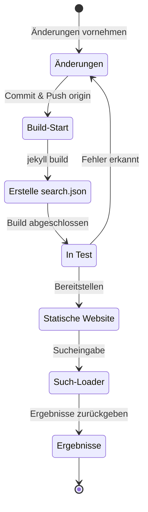

## Überblick
Vor etwa 4 Monaten, Anfang Juli 2024, habe ich das [Polyglot](https://github.com/untra/polyglot)-Plugin auf diesen Jekyll-basierten Blog angewendet, der über Github Pages gehostet wird, um mehrsprachige Unterstützung zu implementieren.
Diese Serie teilt Bugs, die während der Anwendung des Polyglot-Plugins auf das Chirpy-Theme auftraten, deren Lösungsprozesse und Methoden zum Schreiben von HTML-Headern und sitemap.xml unter Berücksichtigung der SEO.
Die Serie besteht aus zwei Beiträgen, und dieser Beitrag, den Sie gerade lesen, ist der zweite Teil der Serie.
- Teil 1: [Anwendung des Polyglot-Plugins & Implementierung von hreflang alt-Tags, Sitemap und Sprachauswahl-Button](/posts/how-to-support-multi-language-on-jekyll-blog-with-polyglot-1)
- Teil 2: Fehlerbehebung bei Chirpy-Theme-Build-Fehlern und Suchfunktionsproblemen (dieser Beitrag)

## Anforderungen
- [x] Die gebauten Ergebnisse (Webseiten) sollten in sprachspezifischen Pfaden (z.B. `/posts/ko/`{: .filepath}, `/posts/ja/`{: .filepath}) bereitgestellt werden können.
- [x] Um den zusätzlichen Zeit- und Arbeitsaufwand für die mehrsprachige Unterstützung zu minimieren, sollte die Sprache beim Build automatisch anhand des lokalen Pfads (z.B. `/_posts/ko/`{: .filepath}, `/_posts/ja/`{: .filepath}) der originalen Markdown-Datei erkannt werden, ohne dass 'lang' und 'permalink' Tags im YAML-Frontmatter manuell angegeben werden müssen.
- [x] Der Header-Bereich jeder Seite der Website sollte angemessene Content-Language Meta-Tags und hreflang Alternativ-Tags enthalten, um die SEO-Richtlinien für die Google-Mehrsprachensuche zu erfüllen.
- [x] Die `sitemap.xml` sollte alle Links zu den Seiten in jeder unterstützten Sprache ohne Auslassungen bereitstellen und selbst nur einmal im Root-Verzeichnis ohne Duplikate existieren.
- [x] Alle vom [Chirpy-Theme](https://github.com/cotes2020/jekyll-theme-chirpy) bereitgestellten Funktionen sollten auf jeder Sprachseite normal funktionieren, andernfalls müssen sie entsprechend angepasst werden.
  - [x] 'Recently Updated', 'Trending Tags' Funktionen funktionieren normal
  - [x] Keine Fehler während des Build-Prozesses mit GitHub Actions
  - [x] Die Beitragssuche in der oberen rechten Ecke des Blogs funktioniert normal

## Bevor wir beginnen
Dieser Beitrag ist eine Fortsetzung von [Teil 1](/posts/how-to-support-multi-language-on-jekyll-blog-with-polyglot-1), daher wird empfohlen, zuerst den vorherigen Beitrag zu lesen, falls Sie dies noch nicht getan haben.

## Fehlerbehebung ('relative_url_regex': target of repeat operator is not specified)
Nach Abschluss der vorherigen Schritte trat beim Ausführen des Befehls `bundle exec jekyll serve` zum Build-Test ein Fehler auf, der besagte: `'relative_url_regex': target of repeat operator is not specified`, und der Build schlug fehl.

```shell
...(gekürzt)
                    ------------------------------------------------
      Jekyll 4.3.4   Please append `--trace` to the `serve` command 
                     for any additional information or backtrace. 
                    ------------------------------------------------
/Users/yunseo/.gem/ruby/3.2.2/gems/jekyll-polyglot-1.8.1/lib/jekyll/polyglot/
patches/jekyll/site.rb:234:in `relative_url_regex': target of repeat operator 
is not specified: /href="?\/((?:(?!*.gem)(?!*.gemspec)(?!tools)(?!README.md)(
?!LICENSE)(?!*.config.js)(?!rollup.config.js)(?!package*.json)(?!.sass-cache)
(?!.jekyll-cache)(?!gemfiles)(?!Gemfile)(?!Gemfile.lock)(?!node_modules)(?!ve
ndor\/bundle\/)(?!vendor\/cache\/)(?!vendor\/gems\/)(?!vendor\/ruby\/)(?!en\/
)(?!ko\/)(?!es\/)(?!pt-BR\/)(?!ja\/)(?!fr\/)(?!de\/)[^,'"\s\/?.]+\.?)*(?:\/[^
\]\[)("'\s]*)?)"/ (RegexpError)

...(gekürzt)
```

Nach einer Suche nach ähnlichen Problemen fand ich [genau dasselbe Problem](https://github.com/untra/polyglot/issues/204) bereits im Polyglot-Repository gemeldet, zusammen mit einer Lösung.

Die [Chirpy-Theme `_config.yml`](https://github.com/cotes2020/jekyll-theme-chirpy/blob/master/_config.yml) Datei, die in diesem Blog verwendet wird, enthält den folgenden Abschnitt:

```yml
exclude:
  - "*.gem"
  - "*.gemspec"
  - docs
  - tools
  - README.md
  - LICENSE
  - "*.config.js"
  - package*.json
```
{: file='_config.yml'}

Die Ursache des Problems liegt in den regulären Ausdrücken der folgenden zwei Funktionen in der [Polyglot `site.rb`](https://github.com/untra/polyglot/blob/master/lib/jekyll/polyglot/patches/jekyll/site.rb) Datei, die Globbing-Muster mit Wildcards wie `"*.gem"`, `"*.gemspec"`, `"*.config.js"` nicht korrekt verarbeiten können.


```ruby
    # a regex that matches relative urls in a html document
    # matches href="baseurl/foo/bar-baz" href="/foo/bar-baz" and others like it
    # avoids matching excluded files.  prepare makes sure
    # that all @exclude dirs have a trailing slash.
    def relative_url_regex(disabled = false)
      regex = ''
      unless disabled
        @exclude.each do |x|
          regex += "(?!#{x})"
        end
        @languages.each do |x|
          regex += "(?!#{x}\/)"
        end
      end
      start = disabled ? 'ferh' : 'href'
      %r{#{start}="?#{@baseurl}/((?:#{regex}[^,'"\s/?.]+\.?)*(?:/[^\]\[)("'\s]*)?)"}
    end

    # a regex that matches absolute urls in a html document
    # matches href="http://baseurl/foo/bar-baz" and others like it
    # avoids matching excluded files.  prepare makes sure
    # that all @exclude dirs have a trailing slash.
    def absolute_url_regex(url, disabled = false)
      regex = ''
      unless disabled
        @exclude.each do |x|
          regex += "(?!#{x})"
        end
        @languages.each do |x|
          regex += "(?!#{x}\/)"
        end
      end
      start = disabled ? 'ferh' : 'href'
      %r{(?<!hreflang="#{@default_lang}" )#{start}="?#{url}#{@baseurl}/((?:#{regex}[^,'"\s/?.]+\.?)*(?:/[^\]\[)("'\s]*)?)"}
    end
```
{: file='(polyglot root path)/lib/jekyll/polyglot/patches/jekyll/site.rb'}


Es gibt zwei Möglichkeiten, dieses Problem zu lösen.

### 1. Forken Sie Polyglot und modifizieren Sie den problematischen Teil
Zum Zeitpunkt des Schreibens dieses Beitrags (November 2024) gibt die [offizielle Jekyll-Dokumentation](https://jekyllrb.com/docs/configuration/options/#global-configuration) an, dass die `exclude`-Einstellung die Verwendung von Globbing-Mustern unterstützt.

>"This configuration option supports Ruby's File.fnmatch filename globbing patterns to match multiple entries to exclude."

Das bedeutet, dass die Ursache des Problems nicht im Chirpy-Theme, sondern in den beiden Funktionen `relative_url_regex()` und `absolute_url_regex()` von Polyglot liegt. Die grundlegende Lösung besteht darin, diese so zu modifizieren, dass das Problem nicht mehr auftritt.

Da dieser Bug in Polyglot noch nicht behoben wurde, können Sie Polyglot forken und den problematischen Teil wie folgt modifizieren, basierend auf [diesem Blogbeitrag](https://hionpu.com/posts/github_blog_4#4-polyglot-%EC%9D%98%EC%A1%B4%EC%84%B1-%EB%AC%B8%EC%A0%9C) und [dieser Antwort im vorherigen GitHub-Issue](https://github.com/untra/polyglot/issues/204#issuecomment-2143270322), und dann anstelle des Original-Polyglot verwenden:


```ruby
    def relative_url_regex(disabled = false)
      regex = ''
      unless disabled
        @exclude.each do |x|
          escaped_x = Regexp.escape(x)
          regex += "(?!#{escaped_x})"
        end
        @languages.each do |x|
          escaped_x = Regexp.escape(x)
          regex += "(?!#{escaped_x}\/)"
        end
      end
      start = disabled ? 'ferh' : 'href'
      %r{#{start}="?#{@baseurl}/((?:#{regex}[^,'"\s/?.]+\.?)*(?:/[^\]\[)("'\s]*)?)"}
    end

    def absolute_url_regex(url, disabled = false)
      regex = ''
      unless disabled
        @exclude.each do |x|
          escaped_x = Regexp.escape(x)
          regex += "(?!#{escaped_x})"
        end
        @languages.each do |x|
          escaped_x = Regexp.escape(x)
          regex += "(?!#{escaped_x}\/)"
        end
      end
      start = disabled ? 'ferh' : 'href'
      %r{(?<!hreflang="#{@default_lang}" )#{start}="?#{url}#{@baseurl}/((?:#{regex}[^,'"\s/?.]+\.?)*(?:/[^\]\[)("'\s]*)?)"}
    end
```
{: file='(polyglot root path)/lib/jekyll/polyglot/patches/jekyll/site.rb'}


### 2. Ersetzen Sie Globbing-Muster durch exakte Dateinamen in der `_config.yml` Konfigurationsdatei des Chirpy-Themes
Die ideale Lösung wäre natürlich, dass dieser Patch in den Hauptzweig von Polyglot aufgenommen wird. Bis dahin müsste man jedoch eine geforkte Version verwenden, was umständlich sein kann, da man bei jedem Update des Polyglot-Upstreams diese Änderungen nachziehen müsste. Daher habe ich mich für eine andere Methode entschieden.

Wenn man die Dateien im Stammverzeichnis des [Chirpy-Theme-Repositories](https://github.com/cotes2020/jekyll-theme-chirpy) überprüft, die den Mustern `"*.gem"`, `"*.gemspec"`, `"*.config.js"` entsprechen, findet man ohnehin nur die folgenden drei:
- `jekyll-theme-chirpy.gemspec`
- `purgecss.config.js`
- `rollup.config.js`

Daher kann man die Globbing-Muster im `exclude`-Abschnitt der `_config.yml`-Datei löschen und wie folgt ersetzen, damit Polyglot sie problemlos verarbeiten kann:

```yml
exclude: # Modifiziert unter Berücksichtigung des Issues https://github.com/untra/polyglot/issues/204.
  # - "*.gem"
  - jekyll-theme-chirpy.gemspec # - "*.gemspec"
  - tools
  - README.md
  - LICENSE
  - purgecss.config.js # - "*.config.js"
  - rollup.config.js
  - package*.json
```

## Anpassung der Suchfunktion
Nach Abschluss der vorherigen Schritte funktionierten fast alle Funktionen der Website wie beabsichtigt zufriedenstellend. Allerdings wurde später festgestellt, dass die Suchleiste in der oberen rechten Ecke der Seite mit dem Chirpy-Theme Seiten in anderen Sprachen als `site.default_lang` (in diesem Fall Englisch) nicht indizierte und bei der Suche in anderen Sprachen als Englisch englische Seiten als Suchergebnisse ausgab.

Um die Ursache zu ermitteln, lassen Sie uns untersuchen, welche Dateien an der Suchfunktion beteiligt sind und wo genau das Problem auftritt.

### '_layouts/default.html'
Wenn man die [`_layouts/default.html`](https://github.com/cotes2020/jekyll-theme-chirpy/blob/master/_layouts/default.html) Datei überprüft, die das Grundgerüst für alle Seiten des Blogs bildet, sieht man, dass innerhalb des `<body>`-Elements die Inhalte von `search-results.html` und `search-loader.html` geladen werden.


```liquid
  <body>
    

    <div id="main-wrapper" class="d-flex justify-content-center">
      <div class="container d-flex flex-column px-xxl-5">
        
        (...gekürzt...)

        
      </div>

      <aside aria-label="Scroll to Top">
        <button id="back-to-top" type="button" class="btn btn-lg btn-box-shadow">
          <i class="fas fa-angle-up"></i>
        </button>
      </aside>
    </div>

    (...gekürzt...)

    
  </body>
```
{: file='_layouts/default.html'}


### '_includes/search-result.html'
[`_includes/search-result.html`](https://github.com/cotes2020/jekyll-theme-chirpy/blob/master/_includes/search-results.html) erstellt den `search-results` Container, der die Suchergebnisse für eingegebene Suchbegriffe im Suchfeld speichert.


```html
<!-- The Search results -->

<div id="search-result-wrapper" class="d-flex justify-content-center d-none">
  <div class="col-11 content">
    <div id="search-hints">
      
    </div>
    <div id="search-results" class="d-flex flex-wrap justify-content-center text-muted mt-3"></div>
  </div>
</div>
```
{: file='_includes/search-result.html'}


### '_includes/search-loader.html'
[`_includes/search-loader.html`](https://github.com/cotes2020/jekyll-theme-chirpy/blob/master/_includes/search-loader.html) ist der Kernbereich, der die Suche basierend auf der [Simple-Jekyll-Search](https://github.com/christian-fei/Simple-Jekyll-Search) Bibliothek implementiert. Es führt JavaScript im Browser des Besuchers aus, das Übereinstimmungen mit dem eingegebenen Suchbegriff in der [`search.json`](https://github.com/cotes2020/jekyll-theme-chirpy/blob/master/assets/js/data/search.json) Indexdatei findet und die entsprechenden Beitragslinks als `<article>`-Elemente zurückgibt, wodurch die Suche clientseitig funktioniert.


```js

  <article class="px-1 px-sm-2 px-lg-4 px-xl-0">
    <header>
      <h2><a href="{url}">{title}</a></h2>
      <div class="post-meta d-flex flex-column flex-sm-row text-muted mt-1 mb-1">
        {categories}
        {tags}
      </div>
    </header>
    <p>{snippet}</p>
  </article>


<p class="mt-5">{{ site.data.locales[include.lang].search.no_results }}</p>

<script>
   Note: dependent library will be loaded in `js-selector.html` 
  document.addEventListener('DOMContentLoaded', () => {
    SimpleJekyllSearch({
      searchInput: document.getElementById('search-input'),
      resultsContainer: document.getElementById('search-results'),
      json: '{{ '/assets/js/data/search.json' | relative_url }}',
      searchResultTemplate: '{{ result_elem | strip_newlines }}',
      noResultsText: '{{ not_found }}',
      templateMiddleware: function(prop, value, template) {
        if (prop === 'categories') {
          if (value === '') {
            return `${value}`;
          } else {
            return `<div class="me-sm-4"><i class="far fa-folder fa-fw"></i>${value}</div>`;
          }
        }

        if (prop === 'tags') {
          if (value === '') {
            return `${value}`;
          } else {
            return `<div><i class="fa fa-tag fa-fw"></i>${value}</div>`;
          }
        }
      }
    });
  });
</script>
```
{: file='_includes/search-loader.html'}


### Struktur der Suchfunktion und Identifizierung des Problembereichs
Zusammengefasst funktioniert die Suchfunktion beim Hosting des Chirpy-Themes auf GitHub Pages wie folgt:



Hier wurde bestätigt, dass `search.json` von Polyglot für jede Sprache wie folgt gut erstellt wird:
- /assets/js/data/search.json
- /ko/assets/js/data/search.json
- /es/assets/js/data/search.json
- /pt-BR/assets/js/data/search.json
- /ja/assets/js/data/search.json
- /fr/assets/js/data/search.json
- /de/assets/js/data/search.json

Daher liegt die Ursache des Problems im "Such-Loader". Das Problem, dass Seiten in anderen Sprachen als Englisch nicht durchsucht werden, tritt auf, weil `_includes/search-loader.html` unabhängig von der Sprache der aktuell besuchten Seite statisch nur die englische Indexdatei (`/assets/js/data/search.json`) lädt.

### Problemlösung
Um dies zu beheben, muss der Inhalt von `_includes/search-loader.html` wie folgt geändert werden:


```js
(gekürzt...)

<script>
   Note: dependent library will be loaded in `js-selector.html` 
  document.addEventListener('DOMContentLoaded', () => {
    // Aktuelle Sprache ermitteln
    const lang = "{{site.active_lang}}";

    // Passenden Pfad für die Such-JSON konstruieren
    const searchJsonPath = lang === "{{site.default_lang}}"
      ? '{{ "/assets/js/data/search.json" | relative_url }}'
      : `{{ "/" | relative_url }}${lang}/assets/js/data/search.json`;

    // Simple Jekyll Search initialisieren
    SimpleJekyllSearch({
      searchInput: document.getElementById('search-input'),
      resultsContainer: document.getElementById('search-results'),
      json: searchJsonPath, // Dynamischen Pfad basierend auf der Sprache verwenden
      searchResultTemplate: '{{ result_elem | strip_newlines }}',
      noResultsText: '{{ not_found }}',

(...gekürzt)
```
{: file='_includes/search-loader.html'}


Der JavaScript-Code wurde modifiziert, um dynamisch `searchJsonPath` zu laden, indem die aktuelle Sprache (`{{site.active_lang}}`) mit der Standardsprache der Website (`{{site.default_lang}}`) verglichen wird. Wenn sie gleich sind, wird der Standardpfad ("/assets/js/data/search.json") verwendet, andernfalls `${lang}/assets/js/data/search.json`. Nach dieser Änderung und einem erneuten Build der Website wurde bestätigt, dass die Suchergebnisse für jede Sprache korrekt angezeigt werden.
