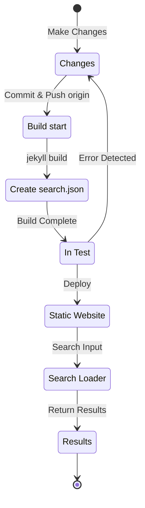

## Übersicht
Vor etwa 4 Monaten, Anfang Juli 12024 im [Holozän-Kalender](https://en.wikipedia.org/wiki/Holocene_calendar), habe ich das [Polyglot](https://github.com/untra/polyglot)-Plugin in meinem Jekyll-basierten Blog, der über GitHub Pages gehostet wird, implementiert, um mehrsprachige Unterstützung hinzuzufügen.
Diese Serie teilt den Prozess der Implementierung des Polyglot-Plugins im Chirpy-Theme, die dabei aufgetretenen Bugs und deren Lösungen sowie die Erstellung von HTML-Headern und sitemap.xml unter Berücksichtigung von SEO.
Die Serie besteht aus zwei Beiträgen, und dieser Beitrag ist der zweite Teil.
- Teil 1: [Anwendung des Polyglot-Plugins & Implementierung von hreflang-Alt-Tags, Sitemap und Sprachauswahl-Button](/posts/how-to-support-multi-language-on-jekyll-blog-with-polyglot-1)
- Teil 2: Fehlerbehebung bei Build-Fehlern und Suchfunktionsproblemen im Chirpy-Theme (dieser Beitrag)

## Anforderungen
- [x] Die gebaute Website sollte Inhalte in sprachspezifischen Pfaden (z.B. `/posts/ko/`{: .filepath}, `/posts/ja/`{: .filepath}) bereitstellen können.
- [x] Um den zusätzlichen Zeit- und Arbeitsaufwand für die mehrsprachige Unterstützung zu minimieren, sollte das System automatisch die Sprache basierend auf dem lokalen Pfad der Markdown-Dateien (z.B. `/_posts/ko/`{: .filepath}, `/_posts/ja/`{: .filepath}) erkennen können, ohne dass 'lang' und 'permalink' Tags im YAML-Front-Matter jeder Datei manuell angegeben werden müssen.
- [x] Der Header jeder Seite sollte geeignete Content-Language-Meta-Tags und hreflang-Alternativ-Tags enthalten, um die SEO-Richtlinien von Google für mehrsprachige Suche zu erfüllen.
- [x] Die `sitemap.xml`{: .filepath} sollte alle Links zu allen sprachunterstützten Seiten ohne Auslassungen enthalten und sollte selbst nur einmal im Root-Verzeichnis existieren, ohne Duplikate.
- [x] Alle Funktionen des [Chirpy-Themes](https://github.com/cotes2020/jekyll-theme-chirpy) sollten auf jeder Sprachseite normal funktionieren, oder andernfalls entsprechend angepasst werden.
  - [x] 'Recently Updated', 'Trending Tags' Funktionen funktionieren normal
  - [x] Keine Fehler während des Build-Prozesses mit GitHub Actions
  - [x] Die Suchfunktion in der oberen rechten Ecke des Blogs funktioniert normal

## Bevor wir beginnen
Dieser Beitrag ist eine Fortsetzung von [Teil 1](/posts/how-to-support-multi-language-on-jekyll-blog-with-polyglot-1). Wenn Sie diesen noch nicht gelesen haben, empfehle ich, zuerst den vorherigen Beitrag zu lesen.

## Fehlerbehebung ('relative_url_regex': target of repeat operator is not specified)
Nach Abschluss der vorherigen Schritte führte ich den Befehl `bundle exec jekyll serve` aus, um einen Build-Test durchzuführen, aber es trat ein Fehler auf: `'relative_url_regex': target of repeat operator is not specified`, und der Build schlug fehl.

```shell
...(gekürzt)
                    ------------------------------------------------
      Jekyll 4.3.4   Please append `--trace` to the `serve` command 
                     for any additional information or backtrace. 
                    ------------------------------------------------
/Users/yunseo/.gem/ruby/3.2.2/gems/jekyll-polyglot-1.8.1/lib/jekyll/polyglot/
patches/jekyll/site.rb:234:in `relative_url_regex': target of repeat operator 
is not specified: /href="?\/((?:(?!*.gem)(?!*.gemspec)(?!tools)(?!README.md)(
?!LICENSE)(?!*.config.js)(?!rollup.config.js)(?!package*.json)(?!.sass-cache)
(?!.jekyll-cache)(?!gemfiles)(?!Gemfile)(?!Gemfile.lock)(?!node_modules)(?!ve
ndor\/bundle\/)(?!vendor\/cache\/)(?!vendor\/gems\/)(?!vendor\/ruby\/)(?!en\/
)(?!ko\/)(?!es\/)(?!pt-BR\/)(?!ja\/)(?!fr\/)(?!de\/)[^,'"\s\/?.]+\.?)*(?:\/[^
\]\[)("'\s]*)?)"/ (RegexpError)

...(gekürzt)
```

Nach einer Suche nach ähnlichen Problemen fand ich [genau dasselbe Problem](https://github.com/untra/polyglot/issues/204) im Polyglot-Repository, und es gab auch eine Lösung.

In der [Chirpy-Theme `_config.yml`{: .filepath}-Datei](https://github.com/cotes2020/jekyll-theme-chirpy/blob/master/_config.yml) gibt es folgende Zeilen:

```yml
exclude:
  - "*.gem"
  - "*.gemspec"
  - docs
  - tools
  - README.md
  - LICENSE
  - "*.config.js"
  - package*.json
```
{: file='_config.yml'}

Das Problem liegt in den regulären Ausdrücken in den folgenden beiden Funktionen in der [Polyglot `site.rb`{: .filepath}-Datei](https://github.com/untra/polyglot/blob/master/lib/jekyll/polyglot/patches/jekyll/site.rb), die Globbing-Muster wie `"*.gem"`, `"*.gemspec"`, `"*.config.js"` nicht korrekt verarbeiten können.


```ruby
    # a regex that matches relative urls in a html document
    # matches href="baseurl/foo/bar-baz" href="/foo/bar-baz" and others like it
    # avoids matching excluded files.  prepare makes sure
    # that all @exclude dirs have a trailing slash.
    def relative_url_regex(disabled = false)
      regex = ''
      unless disabled
        @exclude.each do |x|
          regex += "(?!#{x})"
        end
        @languages.each do |x|
          regex += "(?!#{x}\/)"
        end
      end
      start = disabled ? 'ferh' : 'href'
      %r{#{start}="?#{@baseurl}/((?:#{regex}[^,'"\s/?.]+\.?)*(?:/[^\]\[)("'\s]*)?)"}
    end

    # a regex that matches absolute urls in a html document
    # matches href="http://baseurl/foo/bar-baz" and others like it
    # avoids matching excluded files.  prepare makes sure
    # that all @exclude dirs have a trailing slash.
    def absolute_url_regex(url, disabled = false)
      regex = ''
      unless disabled
        @exclude.each do |x|
          regex += "(?!#{x})"
        end
        @languages.each do |x|
          regex += "(?!#{x}\/)"
        end
      end
      start = disabled ? 'ferh' : 'href'
      %r{(?<!hreflang="#{@default_lang}" )#{start}="?#{url}#{@baseurl}/((?:#{regex}[^,'"\s/?.]+\.?)*(?:/[^\]\[)("'\s]*)?)"}
    end
```
{: file='(polyglot root path)/lib/jekyll/polyglot/patches/jekyll/site.rb'}


Es gibt zwei Möglichkeiten, dieses Problem zu lösen:

### 1. Forken von Polyglot und Anpassen des problematischen Codes
Zum Zeitpunkt dieses Beitrags (11.12024) gibt die [offizielle Jekyll-Dokumentation](https://jekyllrb.com/docs/configuration/options/#global-configuration) an, dass die `exclude`-Einstellung Globbing-Muster unterstützt.

>"This configuration option supports Ruby's File.fnmatch filename globbing patterns to match multiple entries to exclude."

Das Problem liegt also nicht im Chirpy-Theme, sondern in den Funktionen `relative_url_regex()` und `absolute_url_regex()` von Polyglot. Die grundlegende Lösung wäre, diese zu modifizieren.

Da dieser Bug in Polyglot noch nicht behoben ist, können Sie, basierend auf [diesem Blogbeitrag](https://hionpu.com/posts/github_blog_4#4-polyglot-%EC%9D%98%EC%A1%B4%EC%84%B1-%EB%AC%B8%EC%A0%9C) und [der Antwort im GitHub-Issue](https://github.com/untra/polyglot/issues/204#issuecomment-2143270322), das Polyglot-Repository forken und den problematischen Code wie folgt ändern:


```ruby
    def relative_url_regex(disabled = false)
      regex = ''
      unless disabled
        @exclude.each do |x|
          escaped_x = Regexp.escape(x)
          regex += "(?!#{escaped_x})"
        end
        @languages.each do |x|
          escaped_x = Regexp.escape(x)
          regex += "(?!#{escaped_x}\/)"
        end
      end
      start = disabled ? 'ferh' : 'href'
      %r{#{start}="?#{@baseurl}/((?:#{regex}[^,'"\s/?.]+\.?)*(?:/[^\]\[)("'\s]*)?)"}
    end

    def absolute_url_regex(url, disabled = false)
      regex = ''
      unless disabled
        @exclude.each do |x|
          escaped_x = Regexp.escape(x)
          regex += "(?!#{escaped_x})"
        end
        @languages.each do |x|
          escaped_x = Regexp.escape(x)
          regex += "(?!#{escaped_x}\/)"
        end
      end
      start = disabled ? 'ferh' : 'href'
      %r{(?<!hreflang="#{@default_lang}" )#{start}="?#{url}#{@baseurl}/((?:#{regex}[^,'"\s/?.]+\.?)*(?:/[^\]\[)("'\s]*)?)"}
    end
```
{: file='(polyglot root path)/lib/jekyll/polyglot/patches/jekyll/site.rb'}


### 2. Ersetzen der Globbing-Muster in der '_config.yml' des Chirpy-Themes durch exakte Dateinamen
Die ideale Lösung wäre, dass dieser Patch in den Hauptzweig von Polyglot aufgenommen wird. Bis dahin müsste man jedoch eine geforkte Version verwenden, was umständlich sein kann, da man bei jedem Upstream-Update von Polyglot die Änderungen nachverfolgen müsste. Daher habe ich einen anderen Ansatz gewählt.

Wenn man die Dateien im Root-Verzeichnis des [Chirpy-Theme-Repositories](https://github.com/cotes2020/jekyll-theme-chirpy) überprüft, die den Mustern `"*.gem"`, `"*.gemspec"`, `"*.config.js"` entsprechen, findet man nur diese 3 Dateien:
- `jekyll-theme-chirpy.gemspec`{: .filepath}
- `purgecss.config.js`{: .filepath}
- `rollup.config.js`{: .filepath}

Daher kann man die Globbing-Muster in der `exclude`-Anweisung der `_config.yml`{: .filepath}-Datei entfernen und sie wie folgt durch die genauen Dateinamen ersetzen:

```yml
exclude: # Siehe https://github.com/untra/polyglot/issues/204 für Referenz.
  # - "*.gem"
  - jekyll-theme-chirpy.gemspec # - "*.gemspec"
  - tools
  - README.md
  - LICENSE
  - purgecss.config.js # - "*.config.js"
  - rollup.config.js
  - package*.json
```
{: file='_config.yml'}

## Anpassung der Suchfunktion
Nach Abschluss der vorherigen Schritte funktionierte fast alles wie beabsichtigt. Allerdings entdeckte ich später, dass die Suchleiste in der oberen rechten Ecke des Chirpy-Themes nur Seiten in der `site.default_lang` (in meinem Fall Englisch) indizierte und bei Suchen in anderen Sprachen nur englische Seiten in den Ergebnissen anzeigte.

Um die Ursache zu verstehen, schauen wir uns die Dateien an, die mit der Suchfunktion zusammenhängen.

### '_layouts/default.html'
In der [`_layouts/default.html`{: .filepath}-Datei](https://github.com/cotes2020/jekyll-theme-chirpy/blob/master/_layouts/default.html), die das Grundgerüst für alle Seiten bildet, werden innerhalb des `<body>`-Elements die Inhalte von `search-results.html`{: .filepath} und `search-loader.html`{: .filepath} geladen.


```liquid
  <body>
    

    <div id="main-wrapper" class="d-flex justify-content-center">
      <div class="container d-flex flex-column px-xxl-5">
        
        (...gekürzt...)

        
      </div>

      <aside aria-label="Scroll to Top">
        <button id="back-to-top" type="button" class="btn btn-lg btn-box-shadow">
          <i class="fas fa-angle-up"></i>
        </button>
      </aside>
    </div>

    (...gekürzt...)

    
  </body>
```
{: file='_layouts/default.html'}


### '_includes/search-result.html'
[`_includes/search-result.html`{: .filepath}](https://github.com/cotes2020/jekyll-theme-chirpy/blob/master/_includes/search-results.html) erstellt den `search-results`-Container, der die Suchergebnisse für eingegebene Suchbegriffe anzeigt.


```html
<!-- The Search results -->

<div id="search-result-wrapper" class="d-flex justify-content-center d-none">
  <div class="col-11 content">
    <div id="search-hints">
      
    </div>
    <div id="search-results" class="d-flex flex-wrap justify-content-center text-muted mt-3"></div>
  </div>
</div>
```
{: file='_includes/search-result.html'}


### '_includes/search-loader.html'
[`_includes/search-loader.html`{: .filepath}](https://github.com/cotes2020/jekyll-theme-chirpy/blob/master/_includes/search-loader.html) ist der Kern der Suchimplementierung, basierend auf der [Simple-Jekyll-Search](https://github.com/christian-fei/Simple-Jekyll-Search)-Bibliothek. Sie sucht in der [`search.json`{: .filepath}](#assetsjsdatasearchjson)-Indexdatei nach Übereinstimmungen mit dem eingegebenen Suchbegriff und gibt die entsprechenden Beitragslinks als `<article>`-Elemente zurück. Die Suche wird clientseitig im Browser des Besuchers ausgeführt.


```js

  <article class="px-1 px-sm-2 px-lg-4 px-xl-0">
    <header>
      <h2><a href="{url}">{title}</a></h2>
      <div class="post-meta d-flex flex-column flex-sm-row text-muted mt-1 mb-1">
        {categories}
        {tags}
      </div>
    </header>
    <p>{snippet}</p>
  </article>


<p class="mt-5">{{ site.data.locales[include.lang].search.no_results }}</p>

<script>
   Note: dependent library will be loaded in `js-selector.html` 
  document.addEventListener('DOMContentLoaded', () => {
    SimpleJekyllSearch({
      searchInput: document.getElementById('search-input'),
      resultsContainer: document.getElementById('search-results'),
      json: '{{ '/assets/js/data/search.json' | relative_url }}',
      searchResultTemplate: '{{ result_elem | strip_newlines }}',
      noResultsText: '{{ not_found }}',
      templateMiddleware: function(prop, value, template) {
        if (prop === 'categories') {
          if (value === '') {
            return `${value}`;
          } else {
            return `<div class="me-sm-4"><i class="far fa-folder fa-fw"></i>${value}</div>`;
          }
        }

        if (prop === 'tags') {
          if (value === '') {
            return `${value}`;
          } else {
            return `<div><i class="fa fa-tag fa-fw"></i>${value}</div>`;
          }
        }
      }
    });
  });
</script>
```
{: file='_includes/search-loader.html'}


### '/assets/js/data/search.json'

```liquid
---
layout: compress
swcache: true
---

[
  
  {
    "title": {{ post.title | jsonify }},
    "url": {{ post.url | relative_url | jsonify }},
    "categories": {{ post.categories | join: ', ' | jsonify }},
    "tags": {{ post.tags | join: ', ' | jsonify }},
    "date": "{{ post.date }}",
    
    
    "snippet": {{ _content | truncate: 200 | jsonify }},
    "content": {{ _content | jsonify }}
  },
  
]
```
{: file='/assets/js/data/search.json'}


Diese Datei verwendet Jekyll's Liquid-Syntax, um eine JSON-Datei zu erstellen, die Titel, URL, Kategorien, Tags, Datum, einen 200-Zeichen-Ausschnitt und den vollständigen Inhalt aller Beiträge enthält.

### Funktionsweise der Suche und Identifizierung des Problems
Zusammenfassend funktioniert die Suchfunktion bei GitHub Pages mit dem Chirpy-Theme wie folgt:



Ich habe festgestellt, dass `search.json`{: .filepath} von Polyglot für jede Sprache separat erstellt wird:
- `/assets/js/data/search.json`{: .filepath}
- `/ko/assets/js/data/search.json`{: .filepath}
- `/es/assets/js/data/search.json`{: .filepath}
- `/pt-BR/assets/js/data/search.json`{: .filepath}
- `/ja/assets/js/data/search.json`{: .filepath}
- `/fr/assets/js/data/search.json`{: .filepath}
- `/de/assets/js/data/search.json`{: .filepath}

Das Problem liegt also im "Search Loader". Seiten in anderen Sprachen als Englisch werden nicht gefunden, weil `_includes/search-loader.html`{: .filepath} unabhängig von der aktuellen Seitensprache immer nur die englische Indexdatei (`/assets/js/data/search.json`{: .filepath}) lädt.

> - Im Gegensatz zu Markdown- oder HTML-Dateien funktioniert der Polyglot-Wrapper für Jekyll-Variablen wie `post.title`, `post.content` usw. bei JSON-Dateien, aber die [Relativized Local Urls](https://github.com/untra/polyglot?tab=readme-ov-file#relativized-local-urls)-Funktion scheint nicht zu funktionieren.
> - Ebenso konnte ich während des Tests feststellen, dass innerhalb der JSON-Dateivorlage kein Zugriff auf die von [Polyglot zusätzlich bereitgestellten `{{ site.default_lang }}`, `{{ site.active_lang }}` Liquid-Tags](https://github.com/untra/polyglot?tab=readme-ov-file#features) möglich ist, sondern nur auf die von Jekyll standardmäßig bereitgestellten Variablen.
>
> Daher werden die Werte für `title`, `snippet`, `content` usw. in der Indexdatei sprachspezifisch generiert, aber der `url`-Wert gibt den Standardpfad ohne Berücksichtigung der Sprache zurück. Dies muss im "Search Loader"-Teil entsprechend behandelt werden.
{: .prompt-warning }

### Lösung des Problems
Um dieses Problem zu lösen, muss der Inhalt von `_includes/search-loader.html`{: .filepath} wie folgt geändert werden:


```

  <article class="px-1 px-sm-2 px-lg-4 px-xl-0">
    <header>
      
      <h2><a href="/{{ site.active_lang }}{url}">{title}</a></h2>
      
      <h2><a href="{url}">{title}</a></h2>
      

(...gekürzt...)

<script>
   Note: dependent library will be loaded in `js-selector.html` 
  document.addEventListener('DOMContentLoaded', () => {
    
    
      
    
    
    SimpleJekyllSearch({
      searchInput: document.getElementById('search-input'),
      resultsContainer: document.getElementById('search-results'),
      json: '{{ search_path | relative_url }}',
      searchResultTemplate: '{{ result_elem | strip_newlines }}',

(...gekürzt)
```
{: file='_includes/search-loader.html'}


- Ich habe den Liquid-Code im ``-Abschnitt so geändert, dass, wenn `site.active_lang` (aktuelle Seitensprache) und `site.default_lang` (Standardsprache der Website) nicht übereinstimmen, das Präfix `"/{{ site.active_lang }}"` vor die aus der JSON-Datei geladene Beitrags-URL gesetzt wird.
- Auf die gleiche Weise habe ich den `<script>`-Teil so geändert, dass während des Build-Prozesses die aktuelle Seitensprache mit der Standardsprache der Website verglichen wird. Wenn sie übereinstimmen, wird der Standardpfad (`/assets/js/data/search.json`{: .filepath}) verwendet, andernfalls der sprachspezifische Pfad (z.B. `/de/assets/js/data/search.json`{: .filepath}) als `search_path` festgelegt.

Nach diesen Änderungen und einem erneuten Build der Website werden die Suchergebnisse nun korrekt für jede Sprache angezeigt.

> `{url}` ist ein Platzhalter für den URL-Wert, der später aus der JSON-Datei gelesen wird, und nicht selbst eine URL. Daher wird er von Polyglot nicht als Lokalisierungsziel erkannt und muss direkt je nach Sprache behandelt werden. Das Problem ist, dass `"/{{ site.active_lang }}{url}"` als URL erkannt wird und Polyglot versucht, eine bereits lokalisierte URL erneut zu lokalisieren (z.B. `"/de/de/posts/example-post"`{: .filepath}). Um dies zu verhindern, habe ich das [``-Tag](https://github.com/untra/polyglot?tab=readme-ov-file#disabling-url-relativizing) verwendet.
{: .prompt-tip }
