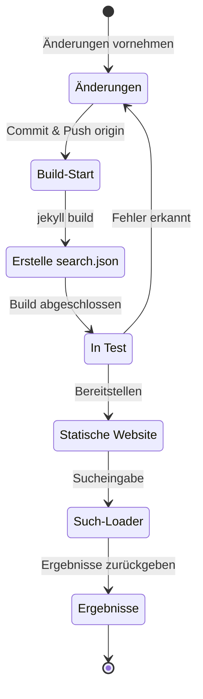

## Überblick
Vor etwa 4 Monaten, Anfang Juli 2024, habe ich das [Polyglot](https://github.com/untra/polyglot)-Plugin auf diesem Jekyll-basierten Blog, der über Github Pages gehostet wird, implementiert, um mehrsprachige Unterstützung hinzuzufügen.
Diese Serie teilt Bugs, die während der Implementierung des Polyglot-Plugins auf dem Chirpy-Theme auftraten, deren Lösungsprozesse und Methoden zum Schreiben von HTML-Headern und sitemap.xml unter Berücksichtigung von SEO.
Die Serie besteht aus zwei Beiträgen, und dieser Beitrag, den Sie gerade lesen, ist der zweite Teil der Serie.
- Teil 1: [Implementierung des Polyglot-Plugins & Implementierung von hreflang alt-Tags, Sitemap und Sprachauswahlbutton](/posts/how-to-support-multi-language-on-jekyll-blog-with-polyglot-1)
- Teil 2: Fehlerbehebung bei Chirpy-Theme-Build-Fehlern und Suchfunktionsproblemen (dieser Beitrag)

## Anforderungen
- [x] Die gebauten Ergebnisse (Webseiten) sollten nach Sprachpfaden (z.B. `/posts/ko/`{: .filepath}, `/posts/ja/`{: .filepath}) unterschieden werden können.
- [x] Um den zusätzlichen Zeit- und Arbeitsaufwand für die mehrsprachige Unterstützung zu minimieren, sollte die Sprache beim Bauen automatisch anhand des lokalen Pfads (z.B. `/_posts/ko/`{: .filepath}, `/_posts/ja/`{: .filepath}) erkannt werden können, ohne dass 'lang' und 'permalink' Tags im YAML-Frontmatter der originalen Markdown-Dateien manuell angegeben werden müssen.
- [x] Der Header-Bereich jeder Seite der Website sollte angemessene Content-Language Meta-Tags und hreflang Alternativ-Tags enthalten, um die SEO-Richtlinien für die Google-Mehrsprachensuche zu erfüllen.
- [x] Die `sitemap.xml`{: .filepath} sollte alle Links zu Seiten, die jede Sprache unterstützen, ohne Auslassungen bereitstellen können, und die `sitemap.xml`{: .filepath} selbst sollte nur einmal im Root-Verzeichnis ohne Duplikate existieren.
- [x] Alle vom [Chirpy-Theme](https://github.com/cotes2020/jekyll-theme-chirpy) bereitgestellten Funktionen sollten auf jeder Sprachseite normal funktionieren, andernfalls müssen sie korrigiert werden.
  - [x] 'Recently Updated', 'Trending Tags' Funktionen funktionieren normal
  - [x] Keine Fehler während des Build-Prozesses mit GitHub Actions
  - [x] Die Suchfunktion oben rechts im Blog funktioniert normal

## Bevor wir beginnen
Dieser Beitrag ist eine Fortsetzung von [Teil 1](/posts/how-to-support-multi-language-on-jekyll-blog-with-polyglot-1), daher wird empfohlen, zuerst den vorherigen Beitrag zu lesen, falls Sie dies noch nicht getan haben.

## Fehlerbehebung ('relative_url_regex': target of repeat operator is not specified)
Nach Abschluss der vorherigen Schritte trat beim Ausführen des Befehls `bundle exec jekyll serve` zum Build-Test ein Fehler auf mit der Meldung `'relative_url_regex': target of repeat operator is not specified`, und der Build schlug fehl.

```shell
...(gekürzt)
                    ------------------------------------------------
      Jekyll 4.3.4   Please append `--trace` to the `serve` command 
                     for any additional information or backtrace. 
                    ------------------------------------------------
/Users/yunseo/.gem/ruby/3.2.2/gems/jekyll-polyglot-1.8.1/lib/jekyll/polyglot/
patches/jekyll/site.rb:234:in `relative_url_regex': target of repeat operator 
is not specified: /href="?\/((?:(?!*.gem)(?!*.gemspec)(?!tools)(?!README.md)(
?!LICENSE)(?!*.config.js)(?!rollup.config.js)(?!package*.json)(?!.sass-cache)
(?!.jekyll-cache)(?!gemfiles)(?!Gemfile)(?!Gemfile.lock)(?!node_modules)(?!ve
ndor\/bundle\/)(?!vendor\/cache\/)(?!vendor\/gems\/)(?!vendor\/ruby\/)(?!en\/
)(?!ko\/)(?!es\/)(?!pt-BR\/)(?!ja\/)(?!fr\/)(?!de\/)[^,'"\s\/?.]+\.?)*(?:\/[^
\]\[)("'\s]*)?)"/ (RegexpError)

...(gekürzt)
```

Nach einer Suche nach ähnlichen Problemen fand ich [genau dasselbe Problem](https://github.com/untra/polyglot/issues/204) bereits im Polyglot-Repository gemeldet, und es gab auch eine Lösung.

In der [`_config.yml`{: .filepath}-Datei des Chirpy-Themes](https://github.com/cotes2020/jekyll-theme-chirpy/blob/master/_config.yml), das in diesem Blog verwendet wird, gibt es folgenden Abschnitt:

```yml
exclude:
  - "*.gem"
  - "*.gemspec"
  - docs
  - tools
  - README.md
  - LICENSE
  - "*.config.js"
  - package*.json
```
{: file='_config.yml'}

Das Problem liegt in den Regex-Ausdrücken der folgenden zwei Funktionen in der [`site.rb`{: .filepath}-Datei von Polyglot](https://github.com/untra/polyglot/blob/master/lib/jekyll/polyglot/patches/jekyll/site.rb), die Globbing-Muster wie `"*.gem"`, `"*.gemspec"`, `"*.config.js"` nicht korrekt verarbeiten können.


```ruby
    # a regex that matches relative urls in a html document
    # matches href="baseurl/foo/bar-baz" href="/foo/bar-baz" and others like it
    # avoids matching excluded files.  prepare makes sure
    # that all @exclude dirs have a trailing slash.
    def relative_url_regex(disabled = false)
      regex = ''
      unless disabled
        @exclude.each do |x|
          regex += "(?!#{x})"
        end
        @languages.each do |x|
          regex += "(?!#{x}\/)"
        end
      end
      start = disabled ? 'ferh' : 'href'
      %r{#{start}="?#{@baseurl}/((?:#{regex}[^,'"\s/?.]+\.?)*(?:/[^\]\[)("'\s]*)?)"}
    end

    # a regex that matches absolute urls in a html document
    # matches href="http://baseurl/foo/bar-baz" and others like it
    # avoids matching excluded files.  prepare makes sure
    # that all @exclude dirs have a trailing slash.
    def absolute_url_regex(url, disabled = false)
      regex = ''
      unless disabled
        @exclude.each do |x|
          regex += "(?!#{x})"
        end
        @languages.each do |x|
          regex += "(?!#{x}\/)"
        end
      end
      start = disabled ? 'ferh' : 'href'
      %r{(?<!hreflang="#{@default_lang}" )#{start}="?#{url}#{@baseurl}/((?:#{regex}[^,'"\s/?.]+\.?)*(?:/[^\]\[)("'\s]*)?)"}
    end
```
{: file='(polyglot root path)/lib/jekyll/polyglot/patches/jekyll/site.rb'}


Es gibt zwei Möglichkeiten, dieses Problem zu lösen.

### 1. Forken Sie Polyglot und verwenden Sie es nach Korrektur des problematischen Teils
Zum Zeitpunkt des Schreibens dieses Beitrags (November 2024) gibt die [offizielle Jekyll-Dokumentation](https://jekyllrb.com/docs/configuration/options/#global-configuration) an, dass die `exclude`-Einstellung die Verwendung von Globbing-Mustern unterstützt.

>"This configuration option supports Ruby's File.fnmatch filename globbing patterns to match multiple entries to exclude."

Das bedeutet, dass das Problem nicht im Chirpy-Theme liegt, sondern in den beiden Funktionen `relative_url_regex()` und `absolute_url_regex()` von Polyglot. Die grundlegende Lösung besteht darin, diese so zu modifizieren, dass das Problem nicht auftritt.

Da dieser Bug in Polyglot noch nicht behoben wurde, können Sie Polyglot forken und den problematischen Teil wie folgt ändern, basierend auf [diesem Blogbeitrag](https://hionpu.com/posts/github_blog_4#4-polyglot-%EC%9D%98%EC%A1%B4%EC%84%B1-%EB%AC%B8%EC%A0%9C) und [der Antwort auf das vorherige GitHub-Issue](https://github.com/untra/polyglot/issues/204#issuecomment-2143270322), und dann anstelle des Original-Polyglot verwenden:


```ruby
    def relative_url_regex(disabled = false)
      regex = ''
      unless disabled
        @exclude.each do |x|
          escaped_x = Regexp.escape(x)
          regex += "(?!#{escaped_x})"
        end
        @languages.each do |x|
          escaped_x = Regexp.escape(x)
          regex += "(?!#{escaped_x}\/)"
        end
      end
      start = disabled ? 'ferh' : 'href'
      %r{#{start}="?#{@baseurl}/((?:#{regex}[^,'"\s/?.]+\.?)*(?:/[^\]\[)("'\s]*)?)"}
    end

    def absolute_url_regex(url, disabled = false)
      regex = ''
      unless disabled
        @exclude.each do |x|
          escaped_x = Regexp.escape(x)
          regex += "(?!#{escaped_x})"
        end
        @languages.each do |x|
          escaped_x = Regexp.escape(x)
          regex += "(?!#{escaped_x}\/)"
        end
      end
      start = disabled ? 'ferh' : 'href'
      %r{(?<!hreflang="#{@default_lang}" )#{start}="?#{url}#{@baseurl}/((?:#{regex}[^,'"\s/?.]+\.?)*(?:/[^\]\[)("'\s]*)?)"}
    end
```
{: file='(polyglot root path)/lib/jekyll/polyglot/patches/jekyll/site.rb'}


### 2. Ersetzen Sie die Globbing-Muster in der '_config.yml'-Konfigurationsdatei des Chirpy-Themes durch genaue Dateinamen
Eigentlich wäre die ideale und korrekte Methode, dass der obige Patch in den Hauptzweig von Polyglot aufgenommen wird. Bis dahin müsste man jedoch eine geforkte Version verwenden, was umständlich sein kann, da man bei jeder Aktualisierung des Polyglot-Upstream diese Änderungen nicht verpassen und entsprechend anpassen muss. Daher habe ich eine andere Methode gewählt.

Wenn man die Dateien im Wurzelverzeichnis des [Chirpy-Theme-Repositories](https://github.com/cotes2020/jekyll-theme-chirpy) überprüft, die den Mustern `"*.gem"`, `"*.gemspec"`, `"*.config.js"` entsprechen, gibt es ohnehin nur die folgenden drei:
- `jekyll-theme-chirpy.gemspec`{: .filepath}
- `purgecss.config.js`{: .filepath}
- `rollup.config.js`{: .filepath}

Daher kann man die Globbing-Muster im `exclude`-Abschnitt der `_config.yml`{: .filepath}-Datei löschen und wie folgt ersetzen, damit Polyglot sie problemlos verarbeiten kann:

```yml
exclude: # Geändert unter Berücksichtigung des Issues https://github.com/untra/polyglot/issues/204.
  # - "*.gem"
  - jekyll-theme-chirpy.gemspec # - "*.gemspec"
  - tools
  - README.md
  - LICENSE
  - purgecss.config.js # - "*.config.js"
  - rollup.config.js
  - package*.json
```
{: file='_config.yml'}

## Anpassung der Suchfunktion
Nach Abschluss der vorherigen Schritte funktionierten fast alle Funktionen der Website wie beabsichtigt zufriedenstellend. Allerdings wurde später festgestellt, dass die Suchleiste oben rechts auf der Seite mit dem Chirpy-Theme Seiten in anderen Sprachen als `site.default_lang` (in diesem Fall Englisch) nicht indizierte und bei der Suche in anderen Sprachen als Englisch englische Seiten als Suchergebnisse ausgab.

Um die Ursache zu ermitteln, lassen Sie uns untersuchen, welche Dateien an der Suchfunktion beteiligt sind und wo genau das Problem auftritt.

### '_layouts/default.html'
Wenn man die [`_layouts/default.html`{: .filepath}-Datei](https://github.com/cotes2020/jekyll-theme-chirpy/blob/master/_layouts/default.html) überprüft, die das Grundgerüst für alle Seiten des Blogs bildet, kann man sehen, dass innerhalb des `<body>`-Elements die Inhalte von `search-results.html`{: .filepath} und `search-loader.html`{: .filepath} geladen werden.


```liquid
  <body>
    

    <div id="main-wrapper" class="d-flex justify-content-center">
      <div class="container d-flex flex-column px-xxl-5">
        
        (...gekürzt...)

        
      </div>

      <aside aria-label="Scroll to Top">
        <button id="back-to-top" type="button" class="btn btn-lg btn-box-shadow">
          <i class="fas fa-angle-up"></i>
        </button>
      </aside>
    </div>

    (...gekürzt...)

    
  </body>
```
{: file='_layouts/default.html'}


### '_includes/search-result.html'
[`_includes/search-result.html`{: .filepath}](https://github.com/cotes2020/jekyll-theme-chirpy/blob/master/_includes/search-results.html) erstellt den `search-results`-Container, der die Suchergebnisse für ein eingegebenes Suchstichwort im Suchfeld speichert.


```html
<!-- The Search results -->

<div id="search-result-wrapper" class="d-flex justify-content-center d-none">
  <div class="col-11 content">
    <div id="search-hints">
      
    </div>
    <div id="search-results" class="d-flex flex-wrap justify-content-center text-muted mt-3"></div>
  </div>
</div>
```
{: file='_includes/search-result.html'}


### '_includes/search-loader.html'
[`_includes/search-loader.html`{: .filepath}](https://github.com/cotes2020/jekyll-theme-chirpy/blob/master/_includes/search-loader.html) ist der Kernbereich, der die Suche basierend auf der [Simple-Jekyll-Search](https://github.com/christian-fei/Simple-Jekyll-Search)-Bibliothek implementiert. Es führt JavaScript im Browser des Besuchers aus, das übereinstimmende Teile aus der [`search.json`{: .filepath}](#assetsjsdatasearchjson)-Indexdatei findet und die entsprechenden Post-Links als `<article>`-Elemente zurückgibt, wodurch es clientseitig funktioniert.


```js

  <article class="px-1 px-sm-2 px-lg-4 px-xl-0">
    <header>
      <h2><a href="{url}">{title}</a></h2>
      <div class="post-meta d-flex flex-column flex-sm-row text-muted mt-1 mb-1">
        {categories}
        {tags}
      </div>
    </header>
    <p>{snippet}</p>
  </article>


<p class="mt-5">{{ site.data.locales[include.lang].search.no_results }}</p>

<script>
   Note: dependent library will be loaded in `js-selector.html` 
  document.addEventListener('DOMContentLoaded', () => {
    SimpleJekyllSearch({
      searchInput: document.getElementById('search-input'),
      resultsContainer: document.getElementById('search-results'),
      json: '{{ '/assets/js/data/search.json' | relative_url }}',
      searchResultTemplate: '{{ result_elem | strip_newlines }}',
      noResultsText: '{{ not_found }}',
      templateMiddleware: function(prop, value, template) {
        if (prop === 'categories') {
          if (value === '') {
            return `${value}`;
          } else {
            return `<div class="me-sm-4"><i class="far fa-folder fa-fw"></i>${value}</div>`;
          }
        }

        if (prop === 'tags') {
          if (value === '') {
            return `${value}`;
          } else {
            return `<div><i class="fa fa-tag fa-fw"></i>${value}</div>`;
          }
        }
      }
    });
  });
</script>
```
{: file='_includes/search-loader.html'}


### '/assets/js/data/search.json'

```liquid
---
layout: compress
swcache: true
---

[
  
  {
    "title": {{ post.title | jsonify }},
    "url": {{ post.url | relative_url | jsonify }},
    "categories": {{ post.categories | join: ', ' | jsonify }},
    "tags": {{ post.tags | join: ', ' | jsonify }},
    "date": "{{ post.date }}",
    
    
    "snippet": {{ _content | truncate: 200 | jsonify }},
    "content": {{ _content | jsonify }}
  },
  
]
```
{: file='/assets/js/data/search.json'}


Diese Datei definiert eine JSON-Datei mit Liquid-Syntax von Jekyll, die den Titel, die URL, Kategorie- und Tag-Informationen, das Erstellungsdatum, ein 200-Zeichen-Snippet des Inhalts und den gesamten Inhalt aller Posts auf der Website enthält.

### Funktionsweise der Suchfunktion und Identifizierung des Problembereichs
Zusammengefasst funktioniert die Suchfunktion beim Hosting des Chirpy-Themes auf GitHub Pages wie folgt:



Hier wurde festgestellt, dass `search.json`{: .filepath} von Polyglot für jede Sprache wie folgt erstellt wird:
- `/assets/js/data/search.json`{: .filepath}
- `/ko/assets/js/data/search.json`{: .filepath}
- `/es/assets/js/data/search.json`{: .filepath}
- `/pt-BR/assets/js/data/search.json`{: .filepath}
- `/ja/assets/js/data/search.json`{: .filepath}
- `/fr/assets/js/data/search.json`{: .filepath}
- `/de/assets/js/data/search.json`{: .filepath}

Daher liegt die Ursache des Problems im "Such-Loader"-Teil. Das Problem, dass Seiten in anderen Sprachen als Englisch nicht durchsucht werden, tritt auf, weil `_includes/search-loader.html`{: .filepath} unabhängig von der Sprache der aktuell besuchten Seite statisch nur die englische Indexdatei (`/assets/js/data/search.json`{: .filepath}) lädt.

> - Es ist jedoch zu beachten, dass im Gegensatz zu Markdown- oder HTML-Dateien der Polyglot-Wrapper für Jekyll-Variablen wie `post.title`, `post.content` usw. für JSON-Dateien funktioniert, aber die [Relativized Local Urls](https://github.com/untra/polyglot?tab=readme-ov-file#relativized-local-urls)-Funktion nicht zu funktionieren scheint.
> - Ebenso wurde während des Testprozesses festgestellt, dass innerhalb der JSON-Dateivorlage neben den von Jekyll standardmäßig bereitgestellten Variablen kein Zugriff auf die [von Polyglot zusätzlich bereitgestellten `{{ site.default_lang }}`, `{{ site.active_lang }}` Liquid-Tags](https://github.com/untra/polyglot?tab=readme-ov-file#features) möglich ist.
>
> Daher werden Werte wie `title`, `snippet`, `content` usw. in der Indexdatei für jede Sprache unterschiedlich generiert, aber der `url`-Wert gibt den Standardpfad ohne Berücksichtigung der Sprache zurück, und eine angemessene Behandlung dafür muss im "Such-Loader"-Teil hinzugefügt werden.
{: .prompt-warning }

### Problemlösung
Um dies zu beheben, sollte der Inhalt von `_includes/search-loader.html`{: .filepath} wie folgt geändert werden:


```

  <article class="px-1 px-sm-2 px-lg-4 px-xl-0">
    <header>
      
      <h2><a href="/{{ site.active_lang }}{url}">{title}</a></h2>
      
      <h2><a href="{url}">{title}</a></h2>
      

(...gekürzt...)

<script>
   Note: dependent library will be loaded in `js-selector.html` 
  document.addEventListener('DOMContentLoaded', () => {
    
    
      
    
    
    SimpleJekyllSearch({
      searchInput: document.getElementById('search-input'),
      resultsContainer: document.getElementById('search-results'),
      json: '{{ search_path | relative_url }}',
      searchResultTemplate: '{{ result_elem | strip_newlines }}',

(...gekürzt)
```
{: file='_includes/search-loader.html'}


- Der Liquid-Ausdruck im ``-Teil wurde so geändert, dass wenn `site.active_lang` (die Sprache der aktuellen Seite) und `site.default_lang` (die Standardsprache der Website) nicht übereinstimmen, der Präfix `"/{{ site.active_lang }}"` vor die aus der JSON-Datei geladene Post-URL gesetzt wird.
- Auf die gleiche Weise wurde der `<script>`-Teil so geändert, dass während des Build-Prozesses die Sprache der aktuellen Seite mit der Standardsprache der Website verglichen wird. Wenn sie übereinstimmen, wird der Standardpfad (`/assets/js/data/search.json`{: .filepath}) als `search_path` festgelegt, andernfalls der Pfad für die entsprechende Sprache (z.B. `/ko/assets/js/data/search.json`{: .filepath}).

Nach diesen Änderungen und einem erneuten Build der Website wurde bestätigt, dass die Suchergebnisse für jede Sprache korrekt angezeigt werden.

> `{url}` ist ein Platzhalter für den URL-Wert, der später aus der JSON-Datei gelesen wird, und nicht selbst eine URL. Daher wird es von Polyglot nicht als Lokalisierungsziel erkannt und muss manuell je nach Sprache behandelt werden. Das Problem ist, dass das so behandelte `"/{{ site.active_lang }}{url}"` als URL erkannt wird und obwohl die Lokalisierung bereits abgeschlossen ist, weiß Polyglot das nicht und versucht, die Lokalisierung doppelt durchzuführen (z.B. `"/ko/ko/posts/example-post"`{: .filepath}). Um dies zu verhindern, wurde der [``-Tag](https://github.com/untra/polyglot?tab=readme-ov-file#disabling-url-relativizing) explizit angegeben.
{: .prompt-tip }
