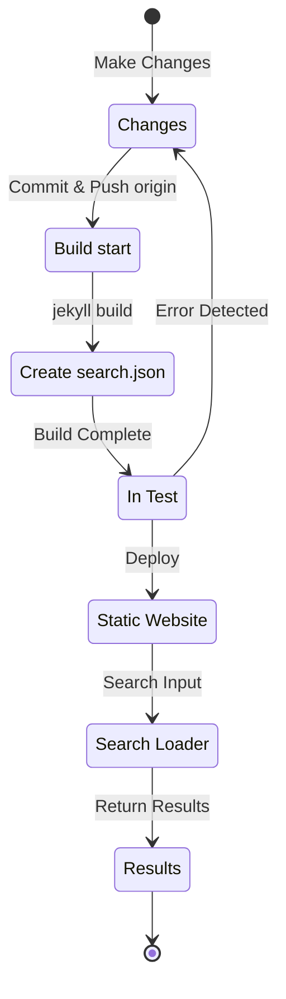

## Übersicht
Anfang Juli 12024 habe ich für diesen Blog, der mit Jekyll erstellt und über Github Pages gehostet wird, eine mehrsprachige Unterstützung mit dem [Polyglot](https://github.com/untra/polyglot)-Plugin implementiert.
Diese Serie teilt die bei der Anwendung des Polyglot-Plugins auf das Chirpy-Theme aufgetretenen Fehler, deren Behebungsprozess sowie die Erstellung von HTML-Headern und sitemap.xml unter Berücksichtigung von SEO.
Die Serie besteht aus drei Beiträgen, und dieser hier ist der dritte Teil.
- Teil 1: [Anwendung des Polyglot-Plugins & Anpassung von HTML-Headern und Sitemap](/posts/how-to-support-multi-language-on-jekyll-blog-with-polyglot-1)
- Teil 2: [Implementierung der Sprachauswahl & Lokalisierung des Layouts](/posts/how-to-support-multi-language-on-jekyll-blog-with-polyglot-2)
- Teil 3: Fehlerbehebung bei Build-Fehlern und Suchfunktion im Chirpy-Theme (Dieser Beitrag)

> Ursprünglich bestand die Serie aus zwei Teilen, wurde aber nach mehreren inhaltlichen Erweiterungen, die den Umfang erheblich vergrößerten, auf drei Teile umstrukturiert.
{: .prompt-info }

## Anforderungen
- [x] Die erstellten Ergebnisse (Webseiten) müssen nach Sprachen in separaten Pfaden (z.B. `/posts/ko/`{: .filepath}, `/posts/ja/`{: .filepath}) bereitgestellt werden können.
- [x] Um den zusätzlichen Zeit- und Arbeitsaufwand für die Mehrsprachigkeit zu minimieren, muss das System die Sprache automatisch anhand des lokalen Dateipfads (z.B. `/_posts/ko/`{: .filepath}, `/_posts/ja/`{: .filepath}) erkennen, ohne dass für jede Markdown-Datei manuell 'lang'- und 'permalink'-Tags im YAML-Frontmatter festgelegt werden müssen.
- [x] Der Header jeder Seite der Website muss die Google-SEO-Richtlinien für die mehrsprachige Suche erfüllen, indem er entsprechende Content-Language-Meta-Tags, hreflang-Alternate-Tags und Canonical-Links enthält.
- [x] Alle Sprachversionen der Seiten müssen lückenlos in einer `sitemap.xml`{: .filepath}-Datei bereitgestellt werden. Diese `sitemap.xml`{: .filepath} muss ohne Duplikate nur im Stammverzeichnis vorhanden sein.
- [x] Alle vom [Chirpy-Theme](https://github.com/cotes2020/jekyll-theme-chirpy) bereitgestellten Funktionen müssen auf jeder Sprachseite korrekt funktionieren. Andernfalls müssen sie entsprechend angepasst werden.
  - [x] Die Funktionen 'Kürzlich aktualisiert' und 'Trend-Tags' müssen normal funktionieren.
  - [x] Der Build-Prozess mit GitHub Actions muss fehlerfrei ablaufen.
  - [x] Die Beitragssuche oben rechts im Blog muss korrekt funktionieren.

## Bevor wir beginnen
Dieser Beitrag baut auf [Teil 1](/posts/how-to-support-multi-language-on-jekyll-blog-with-polyglot-1) und [Teil 2](/posts/how-to-support-multi-language-on-jekyll-blog-with-polyglot-2) auf. Wenn Sie diese noch nicht gelesen haben, empfehle ich, zuerst die vorherigen Beiträge zu lesen.

## Fehlerbehebung ('relative_url_regex': target of repeat operator is not specified)
Nachdem ich die vorherigen Schritte abgeschlossen und einen Build-Test mit dem Befehl `bundle exec jekyll serve` durchgeführt hatte, schlug der Build mit dem Fehler `'relative_url_regex': target of repeat operator is not specified` fehl.

```shell
...(gekürzt)
                    ------------------------------------------------
      Jekyll 4.3.4   Please append `--trace` to the `serve` command 
                     for any additional information or backtrace. 
                    ------------------------------------------------
/Users/yunseo/.gem/ruby/3.2.2/gems/jekyll-polyglot-1.8.1/lib/jekyll/polyglot/
patches/jekyll/site.rb:234:in `relative_url_regex': target of repeat operator 
is not specified: /href="?\/((?:(?!*.gem)(?!*.gemspec)(?!tools)(?!README.md)(
?!LICENSE)(?!*.config.js)(?!rollup.config.js)(?!package*.json)(?!.sass-cache)
(?!.jekyll-cache)(?!gemfiles)(?!Gemfile)(?!Gemfile.lock)(?!node_modules)(?!ve
ndor\/bundle\/)(?!vendor\/cache\/)(?!vendor\/gems\/)(?!vendor\/ruby\/)(?!en\/
)(?!ko\/)(?!es\/)(?!pt-BR\/)(?!ja\/)(?!fr\/)(?!de\/)[^,'"\s\/?.]+\.?)*(?:\/[^
\]\[)("'\s]*)?)"/ (RegexpError)

...(gekürzt)
```

Eine Suche nach ähnlichen gemeldeten Problemen ergab, dass im Polyglot-Repository bereits [genau dasselbe Problem](https://github.com/untra/polyglot/issues/204) gemeldet und auch eine Lösung vorhanden war.

In der Datei [`_config.yml`{: .filepath} des Chirpy-Themes](https://github.com/cotes2020/jekyll-theme-chirpy/blob/master/_config.yml), das in diesem Blog verwendet wird, gibt es folgenden Abschnitt:

```yml
exclude:
  - "*.gem"
  - "*.gemspec"
  - docs
  - tools
  - README.md
  - LICENSE
  - "*.config.js"
  - package*.json
```
{: file='\_config.yml'}

Die Ursache des Problems liegt darin, dass die regulären Ausdrücke in den folgenden zwei Funktionen der Datei [`site.rb`{: .filepath} von Polyglot](https://github.com/untra/polyglot/blob/master/lib/jekyll/polyglot/patches/jekyll/site.rb) die oben genannten Globbing-Muster mit Wildcards wie `"*.gem"`, `"*.gemspec"` und `"*.config.js"` nicht korrekt verarbeiten können.


```ruby
    # a regex that matches relative urls in a html document
    # matches href="baseurl/foo/bar-baz" href="/foo/bar-baz" and others like it
    # avoids matching excluded files.  prepare makes sure
    # that all @exclude dirs have a trailing slash.
    def relative_url_regex(disabled = false)
      regex = ''
      unless disabled
        @exclude.each do |x|
          regex += "(?!#{x})"
        end
        @languages.each do |x|
          regex += "(?!#{x}\/)"
        end
      end
      start = disabled ? 'ferh' : 'href'
      %r{#{start}="?#{@baseurl}/((?:#{regex}[^,'"\s/?.]+\.?)*(?:/[^\]\[)("'\s]*)?)"}
    end

    # a regex that matches absolute urls in a html document
    # matches href="http://baseurl/foo/bar-baz" and others like it
    # avoids matching excluded files.  prepare makes sure
    # that all @exclude dirs have a trailing slash.
    def absolute_url_regex(url, disabled = false)
      regex = ''
      unless disabled
        @exclude.each do |x|
          regex += "(?!#{x})"
        end
        @languages.each do |x|
          regex += "(?!#{x}\/)"
        end
      end
      start = disabled ? 'ferh' : 'href'
      %r{(?<!hreflang="#{@default_lang}" )#{start}="?#{url}#{@baseurl}/((?:#{regex}[^,'"\s/?.]+\.?)*(?:/[^\]\[)("'\s]*)?)"}
    end
```
{: file='(polyglot root path)/lib/jekyll/polyglot/patches/jekyll/site.rb'}


Es gibt zwei Möglichkeiten, dieses Problem zu lösen.

### 1. Polyglot forken und den problematischen Teil korrigieren
Zum Zeitpunkt der Erstellung dieses Beitrags (November 12024) wird in der [offiziellen Jekyll-Dokumentation](https://jekyllrb.com/docs/configuration/options/#global-configuration) angegeben, dass die `exclude`-Einstellung die Verwendung von Globbing-Mustern unterstützt.

>"This configuration option supports Ruby's File.fnmatch filename globbing patterns to match multiple entries to exclude."

Das bedeutet, die Ursache des Problems liegt nicht im Chirpy-Theme, sondern in den beiden Funktionen `relative_url_regex()` und `absolute_url_regex()` von Polyglot. Eine grundlegende Lösung besteht darin, diese so zu ändern, dass das Problem nicht mehr auftritt.

Da dieser Fehler in Polyglot noch nicht behoben ist, kann man das Polyglot-Repository forken und die problematischen Stellen gemäß ~~[diesem Blogbeitrag](https://hionpu.com/posts/github_blog_4#4-polyglot-%EC%9D%98%EC%A1%B4%EC%84%B1-%EB%AC%B8%EC%A0%9C)(Seite nicht mehr verfügbar) und~~ der [Antwort im oben genannten GitHub-Issue](https://github.com/untra/polyglot/issues/204#issuecomment-2143270322) wie folgt ändern und anstelle des originalen Polyglot verwenden.


```ruby
    def relative_url_regex(disabled = false)
      regex = ''
      unless disabled
        @exclude.each do |x|
          escaped_x = Regexp.escape(x)
          regex += "(?!#{escaped_x})"
        end
        @languages.each do |x|
          escaped_x = Regexp.escape(x)
          regex += "(?!#{escaped_x}\/)"
        end
      end
      start = disabled ? 'ferh' : 'href'
      %r{#{start}="?#{@baseurl}/((?:#{regex}[^,'"\s/?.]+\.?)*(?:/[^\]\[)("'\s]*)?)"}
    end

    def absolute_url_regex(url, disabled = false)
      regex = ''
      unless disabled
        @exclude.each do |x|
          escaped_x = Regexp.escape(x)
          regex += "(?!#{escaped_x})"
        end
        @languages.each do |x|
          escaped_x = Regexp.escape(x)
          regex += "(?!#{escaped_x}\/)"
        end
      end
      start = disabled ? 'ferh' : 'href'
      %r{(?<!hreflang="#{@default_lang}" )#{start}="?#{url}#{@baseurl}/((?:#{regex}[^,'"\s/?.]+\.?)*(?:/[^\]\[)("'\s]*)?)"}
    end
```
{: file='(polyglot root path)/lib/jekyll/polyglot/patches/jekyll/site.rb'}


### 2. Globbing-Muster in der '\_config.yml' des Chirpy-Themes durch exakte Dateinamen ersetzen
Der korrekte und ideale Weg wäre, dass der obige Patch in den Mainstream von Polyglot aufgenommen wird. Bis dahin müsste man jedoch eine geforkte Version verwenden. In diesem Fall ist es mühsam, bei jeder neuen Version des Polyglot-Upstreams die Updates nicht zu verpassen und zu übernehmen, weshalb ich eine andere Methode gewählt habe.

Wenn man im [Chirpy-Theme-Repository](https://github.com/cotes2020/jekyll-theme-chirpy) die Dateien im Projektstammverzeichnis überprüft, die den Mustern `"*.gem"`, `"*.gemspec"` und `"*.config.js"` entsprechen, stellt man fest, dass es ohnehin nur die folgenden drei gibt:
- `jekyll-theme-chirpy.gemspec`{: .filepath}
- `purgecss.config.js`{: .filepath}
- `rollup.config.js`{: .filepath}

Daher kann man die Globbing-Muster aus dem `exclude`-Abschnitt der `_config.yml`{: .filepath}-Datei entfernen und sie wie folgt ersetzen, damit Polyglot sie problemlos verarbeiten kann.

```yml
exclude: # Geändert unter Bezugnahme auf das Issue https://github.com/untra/polyglot/issues/204.
  # - "*.gem"
  - jekyll-theme-chirpy.gemspec # - "*.gemspec"
  - tools
  - README.md
  - LICENSE
  - purgecss.config.js # - "*.config.js"
  - rollup.config.js
  - package*.json
```
{: file='\_config.yml'}

## Anpassung der Suchfunktion
Nachdem die vorherigen Schritte abgeschlossen waren, funktionierten die meisten Funktionen der Website wie beabsichtigt. Ich stellte jedoch später fest, dass die Suchleiste oben rechts auf den Seiten mit dem Chirpy-Theme Seiten in anderen Sprachen als `site.default_lang` (in diesem Blog Englisch) nicht indizierte und bei einer Suche auf einer nicht-englischen Seite ebenfalls Links zu englischen Seiten als Ergebnisse ausgab.

Um die Ursache zu ermitteln, schauen wir uns an, welche Dateien an der Suchfunktion beteiligt sind und wo das Problem auftritt.

### '\_layouts/default.html'
Wenn man die Datei [`_layouts/default.html`{: .filepath}](https://github.com/cotes2020/jekyll-theme-chirpy/blob/master/_layouts/default.html) überprüft, die das Grundgerüst für alle Seiten des Blogs bildet, sieht man, dass im `<body>`-Element die Inhalte von `search-results.html`{: .filepath} und `search-loader.html`{: .filepath} geladen werden.


```liquid
  <body>
    

    <div id="main-wrapper" class="d-flex justify-content-center">
      <div class="container d-flex flex-column px-xxl-5">
        
        (...gekürzt...)

        
      </div>

      <aside aria-label="Scroll to Top">
        <button id="back-to-top" type="button" class="btn btn-lg btn-box-shadow">
          <i class="fas fa-angle-up"></i>
        </button>
      </aside>
    </div>

    (...gekürzt...)

    
  </body>
```
{: file='\_layouts/default.html'}


### '\_includes/search-result.html'
[`_includes/search-result.html`{: .filepath}](https://github.com/cotes2020/jekyll-theme-chirpy/blob/master/_includes/search-results.html) erstellt den `search-results`-Container, der die Suchergebnisse für das in das Suchfeld eingegebene Schlüsselwort speichert.


```html
<!-- The Search results -->

<div id="search-result-wrapper" class="d-flex justify-content-center d-none">
  <div class="col-11 content">
    <div id="search-hints">
      
    </div>
    <div id="search-results" class="d-flex flex-wrap justify-content-center text-muted mt-3"></div>
  </div>
</div>
```
{: file='\_includes/search-result.html'}


### '\_includes/search-loader.html'
[`_includes/search-loader.html`{: .filepath}](https://github.com/cotes2020/jekyll-theme-chirpy/blob/master/_includes/search-loader.html) ist der Kern der auf der [Simple-Jekyll-Search](https://github.com/christian-fei/Simple-Jekyll-Search)-Bibliothek basierenden Suche. Es führt ein JavaScript im Browser des Besuchers aus, das im Inhalt der Indexdatei [`search.json`{: .filepath}](#assetsjsdatasearchjson) nach Übereinstimmungen mit dem eingegebenen Schlüsselwort sucht und den Link zum entsprechenden Beitrag als `<article>`-Element zurückgibt. Dies zeigt, dass die Suche clientseitig funktioniert.


```js

  <article class="px-1 px-sm-2 px-lg-4 px-xl-0">
    <header>
      <h2><a href="{url}">{title}</a></h2>
      <div class="post-meta d-flex flex-column flex-sm-row text-muted mt-1 mb-1">
        {categories}
        {tags}
      </div>
    </header>
    <p>{snippet}</p>
  </article>


<p class="mt-5">{{ site.data.locales[include.lang].search.no_results }}</p>

<script>
   Note: dependent library will be loaded in `js-selector.html` 
  document.addEventListener('DOMContentLoaded', () => {
    SimpleJekyllSearch({
      searchInput: document.getElementById('search-input'),
      resultsContainer: document.getElementById('search-results'),
      json: '{{ '/assets/js/data/search.json' | relative_url }}',
      searchResultTemplate: '{{ result_elem | strip_newlines }}',
      noResultsText: '{{ not_found }}',
      templateMiddleware: function(prop, value, template) {
        if (prop === 'categories') {
          if (value === '') {
            return `${value}`;
          } else {
            return `<div class="me-sm-4"><i class="far fa-folder fa-fw"></i>${value}</div>`;
          }
        }

        if (prop === 'tags') {
          if (value === '') {
            return `${value}`;
          } else {
            return `<div><i class="fa fa-tag fa-fw"></i>${value}</div>`;
          }
        }
      }
    });
  });
</script>
```
{: file='\_includes/search-loader.html'}


### '/assets/js/data/search.json'

```liquid
---
layout: compress
swcache: true
---

[
  
  {
    "title": {{ post.title | jsonify }},
    "url": {{ post.url | relative_url | jsonify }},
    "categories": {{ post.categories | join: ', ' | jsonify }},
    "tags": {{ post.tags | join: ', ' | jsonify }},
    "date": "{{ post.date }}",
    
    
    "snippet": {{ _content | truncate: 200 | jsonify }},
    "content": {{ _content | jsonify }}
  },
  
]
```
{: file='/assets/js/data/search.json'}


Mit der Liquid-Syntax von Jekyll wird eine JSON-Datei definiert, die den Titel, die URL, die Kategorie- und Tag-Informationen, das Erstellungsdatum, ein Snippet der ersten 200 Zeichen des Inhalts und den gesamten Inhalt aller Beiträge der Website enthält.

### Struktur der Suchfunktion und Identifizierung des Problems
Zusammenfassend lässt sich sagen, dass die Suchfunktion beim Hosten des Chirpy-Themes auf GitHub Pages wie folgt abläuft:



Hierbei wurde festgestellt, dass `search.json`{: .filepath} von Polyglot für jede Sprache wie folgt erstellt wird:
- `/assets/js/data/search.json`{: .filepath}
- `/ko/assets/js/data/search.json`{: .filepath}
- `/ja/assets/js/data/search.json`{: .filepath}
- `/zh-TW/assets/js/data/search.json`{: .filepath}
- `/es/assets/js/data/search.json`{: .filepath}
- `/pt-BR/assets/js/data/search.json`{: .filepath}
- `/fr/assets/js/data/search.json`{: .filepath}
- `/de/assets/js/data/search.json`{: .filepath}

Die Ursache des Problems liegt also im "Search Loader". Das Problem, dass Seiten in anderen Sprachen als Englisch nicht durchsucht werden, entsteht, weil `_includes/search-loader.html`{: .filepath} unabhängig von der Sprache der aktuell besuchten Seite statisch nur die englische Indexdatei (`/assets/js/data/search.json`{: .filepath}) lädt.

> - Es scheint jedoch, dass für JSON-Dateien, im Gegensatz zu Markdown- oder HTML-Dateien, der Polyglot-Wrapper für Jekyll-Variablen wie `post.title` und `post.content` zwar funktioniert, die Funktion [Relativized Local Urls](https://github.com/untra/polyglot?tab=readme-ov-file#relativized-local-urls) jedoch nicht.
> - Ebenso wurde während des Testens festgestellt, dass innerhalb von JSON-Datei-Templates neben den von Jekyll bereitgestellten Standardvariablen kein Zugriff auf die von [Polyglot zusätzlich bereitgestellten Liquid-Tags](https://github.com/untra/polyglot?tab=readme-ov-file#features) wie `{{ site.default_lang }}` und `{{ site.active_lang }}` möglich ist.
>
> Daher werden Werte wie `title`, `snippet` und `content` in der Indexdatei zwar sprachspezifisch generiert, der `url`-Wert gibt jedoch den Standardpfad ohne Berücksichtigung der Sprache zurück. Eine entsprechende Behandlung muss im "Search Loader"-Teil hinzugefügt werden.
{: .prompt-warning }

### Lösung des Problems
Um dies zu beheben, muss der Inhalt von `_includes/search-loader.html`{: .filepath} wie folgt geändert werden.


```

  <article class="px-1 px-sm-2 px-lg-4 px-xl-0">
    <header>
      
      <h2><a href="/{{ site.active_lang }}{url}">{title}</a></h2>
      
      <h2><a href="{url}">{title}</a></h2>
      

(...gekürzt...)

<script>
   Note: dependent library will be loaded in `js-selector.html` 
  document.addEventListener('DOMContentLoaded', () => {
    
    
      
    
    
    SimpleJekyllSearch({
      searchInput: document.getElementById('search-input'),
      resultsContainer: document.getElementById('search-results'),
      json: '{{ search_path | relative_url }}',
      searchResultTemplate: '{{ result_elem | strip_newlines }}',

(...gekürzt)
```
{: file='\_includes/search-loader.html'}


- Der Liquid-Code im ``-Teil wurde so geändert, dass, wenn `site.active_lang` (aktuelle Seitensprache) und `site.default_lang` (Standard-Seitensprache) nicht übereinstimmen, der aus der JSON-Datei geladenen Post-URL das Präfix `"/{{ site.active_lang }}"` vorangestellt wird.
- Auf die gleiche Weise wurde der `<script>`-Teil so geändert, dass während des Build-Prozesses die Sprache der aktuellen Seite mit der Standard-Seitensprache verglichen wird. Wenn sie übereinstimmen, wird der Standardpfad (`/assets/js/data/search.json`{: .filepath}) als `search_path` zugewiesen, andernfalls der entsprechende sprachspezifische Pfad (z.B. `/ko/assets/js/data/search.json`{: .filepath}).

Nachdem diese Änderungen vorgenommen und die Website neu erstellt wurde, konnte ich bestätigen, dass die Suchergebnisse für jede Sprache korrekt angezeigt werden.

> `{url}` ist ein Platzhalter, der später bei der Suche durch die aus der JSON-Datei gelesene URL ersetzt wird. Zum Zeitpunkt des Builds ist es keine gültige URL, daher erkennt Polyglot sie nicht als Ziel für die Lokalisierung. Man muss sie also je nach Sprache manuell behandeln. Das Problem ist, dass die so behandelte Vorlage `"/{{ site.active_lang }}{url}"` beim Build als relative URL erkannt wird. Obwohl die Lokalisierung bereits abgeschlossen ist, weiß Polyglot das nicht und versucht, sie erneut zu lokalisieren (z.B. `"/de/de/posts/example-post"`{: .filepath}). Um dies zu verhindern, wurde der [``-Tag](https://github.com/untra/polyglot?tab=readme-ov-file#disabling-url-relativizing) explizit angegeben.
{: .prompt-tip }
