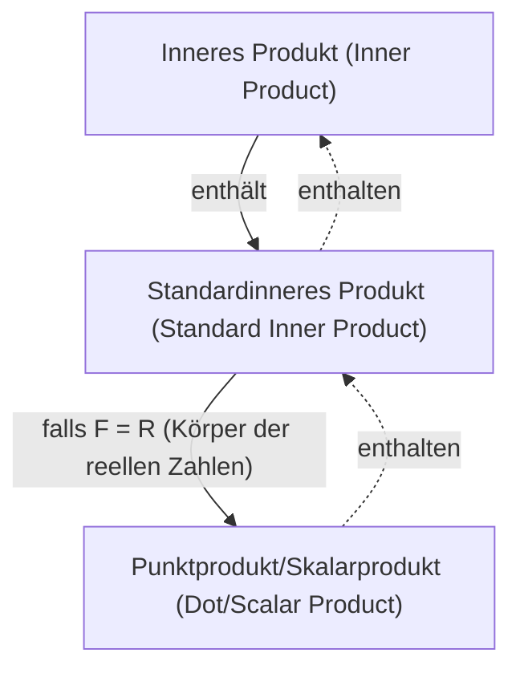

## Prerequisites
- [Vektoren und Linearkombinationen](/posts/vectors-and-linear-combinations/)

## Inneres Produkt

Die Definition des allgemeinen **inneren Produkts (inner product)** in einem $F$-Vektorraum lautet wie folgt.

> **Definition von innerem Produkt (inner product) und Skalarproduktraum (inner product space)**  
> Sei $\mathbb{V}$ ein $F$-Vektorraum. Ein **inneres Produkt (inner product)** $\langle \mathbf{x},\mathbf{y} \rangle$ auf $\mathbb{V}$ ist eine Abbildung, die jedem geordneten Paar von Vektoren $\mathbf{x},\mathbf{y}\in\mathbb{V}$ einen Skalar in $F$ zuordnet und folgende Bedingungen erfüllt:
>
> Für alle $\mathbf{x},\mathbf{y},\mathbf{z} \in \mathbb{V}$ und alle $c \in F$ gilt:
> 1. $\langle \mathbf{x}+\mathbf{z}, \mathbf{y} \rangle = \langle \mathbf{x}, \mathbf{y} \rangle + \langle \mathbf{z}, \mathbf{y} \rangle$
> 2. $\langle c\mathbf{x}, \mathbf{y} \rangle = c \langle \mathbf{x}, \mathbf{y} \rangle$
> 3. $\overline{\langle \mathbf{x}, \mathbf{y} \rangle} = \langle \mathbf{y}, \mathbf{x} \rangle$ (wobei $\overline{\mathbf{z}}$ die komplexe Konjugierte von $\mathbf{z}$ bezeichnet)
> 4. Für $\mathbf{x} \neq \mathbf{0}$ ist $\langle \mathbf{x}, \mathbf{x} \rangle$ positiv.
>
> Ein $F$-Vektorraum $\mathbb{V}$, der mit einem inneren Produkt versehen ist, heißt **Skalarproduktraum (inner product space)**. Insbesondere heißt er bei $F=\mathbb{C}$ **komplexer Skalarproduktraum (complex inner product space)** und bei $F=\mathbb{R}$ **reeller Skalarproduktraum (real inner product space)**.
{: .prompt-info }

Insbesondere nennt man das folgende innere Produkt das **Standardinnere Produkt (standard inner product)**. Man kann überprüfen, dass es die vier obigen Bedingungen erfüllt.

> **Definition des Standardinneren Produkts (standard inner product)**  
> Für zwei Vektoren $\mathbf{x}=(a_1, a_2, \dots, a_n)$, $\mathbf{y}=(b_1, b_2, \dots, b_n)$ in $F^n$ definieren wir das **Standardinnere Produkt** in $F^n$ durch
>
> $$\langle \mathbf{x}, \mathbf{y} \rangle = \sum_{i=1}^n a_i \overline{b_i} $$
>
{: .prompt-info }

Ist hier $F=\mathbb{R}$, so ist die konjugiert komplexe Zahl einer reellen Zahl sie selbst, daher wird das Standardinnere Produkt zu $\sum_{i=1}^n a_i b_i$. In diesem Fall schreibt man das Standardinnere Produkt oft als $\langle \mathbf{x}, \mathbf{y} \rangle$ oder kurz $\mathbf{x} \cdot \mathbf{y}$ und nennt es **Punktprodukt (dot product)** oder **Skalarprodukt (scalar product)**.

> **Definition von Punktprodukt (dot product)/Skalarprodukt (scalar product)**  
> Für $\mathbf{v}=(v_1, v_2, \dots, v_n)$, $\mathbf{w}=(w_1, w_2, \dots, w_n)$ in $\mathbb{R}^n$ definieren wir das **Punktprodukt (dot product)** bzw. **Skalarprodukt (scalar product)** in $\mathbb{R}^n$ durch
>
> $$ \mathbf{v} \cdot \mathbf{w} = \sum_{i=1}^n v_i w_i = v_1 w_1 + v_2 w_2 + \cdots + v_n w_n $$
> 
{: .prompt-info }

> Das hier gemeinte „**Skalarprodukt (scalar product)**“ ist eine Operation zwischen zwei Vektoren und unterscheidet sich von der Skalarmultiplikation, also der Operation zwischen Skalar und Vektor, wie in [Vektoren und Linearkombinationen](/posts/vectors-and-linear-combinations/) behandelt. Da die englischen Bezeichnungen ähnlich sind und die [koreanische Standardübersetzung nach der Korean Mathematical Society](https://www.kms.or.kr/mathdict/list.html?key=kname&keyword=%EC%8A%A4%EC%B9%BC%EB%9D%BC%EA%B3%B1) sogar identisch ist, ist Verwechslungsgefahr gegeben.
>
> Zur Vermeidung von Missverständnissen werde ich nach Möglichkeit den Begriff **Punktprodukt (dot product)** verwenden.
{: .prompt-warning }

> Im euklidischen Raum fällt das innere Produkt mit dem Punktprodukt zusammen, sodass man kontextabhängig das Punktprodukt oft einfach als inneres Produkt bezeichnet. Streng genommen ist das innere Produkt jedoch der allgemeinere Begriff, der das Punktprodukt einschließt.
{: .prompt-tip }

## Vektorlänge/Norm

Für einen Vektor $\mathbf{v}=(v_1, v_2, \dots, v_n)$ in $\mathbb{R}^n$ wird die euklidische Länge von $\mathbf{v}$ über das Punktprodukt definiert durch

$$ \| \mathbf{v} \| = \sqrt{\mathbf{v} \cdot \mathbf{v}} = \left[ \sum_{i=1}^n |v_i|^2 \right]^{1/2} = \sqrt{v_1^2 + v_2^2 + \cdots + v_n^2} $$

Allgemeiner definiert man in einem beliebigen Skalarproduktraum die **Länge (length)** bzw. **Norm** eines Vektors durch

$$ \| \mathbf{x} \| = \sqrt{\langle \mathbf{x}, \mathbf{x} \rangle} $$

In allgemeinen Skalarprodukträumen gelten für die Norm eines Vektors die folgenden wichtigen Eigenschaften.

> **Satz**  
> Für einen $F$-Skalarproduktraum $\mathbb{V}$ und beliebige Vektoren $\mathbf{x}, \mathbf{y} \in \mathbb{V}$ sowie einen Skalar $c \in F$ gilt:
> 1. $\\|c\mathbf{x}\\| = \|c\| \cdot \\|\mathbf{x}\\|$
> 2. Es gelten beide Aussagen:
>    - $\\|\mathbf{x}\\| = 0 \iff \mathbf{x}=\mathbf{0}$
>    - $\\|\mathbf{x}\\| \geq 0 \ \forall \mathbf{x}$
> 3. **Cauchy–Schwarz-Ungleichung (Cauchy–Schwarz inequality)**: $\| \langle \mathbf{x}, \mathbf{y} \rangle \| \leq \\|\mathbf{x}\\| \cdot \\|\mathbf{y}\\|$ (Gleichheit gilt genau dann, wenn einer der Vektoren ein skalares Vielfaches des anderen ist.)
> 4. **Dreiecksungleichung (triangle inequality)**: $\\| \mathbf{x} + \mathbf{y} \\| \leq \\|\mathbf{x}\\| + \\|\mathbf{y}\\|$ (Gleichheit gilt genau dann, wenn einer der Vektoren ein skalares Vielfaches des anderen ist und beide die gleiche Richtung haben.)
{: .prompt-info }

## Winkel zwischen Vektoren und Einheitsvektor

Ein Vektor der Länge $1$ heißt **Einheitsvektor (unit vector)**. Für zwei Vektoren $\mathbf{v}=(v_1, v_2, \dots, v_n)$, $\mathbf{w}=(w_1, w_2, \dots, w_n)$ in $\mathbb{R}^n$ gilt $\mathbf{v} \cdot \mathbf{w} = \\|\mathbf{v}\\| \cdot \\|\mathbf{w}\\| \cos\theta$, woraus sich der Winkel $\theta$ ($0 \leq \theta \leq \pi$) zwischen $\mathbf{v}$ und $\mathbf{w}$ ergibt:

$$ \theta = \arccos{\frac{\mathbf{v} \cdot \mathbf{w}}{\|\mathbf{v}\| \cdot \|\mathbf{w}\|}} $$

Ist $\mathbf{v} \cdot \mathbf{w} = 0$, so nennt man die beiden Vektoren **senkrecht (perpendicular)** oder **orthogonal**.

> Sind die beiden Vektoren $\mathbf{v}$ und $\mathbf{w}$ senkrecht, so gilt
>
> $$ \begin{align*}
> \| \mathbf{v} + \mathbf{w} \|^2 &= (\mathbf{v} + \mathbf{w}) \cdot (\mathbf{v} + \mathbf{w}) \\
> &= \mathbf{v} \cdot \mathbf{v} + \mathbf{v} \cdot \mathbf{w} + \mathbf{w} \cdot \mathbf{v} + \mathbf{w} \cdot \mathbf{w} \\
> &= \mathbf{v} \cdot \mathbf{v} + \mathbf{w} \cdot \mathbf{w} \\
> &= \|\mathbf{v}\|^2 + \|\mathbf{w}\|^2.
> \end{align*} $$
>
{: .prompt-tip }

Verallgemeinert auf beliebige Skalarprodukträume erhält man Folgendes.

> **Definition**  
> Sei $\mathbb{V}$ ein Skalarproduktraum. Für Vektoren $\mathbf{x}, \mathbf{y} \in \mathbb{V}$ heißen $\mathbf{x}$ und $\mathbf{y}$ **orthogonal** bzw. **senkrecht (perpendicular)**, falls $\langle \mathbf{x}, \mathbf{y} \rangle = 0$. Außerdem gelten:
> 1. Für eine Teilmenge $S \subset \mathbb{V}$ heißt $S$ **orthogonale Menge (orthogonal set)**, wenn je zwei verschiedene Vektoren in $S$ orthogonal sind.
> 2. Ein Vektor $\mathbf{x} \in \mathbb{V}$ mit $\\|\mathbf{x}\\|=1$ heißt **Einheitsvektor (unit vector)**.
> 3. Ist $S \subset \mathbb{V}$ eine orthogonale Menge und besteht $S$ nur aus Einheitsvektoren, so heißt $S$ **Orthonormalmenge (orthonormal set)**.
{: .prompt-info }

Für die Menge $S = \{ \mathbf{v}_1, \mathbf{v}_2, \dots \}$ ist notwendige und hinreichende Bedingung für Orthonormalität $\langle \mathbf{v}\_i, \mathbf{v}\_j \rangle = \delta\_{ij}$. Die Multiplikation eines Vektors mit einem von null verschiedenen Skalar beeinträchtigt die Orthogonalität nicht.

Für jeden von null verschiedenen Vektor $\mathbf{x}$ ist $\cfrac{\mathbf{x}}{\\|\mathbf{x}\\|}$ ein Einheitsvektor; den Prozess, bei dem man einen von null verschiedenen Vektor durch Multiplikation mit dem Kehrwert seiner Länge zu einem Einheitsvektor macht, nennt man **Normalisierung (normalizing)**.
