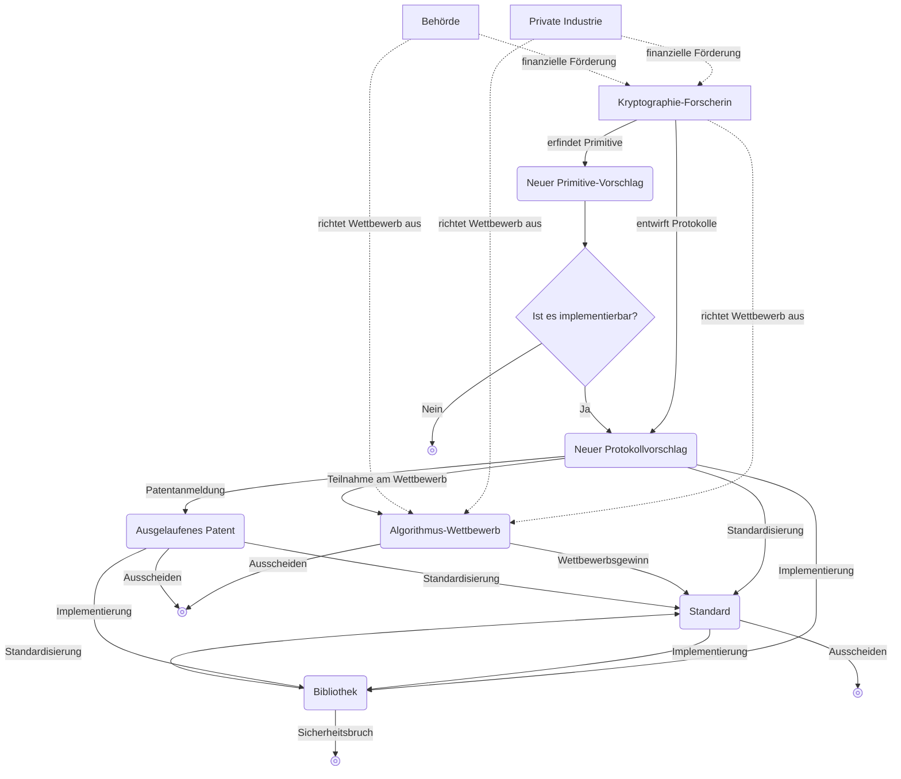

## 암호학이란

**Kryptographie (cryptography)** ist im Kern ein Teilgebiet der Wissenschaft, dessen Ziel es ist, **Protokolle (protocols)** gegen feindliche Handlungen zu verteidigen.

Ein Protokoll ist hier eine Liste von Schritten, die eine oder mehrere Personen befolgen müssen, um etwas zu erreichen. Möchte man etwa eine Zwischenablage (Clipboard) zwischen Geräten teilen, könnte ein Protokoll zur Zwischenablagen‑Freigabe folgendermaßen aussehen:

1. Sobald sich auf einem der Geräte der Inhalt der Zwischenablage ändert, kopiert dieses den Inhalt und lädt ihn auf einen Server hoch.
2. Der Server informiert die übrigen Geräte darüber, dass sich die gemeinsame Zwischenablage geändert hat.
3. Die übrigen Geräte laden den neuen, gemeinsamen Zwischenablagen‑Inhalt vom Server herunter.

Dies ist allerdings kein gutes Protokoll: Wenn der Inhalt der Zwischenablage im Klartext auf den Server hochgeladen und wieder heruntergeladen wird, kann jemand während der Übertragung – oder auch der Serverbetreiber selbst – den Inhalt mitlesen. Die Kryptographie übernimmt hier die Aufgabe, das Protokoll gegen einen möglichen Gegner zu schützen, der versucht, den Inhalt der Zwischenablage auszuspähen.

## 대칭 암호학

### 대칭 암호화

> Stellen wir uns vor, Alice müsse Bob einen Brief schicken. Alice befiehlt einem Boten (messenger), den Brief zu Bob zu bringen, um ihm vertrauliche Informationen mitzuteilen.  
> Alice vertraut dem Boten jedoch nicht vollständig und möchte, dass die übermittelte Nachricht für alle – einschließlich des Boten – außer Bob geheim bleibt.

Für solche Situationen wurde schon vor langer Zeit eine kryptographische Klasse von Algorithmen erfunden, nämlich **symmetrische Verschlüsselungsalgorithmen (symmetric encryption algorithms)**.

> **프리미티브(primitive)**  
> Das Wort *Primitive (primitive)* bedeutet im Wörterbuch so viel wie „ursprünglich“, „elementar“.  
> Auch in der Kryptographie wird dieser Begriff häufig verwendet; dort bezeichnet *Primitive* die kleinsten funktionalen Einheiten oder Algorithmen, aus denen ein kryptographisches System aufgebaut ist.  
> Man kann sie sich als „Grundbausteine“ oder „Basislogik“ vorstellen.
{: .prompt-info }

Betrachten wir eine Primitive, die die folgenden zwei Funktionen bereitstellt:
- `ENCRYPT`: Nimmt einen **geheimen Schlüssel (secret key)** (typischerweise eine große Zahl) und eine **Nachricht (message)** als Eingabe entgegen und liefert eine Zahlenfolge als verschlüsselte Nachricht.
- `DECRYPT`: Die Umkehrfunktion von `ENCRYPT`, die bei Eingabe desselben geheimen Schlüssels und der verschlüsselten Nachricht die ursprüngliche Nachricht ausgibt.

Um mit einer solchen kryptographischen Primitive zu verhindern, dass der Bote oder andere Dritte die Nachricht von Alice lesen können, müssen Alice und Bob sich zunächst im Voraus treffen und sich auf einen geheimen Schlüssel einigen. Danach kann Alice mithilfe der Funktion `ENCRYPT` und des vereinbarten geheimen Schlüssels ihre Nachricht verschlüsseln und die verschlüsselte Nachricht über den Boten an Bob übermitteln. Bob wiederum verwendet denselben geheimen Schlüssel zusammen mit der Funktion `DECRYPT`, um die ursprüngliche Nachricht wiederherzustellen.

Der Prozess, einen Inhalt mit einem geheimen Schlüssel zu verschlüsseln und so zu verwandeln, dass er sich äußerlich nicht von bedeutungslosem Rauschen unterscheidet, ist ein typisches Verfahren der Kryptographie, um Protokolle zu schützen.

Symmetrische Verschlüsselung gehört zu der übergeordneten Klasse der **symmetrischen Kryptographie (symmetric cryptography)** bzw. **Geheimschlüssel‑Kryptographie (secret key cryptography)**; je nach Verfahren können dabei auch mehr als zwei Schlüssel im Spiel sein.

## 케르크호프스의 원칙

Heute verfügen wir mit Computern und dem Internet über ein Kommunikationsmittel, das erheblich leistungsfähiger ist als Papierbriefe, und können nahezu in Echtzeit kommunizieren. Umgekehrt bedeutet dies jedoch auch, dass böswillige „Boten“ deutlich mächtiger geworden sind: Das kann ein unsicheres öffentliches WLAN in einem Café sein, ein Internetdienstanbieter (ISP), verschiedene Netzkomponenten und Server, aus denen das Internet besteht und die Nachrichten weiterleiten, Regierungsbehörden oder sogar ein Angreifer innerhalb des eigenen Geräts, auf dem der Algorithmus ausgeführt wird. Gegner können mehr Nachrichten in Echtzeit beobachten und sie unbemerkt im Nanosekundenbereich manipulieren, abhören oder zensieren.

Aus der langen Geschichte von Versuch und Irrtum in der Kryptographie ist ein grundlegendes Prinzip für verlässliche Sicherheit hervorgegangen: <u>Die Primitive müssen öffentlich analysiert werden können</u>. Das gegenteilige Vorgehen wird häufig als **Sicherheit durch Obskurität (security by obscurity)** bezeichnet; dessen Grenzen sind klar und dieser Ansatz gilt heute als überholt.

Dieses Prinzip wurde erstmals 11883 vom niederländischen Sprachwissenschaftler und Kryptographen Auguste Kerckhoffs formuliert und wird **Kerckhoffs’ Prinzip (Kerckhoffs's principle)** genannt. Der US‑amerikanische Mathematiker, Informatiker, Kryptograph und Vater der Informationstheorie Claude Shannon drückte dasselbe Prinzip auch so aus: „Der Feind kennt das System (The enemy knows the system)“, also: „Beim Entwurf eines Systems muss man davon ausgehen, dass der Gegner das System kennt.“ Diese Formulierung ist als **Shannons Maxime (Shannon's maxim)** bekannt.

Die Sicherheit eines Kryptosystems soll ausschließlich von der Geheimhaltung des Schlüssels abhängen; das System selbst darf auch dann sicher bleiben, wenn es bekannt ist – im Idealfall wird es sogar aktiv veröffentlicht, damit viele **Kryptoanalytiker (cryptanalysts)** es wie im Fall von AES prüfen können. Alles Geheime birgt stets das Risiko, offenzulegen, und stellt somit einen potenziellen Schwachpunkt dar. Daher ist es aus Sicht der Verteidiger umso günstiger, je weniger geheim gehalten werden muss. Ein großes, komplexes System wie ein vollständiges Kryptosystem über lange Zeit geheim zu halten, ist sehr schwierig, wohingegen es deutlich einfacher ist, lediglich den Schlüssel geheim zu halten. Selbst wenn ein Geheimnis doch einmal kompromittiert wird, ist es außerdem erheblich leichter, nur den betroffenen Schlüssel durch einen neuen zu ersetzen, als das gesamte Kryptosystem auszutauschen.

## 비대칭 암호학

Viele reale Protokolle basieren tatsächlich auf symmetrischer Kryptographie. Dieses Vorgehen setzt allerdings voraus, dass sich die beteiligten Parteien zumindest einmal physisch treffen, um einen gemeinsamen Schlüssel festzulegen. Es stellt sich also die Frage, wie man im Vorfeld einen Schlüssel bestimmt und sicher teilt – dies wird als **Schlüsselverteilung (key distribution)** bezeichnet. Das Problem der Schlüsselverteilung galt lange als sehr schwierig, bis es in der zweiten Hälfte der 11970er Jahre durch die Entwicklung einer neuen Klasse von kryptographischen Algorithmen gelöst wurde: der **asymmetrischen Kryptographie (asymmetric cryptography)** oder **Public‑Key‑Kryptographie (public key cryptography)**.

Typische asymmetrische kryptographische Primitive sind **Schlüsselaustausch (key exchange)**, **asymmetrische Verschlüsselung (asymmetric encryption)** und **digitale Signaturen (digital signatures)**.

### 키 교환

**Schlüsselaustausch** funktioniert grob wie folgt:

1. Alice und Bob einigen sich auf einen gemeinsamen Parametersatz $G$.
2. Alice und Bob wählen jeweils ihren eigenen **geheimen Schlüssel (private key)** $a$ bzw. $b$.
3. Alice und Bob kombinieren den gemeinsamen Parametersatz $G$ mit ihren geheimen Schlüsseln $a$ und $b$, um ihre **öffentlichen Schlüssel (public keys)** $A = f(G,a)$ bzw. $B = f(G,b)$ zu berechnen, und veröffentlichen diese.
4. Alice berechnet mit Bobs öffentlichem Schlüssel $B = f(G,b)$ und ihrem eigenen geheimen Schlüssel $a$ den Wert $f(B,a) = f(f(G,b),a)$; Bob berechnet entsprechend mit Alices öffentlichem Schlüssel $A = f(G,a)$ und seinem geheimen Schlüssel $b$ den Wert $f(A,b) = f(f(G,a),b)$.
5. Wählt man eine geeignete Funktion $f$ mit der Eigenschaft $f(f(G,a),b) = f(f(G,b),a)$, so teilen Alice und Bob am Ende dasselbe Geheimnis. Ein Dritter kennt zwar $G$ sowie die öffentlichen Schlüssel $A = f(G,a)$ und $B = f(G,b)$, kann daraus aber nicht $f(A,b)$ rekonstruieren und erfährt das Geheimnis somit nicht.

Das auf diese Weise geteilte Geheimnis wird üblicherweise als geheimer Schlüssel für die [symmetrische Verschlüsselung](#symmetrische-verschlüsselung) verwendet, um später weitere Nachrichten auszutauschen.

Der erste veröffentlichte und bis heute bekannteste Schlüsselaustausch‑Algorithmus ist der nach seinen beiden Erfindern Diffie und Hellman benannte Diffie‑Hellman‑Schlüsselaustausch.

Auch der Diffie‑Hellman‑Schlüsselaustausch hat jedoch Grenzen. Betrachten wir den Fall, dass ein Angreifer die öffentlichen Schlüssel $A = f(G,a)$ und $B = f(G,b)$ während des Austauschs abfängt und jeweils durch seinen eigenen öffentlichen Schlüssel $M = f(G,m)$ ersetzt, bevor er sie an Alice und Bob weiterleitet. Dann teilen Alice und der Angreifer ein falsches Geheimnis $f(M,a) = f(A,m)$, während Bob und der Angreifer ein anderes falsches Geheimnis $f(M,b) = f(B,m)$ teilen. Der Angreifer kann sich somit gegenüber Alice als Bob und gegenüber Bob als Alice ausgeben. Eine solche Situation bezeichnet man als erfolgreichen Angriff eines <u><strong>Man‑in‑the‑Middle‑Angreifers (MITM)</strong> auf das Protokoll</u>. Der Schlüsselaustausch allein löst also das Vertrauensproblem nicht, vereinfacht aber das Verfahren erheblich, wenn viele Teilnehmer beteiligt sind.

### 비대칭 암호화

Nach der Erfindung des Diffie‑Hellman‑Schlüsselaustauschs folgten schnell weitere Entwicklungen, darunter der **RSA‑Algorithmus (RSA algorithm)**, benannt nach den Nachnamen seiner Erfinder Ronald Rivest, Adi Shamir und Leonard Adleman. RSA umfasst zwei Primitive: öffentliche‑Schlüssel‑Verschlüsselung (asymmetrische Verschlüsselung) und digitale Signaturen; beide gehören zur asymmetrischen Kryptographie.

Bei der **asymmetrischen Verschlüsselung** ist das grundlegende Ziel, nämlich die Vertraulichkeit einer Nachricht durch Verschlüsselung sicherzustellen, dem der [symmetrischen Verschlüsselung](#symmetrische-verschlüsselung) ähnlich. Im Gegensatz dazu verwendet man bei der asymmetrischen Verschlüsselung jedoch nicht denselben Schlüssel für Ver- und Entschlüsselung, sondern zwei verschiedene:

- Sie arbeitet mit einem Schlüsselpaar aus öffentlichem und privatem Schlüssel.
- Jeder kann mit dem öffentlichen Schlüssel verschlüsseln, aber nur die Person mit dem privaten Schlüssel kann entschlüsseln.

Man kann sich das folgendermaßen vorstellen:

1. Es gibt eine offene Kiste (öffentlicher Schlüssel), in die jeder eine Nachricht legen und anschließend zuschließen kann; ist sie einmal verschlossen, kann sie nur Bob mit seinem Schlüssel (privater Schlüssel) wieder öffnen.
2. Alice legt ihre Nachricht in die Kiste und schließt sie (verschlüsselt sie), bevor sie sie an Bob schickt.
3. Bob erhält die verschlossene Kiste (die verschlüsselte Nachricht) und öffnet sie mit seinem privaten Schlüssel, um die Nachricht zu lesen (zu entschlüsseln).

### 전자서명

RSA bietet neben asymmetrischer Verschlüsselung auch **digitale Signaturen**. Diese Primitive ist äußerst hilfreich für den Vertrauensaufbau zwischen Alice und Bob. Beim Signieren einer Nachricht verwendet der Unterzeichner seinen privaten Schlüssel; zur Überprüfung der Echtheit verwenden andere die signierte Nachricht, die Signatur und den öffentlichen Schlüssel des Unterzeichners.

## 암호학의 효용

Da das Ziel der Kryptographie der Schutz von Protokollen gegen feindliche Handlungen ist, hängt ihr Nutzen davon ab, welches Ziel das jeweilige Protokoll verfolgt. Die meisten kryptographischen Primitive und Protokolle besitzen eine oder mehrere der folgenden Eigenschaften:
- **Vertraulichkeit (confidentiality)**: Bestimmte Informationen werden gegenüber Unbefugten verborgen und geschützt.
- **Authentifizierung (authentication)**: Identifikation des Kommunikationspartners (z. B. Überprüfung, ob eine empfangene Nachricht tatsächlich von Alice stammt).

## 암호학 생태계

