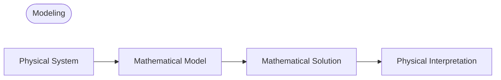

## Modeling
- **Model**: A mathematical formulation of an engineering problem using variables, functions, equations, etc.
- **Mathematical modeling** or **Modeling**: The process of creating a model, solving it mathematically, and interpreting the results

Many physical concepts such as velocity or acceleration are derivatives, so models often take the form of equations containing derivatives of unknown functions, i.e., **differential equations**.

## Ordinary Differential Equations (ODE) and Partial Differential Equations (PDE)
### Ordinary Differential Equations (ODE)
**Ordinary Differential Equation (ODE)**: An equation containing the nth-order derivative of an unknown function

Examples:

$$y' = \cos x$$

$$ y'' + 9y = e^{-2x} $$

$$ y'y''' - \frac{3}{2}y'^{2} = 0 $$

### Partial Differential Equations (PDE)
**Partial Differential Equation (PDE)**: An equation containing partial derivatives of an unknown function with two or more variables

Example:

$$ \frac{\partial^2 u}{\partial x^2} + \frac{\partial^2 u}{\partial y^2} = 0 $$

## Solution
If a function $h(x)$ is defined and differentiable on an open interval $(a, b)$, and when $y$ and $y'$ are replaced with $h$ and $h'$ respectively, the given ODE becomes an identity, then the function

$$ y = h(x) $$

is called a **solution** of the given ODE on the interval $(a, b)$, and the curve of $h$ is called a **solution curve**.

Examples:

$$ y'=\cos x \Leftrightarrow y=\sin x+c $$

$$ y'=0.2y \Leftrightarrow y=ce^{0.2t} $$

A solution containing an arbitrary constant $c$ is called a **general solution** of the ODE.

Geometrically, the general solution of an ODE is a collection of infinitely many solution curves, with one curve corresponding to each value of the constant $c$. Selecting a specific constant $c$ yields a **particular solution** of the ODE.

## Initial Value Problem
To obtain a particular solution of a given problem, we need to determine the value of the arbitrary constant $c$. In many cases, this can be found through an **initial condition** such as $y(x_{0})=y_{0}$ or $y(t_{0})=y_{0}$ (it's called an initial condition even if the independent variable is not time or if $t_{0}\neq0$). An ODE with an initial condition is called an **initial value problem**.

Example:

$$ y'=f(x,y),\qquad y(x_{0})=y_{0} $$

## Modeling Example: Exponential Decay of Radioactive Material
Find the amount of radioactive material remaining over time, given an initial amount of 0.5g.
> Experiments show that radioactive material decomposes at a rate proportional to the amount of material remaining, and thus decays over time.
{: .prompt-info }

### 1. Setting up the Mathematical Model
Let $y(t)$ represent the amount of material remaining at time $t$. Since $y'(t)$ is proportional to $y(t)$, we obtain the **first-order ODE**:

$$ \frac {dy}{dt} = -ky$$ 

where $k>0$ is a constant.

We also know the **initial condition** $y(0)=0.5$. Therefore, we can set up the mathematical model as the following **initial value problem**:

$$ \frac {dy}{dt} = -ky, \qquad y(0)=0.5 $$

### 2. Mathematical Solution
The general solution of the ODE we set up is as follows (refer to [Separation of Variables](/posts/Separation-of-Variables/#modeling-example-radiocarbon-dating)):

$$ y(t)=ce^{-kt} $$

Since $y(0)=c$, we get $y(0)=c=0.5$ from the initial condition. Therefore, the particular solution we're looking for is:

$$ y(t)=0.5e^{-kt} \quad(k>0)$$

### 3. Physical Interpretation of the Solution
The solution we found represents the amount of radioactive material at any time $t$. The amount of radioactive material starts from the initial value of 0.5(g) and decreases over time, with the limit of $y$ approaching $0$ as $t \to \infty$.