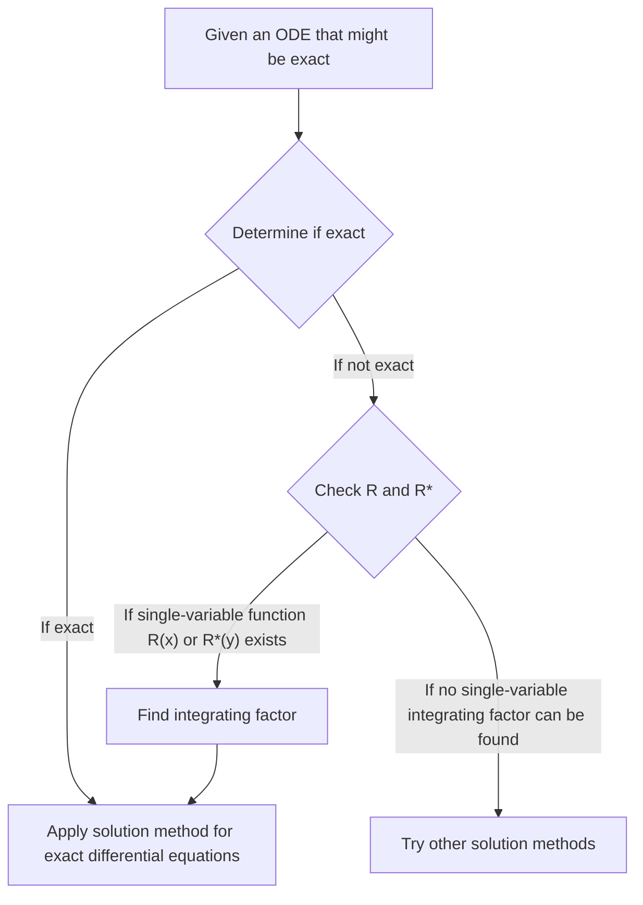

## TL;DR

## Exact Differential Equations
A first-order ordinary differential equation $M(x,y)+N(x,y)y'=0$ can be written as:

$$ M(x,y)dx+N(x,y)dy=0 \tag{1} $$

If 

$$ \exists u(x,y): \frac{\partial u}{\partial x}=M(x,y) \land \frac{\partial u}{\partial y}=N(x,y) \tag{2} $$

then 

$$ M(x,y)dx+N(x,y)dy=\frac{\partial u}{\partial x}dx+\frac{\partial u}{\partial y}dy=du \tag{3} $$

and the ODE $M(x,y)dx+N(x,y)dy=0$ is called an **exact differential equation**. In this case, the ODE can be written as:

$$ du=0 $$

Integrating this gives the general solution in the form:

$$ u(x,y)=c \tag{4} $$

## Identifying Exact Differential Equations
Consider a closed region in the xy-plane bounded by a closed curve that does not intersect itself, where $M$ and $N$ and their first-order partial derivatives are continuous. Looking at condition (2) again:

$$ \begin{align*}
\frac {\partial u}{\partial x}&=M(x,y) \tag{2a}
\\ \frac {\partial u}{\partial y}&=N(x,y) \tag{2b}
\end{align*}$$

Partially differentiating these equations:

$$ \begin{align*}
\frac {\partial M}{\partial y} &= \frac{\partial^2 u}{\partial y \partial x}
\\ \frac {\partial N}{\partial x} &= \frac{\partial^2 u}{\partial x \partial y}
\end{align*}$$

Given the assumed continuity, these two second-order partial derivatives are equal.

$$ \therefore \frac {\partial M}{\partial y}=\frac {\partial N}{\partial x} \tag{5}$$

Thus, condition (5) is a necessary condition for ODE (1) to be an exact differential equation, and while not proven here, it is also a sufficient condition. Therefore, we can determine if an ODE is exact by checking if this condition is satisfied.

## Solving Exact Differential Equations
Integrating equation (2a) with respect to x, treating y as a constant:

$$ u = \int M(x,y) dx + k(y) \tag{6} $$

Here, $k(y)$ acts as an integration constant as y was treated as a constant. Now, treating x as a constant and differentiating equation (6) with respect to y to find $\partial u/\partial y$:

$$ \frac{\partial u}{\partial y} = \frac{\partial}{\partial y}\int M(x,y) dx + \frac{dk}{dy} $$

Comparing this with equation (2b), we can find $dk/dy$:

$$ \frac{\partial}{\partial y}\int M(x,y) dx + \frac{dk}{dy} = N(x,y) $$

$$ \frac{dk}{dy} = N(x,y) - \frac{\partial}{\partial y}\int M(x,y) dx $$

Finally, integrate this equation to determine $k(y)$, substitute it into equation (6) to find the implicit solution $u(x,y)=c$:

$$ k(y) = \int N(x,y)dy - \int \left(\frac{\partial}{\partial y}\int Mdx\right)dy + c^* $$

$$ \int M(x,y)dx + \int N(x,y)dy - \int \left(\frac{\partial}{\partial y}\int Mdx\right)dy = c $$

> It's more important to understand the process of solving rather than memorizing this general solution formula as a rule.
{: .prompt-tip }

## Integrating Factors
Consider an inexact differential equation:

$$ P(x,y)dx+Q(x,y)dy = 0 \quad \left( \frac {\partial P}{\partial y} \neq \frac {\partial Q}{\partial x} \right) \tag{7} $$

If

$$ \exists F(x,y): \frac {\partial}{\partial y}(FP) = \frac {\partial}{\partial x}(FQ) \tag{8} $$

then multiplying the given ODE (7) by function $F$ yields the following exact differential equation:

$$ FP\ dx+FQ\ dy = 0 \tag{9} $$

The function $F(x,y)$ is called an **integrating factor** of equation (7).

## Method for Finding Integrating Factors
Applying the product rule to equation (8) and using subscript notation for partial derivatives:

$$ F_y P + FP_y = F_x Q + FQ_x $$

In many practical cases, an integrating factor exists that depends on only one variable. If $F=F(x)$, then $F_y=0$ and $F_x=F'=dF/dx$, giving:

$$ FP_y = F'Q + FQ_x $$

Dividing both sides by $FQ$ and rearranging:

$$ \begin{align*}
\frac{1}{F} \frac{dF}{dx} &= \frac{P_y}{Q} - \frac{Q_x}{Q}
\\ &= \frac{1}{Q}\left(\frac{\partial P}{\partial y}-\frac{\partial Q}{\partial x} \right)
\end{align*} \tag{10} $$

Therefore:

> For a given ODE (7), if the right side of equation (10), $R$, is a function of x only, then equation (7) has an integrating factor $F=F(x)$.
>
> $$ F(x)=e^{\int R(x)dx}, \quad \text{where }R=\frac{1}{Q}\left(\frac{\partial P}{\partial y}-\frac{\partial Q}{\partial x} \right) \tag{11} $$
{: .prompt-info }

Similarly, if $F^*=F^*(y)$, instead of equation (10) we get:

$$ \frac{1}{F^*} \frac{dF^*}{dy} = \frac{1}{P}\left(\frac{\partial Q}{\partial x}-\frac{\partial P}{\partial y} \right) \tag{12} $$

Therefore:

> For a given ODE (7), if the right side of equation (12), $R^*$, is a function of y only, then equation (7) has an integrating factor $F^*=F^*(y)$.
>
> $$ F^*(y)=e^{\int R^*(y)dy}, \quad \text{where }R^*=\frac{1}{P}\left(\frac{\partial Q}{\partial x}-\frac{\partial P}{\partial y} \right) \tag{13} $$
{: .prompt-info }
