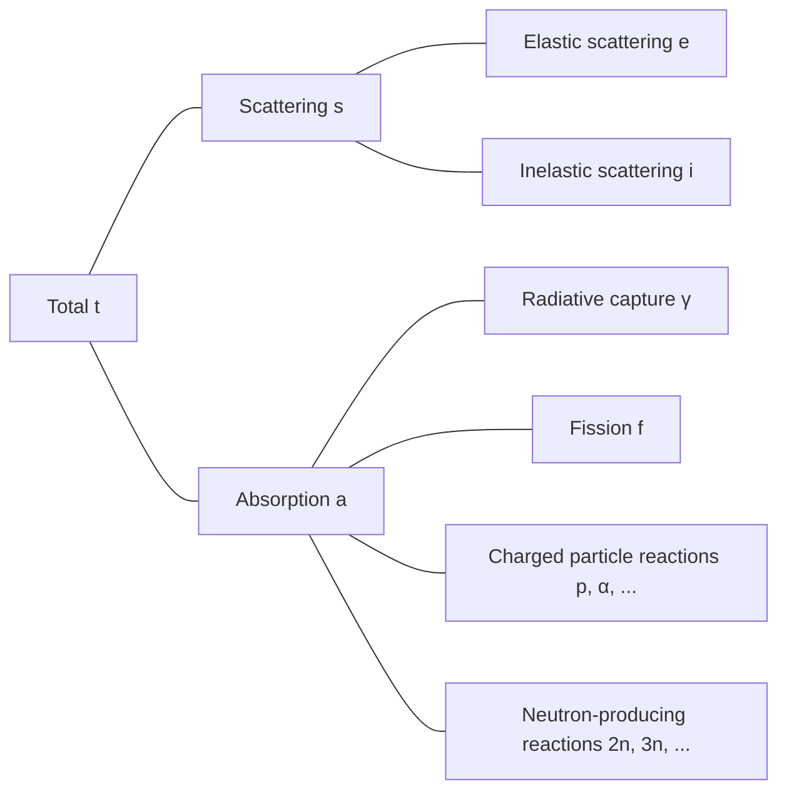

## Neutron Interactions
Neutrons, being electrically neutral, are not affected by the electrical influence of electrons in atoms or the positive charge of atomic nuclei. Therefore, neutrons can pass through the electron cloud of atoms and directly interact with atomic nuclei.

### Elastic scattering
- Neutron collides with the nucleus and bounces off
- The nucleus maintains its ground state without energy change
- Denoted as (n, n)

### Inelastic scattering
- Neutron collides with the nucleus and bounces off
- Unlike elastic scattering, the nucleus absorbs part of the neutron's energy and becomes excited (endothermic reaction)
- Denoted as (n, n′)
- The excited nucleus returns to its ground state by emitting gamma rays, which are called *inelastic γ-rays*

### Radiative capture
- The nucleus captures a neutron and emits one or more gamma rays (exothermic reaction)
- Denoted as (n, γ)
- The gamma rays emitted in this process are called *capture γ-rays*

### Charged particle reactions
- The nucleus captures a neutron and emits charged particles such as alpha particles (α) or protons (p)
- Denoted as (n, α), (n, p), etc.
- Can be either exothermic or endothermic reactions depending on the case

### Neutron-producing reactions
- High-energy neutrons collide with nuclei, resulting in the emission of two or more new neutrons (endothermic reaction)
- Denoted as (n, 2n), (n, 3n), etc.
- The (n, 2n) reaction is particularly important in reactors containing heavy water or beryllium, as the neutrons in $^2\text{H}$ and $^9\text{Be}$ have low binding energies and can be easily emitted even when colliding with low-energy neutrons

### Fission
- A neutron collides with a nucleus, causing it to split into two or more daughter nuclei

## Cross-section or Microscopic Cross-section
Consider a monoenergetic neutron beam incident on a target with (very thin) thickness $\tau$ and area $A$, where the number of neutrons incident on the target per unit area per second is $I\ \text{neutrons/cm}^2\cdot \text{s}$. The volume fraction of the nucleus in an atom is very small, and assuming the target is very thin, most neutrons pass through the target without interacting with nuclei. Then, the number of neutrons colliding with nuclei per unit area per second is proportional to the neutron beam intensity $I$, target thickness $\tau$, and atomic density of the target $N$.

$$ \Delta I \propto I\tau N $$

Introducing a proportionality constant $\sigma$, we can express this as:

$$ \Delta I = \sigma I\tau N\ \text{[neutrons/cm}^2\cdot\text{s]} \tag{1} $$

The ratio of neutrons colliding with nuclei to the incident neutrons on the target is:

$$ p = \frac {\Delta I}{I} = \sigma\tau N = \frac {\sigma}{A} A\tau N = \frac {\sigma}{A} N_t \tag{2} $$

($N_t$: total number of atoms in the target)

From this equation, we can see that $\sigma$ has units of area. This proportionality constant $\sigma$ is called the *cross-section* or *microscopic cross-section*. Physically, the cross-section represents the effective area of the nucleus for interaction with neutrons.

## Units of Microscopic Cross-section
As cm$^2$ is too large a unit to express microscopic cross-sections, the unit *barn* (b) is generally used.

$$ 1\ \text{b} = 10^{-24}\ \text{cm}^2 $$

## Types of Microscopic Cross-sections
- Total: $\sigma_t$
  - Scattering: $\sigma_s$
    - Elastic scattering: $\sigma_e$
    - Inelastic scattering: $\sigma_i$
  - Absorption: $\sigma_a$
    - Radiative capture: $\sigma_\gamma$
    - Fission: $\sigma_f$
    - Charged particle reactions: $\sigma_p, \sigma_\alpha, \cdots$
    - Neutron-producing reactions: $\sigma_{2n}, \sigma_{3n}, \cdots$

## Macroscopic Cross-section
From equation (2), the collision rate per unit distance of the neutron beam is:

$$ \frac {p}{\tau} = \frac {1}{\tau} \frac {\Delta I}{I} = \sigma N \equiv \Sigma\ \text{[cm}^{-1}\text{]} \tag{3}$$

The *macroscopic cross-section* is defined as the product of atomic density $N$ and cross-section as shown above. Physically, the macroscopic cross-section represents the collision rate per unit distance of neutron travel in a target. Like microscopic cross-sections, it can be subdivided as follows:

- Macroscopic total cross-section $\Sigma_t=N\sigma_t$
  - Macroscopic scattering cross-section $\Sigma_s=N\sigma_s$
  - Macroscopic absorption cross-section $\Sigma_a=N\sigma_a$

In general, for any reaction, the macroscopic cross-section $\Sigma_{reaction}=N\sigma_{reaction}$.

## Collision Density, i.e., Reaction Rate
The *collision density* or *reaction rate* represents the number of collisions per unit time per unit volume in the target. From equations (1) and (3), it can be defined as:

$$ F = \frac {\Delta I}{\tau} = I\sigma N = I\Sigma \tag{4} $$