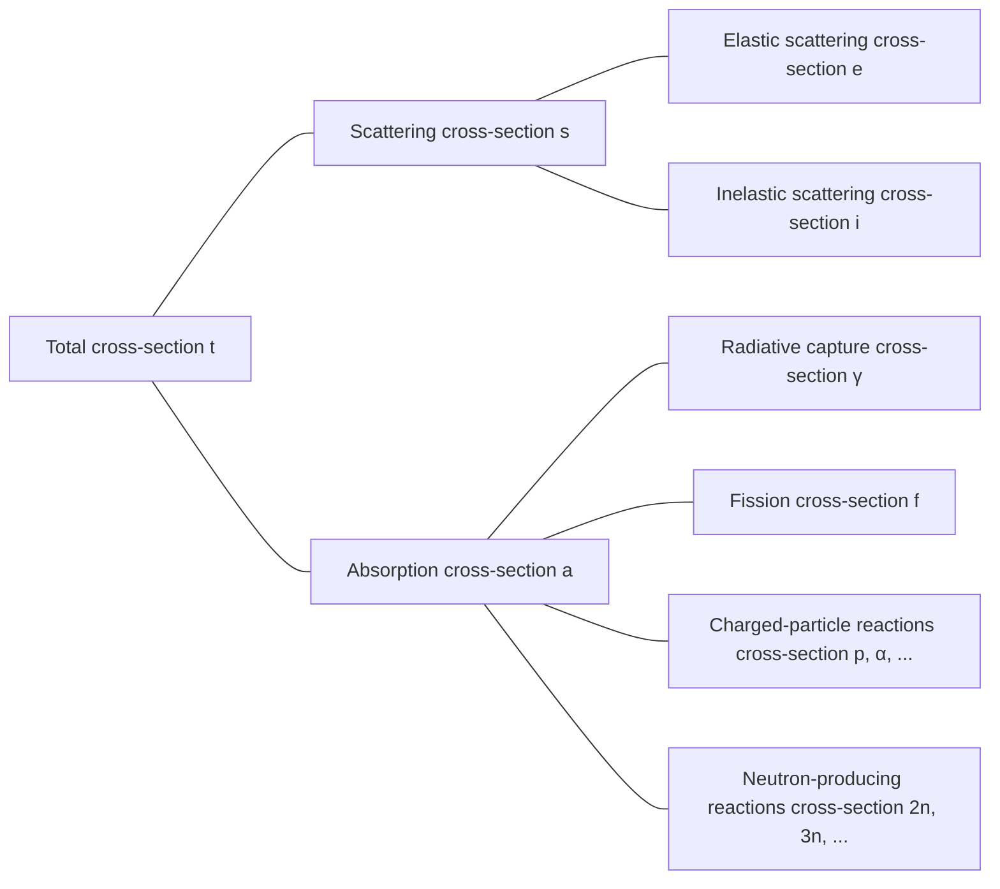

## Cross-Section or Microscopic Cross-Section
Consider a monoenergetic neutron beam incident on a (very thin) target with thickness $\tau$ and area $A$, where the number of neutrons incident per unit area per second is $I\ \text{neutrons/cm}^2\cdot \text{s}$. Since nuclei occupy a very small fraction of atomic volume and the target is assumed to be very thin, most neutrons pass through the target without interacting with nuclei. The number of neutrons colliding with nuclei per unit area per second is proportional to the neutron beam intensity $I$, target thickness $\tau$, and atomic density of the target $N$.

$$ \Delta I \propto I\tau N $$

Introducing a proportionality constant $\sigma$, we can express this as:

$$ \Delta I = \sigma I\tau N\ \mathrm{[neutrons/cm^2\cdot s]} \label{eqn:microscopic_cross_section}\tag{1} $$

The ratio of neutrons colliding with nuclei to those incident on the target is:

$$ p = \frac {\Delta I}{I} = \sigma\tau N = \frac {\sigma}{A} A\tau N = \frac {\sigma}{A} N_t \label{eqn:collision_rate}\tag{2} $$

($N_t$: total number of atoms in the target)

From this equation, we can see that $\sigma$ has units of area. This proportionality constant $\sigma$ is called the *cross-section* or *microscopic cross-section*. Physically, the cross-section represents the effective area that a nucleus presents for interaction with neutrons.

## Units of Microscopic Cross-Section
Since cm$^2$ is too large for expressing microscopic cross-sections, the *barn*(b) unit is commonly used.

$$ 1\ \text{b} = 10^{-24}\ \text{cm}^2 \label{eqn:barn}\tag{3}$$

## Types of Microscopic Cross-Sections
- Total cross-section: $\sigma_t$
  - Scattering cross-section: $\sigma_s$
    - Elastic scattering cross-section: $\sigma_e$
    - Inelastic scattering cross-section: $\sigma_i$
  - Absorption cross-section: $\sigma_a$
    - Radiative capture cross-section: $\sigma_\gamma$
    - Fission cross-section: $\sigma_f$
    - Charged-particle reactions cross-section: $\sigma_p, \sigma_\alpha, \cdots$
    - Neutron-producing reactions cross-section: $\sigma_{2n}, \sigma_{3n}, \cdots$

## Neutron Interactions
Since neutrons are electrically neutral, they are not affected by the electric fields of atomic electrons or the positive charge of nuclei. Therefore, neutrons can penetrate the electron cloud and interact directly with nuclei.

### Compound Nucleus Formation
Most neutron-matter interactions occur in two stages:
1. The neutron and nucleus combine to form a compound nucleus
2. The compound nucleus decays through various pathways

$$ \begin{align*}
\mathrm{^A Z} + \mathrm{n} \to \left( \mathrm{^{A+1}Z} \right)^*
&\to \mathrm{^A Z} + \mathrm{n} \text{ (elastic scattering)} \\
&\to \mathrm{^A Z} + \mathrm{n}^\prime \text{ (inelastic scattering)} \\
&\to \mathrm{^{A+1}Z} + \gamma \text{ (radiative capture)} \\
&\qquad \vdots
\end{align*} $$

Nuclei have quantized energy levels based on their nucleon configurations. When an incident neutron's energy corresponds to one of the excited states of the target nucleus, compound nucleus formation is enhanced. This leads to maximized cross-sections at specific energies, a phenomenon called *resonance*.

### Elastic Scattering
- Neutron collides with a nucleus and bounces off
- The nucleus remains in its ground state with no energy change
- Denoted as $(\mathrm{n}, \mathrm{n})$

When plotting elastic scattering cross-section as a function of neutron energy, three distinct regions can be identified:

> **Elastic and Total Cross Sections of C-12**  
> - Graph provided by: Nuclear Data Center at KAERI, Table of Nuclides (<https://atom.kaeri.re.kr/nuchart/>)

> **Elastic and Total Cross Sections of U-238**  
> - Graph provided by: Nuclear Data Center at KAERI, Table of Nuclides (<https://atom.kaeri.re.kr/nuchart/>)

#### Low-Energy Region
In this region, the elastic scattering cross-section is approximately constant. No compound nucleus is formed; instead, the nucleus exerts a force on passing neutrons, causing slight scattering. This is called potential scattering, and for a nucleus with radius $R$, the potential scattering cross-section is:

$$ \sigma_e = 4\pi R^2 \label{eqn:potential_scattering}\tag{4}$$

> **Why Scattering Cross-Section is Not Constant in the Ultra-Low Energy Region**  
> The approximation above is valid for carbon-12 in the energy range from about 0.02eV to 0.01MeV. In the ultra-low energy region, we can observe from the actual data that this approximation does not hold.
>
> According to the **Ramsauer model**, the relationship between scattering cross-section and neutron energy in the low-energy region is:
>
> $$ \sigma(E) = 2\pi \left(R+\lambda(E)\right)^2(1-\alpha \cos\beta). $$
>
> From [the de Broglie wavelength equation for neutrons](/posts/Mass-and-Energy-Particles-and-Waves/#neglecting-relativistic-effects-eg-neutrons), $\lambda(E) \propto \cfrac{1}{\sqrt{E}}$. Typically, $\lambda(E) \ll R$, so we can ignore $\lambda(E)$ in the $\left(R+\lambda(E)\right)^2$ term and approximate $\sigma(E) \propto R^2$. However, at very low energies, neutrons behave more like waves than particles, and the de Broglie wavelength becomes larger than the nuclear radius. In this case, $\lambda(E)$ becomes the dominant term, and that approximation is no longer valid.
{: .prompt-info }

#### Resonance Region
In this region, the nucleus momentarily absorbs the neutron to form a compound nucleus, which then re-emits a neutron with the same energy as the incident neutron. This is called elastic resonance scattering. Since resonance occurs at energies corresponding to the energy level differences of the target nucleus, neutron cross-sections show peaks at specific energy values.

The resonance region appears at lower neutron energies for heavier nuclei. For uranium-238, the resonance region begins at a much lower energy (around 6 eV) than for carbon-12 and continues up to about 1 keV.

#### High-Energy Region (Smooth Region)
At higher energies, the spacing between nuclear energy levels becomes very small, making individual resonances indistinguishable. In this region, $\sigma_e$ varies slowly and smoothly with neutron energy.

### Inelastic Scattering
- Neutron collides with a nucleus and bounces off
- Unlike elastic scattering, the nucleus absorbs part of the neutron's energy and enters an excited state (endothermic reaction)
- Since nuclear energy levels are quantized, inelastic scattering can only occur when the incident neutron has energy greater than or equal to the difference between two energy levels of the nucleus
  - More common in heavy nuclei with finely divided energy levels; less common in light nuclei
  - The threshold energy for inelastic scattering in carbon is 4.80 MeV, while for uranium-238 it's only 44 keV, as seen in the graphs below
- Above the threshold energy, the inelastic scattering cross-section $\sigma_i$ is roughly similar to the elastic scattering cross-section $\sigma_e$
- Denoted as $(\mathrm{n}, \mathrm{n}^{\prime})$
- The excited nucleus later returns to its ground state by emitting gamma rays, called *inelastic γ-rays*

> **Elastic and Inelastic Cross Sections of C-12**  
> - Graph provided by: Nuclear Data Center at KAERI, Table of Nuclides (<https://atom.kaeri.re.kr/nuchart/>)

> **Elastic and Inelastic Cross Sections of U-238**  
> - Graph provided by: Nuclear Data Center at KAERI, Table of Nuclides (<https://atom.kaeri.re.kr/nuchart/>)

### Radiative Capture
- Nucleus captures a neutron and emits one or more gamma rays (exothermic reaction)
- Denoted as $(\mathrm{n}, \gamma)$
- The emitted gamma rays are called *capture γ-rays*
- Since the neutron is absorbed into the nucleus, this is a type of absorption reaction

Like elastic scattering, the radiative capture cross-section $\sigma_\gamma$ can be divided into three regions:

> **Radiative Capture Cross Section of Au-197**  
> - Graph provided by: Nuclear Data Center at KAERI, Table of Nuclides (<https://atom.kaeri.re.kr/nuchart/>)

#### Low-Energy Region ($1/v$ Region)
In the low-energy region, $\sigma_\gamma$ for most nuclei is proportional to $1/\sqrt{E}$, or $1/v$. This can be observed in the log-log scale graph of gold-197's radiative capture cross-section, where there's a linear section with a slope of $-1/2$.

Some important nuclides don't follow the exact $1/v$ behavior in the low neutron energy region; these are called non-$1/v$ absorbers.

#### Resonance Region
Beyond the $1/v$ region, the resonance region appears at the same energy range as for scattering reactions. Near a resonance at energy $E_r$, $\sigma_\gamma$ is given by the Breit-Wigner single-level formula:

$$ \sigma_\gamma = \frac{\gamma_r^2 g}{4\pi}\frac{\Gamma_n\Gamma_g}{(E-E_r)^2 + \Gamma^2/4} \label{eqn:breit_wigner}\tag{5}$$

- $\gamma_r$: de Broglie wavelength of a neutron with energy $E_r$
- $g$: statistical factor, a constant
- $\Gamma \ (=\Gamma_n + \Gamma_\gamma)$: total width, a constant
  - $\Gamma_n$: neutron width, a constant
  - $\Gamma_\gamma$: radiation width, a constant

> The resonance width $\Gamma$ is defined as the energy difference between two points where the cross-section is half its maximum value: $\sigma_\gamma(E_r \pm \Gamma/2) = \cfrac{1}{2}\sigma_\gamma(E_r)$. This is the origin of the term "width."
{: .prompt-tip }

#### High-Energy Region (Above the Resonance Region)
Beyond the resonance region (generally above 1 keV for heavy nuclei, higher for lighter nuclei), $\sigma_\gamma$ initially decreases rapidly and then continues to decrease slowly at a very small value.

### Charged-Particle Reactions
- Nucleus captures a neutron and emits charged particles like alpha particles ($\alpha$) or protons ($\mathrm{p}$)
- Denoted as $(\mathrm{n}, \alpha)$, $(\mathrm{n}, \mathrm{p})$, etc.
- Can be either exothermic or endothermic reactions, but usually endothermic
- Have threshold energies below which they don't occur, and even above threshold, cross-sections are generally small (especially for heavy nuclei)

Despite their generally small cross-sections and threshold energy requirements, some important charged-particle reactions occur in light nuclei.

#### Exothermic Reactions
##### $^{10}\mathrm{B}(\mathrm{n},\alpha){^7\mathrm{Li}}$

> **$^{10}\mathrm{B}(\mathrm{n},\alpha){^7\mathrm{Li}}$ Reaction Cross Section**  
> - Graph provided by: Nuclear Data Center at KAERI, Table of Nuclides (<https://atom.kaeri.re.kr/nuchart/>)

- $\sigma_\alpha \propto 1/v$ for energies below about $100\ \mathrm{keV}$
- $\sigma_\alpha$ is very large at low neutron energies, making it useful for absorbing low-energy neutrons

> In reactors using water as coolant and moderator, boron is added to the moderator to absorb excess neutrons for reaction control or emergency shutdown.
{: .prompt-tip }

##### $^{6}\mathrm{Li}(\mathrm{n},\alpha){^3\mathrm{H}}$

> **$^{6}\mathrm{Li}(\mathrm{n},\alpha){^3\mathrm{H}}$ Reaction Cross Section**  
> - Graph provided by: Nuclear Data Center at KAERI, Table of Nuclides (<https://atom.kaeri.re.kr/nuchart/>)

- Similarly shows $\sigma_\alpha \propto 1/v$ for energies below approximately $100\ \mathrm{keV}$
- Used for tritium ($^3\mathrm{H}$) production

> This reaction is particularly important in fusion reactor blankets. Since [tritium has a short half-life and is rarely found in nature](/posts/Nuclear-Stability-and-Radioactive-Decay/#tritium), fusion reactors must produce it on-site. The fusion reactor vessel is surrounded by a lithium blanket that absorbs neutrons from the fusion reaction, converting lithium to tritium which is then collected for use as fusion fuel.  
> As this is an exothermic reaction, some of the neutron energy from the fusion reaction is converted to thermal energy through this process, which is then converted to electrical energy in fusion power plants.
{: .prompt-tip }

#### Endothermic Reactions
##### $^{16}\mathrm{O}(\mathrm{n},\mathrm{p}){^{16}\mathrm{N}}$

> **$^{16}\mathrm{O}(\mathrm{n},\mathrm{p}){^{16}\mathrm{N}}$ Reaction Cross Section**  
> - Graph provided by: Nuclear Data Center at KAERI, Table of Nuclides (<https://atom.kaeri.re.kr/nuchart/>)

- Has a high threshold energy of about 9 MeV, much higher than the average energy of neutrons from uranium-235 fission (2-3 MeV), so the reaction frequency is low (about 1 in thousands of neutrons)
- Despite its low frequency, it's important as the main cause of water activation in reactors using water as coolant and moderator
  - $^{16}\mathrm{O}$ in water molecules undergoes this reaction to form $^{16}\mathrm{N}$, which has a half-life of about 7 seconds and [beta decays](/posts/Nuclear-Stability-and-Radioactive-Decay/#beta-decay-beta-decay) while [emitting 6-7 MeV gamma rays](/posts/Nuclear-Stability-and-Radioactive-Decay/#isomeric-transition)

### Neutron-Producing Reactions
- High-energy neutrons collide with nuclei, resulting in the emission of two or more neutrons (endothermic reactions)
- Denoted as (n, 2n), (n, 3n), etc.
- Particularly important in reactors containing heavy water or beryllium, as $^2\text{H}$ and $^9\text{Be}$ have weakly bound neutrons that can be easily released even in collisions with lower energy neutrons

> **$\mathrm{D}(\mathrm{n},\mathrm{2n})\mathrm{p}$ and $^{9}\mathrm{Be}(\mathrm{n},\mathrm{2n}){^{8}\mathrm{Be}}$ Reaction Cross Sections**  
> - Graph provided by: Nuclear Data Center at KAERI, Table of Nuclides (<https://atom.kaeri.re.kr/nuchart/>)

### Fission
- Neutron collides with a nucleus, causing it to split into two or more daughter nuclei

> Fission and fission cross-sections will be covered in a separate post.
{: .prompt-info }

### Total Cross-Section
#### Low-Energy Region

$$ \sigma_t = 4\pi R^2 + \frac{C}{\sqrt{E}} \label{eqn:total_cross_section}\tag{6}$$

- The first term represents the [elastic scattering cross-section](#low-energy-region), and the second term represents the cross-section for [radiative capture](#low-energy-region-1v-region) and all possible exothermic reactions at that energy
- If the first term dominates, the total cross-section will be constant at low energies; if the second term dominates, it will show $1/v$ behavior

#### Resonance Region
Includes resonances from both [$\sigma_s$](#resonance-region) and [$\sigma_\gamma$](#resonance-region-1), appearing at the same energies as these cross-sections. Lighter nuclei have resonances at higher and broader energy ranges, while heavier nuclei show resonances at relatively lower and narrower energy ranges.

#### High-Energy Region
Beyond the resonance region, $\sigma_t$ decreases smoothly with increasing energy.

## Cross-Sections of Hydrogen and Deuterium
$^1\mathrm{H}$ and $^2\mathrm{H}$ nuclei, which are abundant in many reactors*, interact with neutrons differently than other nuclei:
- They don't form compound nuclei
- They have no resonance regions
  - [Elastic scattering cross-section is constant](#low-energy-region)
  - [Radiative capture cross-section shows $1/v$ behavior at all neutron energies](#low-energy-region-1v-region)
- Particularly for $^1\mathrm{H}$, which consists of a single proton with no excited states, [inelastic scattering](#inelastic-scattering) doesn't occur

> * Typically present in light water (H₂O) or heavy water (D₂O) used as coolant and moderator in reactors.
{: .prompt-info }

> **Cross Sections of H-1**  
> - Graph provided by: Nuclear Data Center at KAERI, Table of Nuclides (<https://atom.kaeri.re.kr/nuchart/>)

> **Cross Sections of H-2**  
> - Graph provided by: Nuclear Data Center at KAERI, Table of Nuclides (<https://atom.kaeri.re.kr/nuchart/>)

## Macroscopic Cross-Section
From equation ($\ref{eqn:collision_rate}$), the collision rate per unit distance traveled by the neutron beam is:

$$ \frac {p}{\tau} = \frac {1}{\tau} \frac {\Delta I}{I} = \sigma N \equiv \Sigma\ \text{[cm}^{-1}\text{]} \label{eqn:macroscopic_cross_section}\tag{7}$$

The *macroscopic cross-section* is defined as the product of atomic density $N$ and [cross-section](#cross-section-or-microscopic-cross-section). Physically, it represents the probability of neutron collision per unit path length in a target. Like microscopic cross-sections, it can be subdivided:

- Total macroscopic cross-section $\Sigma_t=N\sigma_t$
  - Scattering macroscopic cross-section $\Sigma_s=N\sigma_s$
  - Absorption macroscopic cross-section $\Sigma_a=N\sigma_a$

In general, for any reaction, the macroscopic cross-section is $\Sigma_{reaction}=N\sigma_{reaction}$.

## Collision Density (Reaction Rate)
The *collision density* or *reaction rate* is the number of collisions per unit time per unit volume in a target. From equations ($\ref{eqn:microscopic_cross_section}$) and ($\ref{eqn:macroscopic_cross_section}$), it can be defined as:

$$ F = \frac {\Delta I}{\tau} = I\sigma N = I\Sigma \label{eqn:reaction_rate}\tag{8} $$
