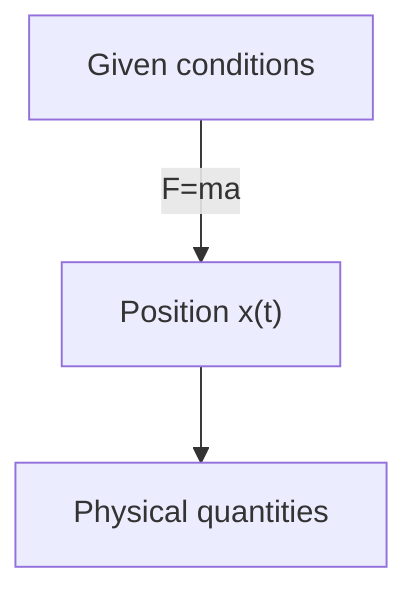
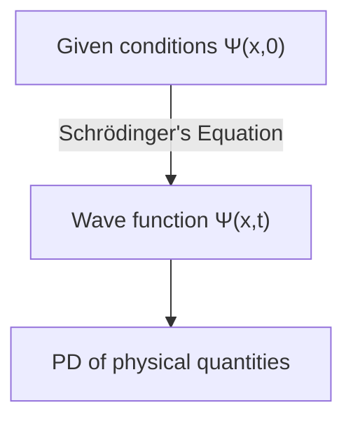

## Prerequisites
- Continuous probability distribution and probability density

## Schrödinger Equation
Let's consider a particle with mass $m$ moving along the x-axis under a given force $F(x,t)$.

In classical mechanics, the main goal is to determine the position of the particle $x(t)$ at any given time by applying Newton's equation of motion $F=ma$. This process can be roughly represented by the following diagram:

In quantum mechanics, the same problem is approached in a very different way. The quantum mechanical approach is to solve the following **Schrödinger equation** to find the particle's **wave function** $\Psi(x,t)$:

$$ \begin{gather*}
i\hbar\frac{\partial \Psi}{\partial t} = - \frac{\hbar^2}{2m}\frac{\partial^2 \Psi}{\partial x^2} + V\Psi. \label{eqn:schrodinger_eqn}\tag{1}\\
\text{(} i=\sqrt{-1}\text{, } \hbar=\frac{h}{2\pi}=1.054573\times10^{-34}\text{, } h\text{: Planck constant, } V(x)\text{: potential energy)}
\end{gather*} $$

> *Image source*
> - Author: Wikimedia user Xcodexif
> - License: [CC BY-SA 4.0](https://creativecommons.org/licenses/by-sa/4.0/)

## Statistical Interpretation of Wave Function $\Psi(x,t)$ (Born Interpretation)
While a particle in classical mechanics is located at a single point, the wave function representing the state of a particle in quantum mechanics is a function of $x$ for a given $t$, meaning it is spread out in space. How should we interpret the physical meaning of this?

According to Born's **statistical interpretation**, the square of the absolute value of the wave function $\|\Psi(x,t)\|^2$ is the probability density function of finding the particle at position $x$ at time $t$. While the wave function $\Psi$ itself is complex, $\|\Psi\|^2=\Psi^\*\Psi$ ($\Psi^\*$ is the complex conjugate of $\Psi$) is a real number greater than or equal to 0, allowing for this interpretation. In other words, it can be expressed as follows:

$$ \int_a^b |\Psi(x,t)|^2 dx = \text{Probability of finding the particle between }a\text{ and }b\text{ at time }t. \tag{2}$$

This statistical interpretation implies that quantum mechanics inherently contains a kind of **indeterminacy**. Even if we know everything about the particle (the wave function), we can only know the probability distribution of possible outcomes, not determine a specific value.

As this was difficult to accept intuitively, it naturally raised questions about whether this indeterminacy was due to some flaw in quantum mechanics or an essential characteristic of nature.

## Perspectives on Quantum Indeterminacy
Suppose we measure the position of a particle and find that it is at point $C$. Then, where was the particle just before the measurement?

### Realist Position

> "God does not play dice."  
> *by Albert Einstein*

The particle was at $C$ from the beginning. This is also the perspective of Einstein and Schrödinger. However, from this viewpoint, quantum mechanics is an incomplete theory because while the particle was actually exactly at $C$, due to the limitations of the theory, we can only know the particle's position as a probability distribution until measurement. In other words, according to this view, indeterminacy is not an essential property of nature but a result of the limitations of quantum mechanics, and there must be some hidden variables in addition to $\Psi$ that need to be known to perfectly describe the particle.

> Schrödinger once worked as an assistant under Einstein and continued to interact with him afterwards. It is likely that Schrödinger's realist and deterministic stance was also influenced by this relationship.
{: .prompt-info }

### Orthodox Position

> "Stop telling God what to do with his dice."  
> *by Niels Bohr, In answer to Einstein's earlier quote*
>
> "Observations not only disturb what is to be measured, they produce it"  
> ...  
> "We compel to assume a definite position."  
> *by Pascual Jordan*

Until the moment of measurement, the particle exists only in the form of a probability distribution and is not located anywhere specific. It is only when the act of measurement is performed that the particle appears at a particular location. This interpretation is called the **Copenhagen interpretation**, proposed by Bohr and Heisenberg at the University of Copenhagen.

> Interestingly, similar to the relationship between Einstein and Schrödinger, Heisenberg was also a student of Bohr.
{: .prompt-info }

### Agnostic Position

> "One should no more rack one's brain about the problem of whether something one cannot know anything about exists all the same, than about the ancient question of how many angels are able to sit on the point of a needle."  
> *by Wolfgang Pauli*

This position refuses to answer. Whatever claim is made about the state of the particle before measurement, if the only way to verify that claim is through measurement, then it's no longer "before measurement" - so what's the point? It's merely metaphysics to argue about something that is fundamentally untestable and unknowable.

### Today's Common Understanding
In 1964, John Bell proved that there is an observable difference depending on whether the particle exists at an exact position before or after measurement, thus ruling out the agnostic position. Subsequent experiments have made the Copenhagen interpretation mainstream. Therefore, unless otherwise stated, the Copenhagen interpretation is usually assumed when dealing with quantum mechanics.

> There are still other interpretations that could be correct besides the Copenhagen interpretation, such as nonlocal hidden variable theories or the many worlds interpretation.
{: .prompt-info }

## Measurement and Collapse of the Wave Function
The particle does not have an exact position until measurement, and only through measurement does it acquire a specific position $C$ (in fact, due to Heisenberg's uncertainty principle, which we'll discuss in another post, even this position is not perfectly accurate but has a small margin of error). However, if an additional measurement is made immediately after this first measurement, the same result is always obtained, not a different value with each measurement. This is explained as follows:

At the moment of the first measurement, the wave function of the measured object changes dramatically, forming a narrow and sharp $\|\Psi(x,t)\|^2$ graph concentrated around point $C$. This is called the **collapse** of the wave function to point $C$ due to measurement.

In other words, physical processes can be divided into two distinct types:
- Ordinary processes where the wave function changes slowly according to the Schrödinger equation
- Measurement processes where $\Psi$ collapses suddenly and discontinuously

> A wave function that has collapsed due to measurement will spread out spatially again over time according to the Schrödinger equation. Therefore, to reproduce the same measurement result, the second measurement must be performed immediately.
{: .prompt-tip }

## Normalization of the Wave Function
Since the square of the absolute value of the wave function $\|\Psi(x,t)\|^2$ is the probability density of finding the particle at position $x$ at time $t$, integrating $|\Psi|^2$ over all $x$ should equal 1.

$$ \int_{-\infty}^{\infty} |\Psi(x,t)|^2 dx = 1. \label{eqn:wavefunction_norm}\tag{3} $$

From equation ($\ref{eqn:schrodinger_eqn}$), we can see that if $\Psi(x,t)$ is a solution, then $A\Psi(x,t)$ is also a solution for any complex constant $A$. Therefore, this $A$ should be determined to satisfy equation ($\ref{eqn:wavefunction_norm}$), and this process is called normalization of the wave function. Some solutions to the Schrödinger equation diverge to infinity when integrated, and in this case, there is no constant $A$ that satisfies equation ($\ref{eqn:wavefunction_norm}$). The same is true for the trivial solution $\Psi=0$. These **non-normalizable solutions** cannot represent particles and are not valid wave functions. Physically possible states correspond to **square-integrable** solutions of the Schrödinger equation.

Moreover, an important property of the Schrödinger equation is that <u>a wave function normalized at one point in time remains normalized ($\int_{-\infty}^{\infty} |\Psi(x,t)|^2 dx = 1$) as time passes and $\Psi$ changes</u>. If the wave function had to be normalized with a different $A$ value at each point in time, $A$ would become a function of time $t$ rather than a constant, making it impossible to solve the Schrödinger equation. However, due to this property, the $A$ value normalized at the initial condition ($t=0$) is preserved regardless of time $t$.

### Proof

$$ \frac{d}{dt}\int_{-\infty}^{\infty} |\Psi(x,t)|^2 dx = \int_{-\infty}^{\infty} \frac{\partial}{\partial t}|\Psi(x,t)|^2 dx. \label{eqn:norm_proof_1}\tag{4} $$

> The result of integrating $\|\Psi\|^2$ over $x$ is a function of $t$ only, so we use total derivative ($d/dt$) on the left side, but $\|\Psi\|^2$ itself is a function of two variables $x$ and $t$, so we use partial derivative ($\partial/\partial t$) on the right side.
{: .prompt-tip }

The above equation can be rewritten according to the product rule of differentiation as follows:

$$ \frac{\partial}{\partial t}|\Psi|^2 = \frac{\partial}{\partial t}(\Psi^*\Psi) = \Psi^*\frac{\partial \Psi}{\partial t} + \frac{\partial \Psi^*}{\partial t}\Psi. \label{eqn:norm_proof_2}\tag{5}$$

Multiplying both sides of the Schrödinger equation ($\ref{eqn:schrodinger_eqn}$) by $-\cfrac{i}{\hbar}$, we get

$$ \frac{\partial \Psi}{\partial t} = \frac{i\hbar}{2m}\frac{\partial^2 \Psi}{\partial x^2}-\frac{i}{\hbar}V\Psi \label{eqn:norm_proof_3}\tag{6}$$

Taking the complex conjugate of $\cfrac{\partial \Psi}{\partial t}$ from the above equation, we get

$$ \frac{\partial \Psi^*}{\partial t} = -\frac{i\hbar}{2m}\frac{\partial^2 \Psi^*}{\partial x^2}+\frac{i}{\hbar}V\Psi^* \label{eqn:norm_proof_4}\tag{7}$$

Now, substituting ($\ref{eqn:norm_proof_3}$) and ($\ref{eqn:norm_proof_4}$) into equation ($\ref{eqn:norm_proof_2}$), we get

$$\begin{align*}
\frac{\partial}{\partial t}|\Psi|^2 &= \frac{i\hbar}{2m}\left(\Psi^*\frac{\partial^2\Psi}{\partial x^2}-\frac{\partial^2\Psi^*}{\partial x^2}\Psi\right) \\
&= \frac{\partial}{\partial x}\left[\frac{i\hbar}{2m}\left(\Psi^*\frac{\partial\Psi}{\partial x}-\frac{\partial\Psi^*}{\partial x}\Psi \right) \right] 
\end{align*} \label{eqn:norm_proof_5}\tag{8}$$

Substituting this into the right side of the initial equation ($\ref{eqn:norm_proof_1}$), we get

$$ \frac{d}{dt}\int_{-\infty}^{\infty} |\Psi(x,t)|^2 dx = \frac{i\hbar}{2m}\left(\Psi^*\frac{\partial\Psi}{\partial x}-\frac{\partial\Psi^*}{\partial x}\Psi \right)\Bigg|_{-\infty}^{\infty}. \label{eqn:norm_proof_6}\tag{9} $$

However, for the wave function to be normalized and physically valid, $\Psi(x,t)$ must converge to $0$ as $x$ approaches $\pm\infty$. Therefore,

$$ \frac{d}{dt}\int_{-\infty}^{\infty} |\Psi(x,t)|^2 dx = 0 \label{eqn:norm_proof_fin}\tag{10} $$

Thus, $\int_{-\infty}^{\infty} \|\Psi(x,t)\|^2 dx$ is a constant independent of time.

$$ \therefore \text{If }\Psi\text{ is normalized at any one point in time }t\text{, it remains normalized for all other times }t. \blacksquare $$
