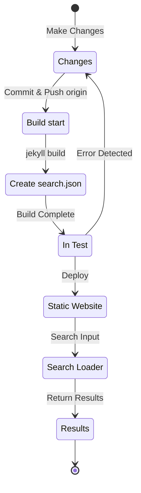

## Overview
About four months ago, in early July 12024, I added multi-language support to this blog, which is hosted on GitHub Pages with Jekyll, by applying the [Polyglot](https://github.com/untra/polyglot) plugin.
This series shares the bugs encountered while applying the Polyglot plugin to the Chirpy theme, their solutions, and how to write the HTML header and sitemap.xml with SEO in mind.
The series consists of 2 posts, and this is the second post in the series.
- Part 1: [Applying Polyglot Plugin & Implementing hreflang alt Tags, Sitemap, and Language Selection Button](/posts/how-to-support-multi-language-on-jekyll-blog-with-polyglot-1)
- Part 2: Troubleshooting Chirpy Theme Build Failures and Search Function Errors (this post)

## Requirements
- [x] The built result (web pages) must be served under language-specific paths (e.g., `/posts/ko/`{: .filepath}, `/posts/ja/`{: .filepath}).
- [x] To minimize the additional time and effort for multi-language support, the build process should automatically recognize the language based on the local file path (e.g., `/_posts/ko/`{: .filepath}, `/_posts/ja/`{: .filepath}) without needing to manually specify 'lang' and 'permalink' tags in the YAML front matter of each Markdown file.
- [x] The header of each page on the site must meet Google's SEO guidelines for multilingual search by including appropriate Content-Language meta tags, hreflang alternate tags, and canonical links.
- [x] The site must provide all language-specific page links in a single `sitemap.xml`{: .filepath} file without omissions, and this `sitemap.xml`{: .filepath} file must exist only at the root path without duplication.
- [x] All features provided by the [Chirpy theme](https://github.com/cotes2020/jekyll-theme-chirpy) must function correctly on each language page. If not, they must be modified to work properly.
  - [x] 'Recently Updated' and 'Trending Tags' features work correctly.
  - [x] No errors during the build process using GitHub Actions.
  - [x] The post search function in the top-right corner of the blog works correctly.

## Before We Begin
This post is a continuation of [Part 1](/posts/how-to-support-multi-language-on-jekyll-blog-with-polyglot-1), so if you haven't read it yet, I recommend reading the previous post first.

## Troubleshooting ('relative_url_regex': target of repeat operator is not specified)
After completing the previous steps, when I ran the `bundle exec jekyll serve` command to test the build, it failed with the error `'relative_url_regex': target of repeat operator is not specified`.

```shell
...(omitted)
                    ------------------------------------------------
      Jekyll 4.3.4   Please append `--trace` to the `serve` command 
                     for any additional information or backtrace. 
                    ------------------------------------------------
/Users/yunseo/.gem/ruby/3.2.2/gems/jekyll-polyglot-1.8.1/lib/jekyll/polyglot/
patches/jekyll/site.rb:234:in `relative_url_regex': target of repeat operator 
is not specified: /href="?\/((?:(?!*.gem)(?!*.gemspec)(?!tools)(?!README.md)(
?!LICENSE)(?!*.config.js)(?!rollup.config.js)(?!package*.json)(?!.sass-cache)
(?!.jekyll-cache)(?!gemfiles)(?!Gemfile)(?!Gemfile.lock)(?!node_modules)(?!ve
ndor\/bundle\/)(?!vendor\/cache\/)(?!vendor\/gems\/)(?!vendor\/ruby\/)(?!en\/
)(?!ko\/)(?!es\/)(?!pt-BR\/)(?!ja\/)(?!fr\/)(?!de\/)[^,'"\s\/?.]+\.?)*(?:\/[^
\]\[)("'\s]*)?)"/ (RegexpError)

...(omitted)
```

After searching to see if similar issues had been reported, I found that [exactly the same issue](https://github.com/untra/polyglot/issues/204) had already been registered in the Polyglot repository, and a solution existed.

The [Chirpy theme's `_config.yml`{: .filepath}](https://github.com/cotes2020/jekyll-theme-chirpy/blob/master/_config.yml) file contains the following syntax:

```yml
exclude:
  - "*.gem"
  - "*.gemspec"
  - docs
  - tools
  - README.md
  - LICENSE
  - "*.config.js"
  - package*.json
```
{: file='_config.yml'}

The cause of the problem lies in the regex syntax in the following two functions in [Polyglot's `site.rb`{: .filepath}](https://github.com/untra/polyglot/blob/master/lib/jekyll/polyglot/patches/jekyll/site.rb), which cannot properly handle globbing patterns with wildcards like `"*.gem"`, `"*.gemspec"`, and `"*.config.js"`.


```ruby
    # a regex that matches relative urls in a html document
    # matches href="baseurl/foo/bar-baz" href="/foo/bar-baz" and others like it
    # avoids matching excluded files.  prepare makes sure
    # that all @exclude dirs have a trailing slash.
    def relative_url_regex(disabled = false)
      regex = ''
      unless disabled
        @exclude.each do |x|
          regex += "(?!#{x})"
        end
        @languages.each do |x|
          regex += "(?!#{x}\/)"
        end
      end
      start = disabled ? 'ferh' : 'href'
      %r{#{start}="?#{@baseurl}/((?:#{regex}[^,'"\s/?.]+\.?)*(?:/[^\]\[)("'\s]*)?)"}
    end

    # a regex that matches absolute urls in a html document
    # matches href="http://baseurl/foo/bar-baz" and others like it
    # avoids matching excluded files.  prepare makes sure
    # that all @exclude dirs have a trailing slash.
    def absolute_url_regex(url, disabled = false)
      regex = ''
      unless disabled
        @exclude.each do |x|
          regex += "(?!#{x})"
        end
        @languages.each do |x|
          regex += "(?!#{x}\/)"
        end
      end
      start = disabled ? 'ferh' : 'href'
      %r{(?<!hreflang="#{@default_lang}" )#{start}="?#{url}#{@baseurl}/((?:#{regex}[^,'"\s/?.]+\.?)*(?:/[^\]\[)("'\s]*)?)"}
    end
```
{: file='(polyglot root path)/lib/jekyll/polyglot/patches/jekyll/site.rb'}


There are two ways to solve this problem.

### 1. Fork Polyglot and modify the problematic parts
As of the time of writing this post (11.12024), the [Jekyll official documentation](https://jekyllrb.com/docs/configuration/options/#global-configuration) states that the `exclude` setting supports globbing patterns.

>"This configuration option supports Ruby's File.fnmatch filename globbing patterns to match multiple entries to exclude."

In other words, the root cause is not in the Chirpy theme but in Polyglot's `relative_url_regex()` and `absolute_url_regex()` functions, so the fundamental solution is to modify them to prevent the problem.

Since this bug has not yet been fixed in Polyglot, you can fork the Polyglot repository with reference to [this blog post](https://hionpu.com/posts/github_blog_4#4-polyglot-%EC%9D%98%EC%A1%B4%EC%84%B1-%EB%AC%B8%EC%A0%9C) and [the answer to the previous GitHub issue](https://github.com/untra/polyglot/issues/204#issuecomment-2143270322), modify the problematic parts as follows, and use it instead of the original Polyglot.


```ruby
    def relative_url_regex(disabled = false)
      regex = ''
      unless disabled
        @exclude.each do |x|
          escaped_x = Regexp.escape(x)
          regex += "(?!#{escaped_x})"
        end
        @languages.each do |x|
          escaped_x = Regexp.escape(x)
          regex += "(?!#{escaped_x}\/)"
        end
      end
      start = disabled ? 'ferh' : 'href'
      %r{#{start}="?#{@baseurl}/((?:#{regex}[^,'"\s/?.]+\.?)*(?:/[^\]\[)("'\s]*)?)"}
    end

    def absolute_url_regex(url, disabled = false)
      regex = ''
      unless disabled
        @exclude.each do |x|
          escaped_x = Regexp.escape(x)
          regex += "(?!#{escaped_x})"
        end
        @languages.each do |x|
          escaped_x = Regexp.escape(x)
          regex += "(?!#{escaped_x}\/)"
        end
      end
      start = disabled ? 'ferh' : 'href'
      %r{(?<!hreflang="#{@default_lang}" )#{start}="?#{url}#{@baseurl}/((?:#{regex}[^,'"\s/?.]+\.?)*(?:/[^\]\[)("'\s]*)?)"}
    end
```
{: file='(polyglot root path)/lib/jekyll/polyglot/patches/jekyll/site.rb'}


### 2. Replace globbing patterns with exact filenames in the Chirpy theme's '_config.yml' configuration file
The proper and ideal solution would be for the above patch to be incorporated into the Polyglot mainstream. However, until then, you would need to use a forked version, which can be cumbersome as you would need to keep up with upstream Polyglot updates. Therefore, I used a different approach.

If you check the files in the root path of the [Chirpy theme repository](https://github.com/cotes2020/jekyll-theme-chirpy) that match the patterns `"*.gem"`, `"*.gemspec"`, and `"*.config.js"`, there are only 3 files:
- `jekyll-theme-chirpy.gemspec`{: .filepath}
- `purgecss.config.js`{: .filepath}
- `rollup.config.js`{: .filepath}

Therefore, you can delete the globbing patterns in the `exclude` section of the `_config.yml`{: .filepath} file and replace them as follows so that Polyglot can process them without issues.

```yml
exclude: # Modified with reference to https://github.com/untra/polyglot/issues/204
  # - "*.gem"
  - jekyll-theme-chirpy.gemspec # - "*.gemspec"
  - tools
  - README.md
  - LICENSE
  - purgecss.config.js # - "*.config.js"
  - rollup.config.js
  - package*.json
```
{: file='_config.yml'}

## Modifying the Search Function
After completing the previous steps, almost all site functions worked satisfactorily as intended. However, I later discovered that the search bar located in the upper right corner of pages using the Chirpy theme could not index pages in languages other than `site.default_lang` (English in the case of this blog), and when searching in languages other than English, it still displayed English pages in the search results.

To understand the cause, let's look at what files are involved in the search function and where the problem occurs.

### '_layouts/default.html'
Looking at the [`_layouts/default.html`{: .filepath}](https://github.com/cotes2020/jekyll-theme-chirpy/blob/master/_layouts/default.html) file that forms the template for all pages on the blog, we can see that it loads the contents of `search-results.html`{: .filepath} and `search-loader.html`{: .filepath} inside the `<body>` element.


```liquid
  <body>
    

    <div id="main-wrapper" class="d-flex justify-content-center">
      <div class="container d-flex flex-column px-xxl-5">
        
        (...omitted...)

        
      </div>

      <aside aria-label="Scroll to Top">
        <button id="back-to-top" type="button" class="btn btn-lg btn-box-shadow">
          <i class="fas fa-angle-up"></i>
        </button>
      </aside>
    </div>

    (...omitted...)

    
  </body>
```
{: file='_layouts/default.html'}


### '_includes/search-result.html'
[`_includes/search-result.html`{: .filepath}](https://github.com/cotes2020/jekyll-theme-chirpy/blob/master/_includes/search-results.html) creates a `search-results` container to store search results for keywords entered in the search box.


```html
<!-- The Search results -->

<div id="search-result-wrapper" class="d-flex justify-content-center d-none">
  <div class="col-11 content">
    <div id="search-hints">
      
    </div>
    <div id="search-results" class="d-flex flex-wrap justify-content-center text-muted mt-3"></div>
  </div>
</div>
```
{: file='_includes/search-result.html'}


### '_includes/search-loader.html'
[`_includes/search-loader.html`{: .filepath}](https://github.com/cotes2020/jekyll-theme-chirpy/blob/master/_includes/search-loader.html) is the core part that implements search based on the [Simple-Jekyll-Search](https://github.com/christian-fei/Simple-Jekyll-Search) library. It executes JavaScript in the visitor's browser to find matches for input keywords in the [`search.json`{: .filepath}](#assetsjsdatasearchjson) index file and returns the corresponding post links as `<article>` elements, operating on the client side.


```js

  <article class="px-1 px-sm-2 px-lg-4 px-xl-0">
    <header>
      <h2><a href="{url}">{title}</a></h2>
      <div class="post-meta d-flex flex-column flex-sm-row text-muted mt-1 mb-1">
        {categories}
        {tags}
      </div>
    </header>
    <p>{snippet}</p>
  </article>


<p class="mt-5">{{ site.data.locales[include.lang].search.no_results }}</p>

<script>
   Note: dependent library will be loaded in `js-selector.html` 
  document.addEventListener('DOMContentLoaded', () => {
    SimpleJekyllSearch({
      searchInput: document.getElementById('search-input'),
      resultsContainer: document.getElementById('search-results'),
      json: '{{ '/assets/js/data/search.json' | relative_url }}',
      searchResultTemplate: '{{ result_elem | strip_newlines }}',
      noResultsText: '{{ not_found }}',
      templateMiddleware: function(prop, value, template) {
        if (prop === 'categories') {
          if (value === '') {
            return `${value}`;
          } else {
            return `<div class="me-sm-4"><i class="far fa-folder fa-fw"></i>${value}</div>`;
          }
        }

        if (prop === 'tags') {
          if (value === '') {
            return `${value}`;
          } else {
            return `<div><i class="fa fa-tag fa-fw"></i>${value}</div>`;
          }
        }
      }
    });
  });
</script>
```
{: file='_includes/search-loader.html'}


### '/assets/js/data/search.json'

```liquid
---
layout: compress
swcache: true
---

[
  
  {
    "title": {{ post.title | jsonify }},
    "url": {{ post.url | relative_url | jsonify }},
    "categories": {{ post.categories | join: ', ' | jsonify }},
    "tags": {{ post.tags | join: ', ' | jsonify }},
    "date": "{{ post.date }}",
    
    
    "snippet": {{ _content | truncate: 200 | jsonify }},
    "content": {{ _content | jsonify }}
  },
  
]
```
{: file='/assets/js/data/search.json'}


This file uses Jekyll's Liquid syntax to define a JSON file containing the title, URL, category and tag information, creation date, the first 200 characters of the content as a snippet, and the full content of all posts on the site.

### Search Function Structure and Problem Identification
To summarize, when hosting the Chirpy theme on GitHub Pages, the search function operates through the following process:



I confirmed that `search.json`{: .filepath} is created for each language by Polyglot as follows:
- `/assets/js/data/search.json`{: .filepath}
- `/ko/assets/js/data/search.json`{: .filepath}
- `/es/assets/js/data/search.json`{: .filepath}
- `/pt-BR/assets/js/data/search.json`{: .filepath}
- `/ja/assets/js/data/search.json`{: .filepath}
- `/fr/assets/js/data/search.json`{: .filepath}
- `/de/assets/js/data/search.json`{: .filepath}

Therefore, the problematic part is the "Search Loader". The issue of non-English pages not being searchable occurs because `_includes/search-loader.html`{: .filepath} statically loads only the English index file (`/assets/js/data/search.json`{: .filepath}) regardless of the language of the page being visited.

> - However, unlike markdown or html format files, for JSON files, Polyglot wrappers for Jekyll-provided variables like `post.title`, `post.content` work, but the [Relativized Local Urls](https://github.com/untra/polyglot?tab=readme-ov-file#relativized-local-urls) feature does not seem to work.
> - Similarly, I confirmed during testing that within JSON file templates, it's not possible to access [additional liquid tags provided by Polyglot](https://github.com/untra/polyglot?tab=readme-ov-file#features) such as `{{ site.default_lang }}`, `{{ site.active_lang }}` beyond the variables provided by Jekyll.
>
> Therefore, while values like `title`, `snippet`, and `content` in the index file are generated differently for each language, the `url` value returns the default path without considering the language, and appropriate handling needs to be added to the "Search Loader" part.
{: .prompt-warning }

### Solution
To solve this, modify the content of `_includes/search-loader.html`{: .filepath} as follows:


```

  <article class="px-1 px-sm-2 px-lg-4 px-xl-0">
    <header>
      
      <h2><a href="/{{ site.active_lang }}{url}">{title}</a></h2>
      
      <h2><a href="{url}">{title}</a></h2>
      

(...omitted...)

<script>
   Note: dependent library will be loaded in `js-selector.html` 
  document.addEventListener('DOMContentLoaded', () => {
    
    
      
    
    
    SimpleJekyllSearch({
      searchInput: document.getElementById('search-input'),
      resultsContainer: document.getElementById('search-results'),
      json: '{{ search_path | relative_url }}',
      searchResultTemplate: '{{ result_elem | strip_newlines }}',

(...omitted)
```
{: file='_includes/search-loader.html'}


- I modified the liquid syntax in the `` section to add the prefix `"/{{ site.active_lang }}"` before the post URL loaded from the JSON file when `site.active_lang` (current page language) is different from `site.default_lang` (site default language).
- Similarly, I modified the `<script>` section to compare the current page language with the site default language during the build process, and set `search_path` to the default path (`/assets/js/data/search.json`{: .filepath}) if they are the same, or to the language-specific path (e.g., `/ko/assets/js/data/search.json`{: .filepath}) if they are different.

After making these modifications and rebuilding the website, I confirmed that search results are displayed correctly for each language.

> Since `{url}` is a placeholder for the URL value read from the JSON file and not a URL itself, it is not recognized as a localization target by Polyglot, so it needs to be handled directly according to the language. The problem is that `"/{{ site.active_lang }}{url}"` is recognized as a URL, and although localization has already been completed, Polyglot doesn't know that and tries to perform localization again (e.g., `"/ko/ko/posts/example-post"`{: .filepath}). To prevent this, I specified the [`` tag](https://github.com/untra/polyglot?tab=readme-ov-file#disabling-url-relativizing).
{: .prompt-tip }
