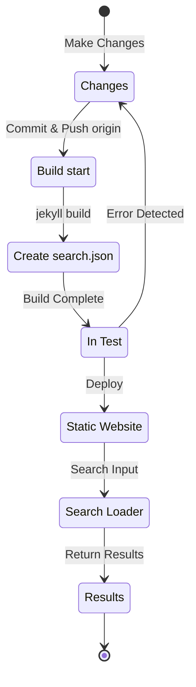

## Overview
About 4 months ago, in early July 2024, I added multilingual support to this Jekyll-based blog hosted on Github Pages by applying the [Polyglot](https://github.com/untra/polyglot) plugin.
This series shares the bugs encountered during the process of applying the Polyglot plugin to the Chirpy theme, their resolution process, and how to write HTML headers and sitemap.xml considering SEO.
The series consists of two posts, and this post you're reading is the second in the series.
- Part 1: [Applying Polyglot Plugin & Implementing hreflang alt Tags, Sitemap, and Language Selection Button](/posts/how-to-support-multi-language-on-jekyll-blog-with-polyglot-1)
- Part 2: Troubleshooting Chirpy Theme Build Failure and Search Function Errors (This post)

## Requirements
- [x] The built result (web pages) should be provided in language-specific paths (e.g., `/posts/ko/`{: .filepath}, `/posts/ja/`{: .filepath}).
- [x] To minimize additional time and effort required for multilingual support, the language should be automatically recognized based on the local path (e.g., `/_posts/ko/`{: .filepath}, `/_posts/ja/`{: .filepath}) of the file during build, without having to specify 'lang' and 'permalink' tags in the YAML front matter of each original markdown file.
- [x] The header of each page on the site should include appropriate Content-Language meta tags and hreflang alternate tags to meet Google's multilingual search SEO guidelines.
- [x] All page links supporting each language on the site should be provided in `sitemap.xml` without omission, and `sitemap.xml` itself should exist only once in the root path without duplication.
- [x] All functions provided by the [Chirpy theme](https://github.com/cotes2020/jekyll-theme-chirpy) should work normally on each language page, and if not, they should be modified to work properly.
  - [x] 'Recently Updated', 'Trending Tags' functions working normally
  - [x] No errors occurring during the build process using GitHub Actions
  - [x] Post search function in the upper right corner of the blog working normally

## Before We Begin
This post is a continuation of [Part 1](/posts/how-to-support-multi-language-on-jekyll-blog-with-polyglot-1), so if you haven't read it yet, it's recommended to read the previous post first.

## Troubleshooting ('relative_url_regex': target of repeat operator is not specified)
After proceeding with the previous steps, when I ran the `bundle exec jekyll serve` command to test the build, it failed with the error `'relative_url_regex': target of repeat operator is not specified`.

```shell
...(omitted)
                    ------------------------------------------------
      Jekyll 4.3.4   Please append `--trace` to the `serve` command 
                     for any additional information or backtrace. 
                    ------------------------------------------------
/Users/yunseo/.gem/ruby/3.2.2/gems/jekyll-polyglot-1.8.1/lib/jekyll/polyglot/
patches/jekyll/site.rb:234:in `relative_url_regex': target of repeat operator 
is not specified: /href="?\/((?:(?!*.gem)(?!*.gemspec)(?!tools)(?!README.md)(
?!LICENSE)(?!*.config.js)(?!rollup.config.js)(?!package*.json)(?!.sass-cache)
(?!.jekyll-cache)(?!gemfiles)(?!Gemfile)(?!Gemfile.lock)(?!node_modules)(?!ve
ndor\/bundle\/)(?!vendor\/cache\/)(?!vendor\/gems\/)(?!vendor\/ruby\/)(?!en\/
)(?!ko\/)(?!es\/)(?!pt-BR\/)(?!ja\/)(?!fr\/)(?!de\/)[^,'"\s\/?.]+\.?)*(?:\/[^
\]\[)("'\s]*)?)"/ (RegexpError)

...(omitted)
```

After searching to see if a similar issue had been reported, I found that [exactly the same issue](https://github.com/untra/polyglot/issues/204) had already been registered in the Polyglot repository, and a solution existed.

The [Chirpy theme's `_config.yml`](https://github.com/cotes2020/jekyll-theme-chirpy/blob/master/_config.yml) file currently applied to this blog contains the following clause:

```yml
exclude:
  - "*.gem"
  - "*.gemspec"
  - docs
  - tools
  - README.md
  - LICENSE
  - "*.config.js"
  - package*.json
```
{: file='_config.yml'}

The cause of the problem lies in the regular expression clauses in the following two functions included in [Polyglot's `site.rb`](https://github.com/untra/polyglot/blob/master/lib/jekyll/polyglot/patches/jekyll/site.rb) file, which fail to properly handle globbing patterns including wildcards like `"*.gem"`, `"*.gemspec"`, `"*.config.js"` above.


```ruby
    # a regex that matches relative urls in a html document
    # matches href="baseurl/foo/bar-baz" href="/foo/bar-baz" and others like it
    # avoids matching excluded files.  prepare makes sure
    # that all @exclude dirs have a trailing slash.
    def relative_url_regex(disabled = false)
      regex = ''
      unless disabled
        @exclude.each do |x|
          regex += "(?!#{x})"
        end
        @languages.each do |x|
          regex += "(?!#{x}\/)"
        end
      end
      start = disabled ? 'ferh' : 'href'
      %r{#{start}="?#{@baseurl}/((?:#{regex}[^,'"\s/?.]+\.?)*(?:/[^\]\[)("'\s]*)?)"}
    end

    # a regex that matches absolute urls in a html document
    # matches href="http://baseurl/foo/bar-baz" and others like it
    # avoids matching excluded files.  prepare makes sure
    # that all @exclude dirs have a trailing slash.
    def absolute_url_regex(url, disabled = false)
      regex = ''
      unless disabled
        @exclude.each do |x|
          regex += "(?!#{x})"
        end
        @languages.each do |x|
          regex += "(?!#{x}\/)"
        end
      end
      start = disabled ? 'ferh' : 'href'
      %r{(?<!hreflang="#{@default_lang}" )#{start}="?#{url}#{@baseurl}/((?:#{regex}[^,'"\s/?.]+\.?)*(?:/[^\]\[)("'\s]*)?)"}
    end
```
{: file='(polyglot root path)/lib/jekyll/polyglot/patches/jekyll/site.rb'}


There are two ways to solve this problem.

### 1. Fork Polyglot and use it after modifying the problematic parts
As of the time of writing this post (November 2024), the [Jekyll official documentation](https://jekyllrb.com/docs/configuration/options/#global-configuration) states that the `exclude` configuration supports the use of globbing patterns.

>"This configuration option supports Ruby's File.fnmatch filename globbing patterns to match multiple entries to exclude."

In other words, the root cause of the problem lies not in the Chirpy theme but in the two functions `relative_url_regex()` and `absolute_url_regex()` of Polyglot, so modifying them to prevent the problem is the fundamental solution.

As this bug has not yet been resolved in Polyglot, you can fork the Polyglot repository and modify the problematic parts as follows, referring to [this blog post](https://hionpu.com/posts/github_blog_4#4-polyglot-%EC%9D%98%EC%A1%B4%EC%84%B1-%EB%AC%B8%EC%A0%9C) and [the answer to the previous GitHub issue](https://github.com/untra/polyglot/issues/204#issuecomment-2143270322), and use it instead of the original Polyglot.


```ruby
    def relative_url_regex(disabled = false)
      regex = ''
      unless disabled
        @exclude.each do |x|
          escaped_x = Regexp.escape(x)
          regex += "(?!#{escaped_x})"
        end
        @languages.each do |x|
          escaped_x = Regexp.escape(x)
          regex += "(?!#{escaped_x}\/)"
        end
      end
      start = disabled ? 'ferh' : 'href'
      %r{#{start}="?#{@baseurl}/((?:#{regex}[^,'"\s/?.]+\.?)*(?:/[^\]\[)("'\s]*)?)"}
    end

    def absolute_url_regex(url, disabled = false)
      regex = ''
      unless disabled
        @exclude.each do |x|
          escaped_x = Regexp.escape(x)
          regex += "(?!#{escaped_x})"
        end
        @languages.each do |x|
          escaped_x = Regexp.escape(x)
          regex += "(?!#{escaped_x}\/)"
        end
      end
      start = disabled ? 'ferh' : 'href'
      %r{(?<!hreflang="#{@default_lang}" )#{start}="?#{url}#{@baseurl}/((?:#{regex}[^,'"\s/?.]+\.?)*(?:/[^\]\[)("'\s]*)?)"}
    end
```
{: file='(polyglot root path)/lib/jekyll/polyglot/patches/jekyll/site.rb'}


### 2. Replace globbing patterns with exact filenames in the Chirpy theme's `_config.yml` configuration file
In fact, the proper and ideal method would be for the above patch to be reflected in the Polyglot mainstream. However, until then, you would have to use the forked version instead, which can be cumbersome to keep up with and reflect updates every time the Polyglot upstream is versioned up. Therefore, I used a different method.

If you check the files located in the project root path in the [Chirpy theme repository](https://github.com/cotes2020/jekyll-theme-chirpy) that correspond to the `"*.gem"`, `"*.gemspec"`, `"*.config.js"` patterns, there are only 3 below anyway.
- `jekyll-theme-chirpy.gemspec`
- `purgecss.config.js`
- `rollup.config.js`

Therefore, if you delete the globbing patterns in the `exclude` clause of the `_config.yml` file and replace them as follows, Polyglot can process them without any problems.

```yml
exclude: # Modified referring to the issue https://github.com/untra/polyglot/issues/204.
  # - "*.gem"
  - jekyll-theme-chirpy.gemspec # - "*.gemspec"
  - tools
  - README.md
  - LICENSE
  - purgecss.config.js # - "*.config.js"
  - rollup.config.js
  - package*.json
```

## Modifying the Search Function
When proceeding up to the previous steps, almost all site functions worked satisfactorily as intended. However, I later discovered that the search bar located in the upper right corner of the page with the Chirpy theme applied could not index pages in languages other than `site.default_lang` (English in the case of this blog), and when searching in languages other than English, it output English pages as search results.

To understand the cause, let's look at what files are involved in the search function and where the problem occurs among them.

### '_layouts/default.html'
If you check the [`_layouts/default.html`](https://github.com/cotes2020/jekyll-theme-chirpy/blob/master/_layouts/default.html) file that forms the framework for all pages in the blog, you can see that it loads the contents of `search-results.html` and `search-loader.html` inside the `<body>` element.


```liquid
  <body>
    

    <div id="main-wrapper" class="d-flex justify-content-center">
      <div class="container d-flex flex-column px-xxl-5">
        
        (...omitted...)

        
      </div>

      <aside aria-label="Scroll to Top">
        <button id="back-to-top" type="button" class="btn btn-lg btn-box-shadow">
          <i class="fas fa-angle-up"></i>
        </button>
      </aside>
    </div>

    (...omitted...)

    
  </body>
```
{: file='_layouts/default.html'}


### '_includes/search-result.html'
[`_includes/search-result.html`](https://github.com/cotes2020/jekyll-theme-chirpy/blob/master/_includes/search-results.html) constructs the `search-results` container to store search results for the keyword when a search term is entered in the search box.


```html
<!-- The Search results -->

<div id="search-result-wrapper" class="d-flex justify-content-center d-none">
  <div class="col-11 content">
    <div id="search-hints">
      
    </div>
    <div id="search-results" class="d-flex flex-wrap justify-content-center text-muted mt-3"></div>
  </div>
</div>
```
{: file='_includes/search-result.html'}


### '_includes/search-loader.html'
[`_includes/search-loader.html`](https://github.com/cotes2020/jekyll-theme-chirpy/blob/master/_includes/search-loader.html) is the core part that implements search based on the [Simple-Jekyll-Search](https://github.com/christian-fei/Simple-Jekyll-Search) library. It can be seen that it operates on the Client-Side by executing JavaScript in the visitor's browser to find parts that match the input keyword among the contents of the [`search.json`](https://github.com/cotes2020/jekyll-theme-chirpy/blob/master/assets/js/data/search.json) index file and return the corresponding post link as an `<article>` element.


```js

  <article class="px-1 px-sm-2 px-lg-4 px-xl-0">
    <header>
      <h2><a href="{url}">{title}</a></h2>
      <div class="post-meta d-flex flex-column flex-sm-row text-muted mt-1 mb-1">
        {categories}
        {tags}
      </div>
    </header>
    <p>{snippet}</p>
  </article>


<p class="mt-5">{{ site.data.locales[include.lang].search.no_results }}</p>

<script>
   Note: dependent library will be loaded in `js-selector.html` 
  document.addEventListener('DOMContentLoaded', () => {
    SimpleJekyllSearch({
      searchInput: document.getElementById('search-input'),
      resultsContainer: document.getElementById('search-results'),
      json: '{{ '/assets/js/data/search.json' | relative_url }}',
      searchResultTemplate: '{{ result_elem | strip_newlines }}',
      noResultsText: '{{ not_found }}',
      templateMiddleware: function(prop, value, template) {
        if (prop === 'categories') {
          if (value === '') {
            return `${value}`;
          } else {
            return `<div class="me-sm-4"><i class="far fa-folder fa-fw"></i>${value}</div>`;
          }
        }

        if (prop === 'tags') {
          if (value === '') {
            return `${value}`;
          } else {
            return `<div><i class="fa fa-tag fa-fw"></i>${value}</div>`;
          }
        }
      }
    });
  });
</script>
```
{: file='_includes/search-loader.html'}


### Search Function Operation Structure and Problem Identification
In summary, when hosting the Chirpy theme on GitHub Pages, the search function operates through the following process:



Here, I confirmed that `search.json` is well-generated for each language by Polyglot as follows:
- /assets/js/data/search.json
- /ko/assets/js/data/search.json
- /es/assets/js/data/search.json
- /pt-BR/assets/js/data/search.json
- /ja/assets/js/data/search.json
- /fr/assets/js/data/search.json
- /de/assets/js/data/search.json

Therefore, the problematic part is the "Search Loader". The issue of pages in languages other than English not being searched occurs because `_includes/search-loader.html` statically loads only the English index file (`/assets/js/data/search.json`) regardless of the language of the page currently being visited.

### Problem Resolution
To resolve this, you need to modify the content of `_includes/search-loader.html` as follows:


```js
(omitted...)

<script>
   Note: dependent library will be loaded in `js-selector.html` 
  document.addEventListener('DOMContentLoaded', () => {
    // Get the current language
    const lang = "{{site.active_lang}}";

    // Construct the appropriate search JSON path
    const searchJsonPath = lang === "{{site.default_lang}}"
      ? '{{ "/assets/js/data/search.json" | relative_url }}'
      : `{{ "/" | relative_url }}${lang}/assets/js/data/search.json`;

    // Initialize Simple Jekyll Search
    SimpleJekyllSearch({
      searchInput: document.getElementById('search-input'),
      resultsContainer: document.getElementById('search-results'),
      json: searchJsonPath, // Use the dynamic path based on language
      searchResultTemplate: '{{ result_elem | strip_newlines }}',
      noResultsText: '{{ not_found }}',

(...omitted)
```
{: file='_includes/search-loader.html'}


I modified the JavaScript code to dynamically load `searchJsonPath` by comparing the current language (`{{site.active_lang}}`) with the site's default language (`{{site.default_lang}}`). If they are the same, it loads the default path ("/assets/js/data/search.json"), and if different, it loads `${lang}/assets/js/data/search.json`. After modifying it as above and rebuilding the website, I confirmed that the search results are displayed correctly for each language.
