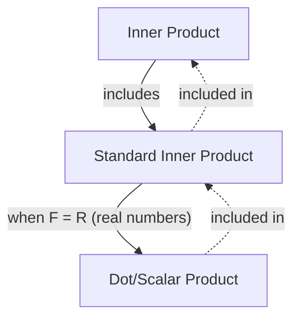

## Prerequisites
- [Vectors and Linear Combinations](/posts/vectors-and-linear-combinations/)

## Inner Product

In a general $F$-vector space, the definition of an **inner product** is as follows.

> **Definition of the inner product and inner product space**  
> Consider an $F$-vector space $\mathbb{V}$. An **inner product** on $\mathbb{V}$, denoted $\langle \mathbf{x},\mathbf{y} \rangle$, is a function that assigns to each ordered pair of vectors $\mathbf{x}, \mathbf{y} \in \mathbb{V}$ a scalar in $F$ and satisfies the following:
>
> For all $\mathbf{x},\mathbf{y},\mathbf{z} \in \mathbb{V}$ and all $c \in F$,
> 1. $\langle \mathbf{x}+\mathbf{z}, \mathbf{y} \rangle = \langle \mathbf{x}, \mathbf{y} \rangle + \langle \mathbf{z}, \mathbf{y} \rangle$
> 2. $\langle c\mathbf{x}, \mathbf{y} \rangle = c \langle \mathbf{x}, \mathbf{y} \rangle$
> 3. $\overline{\langle \mathbf{x}, \mathbf{y} \rangle} = \langle \mathbf{y}, \mathbf{x} \rangle$ (where the overline denotes complex conjugation)
> 4. If $\mathbf{x} \neq \mathbf{0}$, then $\langle \mathbf{x}, \mathbf{x} \rangle$ is positive.
>
> An $F$-vector space $\mathbb{V}$ equipped with an inner product is called an **inner product space**. In particular, when $F=\mathbb{C}$ it is a **complex inner product space**, and when $F=\mathbb{R}$ it is a **real inner product space**.
{: .prompt-info }

In particular, the following inner product is called the **standard inner product**. One can check that it satisfies all four axioms above.

> **Definition of the standard inner product**  
> For two vectors in $F^n$, $\mathbf{x}=(a_1, a_2, \dots, a_n)$ and $\mathbf{y}=(b_1, b_2, \dots, b_n)$, the **standard inner product** on $F^n$ is defined by
>
> $$\langle \mathbf{x}, \mathbf{y} \rangle = \sum_{i=1}^n a_i \overline{b_i} $$
>
{: .prompt-info }

When $F=\mathbb{R}$, complex conjugation is trivial, so the standard inner product becomes $\sum_{i=1}^n a_i b_i$. In this special case we often write $\mathbf{x} \cdot \mathbf{y}$ instead of $\langle \mathbf{x}, \mathbf{y} \rangle$ and call it the **dot product** or **scalar product**.

> **Definition of the dot product/scalar product**  
> For $\mathbf{v}=(v_1, v_2, \dots, v_n)$ and $\mathbf{w}=(w_1, w_2, \dots, w_n)$ in $\mathbb{R}^n$, the **dot product** (or **scalar product**) is defined by
>
> $$ \mathbf{v} \cdot \mathbf{w} = \sum_{i=1}^n v_i w_i = v_1 w_1 + v_2 w_2 + \cdots + v_n w_n $$
> 
{: .prompt-info }

> The “scalar product” mentioned here is an operation between two vectors and is distinct from the operation between a scalar and a vector, “scalar multiplication,” discussed in [Vectors and Linear Combinations](/posts/vectors-and-linear-combinations/). The English terms are similar, and [per the Korean Mathematical Society’s standard terminology the Korean translations are identical](https://www.kms.or.kr/mathdict/list.html?key=kname&keyword=%EC%8A%A4%EC%B9%BC%EB%9D%BC%EA%B3%B1), so be careful not to confuse them.
>
> To avoid confusion, I will refer to it as the **dot product** whenever possible.
{: .prompt-warning }

> In Euclidean space, the inner product coincides with the dot product, so when the context is clear, the dot product is often simply called the inner product. Strictly speaking, however, an inner product is a more general notion that includes the dot product as a special case.
{: .prompt-tip }

## Length/Norm of a Vector

For a vector $\mathbf{v}=(v_1, v_2, \dots, v_n)$ in $\mathbb{R}^n$, the Euclidean length of $\mathbf{v}$ is defined via the dot product as

$$ \| \mathbf{v} \| = \sqrt{\mathbf{v} \cdot \mathbf{v}} = \left[ \sum_{i=1}^n |v_i|^2 \right]^{1/2} = \sqrt{v_1^2 + v_2^2 + \cdots + v_n^2} $$

More generally, in any inner product space, the **length** or **norm** of a vector is defined by

$$ \| \mathbf{x} \| = \sqrt{\langle \mathbf{x}, \mathbf{x} \rangle} $$

In a general inner product space, the norm satisfies the following fundamental properties.

> **Theorem**  
> Let $\mathbb{V}$ be an $F$-inner product space and let $\mathbf{x}, \mathbf{y} \in \mathbb{V}$ and $c \in F$. Then:
> 1. $\\|c\mathbf{x}\\| = \|c\| \cdot \\|\mathbf{x}\\|$
> 2. The following hold:
>    - $\\|\mathbf{x}\\| = 0 \iff \mathbf{x}=\mathbf{0}$
>    - $\\|\mathbf{x}\\| \geq 0 \ \forall \mathbf{x}$
> 3. **Cauchy–Schwarz inequality**: $\| \langle \mathbf{x}, \mathbf{y} \rangle \| \leq \\|\mathbf{x}\\| \cdot \\|\mathbf{y}\\|$ (with equality if and only if one of $\mathbf{x}$ and $\mathbf{y}$ is a scalar multiple of the other)
> 4. **Triangle inequality**: $\\| \mathbf{x} + \mathbf{y} \\| \leq \\|\mathbf{x}\\| + \\|\mathbf{y}\\|$ (with equality if and only if one is a scalar multiple of the other and they point in the same direction)
{: .prompt-info }

## Angle Between Vectors and Unit Vectors

A vector of length $1$ is called a **unit vector**. For two vectors $\mathbf{v}=(v_1, v_2, \dots, v_n)$ and $\mathbf{w}=(w_1, w_2, \dots, w_n)$ in $\mathbb{R}^n$, we have $\mathbf{v} \cdot \mathbf{w} = \\|\mathbf{v}\\| \cdot \\|\mathbf{w}\\| \cos\theta$, from which the angle $\theta$ between $\mathbf{v}$ and $\mathbf{w}$ ($0 \leq \theta \leq \pi$) can be obtained:

$$ \theta = \arccos{\frac{\mathbf{v} \cdot \mathbf{w}}{\|\mathbf{v}\| \cdot \|\mathbf{w}\|}} $$

If $\mathbf{v} \cdot \mathbf{w} = 0$, the two vectors are said to be **perpendicular** or **orthogonal**.

> If vectors $\mathbf{v}$ and $\mathbf{w}$ are perpendicular, then
>
> $$ \begin{align*}
> \| \mathbf{v} + \mathbf{w} \|^2 &= (\mathbf{v} + \mathbf{w}) \cdot (\mathbf{v} + \mathbf{w}) \\
> &= \mathbf{v} \cdot \mathbf{v} + \mathbf{v} \cdot \mathbf{w} + \mathbf{w} \cdot \mathbf{v} + \mathbf{w} \cdot \mathbf{w} \\
> &= \mathbf{v} \cdot \mathbf{v} + \mathbf{w} \cdot \mathbf{w} \\
> &= \|\mathbf{v}\|^2 + \|\mathbf{w}\|^2.
> \end{align*} $$
>
{: .prompt-tip }

Generalizing to an arbitrary inner product space:

> **Definition**  
> Let $\mathbb{V}$ be an inner product space. For vectors $\mathbf{x}, \mathbf{y} \in \mathbb{V}$, if $\langle \mathbf{x}, \mathbf{y} \rangle = 0$, then $\mathbf{x}$ and $\mathbf{y}$ are said to be **orthogonal** or **perpendicular**. Moreover,
> 1. For a subset $S \subset \mathbb{V}$, if any two distinct vectors in $S$ are orthogonal, then $S$ is called an **orthogonal set**.
> 2. A vector $\mathbf{x} \in \mathbb{V}$ with $\\|\mathbf{x}\\|=1$ is called a **unit vector**.
> 3. If a subset $S \subset \mathbb{V}$ is an orthogonal set consisting only of unit vectors, then $S$ is called an **orthonormal set**.
{: .prompt-info }

A set $S = \{ \mathbf{v}_1, \mathbf{v}_2, \dots \}$ is orthonormal if and only if $\langle \mathbf{v}\_i, \mathbf{v}\_j \rangle = \delta\_{ij}$. Multiplying a vector by a nonzero scalar does not affect orthogonality.

For any nonzero vector $\mathbf{x}$, the vector $\cfrac{\mathbf{x}}{\\|\mathbf{x}\\|}$ is a unit vector. Obtaining a unit vector by multiplying a nonzero vector by the reciprocal of its length is called **normalizing**.
