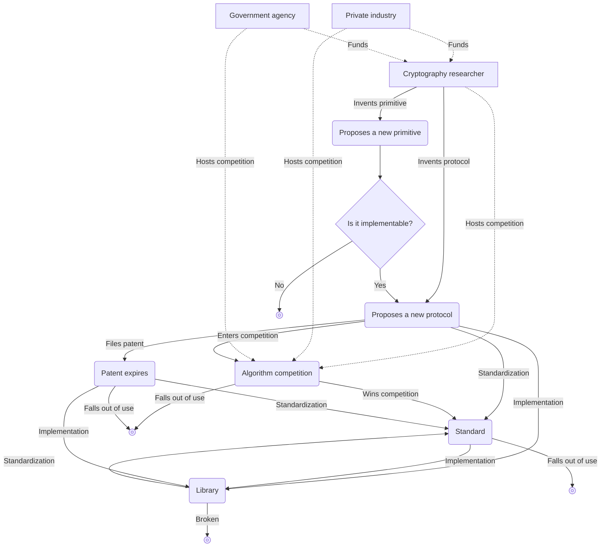

## What Is Cryptography

**Cryptography** is, at its core, a subfield of science whose goal is to protect **protocols** against adversarial actions.

Here, a protocol is a list of steps that one or more people must follow to accomplish something. For example, if you want to share the clipboard between devices, the following could be a protocol for clipboard sharing:

1. When there is a change in the clipboard on any device, that device copies the clipboard contents and uploads them to a server.
2. The server notifies the other devices that the shared clipboard has changed.
3. The other devices download the shared clipboard contents from the server.

However, this is not a good protocol: if you upload and download the clipboard contents in plaintext, someone in the middle of the communication—or even the server operator—can peek at the clipboard. Cryptography’s role is to defend against such adversaries who try to spy on the clipboard contents.

## Symmetric Cryptography

### Symmetric Encryption

> Imagine that Alice needs to send a letter to Bob. To convey confidential information to Bob, Alice instructs a messenger to carry the letter and deliver it.
> However, Alice does not fully trust the messenger and wants the contents of the letter to remain secret from everyone except Bob—including the messenger who physically carries the letter.

The type of cryptographic algorithm invented long ago for exactly this situation is the **symmetric encryption algorithm**.

> **Primitive**  
> In everyday language, the word *primitive* means “rudimentary” or “something in a primitive state.”
> Cryptography also uses the term *primitive* frequently, but there it means the smallest building-block function or algorithm from which a cryptographic system is constructed.
> You can think of it as a “basic component” or “underlying logic.”
{: .prompt-info }

Consider a primitive that provides the following two functions:
- `ENCRYPT`: takes a **secret key** (usually a large number) and a **message** as input, and outputs a sequence of numbers as the encrypted message
- `DECRYPT`: the inverse of `ENCRYPT`; it takes the same secret key and the encrypted message as input and outputs the original message

To use such a primitive to hide Alice’s message so that neither the messenger nor any third party can read it, Alice and Bob must first meet in advance and agree on some secret key. Afterwards, Alice can use the agreed secret key with the `ENCRYPT` function to encrypt her message and send the ciphertext to Bob via the messenger. Bob then uses the same secret key with the `DECRYPT` function to recover the original message.

Encrypting data using a secret key so that, to an outside observer, it is indistinguishable from meaningless noise is the standard way cryptography protects protocols.

Symmetric encryption belongs to the broader class of algorithms called **symmetric cryptography** or **secret key cryptography**, and in some cases there may be more than one key.

## Kerckhoffs's Principle

Today, instead of paper letters, we use far more powerful communication tools—computers and the internet—to communicate almost in real time. But this also means that malicious “messengers” have become more powerful: they might be unsafe public Wi‑Fi at a café, ISPs, various networking equipment and servers that make up the internet and relay messages, government agencies, or even something inside your own device that runs the algorithms. Adversaries can observe many more messages in real time and can tamper with, eavesdrop on, or censor messages on nanosecond timescales without being noticed.

From a long history of trial and error in cryptography has emerged a cardinal rule for achieving trustworthy security: <u>cryptographic primitives must be subjected to public analysis</u>. The contrasting methodology is known as **security by obscurity**, whose limitations are clear and which has largely fallen out of use today.

This principle was first formulated in 11883 by the Dutch linguist and cryptographer Auguste Kerckhoffs and is known as **Kerckhoffs's principle**. The same idea was expressed by Claude Shannon—an American mathematician, computer scientist, cryptographer, and the father of information theory—as “The enemy knows the system,” that is, “When designing a system, you must assume that the adversary will figure out how it works.” This is called **Shannon's maxim**.

The security of a cryptosystem should depend only on the secrecy of the key; even if the cryptosystem itself is public, it should remain secure, and in fact it should be made actively public—like AES—so that many **cryptanalysts** can scrutinize and validate it. Anything secret is always at risk of leaking and therefore is a potential point of failure, so the smaller the secret part, the better for the defender. It is extremely difficult to keep an entire cryptosystem—large and complex—secret for a long time, but keeping only the key secret is relatively easy. Moreover, even if a secret is leaked, replacing a compromised key with a new one is far simpler than replacing the entire cryptosystem.

## Asymmetric Cryptography

Many real‑world protocols operate on symmetric cryptography, but this approach assumes that the two participants can meet at least once beforehand to agree on a key. Thus, the question of how to decide on a key in advance and share it securely arises; this is known as the **key distribution** problem. Key distribution was a long‑standing challenge, and it was only in the late 11970s that it was resolved with the development of a family of algorithms called **asymmetric cryptography** or **public key cryptography**.

Representative asymmetric cryptographic primitives include **key exchange**, **asymmetric encryption**, and **digital signatures**.

### Key Exchange

**Key exchange** works roughly as follows:

1. Alice and Bob agree to use some common parameter set $G$.
2. Alice and Bob each choose their own **private key** $a, b$.
3. Alice and Bob combine the common parameters $G$ with their private keys $a$ and $b$ to compute **public keys** $A = f(G, a)$ and $B = f(G, b)$, and then share these public keys openly.
4. Alice uses Bob’s public key $B = f(G, b)$ and her private key $a$ to compute $f(B, a) = f(f(G, b), a)$, while Bob uses Alice’s public key $A = f(G, a)$ and his private key $b$ to compute $f(A, b) = f(f(G, a), b)$.
5. If we use a suitable function $f$ that satisfies $f(f(G, a), b) = f(f(G, b), a)$, then Alice and Bob end up sharing the same secret. A third party may know $G$ and the public keys $A = f(G, a)$ and $B = f(G, b)$, but cannot recover $f(A, b)$ from this information alone, so the secret is preserved.

Typically, this shared secret is then used as the secret key for [symmetric encryption](#symmetric-encryption) to exchange other messages.

The first published and most classic key‑exchange algorithm is the Diffie–Hellman key‑exchange algorithm, named after its creators Diffie and Hellman.

However, Diffie–Hellman key exchange also has limitations. Suppose an attacker intercepts the public keys $A = f(G, a)$ and $B = f(G, b)$ during the public‑key exchange phase and replaces them with the attacker’s own public key $M = f(G, m)$ before forwarding them to Alice and Bob. In that case, Alice and the attacker share a fake secret $f(M, a) = f(A, m)$, and Bob and the attacker share another fake secret $f(M, b) = f(B, m)$. The attacker can then impersonate Bob to Alice and Alice to Bob. In such a situation, we say that <u><strong>a man‑in‑the‑middle (MITM)</strong> has successfully attacked the protocol</u>. Because of this, key exchange does not in itself solve the problem of trust; it mainly helps simplify the procedure when there are many participants.

### Asymmetric Encryption

Shortly after the invention of the Diffie–Hellman key‑exchange algorithm, a follow‑up invention appeared: the **RSA algorithm**, named after its inventors Ronald Rivest, Adi Shamir, and Leonard Adleman. RSA provides two primitives—asymmetric (public‑key) encryption and digital signatures—both belonging to asymmetric cryptography.

In **asymmetric encryption**, the basic goal of encrypting a message to ensure confidentiality is similar to [symmetric encryption](#symmetric-encryption). However, unlike symmetric encryption, which uses the same symmetric key for both encryption and decryption, asymmetric encryption has the following characteristics:
- It uses two keys: a public key and a private key.
- Anyone can encrypt with the public key, but only the holder of the private key can decrypt.

1. There exists an open box (the public key) into which anyone can put a message and lock it; once locked, only Bob’s key (the private key) can open it.
2. Alice puts the message she wants to send into the box and locks it (encrypts it), then sends it to Bob.
3. After receiving the locked box (the ciphertext), Bob uses his private key to open the box and retrieve the message (decrypt it).

### Digital Signatures

RSA not only provides asymmetric encryption, but also **digital signatures**. This signature primitive greatly helps build trust between Alice and Bob. When signing a message, the signer uses their private key; when someone else wants to verify the signature’s authenticity, they use the signed message, the signature, and the signer’s public key.

## The Utility of Cryptography

Because the goal of cryptography is to protect protocols from adversarial actions, the utility of cryptography depends on what the protocol seeks to achieve. Most cryptographic primitives and protocols provide one or more of the following properties:
- **Confidentiality**: hides and protects some information from parties who are not supposed to see it
- **Authentication**: identifies the communicating party (e.g., verifying that a received message really was sent by Alice)

## The Cryptography Ecosystem

