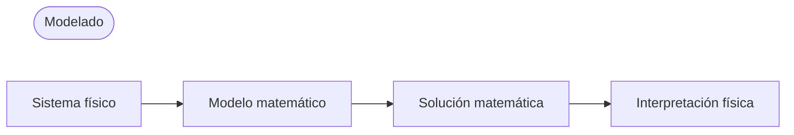

## Modelado (Modeling)
- **Modelo (model)**: Formalización matemática de un problema de ingeniería mediante variables, funciones, ecuaciones, etc.
- **Modelado matemático (mathematical modeling)** o **modelado (modeling)**: Proceso de establecer un modelo, resolverlo matemáticamente e interpretar los resultados

Dado que muchos conceptos físicos como la velocidad o la aceleración son derivadas, los modelos a menudo toman la forma de ecuaciones que incluyen derivadas de funciones desconocidas, es decir, **ecuaciones diferenciales (differential equations)**.

## Ecuaciones diferenciales ordinarias (EDO) y ecuaciones diferenciales parciales (EDP)
### Ecuaciones diferenciales ordinarias (EDO)
**Ecuación diferencial ordinaria (ordinary differential equation; ODE)**: Ecuación que incluye la derivada n-ésima de una función desconocida

Ejemplos:

$$y' = \cos x$$

$$ y'' + 9y = e^{-2x} $$

$$ y'y''' - \frac{3}{2}y'^{2} = 0 $$

### Ecuaciones diferenciales parciales (EDP)
**Ecuación diferencial parcial (partial differential equation; PDE)**: Ecuación que incluye derivadas parciales de una función desconocida con dos o más variables

Ejemplo:

$$ \frac{\partial^2 u}{\partial x^2} + \frac{\partial^2 u}{\partial y^2} = 0 $$

## Solución (Solution)
Si una función $h(x)$ está definida y es diferenciable en un intervalo abierto $(a, b)$, y cuando $y$ e $y'$ se reemplazan por $h$ y $h'$ respectivamente, la ecuación diferencial ordinaria dada se convierte en una identidad, entonces la función

$$ y = h(x) $$

se llama **solución (solution)** de la ecuación diferencial ordinaria dada en el intervalo $(a, b)$, y la curva de $h$ se llama **curva solución (solution curve)**.

Ejemplos:

$$ y'=\cos x \Leftrightarrow y=\sin x+c $$

$$ y'=0.2y \Leftrightarrow y=ce^{0.2t} $$

Una solución que incluye una constante arbitraria $c$ como esta se llama **solución general (general solution)** de la ecuación diferencial ordinaria.

Geométricamente, la solución general de una ecuación diferencial ordinaria es un conjunto infinito de curvas solución, con una curva correspondiente a cada valor de la constante $c$. Al seleccionar un valor específico para la constante $c$, se obtiene una **solución particular (particular solution)** de la ecuación diferencial ordinaria.

## Problema de valor inicial (Initial Value Problem)
Para obtener una solución particular del problema dado, es necesario determinar el valor de la constante arbitraria $c$, que en muchos casos se puede encontrar a través de una **condición inicial (initial condition)** como $y(x_{0})=y_{0}$ o $y(t_{0})=y_{0}$ (se llama condición inicial incluso si la variable independiente no es el tiempo o si $t_{0}\neq0$). Una ecuación diferencial ordinaria con una condición inicial se llama **problema de valor inicial (initial value problem)**.

Ejemplo:

$$ y'=f(x,y),\qquad y(x_{0})=y_{0} $$

## Ejemplo de modelado: Decaimiento exponencial de material radiactivo
Determina la cantidad restante de material radiactivo en el tiempo cuando se da una cantidad inicial de 0.5g.
> Los experimentos muestran que el material radiactivo se descompone a una velocidad proporcional a la cantidad de material restante en cada momento, y por lo tanto decae con el tiempo.
{: .prompt-info }

### 1. Establecimiento del modelo matemático
Representemos la cantidad de material restante en el tiempo $t$ como $y(t)$. Como $y'(t)$ es proporcional a $y(t)$, obtenemos la **ecuación diferencial ordinaria de primer orden**

$$ \frac {dy}{dt} = -ky$$ 

(donde la constante $k>0$).

También conocemos la **condición inicial** $y(0)=0.5$. Por lo tanto, podemos establecer el modelo matemático como el siguiente **problema de valor inicial**:

$$ \frac {dy}{dt} = -ky, \qquad y(0)=0.5 $$

### 2. Solución matemática
La solución general de la ecuación diferencial ordinaria que establecimos anteriormente es la siguiente (consulta [Método de separación de variables](/posts/Separation-of-Variables/#ejemplo-de-modelado-datación-por-radiocarbono)):

$$ y(t)=ce^{-kt} $$

Como $y(0)=c$, obtenemos $y(0)=c=0.5$ de la condición inicial. Por lo tanto, la solución particular que buscamos es

$$ y(t)=0.5e^{-kt} \quad(k>0)$$

### 3. Interpretación física de la solución
La solución que hemos encontrado representa la cantidad de material radiactivo en cualquier tiempo $t$. La cantidad de material radiactivo comienza en el valor inicial de 0.5(g) y disminuye con el tiempo, con un valor límite de $0$ cuando $t \to \infty$.
