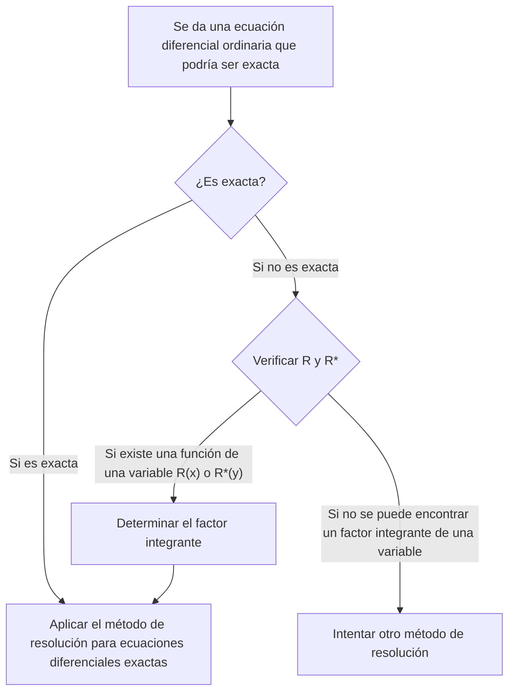

## TL;DR

## Ecuación Diferencial Exacta
Una ecuación diferencial ordinaria de primer orden $M(x,y)+N(x,y)y'=0$ se puede escribir como:

$$ M(x,y)dx+N(x,y)dy=0 \tag{1} $$

Si existe

$$ \exists u(x,y): \frac{\partial u}{\partial x}=M(x,y) \land \frac{\partial u}{\partial y}=N(x,y) \tag{2} $$

entonces

$$ M(x,y)dx+N(x,y)dy=\frac{\partial u}{\partial x}dx+\frac{\partial u}{\partial y}dy=du \tag{3} $$

y en este caso, la ecuación diferencial ordinaria $M(x,y)dx+N(x,y)dy=0$ se llama **ecuación diferencial exacta**. Entonces, esta ecuación diferencial ordinaria se puede escribir como:

$$ du=0 $$

y al integrar, obtenemos inmediatamente la solución general en la forma:

$$ u(x,y)=c \tag{4} $$

## Determinación de una Ecuación Diferencial Exacta
Supongamos que en una región cerrada del plano $xy$, con una curva cerrada que no se interseca a sí misma como frontera, $M$ y $N$ y sus derivadas parciales de primer orden son continuas. Revisando la condición (2) nuevamente, tenemos:

$$ \begin{align*}
\frac {\partial u}{\partial x}&=M(x,y) \tag{2a}
\\ \frac {\partial u}{\partial y}&=N(x,y) \tag{2b}
\end{align*}$$

Diferenciando parcialmente estas ecuaciones:

$$ \begin{align*}
\frac {\partial M}{\partial y} &= \frac{\partial^2 u}{\partial y \partial x}
\\ \frac {\partial N}{\partial x} &= \frac{\partial^2 u}{\partial x \partial y}
\end{align*}$$

Dado que asumimos continuidad, las dos derivadas parciales de segundo orden son iguales.

$$ \therefore \frac {\partial M}{\partial y}=\frac {\partial N}{\partial x} \tag{5}$$

Por lo tanto, podemos ver que la condición (5) es una condición necesaria para que la ecuación diferencial ordinaria (1) sea exacta, y aunque no lo hemos demostrado aquí, de hecho, también es una condición suficiente. Es decir, podemos determinar si una ecuación diferencial es exacta verificando si cumple esta condición.

## Resolución de una Ecuación Diferencial Exacta
Si integramos la ecuación (2a) con respecto a $x$, considerando $y$ como una constante, obtenemos:

$$ u = \int M(x,y) dx + k(y) \tag{6} $$

Aquí, $k(y)$ actúa como una constante de integración, ya que consideramos $y$ como una constante. Ahora, diferenciamos la ecuación (6) con respecto a $y$, considerando $x$ como una constante, para obtener $\partial u/\partial y$:

$$ \frac{\partial u}{\partial y} = \frac{\partial}{\partial y}\int M(x,y) dx + \frac{dk}{dy} $$

Ahora comparamos esta ecuación con (2b) para determinar $dk/dy$:

$$ \frac{\partial}{\partial y}\int M(x,y) dx + \frac{dk}{dy} = N(x,y) $$

$$ \frac{dk}{dy} = N(x,y) - \frac{\partial}{\partial y}\int M(x,y) dx $$

Finalmente, integramos esta ecuación para determinar $k(y)$, la sustituimos en la ecuación (6), y obtenemos la solución implícita $u(x,y)=c$:

$$ k(y) = \int N(x,y)dy - \int \left(\frac{\partial}{\partial y}\int Mdx\right)dy + c^* $$

$$ \int M(x,y)dx + \int N(x,y)dy - \int \left(\frac{\partial}{\partial y}\int Mdx\right)dy = c $$

> Es más importante entender el proceso de resolución que memorizar esta forma general de la solución como una fórmula.
{: .prompt-tip }

## Factor Integrante
Supongamos que se nos da una ecuación diferencial inexacta:

$$ P(x,y)dx+Q(x,y)dy = 0 \quad \left( \frac {\partial P}{\partial y} \neq \frac {\partial Q}{\partial x} \right) \tag{7} $$

Si existe

$$ \exists F(x,y): \frac {\partial}{\partial y}(FP) = \frac {\partial}{\partial x}(FQ) \tag{8} $$

entonces podemos multiplicar la ecuación diferencial dada (7) por la función $F$ para obtener la siguiente ecuación diferencial exacta:

$$ FP\ dx+FQ\ dy = 0 \tag{9} $$

En este caso, la función $F(x,y)$ se llama **factor integrante** de la ecuación (7).

## Método para Encontrar el Factor Integrante
Aplicando la regla del producto a la ecuación (8) y usando subíndices para denotar derivadas parciales, obtenemos:

$$ F_y P + FP_y = F_x Q + FQ_x $$

En muchos casos prácticos, existe un factor integrante que depende de una sola variable. Si $F=F(x)$, entonces $F_y=0$ y $F_x=F'=dF/dx$, lo que nos lleva a:

$$ FP_y = F'Q + FQ_x $$

Dividiendo ambos lados por $FQ$ y reorganizando los términos:

$$ \begin{align*}
\frac{1}{F} \frac{dF}{dx} &= \frac{P_y}{Q} - \frac{Q_x}{Q}
\\ &= \frac{1}{Q}\left(\frac{\partial P}{\partial y}-\frac{\partial Q}{\partial x} \right)
\end{align*} \tag{10} $$

Por lo tanto, se cumple lo siguiente:

> Para la ecuación diferencial dada (7), si el lado derecho de la ecuación (10), $R$, es una función solo de $x$, entonces la ecuación (7) tiene un factor integrante $F=F(x)$.
>
> $$ F(x)=e^{\int R(x)dx}, \quad \text{donde }R=\frac{1}{Q}\left(\frac{\partial P}{\partial y}-\frac{\partial Q}{\partial x} \right) \tag{11} $$
{: .prompt-info }

De manera similar, si $F^\*=F^\*(y)$, en lugar de la ecuación (10) obtenemos:

$$ \frac{1}{F^*} \frac{dF^*}{dy} = \frac{1}{P}\left(\frac{\partial Q}{\partial x}-\frac{\partial P}{\partial y} \right) \tag{12} $$

Por lo tanto, se cumple lo siguiente:

> Para la ecuación diferencial dada (7), si el lado derecho de la ecuación (12), $R^*$, es una función solo de $y$, entonces la ecuación (7) tiene un factor integrante $F^\*=F^\*(y)$.
>
> $$ F^*(y)=e^{\int R^*(y)dy}, \quad \text{donde }R^*=\frac{1}{P}\left(\frac{\partial Q}{\partial x}-\frac{\partial P}{\partial y} \right) \tag{13} $$
{: .prompt-info }
