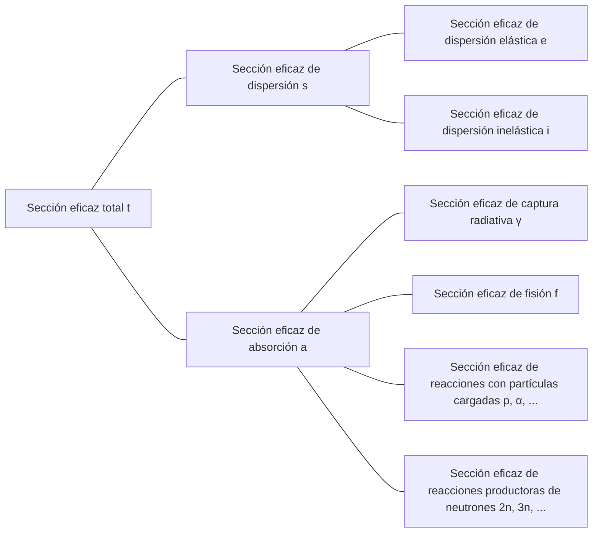

## Sección eficaz (cross-section) o sección eficaz microscópica (microscopic cross-section)
Supongamos que un haz de neutrones monoenergético incide sobre un blanco (muy delgado) de espesor $\tau$ y área $A$, y que el número de neutrones que inciden en el blanco por segundo por unidad de área es $I\ \text{neutrons/cm}^2\cdot \text{s}$. Como el volumen que ocupa el núcleo atómico en el átomo es muy pequeño, y asumiendo que el blanco es muy delgado, la mayoría de los neutrones atravesarán el blanco sin interactuar con los núcleos atómicos. Entonces, el número de neutrones que colisionan con los núcleos atómicos por segundo por unidad de área es proporcional a la intensidad del haz de neutrones $I$, el espesor del blanco $\tau$, y la densidad atómica del blanco $N$.

$$ \Delta I \propto I\tau N $$

Introduciendo la constante de proporcionalidad $\sigma$, podemos expresarlo como:

$$ \Delta I = \sigma I\tau N\ \mathrm{[neutrons/cm^2\cdot s]} \label{eqn:microscopic_cross_section}\tag{1} $$

La proporción de neutrones incidentes que colisionan con los núcleos atómicos se puede calcular como:

$$ p = \frac {\Delta I}{I} = \sigma\tau N = \frac {\sigma}{A} A\tau N = \frac {\sigma}{A} N_t \label{eqn:collision_rate}\tag{2} $$

($N_t$: número total de átomos en el blanco)

De esta ecuación, podemos ver que $\sigma$ tiene unidades de área. Esta constante de proporcionalidad $\sigma$ se denomina *sección eficaz (cross-section)* o *sección eficaz microscópica (microscopic cross-section)*. Físicamente, la sección eficaz representa el área efectiva que tiene un núcleo atómico para interactuar con un neutrón.

## Unidades de la sección eficaz microscópica
Como cm$^2$ es una unidad demasiado grande para expresar la sección eficaz microscópica, generalmente se utiliza la unidad *barn* (b).

$$ 1\ \text{b} = 10^{-24}\ \text{cm}^2 \label{eqn:barn}\tag{3}$$

## Tipos de sección eficaz microscópica
- Sección eficaz total: $\sigma_t$
  - Sección eficaz de dispersión (scattering): $\sigma_s$
    - Sección eficaz de dispersión elástica (elastic scattering): $\sigma_e$
    - Sección eficaz de dispersión inelástica (inelastic scattering): $\sigma_i$
  - Sección eficaz de absorción (absorption): $\sigma_a$
    - Sección eficaz de captura radiativa (radiative capture): $\sigma_\gamma$
    - Sección eficaz de fisión (fission): $\sigma_f$
    - Sección eficaz de reacciones con partículas cargadas (charged-particle reactions): $\sigma_p, \sigma_\alpha, \cdots$
    - Sección eficaz de reacciones productoras de neutrones (neutron-producing reactions): $\sigma_{2n}, \sigma_{3n}, \cdots$

## Interacciones de neutrones
Como los neutrones son eléctricamente neutros, no se ven afectados por la influencia eléctrica de los electrones del átomo o la carga positiva del núcleo. Por lo tanto, los neutrones pueden atravesar la nube electrónica y reaccionar directamente con el núcleo atómico.

### Formación de núcleo compuesto
La mayoría de las reacciones entre neutrones y materiales ocurren en dos etapas:
1. El neutrón y el núcleo atómico se combinan para formar un núcleo compuesto (compound nucleus)
2. El núcleo compuesto se desintegra de varias maneras

$$ \begin{align*}
\mathrm{^A Z} + \mathrm{n} \to \left( \mathrm{^{A+1}Z} \right)^*
&\to \mathrm{^A Z} + \mathrm{n} \text{ (dispersión elástica)} \\
&\to \mathrm{^A Z} + \mathrm{n}^\prime \text{ (dispersión inelástica)} \\
&\to \mathrm{^{A+1}Z} + \gamma \text{ (captura radiativa)} \\
&\qquad \vdots
\end{align*} $$

Los núcleos atómicos tienen varios niveles de energía cuantizados según la disposición de sus nucleones. Cuando la energía del neutrón incidente corresponde a uno de los estados excitados del núcleo objetivo, se forma más fácilmente un núcleo compuesto. Por lo tanto, la sección eficaz se maximiza para neutrones con energías específicas, fenómeno conocido como *resonancia (resonance)*.

### Dispersión elástica (elastic scattering)
- El neutrón colisiona con el núcleo atómico y rebota
- El núcleo atómico mantiene su estado fundamental sin cambios de energía
- Se representa como $(\mathrm{n}, \mathrm{n})$

Al representar la sección eficaz de dispersión elástica como función de la energía del neutrón incidente, se pueden distinguir tres regiones diferentes.

> **Sección eficaz de dispersión elástica y total del carbono-12**  
> - Gráfico proporcionado por: Centro de Datos Nucleares del Instituto de Investigación de Energía Atómica de Corea (Nuclear Data Center at KAERI), Table of Nuclides (<https://atom.kaeri.re.kr/nuchart/>)

> **Sección eficaz de dispersión elástica y total del U-238**  
> - Gráfico proporcionado por: Centro de Datos Nucleares del Instituto de Investigación de Energía Atómica de Corea (Nuclear Data Center at KAERI), Table of Nuclides (<https://atom.kaeri.re.kr/nuchart/>)

#### Región de baja energía (low-energy region)
En esta región, la sección eficaz de dispersión elástica es aproximadamente constante. No se forma un núcleo compuesto, sino que el núcleo atómico ejerce una fuerza sobre el neutrón que pasa cerca, produciendo un fenómeno de dispersión leve. Esto se conoce como dispersión potencial (potential scattering), y si $R$ es el radio atómico, la sección eficaz de dispersión potencial viene dada por:

$$ \sigma_e = 4\pi R^2 \label{eqn:potential_scattering}\tag{4}$$

> **Por qué la sección eficaz de dispersión no es constante en el rango de energía extremadamente baja**  
> La aproximación anterior es válida para el carbono-12 en el rango de energía de aproximadamente 0.02eV a 0.01MeV, pero en el rango de energía extremadamente baja, podemos confirmar a partir de los datos reales anteriores que $\sigma_e \propto 1/E$.
>
> Según el **modelo de Ramsauer (Ramsauer model)**, existe la siguiente relación entre la sección eficaz de dispersión en el rango de baja energía y la energía del neutrón:
>
> $$ \sigma(E) \propto \left(R+\lambda(E)\right)^2. $$
>
> Según la [ecuación de longitud de onda de de Broglie para neutrones](/posts/Mass-and-Energy-Particles-and-Waves/#cuando-se-ignoran-los-efectos-relativistas-pej-neutrón), aquí $\lambda(E) \propto \cfrac{1}{\sqrt{E}}$. Generalmente, como $\lambda(E) \ll R$, podemos ignorar $\lambda(E)$ y aproximar $\sigma(E) \propto R^2$, pero en el rango de energía muy baja, los neutrones se comportan más como ondas que como partículas, y cuando la longitud de onda de de Broglie se vuelve mayor que el radio atómico, $\lambda(E)$ se convierte en el término dominante, resultando en $\sigma(E) \propto \lambda(E)^2 \propto \cfrac{1}{E}$.
{: .prompt-info }

#### Región de resonancia (resonance region)
A partir de esta región, el núcleo atómico absorbe momentáneamente el neutrón para formar un núcleo compuesto, que luego emite un neutrón con la misma energía que el neutrón incidente, produciendo dispersión resonante elástica (elastic resonance scattering). Como la resonancia ocurre para neutrones con energías correspondientes a las diferencias entre los niveles de energía del núcleo objetivo, la sección eficaz de neutrones muestra valores elevados para energías específicas.

La región de resonancia aparece a energías de neutrón más bajas para núclidos más pesados. La región de resonancia del uranio-238 comienza a una energía mucho más baja, alrededor de 6 eV, y continúa hasta aproximadamente 1 keV, en comparación con el carbono-12.

#### Región de alta energía (smooth region)
En la región de alta energía, el espaciado entre los niveles de energía del núcleo atómico se vuelve muy pequeño, haciendo que las resonancias individuales sean indistinguibles. En esta región, $\sigma_e$ varía suave y continuamente con la energía del neutrón.

### Dispersión inelástica (inelastic scattering)
- El neutrón colisiona con el núcleo atómico y rebota
- A diferencia de la dispersión elástica, el núcleo atómico absorbe parte de la energía del neutrón y queda en estado excitado ([reacción endotérmica](/posts/nuclear-reactions-and-binding-energy/#reacción-exotérmica-exothermic-reaction-y-reacción-endotérmica-endothermic-reaction))
- Como los niveles de energía que puede tener un núcleo atómico están cuantizados, esta reacción solo puede ocurrir cuando un neutrón con energía mayor o igual a la diferencia entre dos niveles de energía del núcleo colisiona con él
  - Ocurre más fácilmente en núclidos pesados donde los niveles de energía están más subdivididos, y es menos común en núclidos ligeros
  - Como se puede ver en los gráficos siguientes, mientras que la energía umbral (threshold energy) para la dispersión inelástica del carbono es 4.80 MeV, la del uranio-238 es de 44 keV
- Para energías superiores al umbral, la sección eficaz de dispersión inelástica $\sigma_i$ es aproximadamente similar a la sección eficaz de dispersión elástica $\sigma_e$
- Se representa como $(\mathrm{n}, \mathrm{n}^{\prime})$
- El núcleo excitado posteriormente emite rayos gamma y vuelve al estado fundamental; estos rayos gamma se denominan *rayos gamma inelásticos (inelastic $\gamma$-ray)*

> **Sección eficaz de dispersión elástica e inelástica del C-12**  
> - Gráfico proporcionado por: Centro de Datos Nucleares del Instituto de Investigación de Energía Atómica de Corea (Nuclear Data Center at KAERI), Table of Nuclides (<https://atom.kaeri.re.kr/nuchart/>)

> **Sección eficaz de dispersión elástica e inelástica del U-238**  
> - Gráfico proporcionado por: Centro de Datos Nucleares del Instituto de Investigación de Energía Atómica de Corea (Nuclear Data Center at KAERI), Table of Nuclides (<https://atom.kaeri.re.kr/nuchart/>)

### Captura radiativa (radiative capture)
- El núcleo atómico captura un neutrón y emite uno o más rayos gamma ([reacción exotérmica](/posts/nuclear-reactions-and-binding-energy/#reacción-exotérmica-exothermic-reaction-y-reacción-endotérmica-endothermic-reaction))
- Se representa como $(\mathrm{n}, \gamma)$
- Los rayos gamma emitidos se denominan *rayos gamma de captura (capture $\gamma$-ray)*
- Como el neutrón que colisiona es absorbido por el núcleo atómico, es un tipo de reacción de absorción

Al igual que con la [dispersión elástica](#dispersión-elástica-elastic-scattering), la sección eficaz de captura radiativa $\sigma_\gamma$ también se puede dividir en tres regiones.

> **Sección eficaz de captura radiativa del Au-197**  
> - Gráfico proporcionado por: Centro de Datos Nucleares del Instituto de Investigación de Energía Atómica de Corea (Nuclear Data Center at KAERI), Table of Nuclides (<https://atom.kaeri.re.kr/nuchart/>)

#### Región de baja energía (región $1/v$)
En la región de baja energía, la $\sigma_\gamma$ de la mayoría de los núclidos es proporcional a $1/\sqrt{E}$, es decir, a $1/v$. En el gráfico anterior de la sección eficaz de captura radiativa del oro-197 en escala log-log, se puede observar un segmento de línea recta con pendiente $-1/2$.

Algunos núclidos importantes no muestran exactamente un comportamiento $1/v$ en la región de neutrones de baja energía; estos núclidos se denominan absorbentes no-$1/v$ (non-$1/v$ absorber).

#### Región de resonancia
Más allá de la región $1/v$, se observa una región de resonancia en el mismo rango de energía que para las reacciones de dispersión. Cuando ocurre una resonancia a la energía $E_r$, la $\sigma_\gamma$ cerca de esa resonancia viene dada por la fórmula de Breit-Wigner de un solo nivel:

$$ \sigma_\gamma = \frac{\gamma_r^2 g}{4\pi}\frac{\Gamma_n\Gamma_g}{(E-E_r)^2 + \Gamma^2/4} \label{eqn:breit_wigner}\tag{5}$$

- $\gamma_r$: [longitud de onda de de Broglie](/posts/Mass-and-Energy-Particles-and-Waves/#cuando-se-ignoran-los-efectos-relativistas-pej-neutrón) del neutrón con energía $E_r$
- $g$: *factor estadístico (statistical factor)*, constante
- $\Gamma \ (=\Gamma_n + \Gamma_\gamma)$: *anchura total (total width)*, constante
  - $\Gamma_n$: *anchura neutrónica (neutron width)*, constante
  - $\Gamma_\gamma$: *anchura radiativa (radiation width)*, constante

> $\sigma_\gamma(E_r \pm \Gamma/2) = \cfrac{1}{2}\sigma_\gamma(E_r)$, lo que significa que la anchura de la resonancia $\Gamma$ se define como la distancia entre los dos puntos donde la sección eficaz es la mitad de su valor máximo. Este es el origen del término *anchura (width)*.
{: .prompt-tip }

#### Región de alta energía (por encima de la región de resonancia)
Más allá de la región de resonancia, en el rango de energía más alta (aproximadamente por encima de 1 keV para núclidos pesados, y a energías más altas para núclidos más ligeros), $\sigma_\gamma$ disminuye inicialmente de forma abrupta y luego continúa disminuyendo lentamente con valores muy pequeños.

### Reacciones con partículas cargadas (charged-particle reactions)
- El núcleo atómico captura un neutrón y emite partículas cargadas como partículas alfa ($\alpha$) o protones ($\mathrm{p}$)
- Se representan como $(\mathrm{n}, \alpha)$, $(\mathrm{n}, \mathrm{p})$, etc.
- Pueden ser [reacciones exotérmicas o endotérmicas](/posts/nuclear-reactions-and-binding-energy/#reacción-exotérmica-exothermic-reaction-y-reacción-endotérmica-endothermic-reaction) según el caso, pero generalmente son [reacciones endotérmicas](/posts/nuclear-reactions-and-binding-energy/#reacción-exotérmica-exothermic-reaction-y-reacción-endotérmica-endothermic-reaction)
- No ocurren por debajo de la energía umbral, y incluso por encima de esta, la sección eficaz suele ser pequeña (esta tendencia es más pronunciada para núcleos pesados)

Aunque las reacciones con partículas cargadas generalmente requieren superar una energía umbral y tienen secciones eficaces relativamente pequeñas, hay algunas reacciones importantes que ocurren en núcleos ligeros.

#### Reacciones exotérmicas
##### $^{10}\mathrm{B}(\mathrm{n},\alpha){^7\mathrm{Li}}$

> **Sección eficaz de la reacción $^{10}\mathrm{B}(\mathrm{n},\alpha){^7\mathrm{Li}}$**  
> - Gráfico proporcionado por: Centro de Datos Nucleares del Instituto de Investigación de Energía Atómica de Corea (Nuclear Data Center at KAERI), Table of Nuclides (<https://atom.kaeri.re.kr/nuchart/>)

- Se puede confirmar que $\sigma_\alpha \propto 1/v$ para energías por debajo de $100\ \mathrm{keV}$
- Se observa que $\sigma_\alpha$ es muy grande en la región de neutrones de baja energía, característica que se aprovecha para absorber neutrones de baja energía

> En reactores que utilizan agua como refrigerante y moderador, se mezcla boro con el moderador para absorber el exceso de neutrones cuando es necesario controlar la reacción o realizar una parada de emergencia.
{: .prompt-tip }

##### $^{6}\mathrm{Li}(\mathrm{n},\alpha){^3\mathrm{H}}$

> **Sección eficaz de la reacción $^{6}\mathrm{Li}(\mathrm{n},\alpha){^3\mathrm{H}}$**  
> - Gráfico proporcionado por: Centro de Datos Nucleares del Instituto de Investigación de Energía Atómica de Corea (Nuclear Data Center at KAERI), Table of Nuclides (<https://atom.kaeri.re.kr/nuchart/>)

- De manera similar, se puede confirmar que $\sigma_\alpha \propto 1/v$ para energías por debajo de aproximadamente $100\ \mathrm{keV}$
- Se utiliza para producir tritio ($^3\mathrm{H}$)

> Esta reacción es especialmente importante en los mantos (blankets) de los reactores de fusión. Como [el tritio tiene una vida media corta y casi no existe naturalmente](/posts/Nuclear-Stability-and-Radioactive-Decay/#tritio), debe producirse en el propio reactor de fusión. Por ello, el recipiente de reacción de fusión se rodea con un manto de litio, y cuando los neutrones procedentes de la reacción de fusión son absorbidos por el litio del manto, este se convierte en tritio mediante esta reacción, que luego se recolecta para utilizarlo como combustible de fusión.  
> Además, como esta es una reacción exotérmica, parte de la energía de los neutrones procedentes de la reacción de fusión se convierte en energía térmica a través de esta reacción, y en la generación de energía por fusión, esta energía térmica se convierte en energía eléctrica.
{: .prompt-tip }

#### Reacciones endotérmicas
##### $^{16}\mathrm{O}(\mathrm{n},\mathrm{p}){^{16}\mathrm{N}}$

> **Sección eficaz de la reacción $^{16}\mathrm{O}(\mathrm{n},\mathrm{p}){^{16}\mathrm{N}}$**  
> - Gráfico proporcionado por: Centro de Datos Nucleares del Instituto de Investigación de Energía Atómica de Corea (Nuclear Data Center at KAERI), Table of Nuclides (<https://atom.kaeri.re.kr/nuchart/>)

- Tiene una energía umbral de aproximadamente 9 MeV, significativamente mayor que la energía promedio de los neutrones producidos en la fisión del uranio-235 (2-3 MeV), por lo que la frecuencia de esta reacción es relativamente baja, aproximadamente 1 de cada varios miles de neutrones
- A pesar de esto, es importante porque es la principal causa de activación del agua en reactores que utilizan agua como refrigerante y moderador
  - El $^{16}\mathrm{O}$ de las moléculas de agua se convierte en $^{16}\mathrm{N}$ mediante esta reacción, y el $^{16}\mathrm{N}$ se [desintegra beta](/posts/Nuclear-Stability-and-Radioactive-Decay/#desintegración-beta-beta-decay) con una vida media de aproximadamente 7 segundos, [emitiendo también rayos gamma de 6-7 MeV](/posts/Nuclear-Stability-and-Radioactive-Decay/#transición-isomérica-isomeric-transition)

### Reacciones productoras de neutrones (neutron-producing reactions)
- Neutrones de alta energía colisionan con núcleos atómicos, produciendo 2 o más neutrones nuevos (reacciones endotérmicas)
- Se representan como (n, 2n), (n, 3n), etc.
- La reacción (n, 2n) es especialmente importante en reactores que contienen agua pesada o berilio, ya que los neutrones en $^2\text{H}$ y $^9\text{Be}$ tienen energías de enlace bajas y pueden ser liberados fácilmente incluso por neutrones de baja energía

> **Sección eficaz de las reacciones $\mathrm{D}(\mathrm{n},\mathrm{2n})\mathrm{p}$ y $^{9}\mathrm{Be}(\mathrm{n},\mathrm{2n}){^{8}\mathrm{Be}}$**  
> - Gráfico proporcionado por: Centro de Datos Nucleares del Instituto de Investigación de Energía Atómica de Corea (Nuclear Data Center at KAERI), Table of Nuclides (<https://atom.kaeri.re.kr/nuchart/>)

### Fisión (fission)
- Un neutrón colisiona con ciertos núcleos atómicos, dividiéndolos en dos o más núcleos hijos

> La fisión y la sección eficaz de fisión se tratarán en un artículo separado.
{: .prompt-info }

### Sección eficaz total
#### Región de baja energía

$$ \sigma_t = 4\pi R^2 + \frac{C}{\sqrt{E}} \label{eqn:total_cross_section}\tag{6}$$

- El primer término representa la [sección eficaz de dispersión elástica](#región-de-baja-energía-low-energy-region), y el segundo término representa la sección eficaz de [captura radiativa](#región-de-baja-energía-región-1v) y todas las reacciones exotérmicas posibles a esa energía
- Si el primer término es dominante, será constante en la región de baja energía; si el segundo término es dominante, mostrará un comportamiento $1/v$

#### Región de resonancia
Incluye las resonancias que aparecen en [$\sigma_s$](#región-de-resonancia-resonance-region) y [$\sigma_\gamma$](#región-de-resonancia), y la región de resonancia aparece a las mismas energías que estas dos secciones eficaces. Los núclidos más ligeros muestran resonancias en rangos de energía más altos y amplios, mientras que los núclidos más pesados muestran regiones de resonancia a energías relativamente más bajas y en rangos más estrechos.

#### Región de alta energía
Más allá de la región de resonancia, $\sigma_t$ disminuye suavemente con la energía.

## Sección eficaz del hidrógeno y deuterio
En muchos reactores hay una gran cantidad de núcleos de $^1\mathrm{H}$ y $^2\mathrm{H}$\*, que interactúan con los neutrones de manera algo diferente a otros núcleos:
- No forman [núcleos compuestos](#formación-de-núcleo-compuesto)
- No tienen [región de resonancia](#región-de-resonancia-1)
  - [La sección eficaz de dispersión elástica es constante](#región-de-baja-energía-low-energy-region)
  - [La sección eficaz de captura radiativa muestra un comportamiento $1/v$ en todo el rango de energía de neutrones](#región-de-baja-energía-región-1v)
- En particular, $^1\mathrm{H}$ está compuesto por un solo protón y no tiene estados excitados, por lo que tampoco ocurre [dispersión inelástica](#dispersión-inelástica-inelastic-scattering)

> \* Generalmente existen en forma de agua ligera ($\mathrm{H_2O}$) o agua pesada ($\mathrm{D_2O}$) como refrigerante y moderador en reactores que utilizan agua.
{: .prompt-info }

> **Sección eficaz del H-1**  
> - Gráfico proporcionado por: Centro de Datos Nucleares del Instituto de Investigación de Energía Atómica de Corea (Nuclear Data Center at KAERI), Table of Nuclides (<https://atom.kaeri.re.kr/nuchart/>)

> **Sección eficaz del H-2**  
> - Gráfico proporcionado por: Centro de Datos Nucleares del Instituto de Investigación de Energía Atómica de Corea (Nuclear Data Center at KAERI), Table of Nuclides (<https://atom.kaeri.re.kr/nuchart/>)

## Sección eficaz macroscópica (macroscopic cross-section)
A partir de la ecuación ($\ref{eqn:collision_rate}$), la tasa de colisión por unidad de longitud del haz de neutrones es:

$$ \frac {p}{\tau} = \frac {1}{\tau} \frac {\Delta I}{I} = \sigma N \equiv \Sigma\ \text{[cm}^{-1}\text{]} \label{eqn:macroscopic_cross_section}\tag{7}$$

La *sección eficaz macroscópica (macroscopic cross-section)* se define como el producto de la densidad atómica $N$ y la [sección eficaz](#sección-eficaz-cross-section-o-sección-eficaz-microscópica-microscopic-cross-section). Físicamente, la sección eficaz macroscópica representa la tasa de colisión por unidad de longitud recorrida por un neutrón en un material. Al igual que la sección eficaz microscópica, se puede subdividir de la siguiente manera:

- Sección eficaz macroscópica total $\Sigma_t=N\sigma_t$
  - Sección eficaz macroscópica de dispersión $\Sigma_s=N\sigma_s$
  - Sección eficaz macroscópica de absorción $\Sigma_a=N\sigma_a$

En general, para cualquier reacción, la sección eficaz macroscópica es $\Sigma_{reaction}=N\sigma_{reaction}$.

## Densidad de colisión (collision density), es decir, tasa de reacción (reaction rate)
La *densidad de colisión (collision density)* o *tasa de reacción (reaction rate)* representa el número de colisiones por unidad de tiempo y unidad de volumen en un blanco. A partir de las ecuaciones ($\ref{eqn:microscopic_cross_section}$) y ($\ref{eqn:macroscopic_cross_section}$), se puede definir como:

$$ F = \frac {\Delta I}{\tau} = I\sigma N = I\Sigma \label{eqn:reaction_rate}\tag{8} $$
