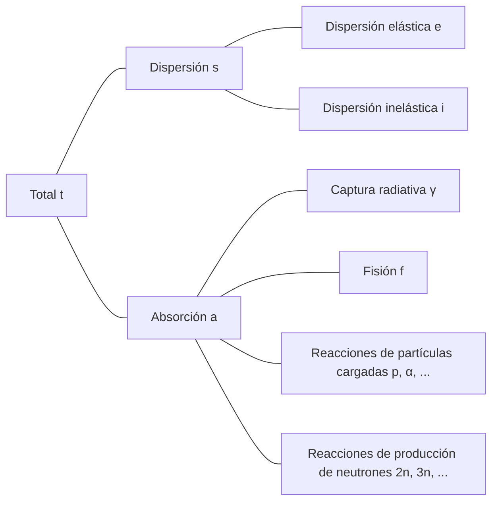

## Interacciones de neutrones
Los neutrones son eléctricamente neutros, por lo que no se ven afectados por las fuerzas eléctricas de los electrones o la carga positiva del núcleo atómico. Por lo tanto, los neutrones pueden atravesar la nube de electrones del átomo y reaccionar directamente con el núcleo.

### Dispersión elástica (elastic scattering)
- El neutrón rebota después de colisionar con el núcleo
- El núcleo mantiene su estado fundamental sin cambios de energía
- Se representa como (n, n)

### Dispersión inelástica (inelastic scattering)
- El neutrón rebota después de colisionar con el núcleo
- A diferencia de la dispersión elástica, el núcleo absorbe parte de la energía del neutrón y pasa a un estado excitado (reacción endotérmica)
- Se representa como (n, n′)
- El núcleo excitado vuelve a su estado fundamental emitiendo rayos gamma, que se denominan *rayos gamma inelásticos (inelastic $\gamma$-ray)*

### Captura radiativa (radiative capture)
- El núcleo captura el neutrón y emite uno o más rayos gamma (reacción exotérmica)
- Se representa como (n, $\gamma$)
- Los rayos gamma emitidos se denominan *rayos gamma de captura (capture $\gamma$-ray)*

### Reacciones de partículas cargadas
- El núcleo captura el neutrón y emite partículas cargadas como partículas alfa ($\alpha$) o protones (p)
- Se representa como (n, $\alpha$), (n, p), etc.
- Puede ser una reacción exotérmica o endotérmica dependiendo del caso

### Reacciones de producción de neutrones
- Un neutrón de alta energía colisiona con el núcleo, produciendo dos o más neutrones nuevos (reacción endotérmica)
- Se representa como (n, 2n), (n, 3n), etc.
- La reacción (n, 2n) es particularmente importante en reactores que contienen agua pesada o berilio, ya que los neutrones en $^2\text{H}$ y $^9\text{Be}$ tienen baja energía de enlace y pueden ser fácilmente expulsados incluso por neutrones de baja energía

### Fisión (fission)
- Un neutrón colisiona con ciertos núcleos, dividiéndolos en dos o más núcleos hijos

## Sección eficaz (cross-section) o sección eficaz microscópica (microscopic cross-section)
Consideremos un haz de neutrones monoenergéticos que incide sobre un blanco de espesor $\tau$ (muy delgado) y área $A$, donde $I\ \text{neutrones/cm}^2\cdot \text{s}$ es el número de neutrones que inciden por unidad de área y por segundo. Dado que el volumen que ocupa el núcleo en el átomo es muy pequeño, y asumiendo que el blanco es muy delgado, la mayoría de los neutrones atravesarán el blanco sin interactuar con los núcleos. Entonces, el número de neutrones que colisionan con los núcleos por unidad de área y por segundo es proporcional a la intensidad del haz de neutrones $I$, el espesor del blanco $\tau$, y la densidad atómica del blanco $N$.

$$ \Delta I \propto I\tau N $$

Introduciendo una constante de proporcionalidad $\sigma$, podemos expresarlo como:

$$ \Delta I = \sigma I\tau N\ \text{[neutrones/cm}^2\cdot\text{s]} \tag{1} $$

La fracción de neutrones incidentes que colisionan con los núcleos se puede calcular como:

$$ p = \frac {\Delta I}{I} = \sigma\tau N = \frac {\sigma}{A} A\tau N = \frac {\sigma}{A} N_t \tag{2} $$

($N_t$: número total de átomos en el blanco)

De esta ecuación, podemos ver que $\sigma$ tiene unidades de área. Esta constante de proporcionalidad $\sigma$ se denomina *sección eficaz (cross-section)* o *sección eficaz microscópica (microscopic cross-section)*. Físicamente, la sección eficaz representa el área efectiva que el núcleo presenta para interactuar con los neutrones.

## Unidades de la sección eficaz microscópica
Como cm$^2$ es una unidad demasiado grande para expresar la sección eficaz microscópica, generalmente se utiliza una unidad llamada *barn* (b).

$$ 1\ \text{b} = 10^{-24}\ \text{cm}^2 $$

## Tipos de sección eficaz microscópica
- Total: $\sigma_t$
  - Dispersión: $\sigma_s$
    - Dispersión elástica: $\sigma_e$
    - Dispersión inelástica: $\sigma_i$
  - Absorción: $\sigma_a$
    - Captura radiativa: $\sigma_\gamma$
    - Fisión: $\sigma_f$
    - Reacciones de partículas cargadas: $\sigma_p, \sigma_\alpha, \cdots$
    - Reacciones de producción de neutrones: $\sigma_{2n}, \sigma_{3n}, \cdots$

## Sección eficaz macroscópica (macroscopic cross-section)
De la ecuación (2), podemos obtener la tasa de colisión por unidad de distancia del haz de neutrones:

$$ \frac {p}{\tau} = \frac {1}{\tau} \frac {\Delta I}{I} = \sigma N \equiv \Sigma\ \text{[cm}^{-1}\text{]} \tag{3}$$

La *sección eficaz macroscópica (macroscopic cross-section)* se define como el producto de la densidad atómica $N$ y la sección eficaz. Físicamente, la sección eficaz macroscópica representa la tasa de colisión por unidad de distancia recorrida por los neutrones en un blanco. Al igual que la sección eficaz microscópica, se puede subdividir de la siguiente manera:

- Sección eficaz macroscópica total $\Sigma_t=N\sigma_t$
  - Sección eficaz macroscópica de dispersión $\Sigma_s=N\sigma_s$
  - Sección eficaz macroscópica de absorción $\Sigma_a=N\sigma_a$

En general, para cualquier reacción, la sección eficaz macroscópica es $\Sigma_{reacción}=N\sigma_{reacción}$.

## Densidad de colisión (collision density), es decir, tasa de reacción (reaction rate)
La *densidad de colisión (collision density)* o *tasa de reacción (reaction rate)* representa el número de colisiones por unidad de tiempo y volumen en el blanco. A partir de las ecuaciones (1) y (3), se puede definir como:

$$ F = \frac {\Delta I}{\tau} = I\sigma N = I\Sigma \tag{4} $$