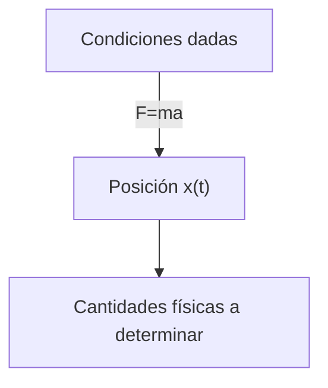
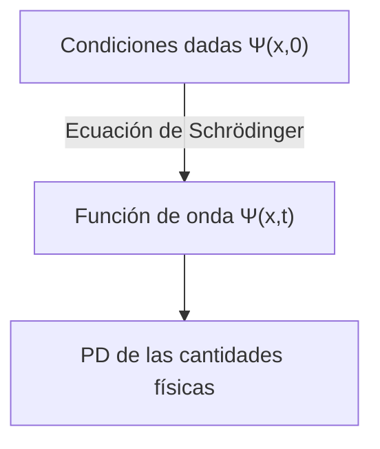

## TL;DR
> - Ecuación de Schrödinger (dependiente del tiempo): 
>
> $$ i\hbar\frac{\partial \Psi}{\partial t} = - \frac{\hbar^2}{2m}\frac{\partial^2 \Psi}{\partial x^2} + V\Psi $$
>
> - Interpretación estadística de la función de onda $\Psi(x,t)$ (interpretación de Born): El cuadrado del valor absoluto de la función de onda $\|\Psi(x,t)\|^2$ es la **función de densidad de probabilidad** de encontrar la partícula en la posición $x$ en el tiempo $t$.
> - Normalización de la función de onda:
>   - $\int_{-\infty}^{\infty} \|\Psi(x,t)\|^2 dx = 1$
>   - Si $\Psi(x,t)$ es una solución de la ecuación de Schrödinger, entonces $A\Psi(x,t)$ también es una solución para cualquier constante compleja $A$, y determinar la constante $A$ para satisfacer la ecuación anterior se llama normalización
>   - Las **soluciones no normalizables** no pueden representar partículas y no son funciones de onda válidas; solo las soluciones **de cuadrado integrable** son estados físicamente posibles
>   - Una función de onda normalizada en un momento dado permanece normalizada a medida que pasa el tiempo, incluso cuando $\Psi$ cambia
> - Corriente de probabilidad:
>   - $J(x,t) \equiv \cfrac{i\hbar}{2m}\left(\Psi\cfrac{\partial \Psi^\*}{\partial x}-\Psi^\*\cfrac{\partial \Psi}{\partial x}\right)$
>   - El flujo de probabilidad (probabilidad por unidad de tiempo) que pasa por el punto $x$
>   - Si $P_{ab}(t)$ es la probabilidad de encontrar la partícula en la región $a<x<b$ en el tiempo $t$, entonces $\cfrac{dP_{ab}}{dt} = J(a,t) - J(b,t)$
{: .prompt-info }

## Prerequisites
- Distribuciones de probabilidad continua y densidad de probabilidad

## La ecuación de Schrödinger (Schrödinger equation)
Consideremos una partícula de masa $m$ que se mueve a lo largo del eje $x$ bajo una fuerza dada $F(x,t)$.

En la mecánica clásica, el objetivo principal es aplicar la ecuación de movimiento de Newton $F=ma$ para determinar la posición de la partícula $x(t)$ en cualquier momento. Este proceso puede representarse aproximadamente con el siguiente diagrama:

En la mecánica cuántica, el mismo problema se aborda de manera muy diferente. El enfoque cuántico consiste en resolver la siguiente **ecuación de Schrödinger** para encontrar la **función de onda** $\Psi(x,t)$ de la partícula:

$$ \begin{gather*}
i\hbar\frac{\partial \Psi}{\partial t} = - \frac{\hbar^2}{2m}\frac{\partial^2 \Psi}{\partial x^2} + V\Psi. \label{eqn:schrodinger_eqn}\tag{1}\\
\text{(} i=\sqrt{-1}\text{, } \hbar=\frac{h}{2\pi}=1.054573\times10^{-34}\text{, } h\text{: constante de Planck, } V(x)\text{: energía potencial)}
\end{gather*} $$

> *Fuente de la imagen*
> - Autor: Usuario de Wikimedia Xcodexif
> - Licencia: [CC BY-SA 4.0](https://creativecommons.org/licenses/by-sa/4.0/)

## Interpretación estadística de la función de onda $\Psi(x,t)$ (Interpretación de Born)
Mientras que en la mecánica clásica una partícula se localiza en un punto, en la mecánica cuántica la función de onda que representa el estado de la partícula es una función de $x$ para un $t$ dado, es decir, está extendida en el espacio. ¿Cómo debemos interpretar su significado físico?

Según la **interpretación estadística** de Born, el cuadrado del valor absoluto de la función de onda $\|\Psi(x,t)\|^2$ es la función de densidad de probabilidad de encontrar la partícula en la posición $x$ en el tiempo $t$. Aunque la función de onda $\Psi$ misma es un número complejo, $\|\Psi\|^2=\Psi^\*\Psi$ (donde $\Psi^\*$ es el complejo conjugado de $\Psi$) es un número real no negativo, lo que permite esta interpretación. Es decir, podemos expresarlo como:

$$ \int_a^b |\Psi(x,t)|^2 dx = \text{probabilidad de encontrar la partícula entre }a\text{ y }b\text{ en el tiempo }t. \tag{2}$$

Esta interpretación estadística implica que la mecánica cuántica incorpora una cierta **indeterminación**. Incluso conociendo todo sobre la partícula (su función de onda), solo podemos conocer la distribución de probabilidad de los posibles resultados, no determinar un valor específico.

Esto era difícil de aceptar intuitivamente, por lo que naturalmente surgió la cuestión de si esta indeterminación se debía a algún defecto de la mecánica cuántica o si era una característica esencial de la naturaleza.

## Perspectivas sobre la indeterminación cuántica (quantum indeterminacy)
Supongamos que medimos la posición de una partícula y descubrimos que está en el punto $C$. Entonces, ¿dónde estaba la partícula justo antes de la medición?

### Postura realista (realist)

> "Dios no juega a los dados." ("God does not play dice.")  
> *por Albert Einstein*

La partícula estaba en $C$ desde el principio. Esta es también la perspectiva de Einstein y Schrödinger. Sin embargo, desde este punto de vista, la mecánica cuántica es una teoría incompleta porque, aunque la partícula estaba exactamente en $C$, las limitaciones de la teoría solo nos permiten conocer la distribución de probabilidad de la posición de la partícula hasta que se realiza la medición. Es decir, según esta perspectiva, la indeterminación no es una característica esencial de la naturaleza sino una limitación de la mecánica cuántica, y debe existir alguna variable oculta adicional a $\Psi$ que necesitamos conocer para describir completamente la partícula.

> Schrödinger fue discípulo de Einstein y trabajó como su asistente durante un tiempo, y posteriormente mantuvo contacto con Einstein. Es probable que su postura realista y determinista fuera influenciada por Einstein.
{: .prompt-info }

### Postura ortodoxa (orthodox)

> "Deja de decirle a Dios qué hacer con sus dados." ("Stop telling God what to do with his dice.")  
> *por Niels Bohr, en respuesta a la cita anterior de Einstein*
>
> "Las observaciones no solo perturban lo que se va a medir, sino que lo producen" ("Observations not only disturb what is to be measured, they produce it")  
> ...  
> "Nosotros obligamos a asumir una posición definida." ("We compel to assume a definite position.")  
> *por Pascual Jordan*

Hasta justo antes de la medición, la partícula solo existe en forma de distribución de probabilidad, no está en ningún lugar específico, y solo cuando se realiza el acto de medición aparece la partícula en una posición determinada. Esta interpretación se conoce como la **interpretación de Copenhague**, propuesta por Bohr y Heisenberg en la Universidad de Copenhague.

> Lo interesante es que, de manera similar a la relación entre Einstein y Schrödinger, Heisenberg también fue discípulo de Bohr.
{: .prompt-info }

### Postura agnóstica (agnostic)

> "Como la antigua pregunta de cuántos ángeles pueden sentarse en la punta de una aguja, no hay necesidad de romperse la cabeza sobre si existe algo de lo que no se puede saber nada." ("One should no more rack one's brain about the problem of whether something one cannot know anything about exists all the same, than about the ancient question of how many angels are able to sit on the point of a needle.")  
> *por Wolfgang Pauli*

Se niega a dar una respuesta. Cualquier afirmación sobre el estado de la partícula antes de la medición, si la única forma de verificar esa afirmación es mediante la medición, ya no sería "antes de la medición". ¿Qué sentido tiene? Es simplemente metafísica discutir sobre algo que es fundamentalmente imposible de probar o conocer.

### Consenso actual
En el año 11964 de la [era humana](https://en.wikipedia.org/wiki/Holocene_calendar), John Bell demostró que hay diferencias observables dependiendo de si la partícula existe en una posición exacta antes o después de la medición, lo que excluyó la postura agnóstica. Posteriormente, los experimentos favorecieron la interpretación de Copenhague, que se convirtió en la corriente principal. Por lo tanto, a menos que se indique lo contrario, generalmente se asume la interpretación de Copenhague cuando se trata de mecánica cuántica.

> Todavía existen otras interpretaciones que podrían ser correctas, como las teorías de variables ocultas no locales (nonlocal hidden variable theories) o la interpretación de los muchos mundos (many worlds interpretation).
{: .prompt-info }

## Medición y colapso de la función de onda
La partícula no tiene una posición exacta hasta que se realiza la medición, momento en el cual adquiere una posición específica $C$ (aunque, como veremos en otro artículo, debido al principio de incertidumbre de Heisenberg, incluso esta posición no es perfectamente exacta sino que tiene un cierto margen de error). Sin embargo, si inmediatamente después de esta primera medición realizamos mediciones adicionales, obtendremos siempre el mismo resultado, no valores diferentes en cada medición. Esto se explica de la siguiente manera:

En el momento de realizar la primera medición, la función de onda del objeto medido cambia drásticamente, concentrándose en un gráfico estrecho y puntiagudo de $\|\Psi(x,t)\|^2$ alrededor del punto $C$. Esto se conoce como el **colapso (collapse)** de la función de onda al punto $C$ debido a la medición.

Es decir, los procesos físicos pueden dividirse en dos tipos distintos:
- Procesos ordinarios (ordinary) donde la función de onda cambia lentamente según la ecuación de Schrödinger
- Procesos de medición (measurement) donde $\Psi$ colapsa repentina y discontinuamente

> Una función de onda que ha colapsado debido a una medición vuelve a extenderse espacialmente con el tiempo según la ecuación de Schrödinger. Por lo tanto, para reproducir el mismo resultado de medición, la segunda medición debe realizarse inmediatamente.
{: .prompt-tip }

## Normalización de la función de onda (Normalization)
Como el cuadrado del valor absoluto de la función de onda $\|\Psi(x,t)\|^2$ es la densidad de probabilidad de encontrar la partícula en la posición $x$ en el tiempo $t$, la integral de $\|\Psi\|^2$ sobre todos los valores de $x$ debe ser igual a 1.

$$ \int_{-\infty}^{\infty} |\Psi(x,t)|^2 dx = 1. \label{eqn:wavefunction_norm}\tag{3} $$

En la ecuación ($\ref{eqn:schrodinger_eqn}$), si $\Psi(x,t)$ es una solución, entonces $A\Psi(x,t)$ también es una solución para cualquier constante compleja $A$. Por lo tanto, debemos determinar este $A$ para satisfacer la ecuación ($\ref{eqn:wavefunction_norm}$), y este proceso se llama normalización de la función de onda. Algunas soluciones de la ecuación de Schrödinger divergen al infinito cuando se integran, y en estos casos no existe una constante $A$ que satisfaga la ecuación ($\ref{eqn:wavefunction_norm}$). Lo mismo ocurre con la solución trivial $\Psi=0$. Estas **soluciones no normalizables** no pueden representar partículas y no son funciones de onda válidas. Los estados físicamente posibles corresponden a soluciones **de cuadrado integrable** de la ecuación de Schrödinger.

Además, una propiedad importante de la ecuación de Schrödinger es que <u>una función de onda normalizada en un momento dado permanece normalizada ($\int_{-\infty}^{\infty} |\Psi(x,t)|^2 dx = 1$) a medida que pasa el tiempo, incluso cuando $\Psi$ cambia</u>. Si tuviéramos que normalizar la función de onda con diferentes valores de $A$ en cada momento, $A$ sería una función del tiempo $t$ en lugar de una constante, y ya no podríamos encontrar soluciones a la ecuación de Schrödinger. Sin embargo, gracias a esta propiedad, el valor de $A$ normalizado en la condición inicial ($t=0$) se conserva independientemente del tiempo $t$.

### Demostración

$$ \frac{d}{dt}\int_{-\infty}^{\infty} |\Psi(x,t)|^2 dx = \int_{-\infty}^{\infty} \frac{\partial}{\partial t}|\Psi(x,t)|^2 dx. \label{eqn:norm_proof_1}\tag{4} $$

> El resultado de integrar $\|\Psi\|^2$ con respecto a $x$ es una función solo de $t$, por lo que usamos la derivada total ($d/dt$) en el lado izquierdo, pero $\|\Psi\|^2$ mismo es una función de dos variables $x$ y $t$, por lo que usamos la derivada parcial ($\partial/\partial t$) en el lado derecho.
{: .prompt-tip }

La ecuación anterior puede reescribirse según la regla de derivación del producto:

$$ \frac{\partial}{\partial t}|\Psi|^2 = \frac{\partial}{\partial t}(\Psi^*\Psi) = \Psi^*\frac{\partial \Psi}{\partial t} + \frac{\partial \Psi^*}{\partial t}\Psi. \label{eqn:norm_proof_2}\tag{5}$$

Multiplicando ambos lados de la ecuación de Schrödinger ($\ref{eqn:schrodinger_eqn}$) por $-\cfrac{i}{\hbar}$, obtenemos:

$$ \frac{\partial \Psi}{\partial t} = \frac{i\hbar}{2m}\frac{\partial^2 \Psi}{\partial x^2}-\frac{i}{\hbar}V\Psi \label{eqn:norm_proof_3}\tag{6}$$

y tomando el complejo conjugado de $\cfrac{\partial \Psi}{\partial t}$ en la ecuación anterior:

$$ \frac{\partial \Psi^*}{\partial t} = -\frac{i\hbar}{2m}\frac{\partial^2 \Psi^*}{\partial x^2}+\frac{i}{\hbar}V\Psi^* \label{eqn:norm_proof_4}\tag{7}$$

Ahora, sustituyendo ($\ref{eqn:norm_proof_3}$) y ($\ref{eqn:norm_proof_4}$) en ($\ref{eqn:norm_proof_2}$):

$$\begin{align*}
\frac{\partial}{\partial t}|\Psi|^2 &= \frac{i\hbar}{2m}\left(\Psi^*\frac{\partial^2\Psi}{\partial x^2}-\frac{\partial^2\Psi^*}{\partial x^2}\Psi\right) \\
&= \frac{\partial}{\partial x}\left[\frac{i\hbar}{2m}\left(\Psi^*\frac{\partial\Psi}{\partial x}-\frac{\partial\Psi^*}{\partial x}\Psi \right) \right] 
\end{align*} \label{eqn:norm_proof_5}\tag{8}$$

Sustituyendo esto en el lado derecho de la ecuación ($\ref{eqn:norm_proof_1}$):

$$ \frac{d}{dt}\int_{-\infty}^{\infty} |\Psi(x,t)|^2 dx = \frac{i\hbar}{2m}\left(\Psi^*\frac{\partial\Psi}{\partial x}-\frac{\partial\Psi^*}{\partial x}\Psi \right)\Bigg|_{-\infty}^{\infty}. \label{eqn:norm_proof_6}\tag{9} $$

Para que la función de onda esté normalizada y sea físicamente válida, $\Psi(x,t)$ debe converger a $0$ cuando $x$ tiende a $\pm\infty$. Por lo tanto:

$$ \frac{d}{dt}\int_{-\infty}^{\infty} |\Psi(x,t)|^2 dx = 0 \label{eqn:norm_proof_fin}\tag{10} $$

lo que significa que $\int_{-\infty}^{\infty} \|\Psi(x,t)\|^2 dx$ es una constante independiente del tiempo.

$$ \therefore \text{Si }\Psi\text{ está normalizada en un momento }t\text{, entonces está normalizada para todos los demás momentos }t. \blacksquare $$

## Corriente de probabilidad (probability current)
Ahora, consideremos la probabilidad $P_{ab}(t)$ de encontrar la partícula en la región $a<x<b$ en el tiempo $t$. Entonces:

$$ P_{ab}(t) = \int_a^b |\Psi(x,t)|^2 dx \tag{11}$$

y,

$$ \begin{align*}
\frac{dP_{ab}}{dt} &= \frac{d}{dt}\int_a^b |\Psi(x,t)|^2 dx \\
&= \int_a^b \frac{\partial}{\partial t}|\Psi(x,t)|^2 dx \quad \text{(}\because\text{ver ecuación }\ref{eqn:norm_proof_1}\text{)}\\
&= \int_a^b \left(\frac{\partial \Psi^*}{\partial t}\Psi + \Psi^*\frac{\partial \Psi}{\partial t} \right)dx \quad \text{(}\because\text{ver ecuación }\ref{eqn:norm_proof_2}\text{)} \\
&= \frac{i\hbar}{2m}\int_a^b \left(\Psi^*\frac{\partial^2\Psi}{\partial x^2}-\frac{\partial^2\Psi^*}{\partial x^2}\Psi\right)dx \\
&= \frac{i\hbar}{2m}\int_a^b\frac{\partial}{\partial x}\left(\Psi^*\frac{\partial\Psi}{\partial x}-\frac{\partial\Psi^*}{\partial x}\Psi \right)dx \quad \text{(}\because\text{ver ecuaciones }\ref{eqn:norm_proof_3},\ref{eqn:norm_proof_4},\ref{eqn:norm_proof_5}\text{)}\\
&= \frac{i\hbar}{2m}\left(\Psi^*\frac{\partial \Psi}{\partial x}-\frac{\partial \Psi^*}{\partial x}\Psi \right)\Bigg|^b_a \\
&= \frac{i\hbar}{2m}\left(\Psi\frac{\partial \Psi^*}{\partial x}-\Psi^*\frac{\partial \Psi}{\partial x} \right)\Bigg|^a_b
\end{align*} $$

Si definimos:

$$ J(x,t) \equiv \frac{i\hbar}{2m}\left(\Psi\frac{\partial \Psi^*}{\partial x}-\Psi^*\frac{\partial \Psi}{\partial x}\right) \label{eqn:probability_current}\tag{12}$$

entonces:

$$ \frac{dP_{ab}}{dt} = J(a,t) - J(b,t) \label{eqn:probability_over_time}\tag{13}$$

$J(x,t)$ definido en la ecuación ($\ref{eqn:probability_current}$) se llama **corriente de probabilidad** y representa el flujo de probabilidad (es decir, probabilidad por unidad de tiempo) que pasa por el punto $x$. En la ecuación ($\ref{eqn:probability_over_time}$), si la corriente de probabilidad que entra por un extremo $J(a,t)$ es mayor que la que sale por el otro extremo $J(b,t)$ en un momento dado $t$, entonces $P_{ab}$ aumenta, y viceversa.

> *Piensa en esto como el caudal en mecánica de fluidos, donde la masa o volumen del fluido se ha reemplazado por probabilidad.
{: .prompt-info }
