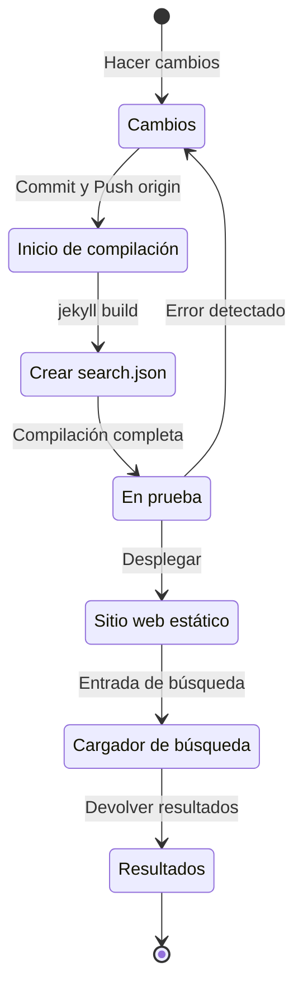

## Resumen
Hace aproximadamente 4 meses, a principios de julio de 2024, implementé soporte multilingüe en este blog, que está alojado en GitHub Pages basado en Jekyll, utilizando el plugin [Polyglot](https://github.com/untra/polyglot).
Esta serie comparte los errores encontrados durante el proceso de aplicar el plugin Polyglot al tema Chirpy, cómo se resolvieron, y cómo escribir encabezados HTML y sitemap.xml considerando el SEO.
La serie consta de 2 posts, y este es el segundo post de la serie.
- Parte 1: [Aplicación del plugin Polyglot e implementación de etiquetas alt hreflang, sitemap y botón de selección de idioma](/posts/how-to-support-multi-language-on-jekyll-blog-with-polyglot-1)
- Parte 2: Solución de problemas de fallo de compilación del tema Chirpy y errores en la función de búsqueda (este post)

## Requisitos
- [x] Debe ser posible proporcionar el resultado de la compilación (páginas web) separado por rutas de idioma (ej. `/posts/ko/`{: .filepath}, `/posts/ja/`{: .filepath}).
- [x] Para minimizar el tiempo y esfuerzo adicional requerido para el soporte multilingüe, debe ser posible reconocer automáticamente el idioma según la ruta local donde se encuentra el archivo markdown original (ej. `/_posts/ko/`{: .filepath}, `/_posts/ja/`{: .filepath}) durante la compilación, sin tener que especificar manualmente las etiquetas 'lang' y 'permalink' en el YAML front matter de cada archivo.
- [x] El encabezado de cada página del sitio debe incluir las etiquetas meta Content-Language y hreflang alternativas apropiadas para cumplir con las pautas de SEO para la búsqueda multilingüe de Google.
- [x] Debe ser posible proporcionar enlaces a todas las páginas que soportan cada idioma en el sitio sin omisiones en `sitemap.xml`{: .filepath}, y `sitemap.xml`{: .filepath} en sí debe existir solo uno en la ruta raíz sin duplicados.
- [x] Todas las funciones proporcionadas por el [tema Chirpy](https://github.com/cotes2020/jekyll-theme-chirpy) deben funcionar normalmente en las páginas de cada idioma, y si no es así, deben modificarse para que funcionen correctamente.
  - [x] Las funciones 'Recently Updated' y 'Trending Tags' funcionan normalmente
  - [x] No se producen errores durante el proceso de compilación utilizando GitHub Actions
  - [x] La función de búsqueda de posts en la esquina superior derecha del blog funciona normalmente

## Antes de empezar
Este post es una continuación de la [Parte 1](/posts/how-to-support-multi-language-on-jekyll-blog-with-polyglot-1), así que si aún no lo has leído, se recomienda leer el post anterior primero.

## Solución de problemas ('relative_url_regex': target of repeat operator is not specified)
Después de completar los pasos anteriores, al ejecutar el comando `bundle exec jekyll serve` para probar la compilación, se produjo un error que decía `'relative_url_regex': target of repeat operator is not specified` y la compilación falló.

```shell
...(omitido)
                    ------------------------------------------------
      Jekyll 4.3.4   Please append `--trace` to the `serve` command 
                     for any additional information or backtrace. 
                    ------------------------------------------------
/Users/yunseo/.gem/ruby/3.2.2/gems/jekyll-polyglot-1.8.1/lib/jekyll/polyglot/
patches/jekyll/site.rb:234:in `relative_url_regex': target of repeat operator 
is not specified: /href="?\/((?:(?!*.gem)(?!*.gemspec)(?!tools)(?!README.md)(
?!LICENSE)(?!*.config.js)(?!rollup.config.js)(?!package*.json)(?!.sass-cache)
(?!.jekyll-cache)(?!gemfiles)(?!Gemfile)(?!Gemfile.lock)(?!node_modules)(?!ve
ndor\/bundle\/)(?!vendor\/cache\/)(?!vendor\/gems\/)(?!vendor\/ruby\/)(?!en\/
)(?!ko\/)(?!es\/)(?!pt-BR\/)(?!ja\/)(?!fr\/)(?!de\/)[^,'"\s\/?.]+\.?)*(?:\/[^
\]\[)("'\s]*)?)"/ (RegexpError)

...(omitido)
```

Después de buscar si se había reportado un problema similar, encontré que [exactamente el mismo problema](https://github.com/untra/polyglot/issues/204) ya estaba registrado en el repositorio de Polyglot y también existía una solución.

En el archivo [`_config.yml`{: .filepath}](https://github.com/cotes2020/jekyll-theme-chirpy/blob/master/_config.yml) del [tema Chirpy](https://github.com/cotes2020/jekyll-theme-chirpy) que se está aplicando a este blog, existe la siguiente declaración:

```yml
exclude:
  - "*.gem"
  - "*.gemspec"
  - docs
  - tools
  - README.md
  - LICENSE
  - "*.config.js"
  - package*.json
```
{: file='_config.yml'}

La causa del problema está en que las expresiones regulares en las siguientes dos funciones incluidas en el archivo [`site.rb`{: .filepath}](https://github.com/untra/polyglot/blob/master/lib/jekyll/polyglot/patches/jekyll/site.rb) de Polyglot no pueden procesar correctamente los patrones de globbing que incluyen comodines como `"*.gem"`, `"*.gemspec"`, `"*.config.js"` mencionados arriba.


```ruby
    # a regex that matches relative urls in a html document
    # matches href="baseurl/foo/bar-baz" href="/foo/bar-baz" and others like it
    # avoids matching excluded files.  prepare makes sure
    # that all @exclude dirs have a trailing slash.
    def relative_url_regex(disabled = false)
      regex = ''
      unless disabled
        @exclude.each do |x|
          regex += "(?!#{x})"
        end
        @languages.each do |x|
          regex += "(?!#{x}\/)"
        end
      end
      start = disabled ? 'ferh' : 'href'
      %r{#{start}="?#{@baseurl}/((?:#{regex}[^,'"\s/?.]+\.?)*(?:/[^\]\[)("'\s]*)?)"}
    end

    # a regex that matches absolute urls in a html document
    # matches href="http://baseurl/foo/bar-baz" and others like it
    # avoids matching excluded files.  prepare makes sure
    # that all @exclude dirs have a trailing slash.
    def absolute_url_regex(url, disabled = false)
      regex = ''
      unless disabled
        @exclude.each do |x|
          regex += "(?!#{x})"
        end
        @languages.each do |x|
          regex += "(?!#{x}\/)"
        end
      end
      start = disabled ? 'ferh' : 'href'
      %r{(?<!hreflang="#{@default_lang}" )#{start}="?#{url}#{@baseurl}/((?:#{regex}[^,'"\s/?.]+\.?)*(?:/[^\]\[)("'\s]*)?)"}
    end
```
{: file='(polyglot root path)/lib/jekyll/polyglot/patches/jekyll/site.rb'}


Hay dos formas de resolver este problema.

### 1. Hacer un fork de Polyglot, modificar la parte problemática y usarlo
En el momento de escribir este post (noviembre de 2024), la [documentación oficial de Jekyll](https://jekyllrb.com/docs/configuration/options/#global-configuration) indica que la configuración `exclude` admite el uso de patrones de globbing de nombres de archivo.

>"This configuration option supports Ruby's File.fnmatch filename globbing patterns to match multiple entries to exclude."

Es decir, la causa del problema no está en el tema Chirpy sino en las dos funciones `relative_url_regex()` y `absolute_url_regex()` de Polyglot, por lo que modificarlas para que no causen problemas es la solución fundamental.

Como este error aún no se ha resuelto en Polyglot, se puede hacer un fork del repositorio de Polyglot y modificar la parte problemática como se muestra a continuación, refiriéndose a [este post de blog](https://hionpu.com/posts/github_blog_4#4-polyglot-%EC%9D%98%EC%A1%B4%EC%84%B1-%EB%AC%B8%EC%A0%9C) y [la respuesta dada en el problema de GitHub mencionado anteriormente](https://github.com/untra/polyglot/issues/204#issuecomment-2143270322), y luego usarlo en lugar del Polyglot original.


```ruby
    def relative_url_regex(disabled = false)
      regex = ''
      unless disabled
        @exclude.each do |x|
          escaped_x = Regexp.escape(x)
          regex += "(?!#{escaped_x})"
        end
        @languages.each do |x|
          escaped_x = Regexp.escape(x)
          regex += "(?!#{escaped_x}\/)"
        end
      end
      start = disabled ? 'ferh' : 'href'
      %r{#{start}="?#{@baseurl}/((?:#{regex}[^,'"\s/?.]+\.?)*(?:/[^\]\[)("'\s]*)?)"}
    end

    def absolute_url_regex(url, disabled = false)
      regex = ''
      unless disabled
        @exclude.each do |x|
          escaped_x = Regexp.escape(x)
          regex += "(?!#{escaped_x})"
        end
        @languages.each do |x|
          escaped_x = Regexp.escape(x)
          regex += "(?!#{escaped_x}\/)"
        end
      end
      start = disabled ? 'ferh' : 'href'
      %r{(?<!hreflang="#{@default_lang}" )#{start}="?#{url}#{@baseurl}/((?:#{regex}[^,'"\s/?.]+\.?)*(?:/[^\]\[)("'\s]*)?)"}
    end
```
{: file='(polyglot root path)/lib/jekyll/polyglot/patches/jekyll/site.rb'}


### 2. Reemplazar los patrones de globbing en el archivo de configuración '_config.yml' del tema Chirpy por nombres de archivo exactos
En realidad, el método ideal y correcto sería que el parche anterior se incorporara al flujo principal de Polyglot. Sin embargo, hasta entonces, se debe usar la versión bifurcada en su lugar, pero en este caso, puede ser engorroso seguir y reflejar las actualizaciones cada vez que la versión upstream de Polyglot se actualice, así que yo usé un método diferente.

Si se revisan los archivos ubicados en la ruta raíz del proyecto en el [repositorio del tema Chirpy](https://github.com/cotes2020/jekyll-theme-chirpy) que corresponden a los patrones `"*.gem"`, `"*.gemspec"`, `"*.config.js"`, de todos modos solo hay 3:
- `jekyll-theme-chirpy.gemspec`{: .filepath}
- `purgecss.config.js`{: .filepath}
- `rollup.config.js`{: .filepath}

Por lo tanto, si se eliminan los patrones de globbing en la declaración `exclude` del archivo `_config.yml`{: .filepath} y se reescriben como se muestra a continuación, Polyglot podrá procesarlos sin problemas.

```yml
exclude: # Modificado refiriéndose al problema https://github.com/untra/polyglot/issues/204.
  # - "*.gem"
  - jekyll-theme-chirpy.gemspec # - "*.gemspec"
  - tools
  - README.md
  - LICENSE
  - purgecss.config.js # - "*.config.js"
  - rollup.config.js
  - package*.json
```
{: file='_config.yml'}

## Modificación de la función de búsqueda
Cuando se completaron los pasos anteriores, casi todas las funciones del sitio funcionaban satisfactoriamente como se pretendía. Sin embargo, se descubrió tardíamente que había un problema: la barra de búsqueda ubicada en la esquina superior derecha de la página que aplica el tema Chirpy no indexaba las páginas en idiomas distintos al `site.default_lang` (en el caso de este blog, inglés), y cuando se buscaba en idiomas distintos al inglés, también mostraba páginas en inglés como resultados de búsqueda.

Para entender la causa, veamos qué archivos están involucrados en la función de búsqueda y dónde se produce el problema.

### '_layouts/default.html'
Si se revisa el archivo [`_layouts/default.html`{: .filepath}](https://github.com/cotes2020/jekyll-theme-chirpy/blob/master/_layouts/default.html) que constituye el marco de todas las páginas del blog, se puede ver que dentro del elemento `<body>` se cargan los contenidos de `search-results.html`{: .filepath} y `search-loader.html`{: .filepath}.


```liquid
  <body>
    

    <div id="main-wrapper" class="d-flex justify-content-center">
      <div class="container d-flex flex-column px-xxl-5">
        
        (...omitido...)

        
      </div>

      <aside aria-label="Scroll to Top">
        <button id="back-to-top" type="button" class="btn btn-lg btn-box-shadow">
          <i class="fas fa-angle-up"></i>
        </button>
      </aside>
    </div>

    (...omitido...)

    
  </body>
```
{: file='_layouts/default.html'}


### '_includes/search-result.html'
[`_includes/search-result.html`{: .filepath}](https://github.com/cotes2020/jekyll-theme-chirpy/blob/master/_includes/search-results.html) constituye el contenedor `search-results` para almacenar los resultados de búsqueda para la palabra clave ingresada cuando se ingresa una palabra clave en el cuadro de búsqueda.


```html
<!-- The Search results -->

<div id="search-result-wrapper" class="d-flex justify-content-center d-none">
  <div class="col-11 content">
    <div id="search-hints">
      
    </div>
    <div id="search-results" class="d-flex flex-wrap justify-content-center text-muted mt-3"></div>
  </div>
</div>
```
{: file='_includes/search-result.html'}


### '_includes/search-loader.html'
[`_includes/search-loader.html`{: .filepath}](https://github.com/cotes2020/jekyll-theme-chirpy/blob/master/_includes/search-loader.html) es la parte central que implementa la búsqueda basada en la biblioteca [Simple-Jekyll-Search](https://github.com/christian-fei/Simple-Jekyll-Search), que funciona del lado del cliente ejecutando JavaScript en el navegador del visitante para encontrar partes que coincidan con la palabra clave de entrada entre el contenido del archivo de índice [`search.json`{: .filepath}](#assetsjsdatasearchjson) y devolver el enlace al post correspondiente como un elemento `<article>`.


```js

  <article class="px-1 px-sm-2 px-lg-4 px-xl-0">
    <header>
      <h2><a href="{url}">{title}</a></h2>
      <div class="post-meta d-flex flex-column flex-sm-row text-muted mt-1 mb-1">
        {categories}
        {tags}
      </div>
    </header>
    <p>{snippet}</p>
  </article>


<p class="mt-5">{{ site.data.locales[include.lang].search.no_results }}</p>

<script>
   Note: dependent library will be loaded in `js-selector.html` 
  document.addEventListener('DOMContentLoaded', () => {
    SimpleJekyllSearch({
      searchInput: document.getElementById('search-input'),
      resultsContainer: document.getElementById('search-results'),
      json: '{{ '/assets/js/data/search.json' | relative_url }}',
      searchResultTemplate: '{{ result_elem | strip_newlines }}',
      noResultsText: '{{ not_found }}',
      templateMiddleware: function(prop, value, template) {
        if (prop === 'categories') {
          if (value === '') {
            return `${value}`;
          } else {
            return `<div class="me-sm-4"><i class="far fa-folder fa-fw"></i>${value}</div>`;
          }
        }

        if (prop === 'tags') {
          if (value === '') {
            return `${value}`;
          } else {
            return `<div><i class="fa fa-tag fa-fw"></i>${value}</div>`;
          }
        }
      }
    });
  });
</script>
```
{: file='_includes/search-loader.html'}


### '/assets/js/data/search.json'

```liquid
---
layout: compress
swcache: true
---

[
  
  {
    "title": {{ post.title | jsonify }},
    "url": {{ post.url | relative_url | jsonify }},
    "categories": {{ post.categories | join: ', ' | jsonify }},
    "tags": {{ post.tags | join: ', ' | jsonify }},
    "date": "{{ post.date }}",
    
    
    "snippet": {{ _content | truncate: 200 | jsonify }},
    "content": {{ _content | jsonify }}
  },
  
]
```
{: file='/assets/js/data/search.json'}


Define un archivo JSON que contiene el título, URL, información de categorías y etiquetas, fecha de escritura, un fragmento de los primeros 200 caracteres del cuerpo y el contenido completo del cuerpo de todos los posts del sitio utilizando la sintaxis Liquid de Jekyll.

### Estructura de funcionamiento de la función de búsqueda e identificación de la parte donde se produce el problema
En resumen, cuando se aloja el tema Chirpy en GitHub Pages, la función de búsqueda funciona con el siguiente proceso:



Aquí se confirmó que `search.json`{: .filepath} es generado por Polyglot para cada idioma de la siguiente manera:
- `/assets/js/data/search.json`{: .filepath}
- `/ko/assets/js/data/search.json`{: .filepath}
- `/es/assets/js/data/search.json`{: .filepath}
- `/pt-BR/assets/js/data/search.json`{: .filepath}
- `/ja/assets/js/data/search.json`{: .filepath}
- `/fr/assets/js/data/search.json`{: .filepath}
- `/de/assets/js/data/search.json`{: .filepath}

Por lo tanto, la parte que causa el problema es el "Cargador de búsqueda". El problema de que las páginas en idiomas distintos al inglés no se buscan se debe a que `_includes/search-loader.html`{: .filepath} carga estáticamente solo el archivo de índice en inglés (`/assets/js/data/search.json`{: .filepath}) independientemente del idioma de la página que se está visitando actualmente.

> - Sin embargo, a diferencia de los archivos en formato markdown o html, para los archivos JSON, el wrapper Polyglot funciona para variables proporcionadas por Jekyll como `post.title`, `post.content`, etc., pero parece que la función [Relativized Local Urls](https://github.com/untra/polyglot?tab=readme-ov-file#relativized-local-urls) no funciona.
> - De manera similar, se confirmó durante el proceso de prueba que dentro de la plantilla de archivo JSON, no es posible acceder a las [etiquetas liquid `{{ site.default_lang }}`, `{{ site.active_lang }}` proporcionadas adicionalmente por Polyglot](https://github.com/untra/polyglot?tab=readme-ov-file#features) además de las variables predeterminadas proporcionadas por Jekyll.
>
> Por lo tanto, aunque los valores como `title`, `snippet`, `content` en el archivo de índice se generan de manera diferente para cada idioma, el valor `url` devuelve la ruta predeterminada sin considerar el idioma, y se debe agregar un procesamiento apropiado para esto en la parte del "Cargador de búsqueda".
{: .prompt-warning }

### Solución del problema
Para resolver esto, se debe modificar el contenido de `_includes/search-loader.html`{: .filepath} de la siguiente manera:


```

  <article class="px-1 px-sm-2 px-lg-4 px-xl-0">
    <header>
      
      <h2><a href="/{{ site.active_lang }}{url}">{title}</a></h2>
      
      <h2><a href="{url}">{title}</a></h2>
      

(...omitido...)

<script>
   Note: dependent library will be loaded in `js-selector.html` 
  document.addEventListener('DOMContentLoaded', () => {
    
    
      
    
    
    SimpleJekyllSearch({
      searchInput: document.getElementById('search-input'),
      resultsContainer: document.getElementById('search-results'),
      json: '{{ search_path | relative_url }}',
      searchResultTemplate: '{{ result_elem | strip_newlines }}',

(...omitido)
```
{: file='_includes/search-loader.html'}


- Se modificó la sintaxis liquid en la parte `` para agregar el prefijo `"/{{ site.active_lang }}"` delante de la URL del post cargada desde el archivo JSON cuando `site.active_lang` (idioma de la página actual) y `site.default_lang` (idioma predeterminado del sitio) no son iguales.
- De la misma manera, se modificó la parte `<script>` para que durante el proceso de compilación, se compare el idioma de la página actual con el idioma predeterminado del sitio y se designe como `search_path` la ruta predeterminada (`/assets/js/data/search.json`{: .filepath}) si son iguales, o la ruta correspondiente al idioma (por ejemplo, `/ko/assets/js/data/search.json`{: .filepath}) si son diferentes.

Después de hacer estas modificaciones y volver a compilar el sitio web, se confirmó que los resultados de búsqueda se muestran correctamente para cada idioma.

> Como `{url}` es un marcador de posición para el valor de URL que se leerá del archivo JSON en el futuro, no es una URL en sí misma, por lo que Polyglot no lo reconoce como objetivo de localización y debe procesarse directamente según el idioma. El problema es que `"/{{ site.active_lang }}{url}"` procesado de esta manera se reconoce como una URL, y aunque la localización ya está completa, Polyglot no lo sabe y trata de realizar la localización por duplicado (por ejemplo, `"/ko/ko/posts/example-post"`{: .filepath}). Para evitar esto, se especificó la [etiqueta ``](https://github.com/untra/polyglot?tab=readme-ov-file#disabling-url-relativizing).
{: .prompt-tip }
