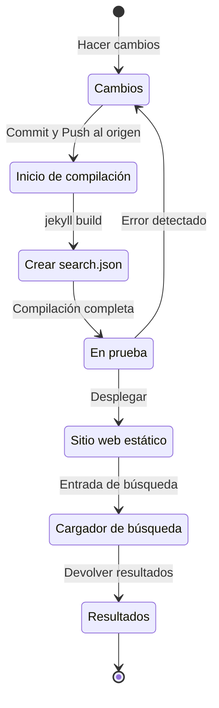

## Resumen
Hace aproximadamente 4 meses, a principios de julio de 2024, implementé el soporte multilingüe en este blog basado en Jekyll y alojado a través de Github Pages, aplicando el plugin [Polyglot](https://github.com/untra/polyglot).
Esta serie comparte los errores encontrados durante el proceso de aplicación del plugin Polyglot al tema Chirpy, sus soluciones, y cómo escribir encabezados HTML y sitemap.xml considerando el SEO.
La serie consta de dos publicaciones, y esta es la segunda de ellas.
- Parte 1: [Aplicación del plugin Polyglot e implementación de etiquetas alt hreflang, sitemap y botón de selección de idioma](/posts/how-to-support-multi-language-on-jekyll-blog-with-polyglot-1)
- Parte 2: Solución de problemas de fallo de compilación del tema Chirpy y errores en la función de búsqueda (este artículo)

## Requisitos
- [x] Debe ser posible proporcionar el resultado de la compilación (páginas web) separado por rutas de idioma (ej. `/posts/ko/`{: .filepath}, `/posts/ja/`{: .filepath}).
- [x] Para minimizar el tiempo y esfuerzo adicionales necesarios para el soporte multilingüe, debe ser posible reconocer automáticamente el idioma según la ruta local donde se encuentra el archivo original de markdown (ej. `/_posts/ko/`{: .filepath}, `/_posts/ja/`{: .filepath}) durante la compilación, sin tener que especificar manualmente las etiquetas 'lang' y 'permalink' en el YAML front matter de cada archivo markdown escrito.
- [x] El encabezado de cada página del sitio debe incluir las etiquetas meta Content-Language y hreflang alternativas apropiadas para cumplir con las pautas de SEO para la búsqueda multilingüe de Google.
- [x] Debe ser posible proporcionar enlaces a todas las páginas que admiten cada idioma en el sitio sin omisiones en `sitemap.xml`, y el propio `sitemap.xml` debe existir solo uno en la ruta raíz sin duplicados.
- [x] Todas las funciones proporcionadas por el [tema Chirpy](https://github.com/cotes2020/jekyll-theme-chirpy) deben funcionar correctamente en las páginas de cada idioma, y si no es así, deben modificarse para que funcionen correctamente.
  - [x] Funcionamiento normal de las funciones 'Recently Updated' y 'Trending Tags'
  - [x] No deben producirse errores durante el proceso de compilación utilizando GitHub Actions
  - [x] Funcionamiento normal de la función de búsqueda de publicaciones en la esquina superior derecha del blog

## Antes de empezar
Este artículo es una continuación de la [Parte 1](/posts/how-to-support-multi-language-on-jekyll-blog-with-polyglot-1), por lo que se recomienda leer primero el artículo anterior si aún no lo ha hecho.

## Solución de problemas ('relative_url_regex': target of repeat operator is not specified)
Después de completar los pasos anteriores, al ejecutar el comando `bundle exec jekyll serve` para realizar una prueba de compilación, se produjo un error que decía `'relative_url_regex': target of repeat operator is not specified` y la compilación falló.

```shell
...(omitido)
                    ------------------------------------------------
      Jekyll 4.3.4   Please append `--trace` to the `serve` command 
                     for any additional information or backtrace. 
                    ------------------------------------------------
/Users/yunseo/.gem/ruby/3.2.2/gems/jekyll-polyglot-1.8.1/lib/jekyll/polyglot/
patches/jekyll/site.rb:234:in `relative_url_regex': target of repeat operator 
is not specified: /href="?\/((?:(?!*.gem)(?!*.gemspec)(?!tools)(?!README.md)(
?!LICENSE)(?!*.config.js)(?!rollup.config.js)(?!package*.json)(?!.sass-cache)
(?!.jekyll-cache)(?!gemfiles)(?!Gemfile)(?!Gemfile.lock)(?!node_modules)(?!ve
ndor\/bundle\/)(?!vendor\/cache\/)(?!vendor\/gems\/)(?!vendor\/ruby\/)(?!en\/
)(?!ko\/)(?!es\/)(?!pt-BR\/)(?!ja\/)(?!fr\/)(?!de\/)[^,'"\s\/?.]+\.?)*(?:\/[^
\]\[)("'\s]*)?)"/ (RegexpError)

...(omitido)
```

Después de buscar si se había informado de un problema similar, encontré que [exactamente el mismo problema](https://github.com/untra/polyglot/issues/204) ya estaba registrado en el repositorio de Polyglot y también existía una solución.

En el archivo [`_config.yml` del tema Chirpy](https://github.com/cotes2020/jekyll-theme-chirpy/blob/master/_config.yml) que se está aplicando a este blog, existe la siguiente sintaxis:

```yml
exclude:
  - "*.gem"
  - "*.gemspec"
  - docs
  - tools
  - README.md
  - LICENSE
  - "*.config.js"
  - package*.json
```
{: file='_config.yml'}

La causa del problema está en que las expresiones regulares en las siguientes dos funciones incluidas en el archivo [`site.rb` de Polyglot](https://github.com/untra/polyglot/blob/master/lib/jekyll/polyglot/patches/jekyll/site.rb) no pueden procesar correctamente los patrones de globbing que incluyen comodines como `"*.gem"`, `"*.gemspec"`, `"*.config.js"` mencionados anteriormente.


```ruby
    # a regex that matches relative urls in a html document
    # matches href="baseurl/foo/bar-baz" href="/foo/bar-baz" and others like it
    # avoids matching excluded files.  prepare makes sure
    # that all @exclude dirs have a trailing slash.
    def relative_url_regex(disabled = false)
      regex = ''
      unless disabled
        @exclude.each do |x|
          regex += "(?!#{x})"
        end
        @languages.each do |x|
          regex += "(?!#{x}\/)"
        end
      end
      start = disabled ? 'ferh' : 'href'
      %r{#{start}="?#{@baseurl}/((?:#{regex}[^,'"\s/?.]+\.?)*(?:/[^\]\[)("'\s]*)?)"}
    end

    # a regex that matches absolute urls in a html document
    # matches href="http://baseurl/foo/bar-baz" and others like it
    # avoids matching excluded files.  prepare makes sure
    # that all @exclude dirs have a trailing slash.
    def absolute_url_regex(url, disabled = false)
      regex = ''
      unless disabled
        @exclude.each do |x|
          regex += "(?!#{x})"
        end
        @languages.each do |x|
          regex += "(?!#{x}\/)"
        end
      end
      start = disabled ? 'ferh' : 'href'
      %r{(?<!hreflang="#{@default_lang}" )#{start}="?#{url}#{@baseurl}/((?:#{regex}[^,'"\s/?.]+\.?)*(?:/[^\]\[)("'\s]*)?)"}
    end
```
{: file='(polyglot root path)/lib/jekyll/polyglot/patches/jekyll/site.rb'}


Hay dos formas de resolver este problema.

### 1. Hacer un fork de Polyglot y usar una versión modificada que corrija la parte problemática
En el momento de escribir este artículo (noviembre de 2024), la [documentación oficial de Jekyll](https://jekyllrb.com/docs/configuration/options/#global-configuration) indica que la configuración `exclude` admite el uso de patrones de globbing de nombres de archivo.

>"This configuration option supports Ruby's File.fnmatch filename globbing patterns to match multiple entries to exclude."

Es decir, la causa del problema no está en el tema Chirpy sino en las dos funciones `relative_url_regex()` y `absolute_url_regex()` de Polyglot, por lo que modificarlas para que no causen problemas es la solución fundamental.

Como este error aún no se ha resuelto en Polyglot, se puede hacer un fork del repositorio de Polyglot y modificar la parte problemática como se muestra a continuación, refiriéndose a [esta publicación de blog](https://hionpu.com/posts/github_blog_4#4-polyglot-%EC%9D%98%EC%A1%B4%EC%84%B1-%EB%AC%B8%EC%A0%9C) y [la respuesta dada en el problema de GitHub mencionado anteriormente](https://github.com/untra/polyglot/issues/204#issuecomment-2143270322), y luego usar esta versión modificada en lugar del Polyglot original.


```ruby
    def relative_url_regex(disabled = false)
      regex = ''
      unless disabled
        @exclude.each do |x|
          escaped_x = Regexp.escape(x)
          regex += "(?!#{escaped_x})"
        end
        @languages.each do |x|
          escaped_x = Regexp.escape(x)
          regex += "(?!#{escaped_x}\/)"
        end
      end
      start = disabled ? 'ferh' : 'href'
      %r{#{start}="?#{@baseurl}/((?:#{regex}[^,'"\s/?.]+\.?)*(?:/[^\]\[)("'\s]*)?)"}
    end

    def absolute_url_regex(url, disabled = false)
      regex = ''
      unless disabled
        @exclude.each do |x|
          escaped_x = Regexp.escape(x)
          regex += "(?!#{escaped_x})"
        end
        @languages.each do |x|
          escaped_x = Regexp.escape(x)
          regex += "(?!#{escaped_x}\/)"
        end
      end
      start = disabled ? 'ferh' : 'href'
      %r{(?<!hreflang="#{@default_lang}" )#{start}="?#{url}#{@baseurl}/((?:#{regex}[^,'"\s/?.]+\.?)*(?:/[^\]\[)("'\s]*)?)"}
    end
```
{: file='(polyglot root path)/lib/jekyll/polyglot/patches/jekyll/site.rb'}


### 2. Reemplazar los patrones de globbing en el archivo de configuración `_config.yml` del tema Chirpy por nombres de archivo exactos
En realidad, el método ideal y correcto sería que el parche anterior se incorporara al flujo principal de Polyglot. Sin embargo, hasta entonces, se tendría que usar la versión bifurcada en su lugar, lo que sería engorroso ya que habría que seguir y reflejar las actualizaciones del flujo ascendente de Polyglot cada vez que se actualice la versión. Por eso, yo utilicé un método diferente.

Si se comprueban los archivos ubicados en la ruta raíz del proyecto en el [repositorio del tema Chirpy](https://github.com/cotes2020/jekyll-theme-chirpy) que corresponden a los patrones `"*.gem"`, `"*.gemspec"`, `"*.config.js"`, solo hay 3:
- `jekyll-theme-chirpy.gemspec`
- `purgecss.config.js`
- `rollup.config.js`

Por lo tanto, si se elimina el patrón de globbing en la sintaxis `exclude` del archivo `_config.yml` y se reemplaza como se muestra a continuación, Polyglot podrá procesarlo sin problemas.

```yml
exclude: # Modificado según el problema https://github.com/untra/polyglot/issues/204.
  # - "*.gem"
  - jekyll-theme-chirpy.gemspec # - "*.gemspec"
  - tools
  - README.md
  - LICENSE
  - purgecss.config.js # - "*.config.js"
  - rollup.config.js
  - package*.json
```

## Modificación de la función de búsqueda
Después de completar los pasos anteriores, casi todas las funciones del sitio funcionaban satisfactoriamente como se pretendía. Sin embargo, descubrí tardíamente que había un problema: la barra de búsqueda ubicada en la esquina superior derecha de la página con el tema Chirpy no indexaba las páginas en idiomas distintos al `site.default_lang` (en el caso de este blog, inglés), y cuando se realizaba una búsqueda en idiomas distintos al inglés, también mostraba páginas en inglés como resultados de búsqueda.

Para entender la causa, veamos qué archivos están involucrados en la función de búsqueda y dónde se produce el problema.

### '_layouts/default.html'
Si se revisa el archivo [`_layouts/default.html`](https://github.com/cotes2020/jekyll-theme-chirpy/blob/master/_layouts/default.html) que constituye el marco de todas las páginas del blog, se puede ver que dentro del elemento `<body>` se cargan los contenidos de `search-results.html` y `search-loader.html`.


```liquid
  <body>
    

    <div id="main-wrapper" class="d-flex justify-content-center">
      <div class="container d-flex flex-column px-xxl-5">
        
        (...omitido...)

        
      </div>

      <aside aria-label="Scroll to Top">
        <button id="back-to-top" type="button" class="btn btn-lg btn-box-shadow">
          <i class="fas fa-angle-up"></i>
        </button>
      </aside>
    </div>

    (...omitido...)

    
  </body>
```
{: file='_layouts/default.html'}


### '_includes/search-result.html'
[`_includes/search-result.html`](https://github.com/cotes2020/jekyll-theme-chirpy/blob/master/_includes/search-results.html) constituye el contenedor `search-results` para almacenar los resultados de búsqueda para la palabra clave cuando se ingresa en el cuadro de búsqueda.


```html
<!-- The Search results -->

<div id="search-result-wrapper" class="d-flex justify-content-center d-none">
  <div class="col-11 content">
    <div id="search-hints">
      
    </div>
    <div id="search-results" class="d-flex flex-wrap justify-content-center text-muted mt-3"></div>
  </div>
</div>
```
{: file='_includes/search-result.html'}


### '_includes/search-loader.html'
[`_includes/search-loader.html`](https://github.com/cotes2020/jekyll-theme-chirpy/blob/master/_includes/search-loader.html) es la parte central que implementa la búsqueda basada en la biblioteca [Simple-Jekyll-Search](https://github.com/christian-fei/Simple-Jekyll-Search). Se puede ver que funciona del lado del cliente ejecutando JavaScript en el navegador del visitante, que busca partes que coincidan con la palabra clave de entrada en el contenido del archivo de índice [`search.json`](https://github.com/cotes2020/jekyll-theme-chirpy/blob/master/assets/js/data/search.json) y devuelve el enlace a la publicación correspondiente como un elemento `<article>`.


```js

  <article class="px-1 px-sm-2 px-lg-4 px-xl-0">
    <header>
      <h2><a href="{url}">{title}</a></h2>
      <div class="post-meta d-flex flex-column flex-sm-row text-muted mt-1 mb-1">
        {categories}
        {tags}
      </div>
    </header>
    <p>{snippet}</p>
  </article>


<p class="mt-5">{{ site.data.locales[include.lang].search.no_results }}</p>

<script>
   Note: dependent library will be loaded in `js-selector.html` 
  document.addEventListener('DOMContentLoaded', () => {
    SimpleJekyllSearch({
      searchInput: document.getElementById('search-input'),
      resultsContainer: document.getElementById('search-results'),
      json: '{{ '/assets/js/data/search.json' | relative_url }}',
      searchResultTemplate: '{{ result_elem | strip_newlines }}',
      noResultsText: '{{ not_found }}',
      templateMiddleware: function(prop, value, template) {
        if (prop === 'categories') {
          if (value === '') {
            return `${value}`;
          } else {
            return `<div class="me-sm-4"><i class="far fa-folder fa-fw"></i>${value}</div>`;
          }
        }

        if (prop === 'tags') {
          if (value === '') {
            return `${value}`;
          } else {
            return `<div><i class="fa fa-tag fa-fw"></i>${value}</div>`;
          }
        }
      }
    });
  });
</script>
```
{: file='_includes/search-loader.html'}


### Estructura de funcionamiento de la función de búsqueda e identificación de la parte problemática
En resumen, cuando se aloja el tema Chirpy en GitHub Pages, la función de búsqueda funciona con el siguiente proceso:



Aquí se confirmó que `search.json` se genera correctamente para cada idioma por Polyglot de la siguiente manera:
- /assets/js/data/search.json
- /ko/assets/js/data/search.json
- /es/assets/js/data/search.json
- /pt-BR/assets/js/data/search.json
- /ja/assets/js/data/search.json
- /fr/assets/js/data/search.json
- /de/assets/js/data/search.json

Por lo tanto, la parte que causa el problema es el "Cargador de búsqueda". El problema de que no se buscan páginas en idiomas distintos al inglés se debe a que `_includes/search-loader.html` carga estáticamente solo el archivo de índice en inglés (`/assets/js/data/search.json`) independientemente del idioma de la página que se está visitando actualmente.

### Solución del problema
Para resolver esto, se debe modificar el contenido de `_includes/search-loader.html` de la siguiente manera:


```js
(omitido...)

<script>
   Note: dependent library will be loaded in `js-selector.html` 
  document.addEventListener('DOMContentLoaded', () => {
    // Obtener el idioma actual
    const lang = "{{site.active_lang}}";

    // Construir la ruta apropiada del JSON de búsqueda
    const searchJsonPath = lang === "{{site.default_lang}}"
      ? '{{ "/assets/js/data/search.json" | relative_url }}'
      : `{{ "/" | relative_url }}${lang}/assets/js/data/search.json`;

    // Inicializar Simple Jekyll Search
    SimpleJekyllSearch({
      searchInput: document.getElementById('search-input'),
      resultsContainer: document.getElementById('search-results'),
      json: searchJsonPath, // Usar la ruta dinámica basada en el idioma
      searchResultTemplate: '{{ result_elem | strip_newlines }}',
      noResultsText: '{{ not_found }}',

(...omitido)
```
{: file='_includes/search-loader.html'}


Se modificó el código JavaScript para cargar dinámicamente `searchJsonPath` comparando el idioma actual (`{{site.active_lang}}`) con el idioma predeterminado del sitio (`{{site.default_lang}}`). Si son iguales, se carga la ruta predeterminada ("/assets/js/data/search.json"), si son diferentes, se carga `${lang}/assets/js/data/search.json`. Después de hacer esta modificación y volver a compilar el sitio web, se confirmó que los resultados de búsqueda se muestran correctamente según cada idioma.
