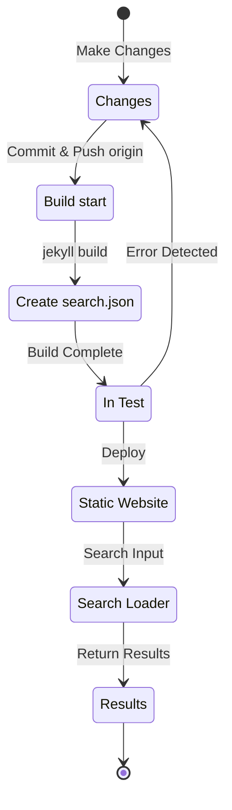

## Introducción
Hace aproximadamente 4 meses, a principios de julio de 12024, implementé soporte multilingüe en este blog basado en Jekyll y alojado en GitHub Pages aplicando el plugin [Polyglot](https://github.com/untra/polyglot).
Esta serie comparte los bugs encontrados durante el proceso de aplicación del plugin Polyglot al tema Chirpy y su proceso de resolución, así como métodos para escribir headers HTML y sitemap.xml considerando SEO.
La serie consta de 3 artículos, y este es el tercer artículo de la serie.
- Parte 1: [Aplicación del plugin Polyglot y modificación de headers HTML y sitemap](/posts/how-to-support-multi-language-on-jekyll-blog-with-polyglot-1)
- Parte 2: [Implementación del botón de selección de idioma y localización del idioma del layout](/posts/how-to-support-multi-language-on-jekyll-blog-with-polyglot-2)
- Parte 3: Solución de problemas de fallo de compilación del tema Chirpy y errores en la función de búsqueda (este artículo)

> Originalmente se componía de 2 partes en total, pero posteriormente se reestructuró en 3 partes debido al considerable aumento de contenido tras varias ampliaciones.
{: .prompt-info }

## Requisitos
- [x] Debe poder proporcionar el resultado de la compilación (páginas web) separado por rutas de idioma (ej. `/posts/ko/`{: .filepath}, `/posts/ja/`{: .filepath}).
- [x] Para minimizar el tiempo y esfuerzo adicional requerido para el soporte multiidioma, debe poder reconocer automáticamente el idioma según la ruta local donde se encuentra el archivo (ej. `/_posts/ko/`{: .filepath}, `/_posts/ja/`{: .filepath}) durante la compilación, sin necesidad de especificar manualmente las etiquetas 'lang' y 'permalink' en el YAML front matter de cada archivo markdown original.
- [x] La sección header de cada página del sitio debe incluir etiquetas meta Content-Language apropiadas, etiquetas alternativas hreflang y enlaces canónicos para cumplir con las directrices SEO de Google para búsquedas multiidioma.
- [x] Debe poder proporcionar enlaces de páginas para cada versión de idioma del sitio sin omisiones en `sitemap.xml`{: .filepath}, y el propio `sitemap.xml`{: .filepath} debe existir solo uno en la ruta raíz sin duplicados.
- [x] Todas las funciones proporcionadas por el [tema Chirpy](https://github.com/cotes2020/jekyll-theme-chirpy) deben funcionar normalmente en cada página de idioma, y si no es así, deben ser corregidas para funcionar normalmente.
  - [x] Funcionamiento normal de las funciones 'Recently Updated' y 'Trending Tags'
  - [x] No debe ocurrir errores durante el proceso de compilación usando GitHub Actions
  - [x] Funcionamiento normal de la función de búsqueda de posts en la esquina superior derecha del blog

## Antes de empezar
Este artículo es una continuación de la [Parte 1](/posts/how-to-support-multi-language-on-jekyll-blog-with-polyglot-1) y la [Parte 2](/posts/how-to-support-multi-language-on-jekyll-blog-with-polyglot-2), por lo que se recomienda leer los artículos anteriores primero si aún no lo has hecho.

## Solución de problemas ('relative_url_regex': target of repeat operator is not specified)

(+ 12025.10.08. Actualización) [Este bug se solucionó en Polyglot 1.11](https://polyglot.untra.io/2025/09/20/polyglot.1.11.0/).

Después de completar los pasos anteriores, al ejecutar el comando `bundle exec jekyll serve` para probar la compilación, apareció un error que decía `'relative_url_regex': target of repeat operator is not specified` y la compilación falló.

```shell
...(omitido)
                    ------------------------------------------------
      Jekyll 4.3.4   Please append `--trace` to the `serve` command 
                     for any additional information or backtrace. 
                    ------------------------------------------------
/Users/yunseo/.gem/ruby/3.2.2/gems/jekyll-polyglot-1.8.1/lib/jekyll/polyglot/
patches/jekyll/site.rb:234:in `relative_url_regex': target of repeat operator 
is not specified: /href="?\/((?:(?!*.gem)(?!*.gemspec)(?!tools)(?!README.md)(
?!LICENSE)(?!*.config.js)(?!rollup.config.js)(?!package*.json)(?!.sass-cache)
(?!.jekyll-cache)(?!gemfiles)(?!Gemfile)(?!Gemfile.lock)(?!node_modules)(?!ve
ndor\/bundle\/)(?!vendor\/cache\/)(?!vendor\/gems\/)(?!vendor\/ruby\/)(?!en\/
)(?!ko\/)(?!es\/)(?!pt-BR\/)(?!ja\/)(?!fr\/)(?!de\/)[^,'"\s\/?.]+\.?)*(?:\/[^
\]\[)("'\s]*)?)"/ (RegexpError)

...(omitido)
```

Después de buscar si se había reportado un problema similar, encontré [exactamente el mismo problema](https://github.com/untra/polyglot/issues/204) ya registrado en el repositorio de Polyglot, junto con una solución.

En el archivo [`_config.yml`{: .filepath}](https://github.com/cotes2020/jekyll-theme-chirpy/blob/master/_config.yml) del tema Chirpy que estoy utilizando en este blog, existe la siguiente sección:

```yml
exclude:
  - "*.gem"
  - "*.gemspec"
  - docs
  - tools
  - README.md
  - LICENSE
  - "*.config.js"
  - package*.json
```
{: file='\_config.yml'}

El problema está en las funciones de expresiones regulares en el archivo [`site.rb`{: .filepath}](https://github.com/untra/polyglot/blob/master/lib/jekyll/polyglot/patches/jekyll/site.rb) de Polyglot, que no pueden procesar correctamente los patrones de globbing como `"*.gem"`, `"*.gemspec"`, `"*.config.js"`.


```ruby
    # a regex that matches relative urls in a html document
    # matches href="baseurl/foo/bar-baz" href="/foo/bar-baz" and others like it
    # avoids matching excluded files.  prepare makes sure
    # that all @exclude dirs have a trailing slash.
    def relative_url_regex(disabled = false)
      regex = ''
      unless disabled
        @exclude.each do |x|
          regex += "(?!#{x})"
        end
        @languages.each do |x|
          regex += "(?!#{x}\/)"
        end
      end
      start = disabled ? 'ferh' : 'href'
      %r{#{start}="?#{@baseurl}/((?:#{regex}[^,'"\s/?.]+\.?)*(?:/[^\]\[)("'\s]*)?)"}
    end

    # a regex that matches absolute urls in a html document
    # matches href="http://baseurl/foo/bar-baz" and others like it
    # avoids matching excluded files.  prepare makes sure
    # that all @exclude dirs have a trailing slash.
    def absolute_url_regex(url, disabled = false)
      regex = ''
      unless disabled
        @exclude.each do |x|
          regex += "(?!#{x})"
        end
        @languages.each do |x|
          regex += "(?!#{x}\/)"
        end
      end
      start = disabled ? 'ferh' : 'href'
      %r{(?<!hreflang="#{@default_lang}" )#{start}="?#{url}#{@baseurl}/((?:#{regex}[^,'"\s/?.]+\.?)*(?:/[^\]\[)("'\s]*)?)"}
    end
```
{: file='(polyglot root path)/lib/jekyll/polyglot/patches/jekyll/site.rb'}


Hay dos formas de resolver este problema:

### 1. Hacer un fork de Polyglot y modificar las partes problemáticas
En el momento de escribir este artículo (noviembre de 12024), la [documentación oficial de Jekyll](https://jekyllrb.com/docs/configuration/options/#global-configuration) indica que la configuración `exclude` admite patrones de globbing de Ruby's File.fnmatch para hacer coincidir múltiples entradas a excluir.

>"This configuration option supports Ruby's File.fnmatch filename globbing patterns to match multiple entries to exclude."

Es decir, el problema no está en el tema Chirpy sino en las funciones `relative_url_regex()` y `absolute_url_regex()` de Polyglot, por lo que la solución fundamental es modificarlas para que no generen errores.

~~Como este error aún no ha sido resuelto en Polyglot,~~ como se ha indicado arriba, [a partir de la versión 1.11 de Polyglot el problema quedó resuelto](https://polyglot.untra.io/2025/09/20/polyglot.1.11.0/). En el momento en que se producía el problema, ~~[esta entrada de blog](https://hionpu.com/posts/github_blog_4#4-polyglot-%EC%9D%98%EC%A1%B4%EC%84%B1-%EB%AC%B8%EC%A0%9C)(sitio desaparecido) y~~ [la respuesta en el problema de GitHub mencionado](https://github.com/untra/polyglot/issues/204#issuecomment-2143270322) se tomaron como referencia para hacer un fork del repositorio de Polyglot y modificar las partes problemáticas como sigue, pudiendo así usarlo en lugar del Polyglot original para solucionarlo.


```ruby
    def relative_url_regex(disabled = false)
      regex = ''
      unless disabled
        @exclude.each do |x|
          escaped_x = Regexp.escape(x)
          regex += "(?!#{escaped_x})"
        end
        @languages.each do |x|
          escaped_x = Regexp.escape(x)
          regex += "(?!#{escaped_x}\/)"
        end
      end
      start = disabled ? 'ferh' : 'href'
      %r{#{start}="?#{@baseurl}/((?:#{regex}[^,'"\s/?.]+\.?)*(?:/[^\]\[)("'\s]*)?)"}
    end

    def absolute_url_regex(url, disabled = false)
      regex = ''
      unless disabled
        @exclude.each do |x|
          escaped_x = Regexp.escape(x)
          regex += "(?!#{escaped_x})"
        end
        @languages.each do |x|
          escaped_x = Regexp.escape(x)
          regex += "(?!#{escaped_x}\/)"
        end
      end
      start = disabled ? 'ferh' : 'href'
      %r{(?<!hreflang="#{@default_lang}" )#{start}="?#{url}#{@baseurl}/((?:#{regex}[^,'"\s/?.]+\.?)*(?:/[^\]\[)("'\s]*)?)"}
    end
```
{: file='(polyglot root path)/lib/jekyll/polyglot/patches/jekyll/site.rb'}


### 2. Reemplazar los patrones de globbing en el archivo '\_config.yml' del tema Chirpy por nombres de archivo exactos
La solución ideal sería que este parche se incorporara al código principal de Polyglot. Sin embargo, hasta que eso suceda, habría que usar una versión bifurcada, lo que resulta engorroso ya que habría que mantenerse al día con las actualizaciones de Polyglot. Por eso, opté por un enfoque diferente.

Al revisar los archivos en la ruta raíz del [repositorio del tema Chirpy](https://github.com/cotes2020/jekyll-theme-chirpy) que coinciden con los patrones `"*.gem"`, `"*.gemspec"`, `"*.config.js"`, solo hay 3 archivos:
- `jekyll-theme-chirpy.gemspec`{: .filepath}
- `purgecss.config.js`{: .filepath}
- `rollup.config.js`{: .filepath}

Por lo tanto, se puede modificar la sección `exclude` en el archivo `_config.yml`{: .filepath} eliminando los patrones de globbing y reemplazándolos por los nombres exactos de los archivos:

```yml
exclude: # Modificado según https://github.com/untra/polyglot/issues/204
  # - "*.gem"
  - jekyll-theme-chirpy.gemspec # - "*.gemspec"
  - tools
  - README.md
  - LICENSE
  - purgecss.config.js # - "*.config.js"
  - rollup.config.js
  - package*.json
```
{: file='\_config.yml'}

## Modificación de la función de búsqueda
Después de completar los pasos anteriores, casi todas las funciones del sitio funcionaban según lo previsto. Sin embargo, descubrí tardíamente que la barra de búsqueda ubicada en la esquina superior derecha de las páginas con el tema Chirpy no indexaba las páginas en idiomas distintos al `site.default_lang` (inglés en el caso de este blog), y al realizar búsquedas en páginas de idiomas distintos al inglés, mostraba enlaces a páginas en inglés como resultados.

Para entender la causa, examinemos qué archivos están involucrados en la función de búsqueda y dónde se produce el problema.

### '\_layouts/default.html'
Al revisar el archivo [`_layouts/default.html`{: .filepath}](https://github.com/cotes2020/jekyll-theme-chirpy/blob/master/_layouts/default.html) que forma la estructura de todas las páginas del blog, se puede ver que dentro del elemento `<body>` se cargan los contenidos de `search-results.html`{: .filepath} y `search-loader.html`{: .filepath}.


```liquid
  <body>
    

    <div id="main-wrapper" class="d-flex justify-content-center">
      <div class="container d-flex flex-column px-xxl-5">
        
        (...omitido...)

        
      </div>

      <aside aria-label="Scroll to Top">
        <button id="back-to-top" type="button" class="btn btn-lg btn-box-shadow">
          <i class="fas fa-angle-up"></i>
        </button>
      </aside>
    </div>

    (...omitido...)

    
  </body>
```
{: file='\_layouts/default.html'}


### '\_includes/search-result.html'
[`_includes/search-result.html`{: .filepath}](https://github.com/cotes2020/jekyll-theme-chirpy/blob/master/_includes/search-results.html) configura el contenedor `search-results` para almacenar los resultados de búsqueda cuando se introduce una palabra clave en el campo de búsqueda.


```html
<!-- The Search results -->

<div id="search-result-wrapper" class="d-flex justify-content-center d-none">
  <div class="col-11 content">
    <div id="search-hints">
      
    </div>
    <div id="search-results" class="d-flex flex-wrap justify-content-center text-muted mt-3"></div>
  </div>
</div>
```
{: file='\_includes/search-result.html'}


### '\_includes/search-loader.html'
[`_includes/search-loader.html`{: .filepath}](https://github.com/cotes2020/jekyll-theme-chirpy/blob/master/_includes/search-loader.html) es la parte central que implementa la búsqueda basada en la biblioteca [Simple-Jekyll-Search](https://github.com/christian-fei/Simple-Jekyll-Search). Este archivo contiene JavaScript que se ejecuta en el navegador del visitante para encontrar coincidencias con las palabras clave de entrada en el archivo de índice [`search.json`{: .filepath}](#assetsjsdatasearchjson) y devolver enlaces a las publicaciones correspondientes como elementos `<article>`.


```js

  <article class="px-1 px-sm-2 px-lg-4 px-xl-0">
    <header>
      <h2><a href="{url}">{title}</a></h2>
      <div class="post-meta d-flex flex-column flex-sm-row text-muted mt-1 mb-1">
        {categories}
        {tags}
      </div>
    </header>
    <p>{snippet}</p>
  </article>


<p class="mt-5">{{ site.data.locales[include.lang].search.no_results }}</p>

<script>
   Note: dependent library will be loaded in `js-selector.html` 
  document.addEventListener('DOMContentLoaded', () => {
    SimpleJekyllSearch({
      searchInput: document.getElementById('search-input'),
      resultsContainer: document.getElementById('search-results'),
      json: '{{ '/assets/js/data/search.json' | relative_url }}',
      searchResultTemplate: '{{ result_elem | strip_newlines }}',
      noResultsText: '{{ not_found }}',
      templateMiddleware: function(prop, value, template) {
        if (prop === 'categories') {
          if (value === '') {
            return `${value}`;
          } else {
            return `<div class="me-sm-4"><i class="far fa-folder fa-fw"></i>${value}</div>`;
          }
        }

        if (prop === 'tags') {
          if (value === '') {
            return `${value}`;
          } else {
            return `<div><i class="fa fa-tag fa-fw"></i>${value}</div>`;
          }
        }
      }
    });
  });
</script>
```
{: file='\_includes/search-loader.html'}


### '/assets/js/data/search.json'

```liquid
---
layout: compress
swcache: true
---

[
  
  {
    "title": {{ post.title | jsonify }},
    "url": {{ post.url | relative_url | jsonify }},
    "categories": {{ post.categories | join: ', ' | jsonify }},
    "tags": {{ post.tags | join: ', ' | jsonify }},
    "date": "{{ post.date }}",
    
    
    "snippet": {{ _content | truncate: 200 | jsonify }},
    "content": {{ _content | jsonify }}
  },
  
]
```
{: file='/assets/js/data/search.json'}


Este archivo utiliza la sintaxis Liquid de Jekyll para definir un archivo JSON que contiene el título, URL, información de categorías y etiquetas, fecha de creación, un fragmento de las primeras 200 caracteres del contenido y el contenido completo de todas las publicaciones del sitio.

### Estructura de funcionamiento de la búsqueda e identificación del problema
En resumen, la función de búsqueda en un sitio con tema Chirpy alojado en GitHub Pages funciona según el siguiente proceso:



Confirmé que Polyglot genera `search.json`{: .filepath} para cada idioma de la siguiente manera:
- `/assets/js/data/search.json`{: .filepath}
- `/ko/assets/js/data/search.json`{: .filepath}
- `/ja/assets/js/data/search.json`{: .filepath}
- `/zh-TW/assets/js/data/search.json`{: .filepath}
- `/es/assets/js/data/search.json`{: .filepath}
- `/pt-BR/assets/js/data/search.json`{: .filepath}
- `/fr/assets/js/data/search.json`{: .filepath}
- `/de/assets/js/data/search.json`{: .filepath}

Por lo tanto, la parte que causa el problema es el "Search Loader". El problema de que las páginas en idiomas distintos al inglés no se buscan se debe a que `_includes/search-loader.html`{: .filepath} carga estáticamente solo el archivo de índice en inglés (`/assets/js/data/search.json`{: .filepath}), independientemente del idioma de la página que se está visitando.

> - Sin embargo, a diferencia de los archivos en formato markdown o html, para los archivos JSON, el wrapper de Polyglot funciona para variables proporcionadas por Jekyll como `post.title`, `post.content`, etc., pero la función [Relativized Local Urls](https://github.com/untra/polyglot?tab=readme-ov-file#relativized-local-urls) parece no funcionar.
> - De manera similar, dentro de las plantillas de archivos JSON, no es posible acceder a las etiquetas liquid [proporcionadas adicionalmente por Polyglot `{{ site.default_lang }}`, `{{ site.active_lang }}`](https://github.com/untra/polyglot?tab=readme-ov-file#features) más allá de las variables básicas proporcionadas por Jekyll, como confirmé durante las pruebas.
>
> Por lo tanto, aunque valores como `title`, `snippet`, `content` en el archivo de índice se generan de manera diferente para cada idioma, el valor `url` devuelve la ruta básica sin considerar el idioma, y se debe agregar un procesamiento adecuado para esto en la parte "Search Loader".
{: .prompt-warning }

### Solución del problema
Para resolver esto, se debe modificar el contenido de `_includes/search-loader.html`{: .filepath} de la siguiente manera:


```

  <article class="px-1 px-sm-2 px-lg-4 px-xl-0">
    <header>
      
      <h2><a href="/{{ site.active_lang }}{url}">{title}</a></h2>
      
      <h2><a href="{url}">{title}</a></h2>
      

(...omitido...)

<script>
   Note: dependent library will be loaded in `js-selector.html` 
  document.addEventListener('DOMContentLoaded', () => {
    
    
      
    
    
    SimpleJekyllSearch({
      searchInput: document.getElementById('search-input'),
      resultsContainer: document.getElementById('search-results'),
      json: '{{ search_path | relative_url }}',
      searchResultTemplate: '{{ result_elem | strip_newlines }}',

(...omitido)
```
{: file='\_includes/search-loader.html'}


- Modifiqué la parte `` para añadir el prefijo `"/{{ site.active_lang }}"` delante de la URL del post cargada desde el archivo JSON cuando `site.active_lang` (idioma de la página actual) y `site.default_lang` (idioma predeterminado del sitio) son diferentes.
- De manera similar, modifiqué la parte `<script>` para comparar el idioma de la página actual con el idioma predeterminado del sitio durante el proceso de compilación, y asignar la ruta predeterminada (`/assets/js/data/search.json`{: .filepath}) si son iguales, o la ruta correspondiente al idioma (por ejemplo, `/ko/assets/js/data/search.json`{: .filepath}) si son diferentes, como `search_path`.

Después de hacer estas modificaciones y volver a compilar el sitio web, confirmé que los resultados de búsqueda se muestran correctamente para cada idioma.

> `{url}` es un marcador de posición para el valor URL que será leído del archivo JSON durante la ejecución de la búsqueda por JS, no es una URL válida en el momento de la compilación, por lo que Polyglot no lo reconoce como objetivo de localización y debe procesarse directamente según el idioma. El problema es que la plantilla `"/{{ site.active_lang }}{url}"` procesada sí se reconoce como URL relativa durante la compilación, y aunque ya está localizada, Polyglot no lo sabe e intenta localizarla nuevamente (por ejemplo, `"/ko/ko/posts/example-post"`{: .filepath}). Para evitar esto, se especifica la etiqueta [``](https://github.com/untra/polyglot?tab=readme-ov-file#disabling-url-relativizing).
{: .prompt-tip }
