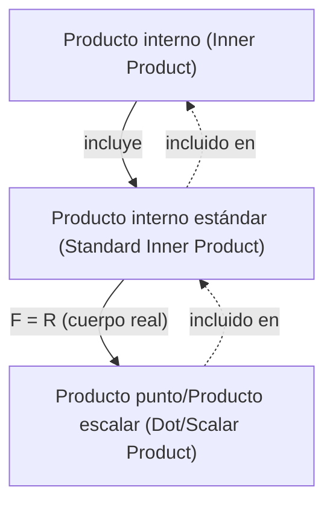

## Requisitos previos
- [Vectores y combinaciones lineales](/posts/vectors-and-linear-combinations/)

## Producto interno

La definición de **producto interno (inner product)** en un espacio vectorial sobre un cuerpo $F$ es la siguiente.

> **Definición de producto interno (inner product) y espacio con producto interno (inner product space)**  
> Consideremos un $F$-espacio vectorial $\mathbb{V}$. Un **producto interno (inner product)** $\langle \mathbf{x},\mathbf{y} \rangle$ en $\mathbb{V}$ es una aplicación que asocia a cada par ordenado de vectores $\mathbf{x}$ y $\mathbf{y}$ de $\mathbb{V}$ un escalar en $F$, y que satisface las condiciones siguientes.
>
> Para cualesquiera $\mathbf{x},\mathbf{y},\mathbf{z} \in \mathbb{V}$ y cualquier $c \in F$:
> 1. $\langle \mathbf{x}+\mathbf{z}, \mathbf{y} \rangle = \langle \mathbf{x}, \mathbf{y} \rangle + \langle \mathbf{z}, \mathbf{y} \rangle$
> 2. $\langle c\mathbf{x}, \mathbf{y} \rangle = c \langle \mathbf{x}, \mathbf{y} \rangle$
> 3. $\overline{\langle \mathbf{x}, \mathbf{y} \rangle} = \langle \mathbf{y}, \mathbf{x} \rangle$ ($\overline{\mathbf{z}}$ es el conjugado complejo de $\mathbf{z}$)
> 4. Si $\mathbf{x} \neq \mathbf{0}$, entonces $\langle \mathbf{x}, \mathbf{x} \rangle$ es positivo.
>
> Un $F$-espacio vectorial $\mathbb{V}$ dotado de un producto interno se denomina **espacio con producto interno (inner product space)**. En particular, si $F=\mathbb{C}$ se llama **espacio con producto interno complejo (complex inner product space)**, y si $F=\mathbb{R}$, **espacio con producto interno real (real inner product space)**.
{: .prompt-info }

En particular, el siguiente producto interno se denomina **producto interno estándar (standard inner product)**. Puede verificarse que cumple las cuatro condiciones anteriores.

> **Definición de producto interno estándar (standard inner product)**  
> Para dos vectores de $F^n$, $\mathbf{x}=(a_1, a_2, \dots, a_n)$ y $\mathbf{y}=(b_1, b_2, \dots, b_n)$, el **producto interno estándar (standard inner product)** en $F^n$ se define por
>
> $$\langle \mathbf{x}, \mathbf{y} \rangle = \sum_{i=1}^n a_i \overline{b_i} $$
>
{: .prompt-info }

Si aquí $F=\mathbb{R}$, como el conjugado complejo de un número real es él mismo, el producto interno estándar se reduce a $\sum_{i=1}^n a_i b_i$. En este caso particular, se suele escribir $\langle \mathbf{x}, \mathbf{y} \rangle$ como $\mathbf{x} \cdot \mathbf{y}$ y se denomina **producto punto (dot product)** o **producto escalar (scalar product)**.

> **Definición de producto punto (dot product)/producto escalar (scalar product)**  
> Para $\mathbf{v}=(v_1, v_2, \dots, v_n)$ y $\mathbf{w}=(w_1, w_2, \dots, w_n)$ en $\mathbb{R}^n$, el **producto punto (dot product)** o **producto escalar (scalar product)** en $\mathbb{R}^n$ se define por
>
> $$ \mathbf{v} \cdot \mathbf{w} = \sum_{i=1}^n v_i w_i = v_1 w_1 + v_2 w_2 + \cdots + v_n w_n $$
> 
{: .prompt-info }

> El 'producto escalar (**scalar product**)' aquí mencionado es una operación entre vectores, distinta de la 'multiplicación escalar (**scalar multiplication**)' (multiplicación por un escalar) tratada en [Vectores y combinaciones lineales](/posts/vectors-and-linear-combinations/). Dado que en inglés las expresiones son similares y en español <u>la traducción puede ser ambigua</u>, conviene evitar confusiones.
>
> Para minimizar la ambigüedad, en lo sucesivo nos referiremos preferentemente a esta operación como **producto punto (dot product)**.
{: .prompt-warning }

> En un espacio euclídeo, el producto interno coincide con el producto punto; por ello, cuando el contexto no induce a confusión, a menudo se usa simplemente “producto interno” para referirse al producto punto. No obstante, con rigor, el producto interno es un concepto más general que incluye al producto punto como caso particular.
{: .prompt-tip }

## Longitud/norma de un vector

Para un vector $\mathbf{v}=(v_1, v_2, \dots, v_n)$ en $\mathbb{R}^n$, la longitud euclídea de $\mathbf{v}$ se define mediante el producto punto como sigue:

$$ \| \mathbf{v} \| = \sqrt{\mathbf{v} \cdot \mathbf{v}} = \left[ \sum_{i=1}^n |v_i|^2 \right]^{1/2} = \sqrt{v_1^2 + v_2^2 + \cdots + v_n^2} $$

Más generalmente, en un espacio con producto interno, la **longitud (length)** o **norma (norm)** de un vector se define por

$$ \| \mathbf{x} \| = \sqrt{\langle \mathbf{x}, \mathbf{x} \rangle} $$

En un espacio con producto interno general, la norma de los vectores satisface las siguientes propiedades fundamentales.

> **Teorema**  
> Sea $\mathbb{V}$ un $F$-espacio con producto interno y sean $\mathbf{x}, \mathbf{y} \in \mathbb{V}$ y $c \in F$. Entonces:
> 1. $\\|c\mathbf{x}\\| = \|c\| \cdot \\|\mathbf{x}\\|$
> 2. Se cumplen ambas:
>    - $\\|\mathbf{x}\\| = 0 \iff \mathbf{x}=\mathbf{0}$
>    - $\\|\mathbf{x}\\| \geq 0 \ \forall \mathbf{x}$
> 3. **Desigualdad de Cauchy‑Schwarz (Cauchy-Schwarz inequality)**: $\| \langle \mathbf{x}, \mathbf{y} \rangle \| \leq \\|\mathbf{x}\\| \cdot \\|\mathbf{y}\\|$ (hay igualdad si y solo si uno de $\mathbf{x}$, $\mathbf{y}$ es múltiplo escalar del otro)
> 4. **Desigualdad triangular (triangle inequality)**: $\\| \mathbf{x} + \mathbf{y} \\| \leq \\|\mathbf{x}\\| + \\|\mathbf{y}\\|$ (hay igualdad si y solo si uno es múltiplo escalar del otro y apuntan en la misma dirección)
{: .prompt-info }

## Ángulo entre vectores y vector unitario

Un vector de longitud $1$ se denomina **vector unitario (unit vector)**. Además, para dos vectores $\mathbf{v}=(v_1, v_2, \dots, v_n)$ y $\mathbf{w}=(w_1, w_2, \dots, w_n)$ en $\mathbb{R}^n$ se cumple $\mathbf{v} \cdot \mathbf{w} = \\|\mathbf{v}\\| \cdot \\|\mathbf{w}\\| \cos\theta$, de donde se puede obtener el ángulo $\theta$ ($0 \leq \theta \leq \pi$) entre $\mathbf{v}$ y $\mathbf{w}$.

$$ \theta = \arccos{\frac{\mathbf{v} \cdot \mathbf{w}}{\|\mathbf{v}\| \cdot \|\mathbf{w}\|}} $$

Si $\mathbf{v} \cdot \mathbf{w} = 0$, se dice que los dos vectores son **perpendiculares (perpendicular)** u **ortogonales (orthogonal)**.

> Si dos vectores $\mathbf{v}$ y $\mathbf{w}$ son perpendiculares,
>
> $$ \begin{align*}
> \| \mathbf{v} + \mathbf{w} \|^2 &= (\mathbf{v} + \mathbf{w}) \cdot (\mathbf{v} + \mathbf{w}) \\
> &= \mathbf{v} \cdot \mathbf{v} + \mathbf{v} \cdot \mathbf{w} + \mathbf{w} \cdot \mathbf{v} + \mathbf{w} \cdot \mathbf{w} \\
> &= \mathbf{v} \cdot \mathbf{v} + \mathbf{w} \cdot \mathbf{w} \\
> &= \|\mathbf{v}\|^2 + \|\mathbf{w}\|^2.
> \end{align*} $$
>
{: .prompt-tip }

Generalizando a un espacio con producto interno arbitrario, tenemos lo siguiente.

> **Definición**  
> Consideremos un espacio con producto interno $\mathbb{V}$. Para vectores $\mathbf{x}, \mathbf{y}$ en $\mathbb{V}$, si $\langle \mathbf{x}, \mathbf{y} \rangle = 0$, decimos que los dos vectores son **ortogonales (orthogonal)** o **perpendiculares (perpendicular)**. Además:
> 1. Para un subconjunto $S$ de $\mathbb{V}$, si cualesquiera dos vectores distintos en $S$ son ortogonales, entonces $S$ es un **conjunto ortogonal (orthogonal set)**.
> 2. Un vector $\mathbf{x} \in \mathbb{V}$ con $\\|\mathbf{x}\\|=1$ se denomina **vector unitario (unit vector)**.
> 3. Si un subconjunto $S$ de $\mathbb{V}$ es ortogonal y está formado únicamente por vectores unitarios, entonces $S$ es un **conjunto ortonormal (orthonormal set)**.
{: .prompt-info }

Una condición necesaria y suficiente para que $S = \{ \mathbf{v}_1, \mathbf{v}_2, \dots \}$ sea ortonormal es $\langle \mathbf{v}\_i, \mathbf{v}\_j \rangle = \delta\_{ij}$. Multiplicar un vector por un escalar no nulo no afecta a la ortogonalidad.

Para cualquier vector no nulo $\mathbf{x}$, $\cfrac{\mathbf{x}}{\\|\mathbf{x}\\|}$ es un vector unitario; el proceso de multiplicar un vector no nulo por el inverso de su longitud para obtener un vector unitario se llama **normalización (normalizing)**.
