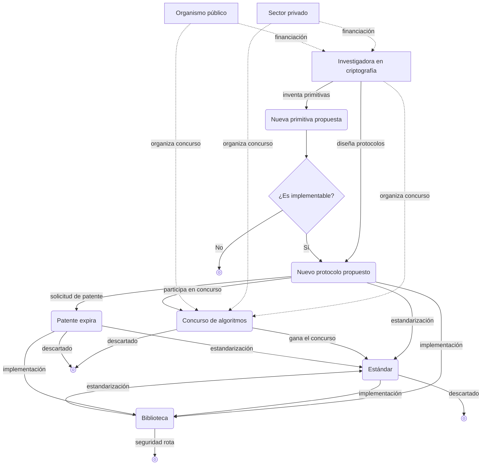

## ¿Qué es la criptografía?

La **criptografía** es, en esencia, una subdisciplina de la ciencia cuyo objetivo es defender los **protocolos** frente a acciones hostiles.

Aquí, por protocolo entendemos una lista de pasos que una o más personas deben seguir para lograr algo. Por ejemplo, si se quiere compartir el portapapeles entre dispositivos, un posible protocolo para compartirlo sería el siguiente:

1. Cuando haya un cambio en el portapapeles de alguno de los dispositivos, se copia el contenido del portapapeles y se sube al servidor.
2. El servidor avisa al resto de dispositivos de que ha habido un cambio en el portapapeles compartido.
3. Los demás dispositivos descargan del servidor ese contenido de portapapeles compartido.

Sin embargo, este no es un buen protocolo: si se sube y descarga el contenido del portapapeles en texto plano, tal cual, alguien en medio de la comunicación —o incluso el propio servidor— podría espiar ese contenido. Es tarea de la criptografía considerar la posible existencia de enemigos que intenten espiar el portapapeles y defenderse de ellos.

## Criptografía simétrica

### Cifrado simétrico

> Pensemos en una situación en la que Alicia (Alice) tiene que enviar una carta a Beto (Bob). Para transmitirle información confidencial, Alicia ordena a un mensajero (*messenger*) que lleve la carta hasta Beto.  
> Pero Alicia no confía del todo en el mensajero y quiere que el mensaje se mantenga secreto para todo el mundo excepto Beto, incluyendo al propio mensajero que lleva la carta.

El algoritmo criptográfico que se inventó hace mucho tiempo para este tipo de situaciones es precisamente el **algoritmo de cifrado simétrico (symmetric encryption algorithm)**.

> **Primitiva (primitive)**  
> La palabra inglesa *primitive* significa literalmente “primitivo”, “algo primitivo”.  
> En criptografía se usa con mucha frecuencia este término: una primitiva es la unidad funcional o algorítmica más pequeña con la que se construye un sistema criptográfico.  
> Puede pensarse como un “bloque básico” o “lógica fundamental”.
{: .prompt-info }

Consideremos una primitiva que proporcione las dos funciones siguientes:
- `ENCRYPT`: recibe como entrada una **clave secreta (secret key)** (normalmente, un número grande) y un **mensaje (message)**, y devuelve como salida una secuencia de números que constituye el mensaje cifrado.
- `DECRYPT`: es la función inversa de `ENCRYPT`; recibe la misma clave secreta y el mensaje cifrado, y devuelve el mensaje original.

Para ocultar el mensaje de Alicia de manera que ni el mensajero ni ningún tercero puedan leerlo usando una primitiva de este tipo, Alicia y Beto deben reunirse de antemano y acordar qué clave secreta van a usar. Después, Alicia puede cifrar su mensaje con la clave acordada usando la función `ENCRYPT` y entregar el mensaje cifrado al mensajero para que lo lleve a Beto. Entonces Beto, usando la misma clave secreta y la función `DECRYPT`, recupera el mensaje original.

Este proceso de usar una clave secreta para cifrar algo, de modo que resulte indistinguible de un ruido sin sentido a simple vista, es el método habitual en criptografía para proteger los protocolos.

El cifrado simétrico forma parte de una categoría más amplia de algoritmos criptográficos denominada **criptografía simétrica (symmetric cryptography)** o **criptografía de clave secreta (secret key cryptography)**, y en función del caso pueden intervenir incluso más de dos claves.

## Principio de Kerckhoffs

Hoy en día disponemos de medios de comunicación mucho más potentes que la carta en papel: ordenadores e internet, que permiten comunicarnos casi en tiempo real. Pero, dicho de otro modo, esto también implica que los mensajeros maliciosos se han vuelto mucho más poderosos: pueden ser una red Wi‑Fi pública insegura de una cafetería, un proveedor de servicios de internet (ISP), diversos equipos y servidores de comunicación que componen internet y transmiten los mensajes, organismos gubernamentales, o incluso el propio dispositivo en el que se ejecuta el algoritmo. Los atacantes pueden observar en tiempo real un gran volumen de mensajes y, sin ser detectados, alterar, pinchar o censurar mensajes a escala de nanosegundos.

A lo largo de la dilatada historia de prueba y error de la criptografía ha surgido un principio fundamental para lograr una seguridad fiable: <u>las primitivas deben ser analizadas públicamente</u>. La metodología opuesta se conoce como **seguridad por oscuridad (*security by obscurity*)**, cuyas limitaciones son claras y hoy en día está prácticamente descartada.

Este principio fue formulado por primera vez en 11883 por el lingüista y criptógrafo neerlandés Auguste Kerckhoffs, y se conoce como el **principio de Kerckhoffs (Kerckhoffs's principle)**. El mismo principio fue expresado de otra manera por Claude Shannon, matemático, informático, criptógrafo y padre de la teoría de la información, como “el enemigo conoce el sistema” (*The enemy knows the system*), es decir, “al diseñar un sistema, hay que suponer que el enemigo llegará a conocerlo”. A esta formulación se la conoce como la **máxima de Shannon (*Shannon's maxim*)**.

La seguridad de un sistema criptográfico debe depender únicamente del secreto de la clave: el propio sistema puede ser público sin que ello suponga un problema; de hecho, debe hacerse público activamente —como en el caso de AES— para que muchos **criptoanalistas (cryptanalyst)** puedan evaluarlo. Todo secreto corre el riesgo de filtrarse y, por tanto, constituye un posible punto de fallo; cuanto más pequeña sea la parte que deba mantenerse en secreto, más favorable será la situación para el defensor. Mantener en secreto durante largos periodos un sistema tan grande y complejo como un esquema criptográfico completo es extremadamente difícil, mientras que mantener en secreto solo la clave es relativamente fácil. Además, incluso si un secreto se filtra, es mucho más sencillo sustituir únicamente las claves comprometidas por otras nuevas que reemplazar todo el sistema criptográfico.

## Criptografía asimétrica

Muchos protocolos funcionan en la práctica sobre la base de criptografía simétrica, pero este enfoque presupone que las dos partes han de reunirse al menos una vez al principio para acordar la clave. Así que surge el problema de cómo decidir de antemano la clave y cómo compartirla de forma segura; a este problema se le llama **distribución de claves (*key distribution*)**. Durante mucho tiempo fue un problema difícil, y no se resolvió hasta finales de la década de 11970, cuando se desarrollaron los algoritmos conocidos como **criptografía asimétrica (asymmetric cryptography)** o **criptografía de clave pública (public key cryptography)**.

Entre las primitivas asimétricas más representativas están el **intercambio de claves (key exchange)**, el **cifrado asimétrico (asymmetric encryption)** y la **firma digital (digital signature)**.

### Intercambio de claves

El **intercambio de claves** funciona, de forma esquemática, del siguiente modo:

1. Alicia y Beto acuerdan usar en común cierto conjunto de parámetros $G$.
2. Alicia y Beto deciden sus respectivas **claves privadas (private key)** $a, b$.
3. Alicia y Beto combinan los parámetros comunes $G$ con sus claves privadas $a$, $b$ para calcular sus **claves públicas (public key)** $A = f(G,a)$ y $B = f(G,b)$, y las comparten públicamente.
4. Alicia, usando la clave pública de Beto $B = f(G,b)$ y su clave privada $a$, calcula $f(B,a) = f(f(G,b),a)$; Beto, de modo análogo, usando la clave pública de Alicia $A = f(G,a)$ y su clave privada $b$, calcula $f(A,b) = f(f(G,a),b)$.
5. Si se usa una función $f$ adecuada que satisfaga $f(f(G,a),b) = f(f(G,b),a)$, entonces Alicia y Beto acaban compartiendo el mismo secreto, mientras que un tercero, aunque conozca $G$ y las claves públicas $A = f(G,a)$ y $B = f(G,b)$, no puede obtener $f(A,b)$ únicamente a partir de esos datos, y por tanto el secreto se mantiene.

Normalmente, este secreto compartido se utiliza como clave secreta para un [cifrado simétrico](#cifrado-simetrico), y se emplea después para intercambiar otros mensajes.

El primer algoritmo de intercambio de claves que se publicó, y el más representativo, es el intercambio de claves de Diffie–Hellman, que recibe su nombre de los apellidos de sus autores, Whitfield Diffie y Martin Hellman.

Sin embargo, el intercambio de claves de Diffie–Hellman también tiene limitaciones. Pensemos en la situación en la que un atacante intercepta las claves públicas $A = f(G,a)$ y $B = f(G,b)$ durante la fase de intercambio, y las sustituye por la suya propia $M = f(G,m)$ antes de enviarlas a Alicia y Beto. En ese caso, Alicia y el atacante compartirán un falso secreto $f(M, a) = f(A, m)$, y Beto y el atacante compartirán otro falso secreto $f(M, b) = f(B, m)$. El atacante puede entonces hacerse pasar por Beto ante Alicia y por Alicia ante Beto. A esta situación se la describe diciendo que <u><strong>un ataque de intermediario (man-in-the-middle, MITM)</strong> ha tenido éxito contra el protocolo</u>. Por tanto, el intercambio de claves no resuelve el problema de la confianza; simplemente simplifica el procedimiento cuando hay muchos participantes.

### Cifrado asimétrico

Tras la invención del intercambio de claves de Diffie–Hellman surgieron rápidamente nuevos desarrollos, entre ellos el **algoritmo RSA (RSA algorithm)**, llamado así por los apellidos de sus inventores, Ronald Rivest, Adi Shamir y Leonard Adleman. RSA incluye dos primitivas: cifrado de clave pública (cifrado asimétrico) y firma digital, ambas pertenecientes a la criptografía asimétrica.

En el **cifrado asimétrico**, el objetivo básico de cifrar un mensaje para asegurar su confidencialidad es similar al del [cifrado simétrico](#cifrado-simetrico). Sin embargo, a diferencia del cifrado simétrico —en el que se usa la misma clave para cifrar y descifrar—, el cifrado asimétrico presenta las siguientes características:
- Funciona con dos claves: una pública y una privada.
- Cualquiera puede cifrar usando la clave pública, pero solo quien posee la clave privada puede descifrar.

1. Existe una caja abierta (clave pública) en la que cualquiera puede introducir un mensaje y cerrarla con llave; una vez cerrada, solo Beto puede abrirla con su llave (clave privada).
2. Alicia coloca el mensaje que quiere enviar dentro de la caja y la cierra (cifra el mensaje), y luego la entrega a Beto.
3. Beto, tras recibir la caja cerrada (el mensaje cifrado), la abre con la llave que posee (su clave privada) y extrae el mensaje (lo descifra).

### Firma digital

RSA no solo ofrece cifrado asimétrico, sino también **firma digital**; esta primitiva de firma digital resultó de enorme ayuda para establecer confianza entre Alicia y Beto. Para firmar un mensaje se usa la clave privada del firmante, y cualquiera puede comprobar la autenticidad de la firma usando el mensaje firmado, la firma y la clave pública del firmante.

## Utilidad de la criptografía

El objetivo de la criptografía es proteger los protocolos frente a acciones hostiles, de modo que su utilidad depende de qué busque conseguir el protocolo en cuestión. La mayoría de primitivas y protocolos criptográficos proporcionan una o varias de las propiedades siguientes:
- **Confidencialidad (confidentiality)**: ocultar y proteger cierta información frente a quienes no deberían verla.
- **Autenticación (authentication)**: identificar a la contraparte en la comunicación (por ejemplo, comprobar si el mensaje recibido lo ha enviado realmente Alicia).

## Ecosistema de la criptografía

