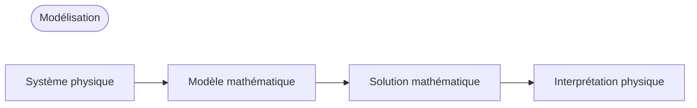

## Modélisation
- **Modèle** : Formalisation mathématique d'un problème d'ingénierie à l'aide de variables, de fonctions et d'équations
- **Modélisation mathématique** ou **modélisation** : Processus d'établissement d'un modèle, de sa résolution mathématique et d'interprétation des résultats

De nombreux concepts physiques tels que la vitesse ou l'accélération étant des dérivées, les modèles prennent souvent la forme d'**équations différentielles**.

## Équations différentielles ordinaires (EDO) et équations aux dérivées partielles (EDP)
### Équations différentielles ordinaires (EDO)
**Équation différentielle ordinaire (EDO)** : Équation contenant la dérivée n-ième d'une fonction inconnue

Exemples :

$$y' = \cos x$$

$$ y'' + 9y = e^{-2x} $$

$$ y'y''' - \frac{3}{2}y'^{2} = 0 $$

### Équations aux dérivées partielles (EDP)
**Équation aux dérivées partielles (EDP)** : Équation contenant les dérivées partielles d'une fonction inconnue à plusieurs variables

Exemple :

$$ \frac{\partial^2 u}{\partial x^2} + \frac{\partial^2 u}{\partial y^2} = 0 $$

## Solution
Une fonction $h(x)$ définie et différentiable sur un intervalle ouvert $(a, b)$ est une **solution** de l'équation différentielle ordinaire donnée sur l'intervalle $(a, b)$ si l'équation devient une identité lorsque $y$ et $y'$ sont remplacés respectivement par $h$ et $h'$. La courbe de $h$ est appelée **courbe solution**.

$$ y = h(x) $$

Exemples :

$$ y'=\cos x \Leftrightarrow y=\sin x+c $$

$$ y'=0.2y \Leftrightarrow y=ce^{0.2t} $$

Une solution contenant une constante arbitraire $c$ est appelée **solution générale** de l'équation différentielle ordinaire.

Géométriquement, la solution générale d'une EDO est un ensemble infini de courbes solutions, avec une courbe correspondant à chaque valeur de la constante $c$. Le choix d'une constante $c$ spécifique donne une **solution particulière** de l'EDO.

## Problème à valeur initiale
Pour obtenir une solution particulière du problème donné, il faut déterminer la valeur de la constante arbitraire $c$, ce qui peut souvent être fait à l'aide d'une **condition initiale** de la forme $y(x_{0})=y_{0}$ ou $y(t_{0})=y_{0}$ (on parle de condition initiale même si la variable indépendante n'est pas le temps ou si $t_{0}\neq0$). Une équation différentielle ordinaire avec une condition initiale est appelée **problème à valeur initiale**.

Exemple :

$$ y'=f(x,y),\qquad y(x_{0})=y_{0} $$

## Exemple de modélisation : Décroissance exponentielle d'une substance radioactive
Déterminez la quantité restante d'une substance radioactive au fil du temps, sachant que la quantité initiale est de 0,5g.
> L'expérience montre que les substances radioactives se décomposent à une vitesse proportionnelle à la quantité restante à chaque instant, et donc décroissent avec le temps.
{: .prompt-info }

### 1. Établissement du modèle mathématique
Soit $y(t)$ la quantité de substance restante au temps $t$. Comme $y'(t)$ est proportionnel à $y(t)$, on obtient l'**équation différentielle ordinaire du premier ordre** :

$$ \frac {dy}{dt} = -ky$$ 

(où $k>0$ est une constante).

On connaît également la **condition initiale** $y(0)=0.5$. Le modèle mathématique peut donc être formulé comme le **problème à valeur initiale** suivant :

$$ \frac {dy}{dt} = -ky, \qquad y(0)=0.5 $$

### 2. Résolution mathématique
La solution générale de l'équation différentielle établie précédemment est (voir [Méthode de séparation des variables](/posts/Separation-of-Variables/#exemple-de-modélisation--datation-par-le-carbone-radioactif)) :

$$ y(t)=ce^{-kt} $$

Comme $y(0)=c$, on obtient $y(0)=c=0.5$ à partir de la condition initiale. La solution particulière recherchée est donc :

$$ y(t)=0.5e^{-kt} \quad(k>0)$$

### 3. Interprétation physique de la solution
La solution obtenue représente la quantité de substance radioactive à un instant $t$ quelconque. La quantité de substance radioactive décroît à partir de la valeur initiale de 0,5(g) avec le temps, et la valeur limite de $y$ lorsque $t \to \infty$ est $0$.
