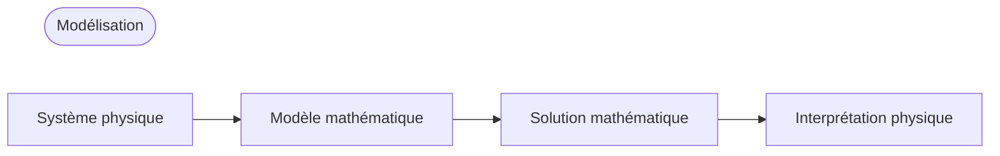

## Modélisation (Modeling)
- **Modèle (model)** : Formalisation mathématique d'un problème d'ingénierie à l'aide de variables, de fonctions et d'équations
- **Modélisation mathématique (mathematical modeling)** ou **modélisation (modeling)** : Processus de création d'un modèle, de sa résolution mathématique et de l'interprétation des résultats

De nombreux concepts physiques tels que la vitesse ou l'accélération étant des dérivées, les modèles prennent souvent la forme d'équations contenant des dérivées de fonctions inconnues, c'est-à-dire des **équations différentielles (differential equation)**.

## Équations différentielles ordinaires (EDO) et équations aux dérivées partielles (EDP)
### Équations différentielles ordinaires (EDO)
**Équation différentielle ordinaire (ordinary differential equation; ODE)** : Équation contenant la dérivée n-ième d'une fonction inconnue

Exemples :

$$y' = \cos x$$

$$ y'' + 9y = e^{-2x} $$

$$ y'y''' - \frac{3}{2}y'^{2} = 0 $$

### Équations aux dérivées partielles (EDP)
**Équation aux dérivées partielles (partial differential equation; PDE)** : Équation contenant les dérivées partielles d'une fonction inconnue à plusieurs variables

Exemple :

$$ \frac{\partial^2 u}{\partial x^2} + \frac{\partial^2 u}{\partial y^2} = 0 $$

## Solution
Si une fonction $h(x)$ est définie et différentiable sur un intervalle ouvert $(a, b)$ et que l'équation différentielle ordinaire devient une identité lorsque $y$ et $y'$ sont remplacés respectivement par $h$ et $h'$, alors la fonction

$$ y = h(x) $$

est appelée **solution** de l'équation différentielle ordinaire donnée sur l'intervalle $(a, b)$, et la courbe de $h$ est appelée **courbe solution (solution curve)**.

Exemples :

$$ y'=\cos x \Leftrightarrow y=\sin x+c $$

$$ y'=0.2y \Leftrightarrow y=ce^{0.2t} $$

Une solution contenant une constante arbitraire $c$ est appelée **solution générale (general solution)** de l'équation différentielle ordinaire.

Géométriquement, la solution générale d'une équation différentielle ordinaire est un ensemble infini de courbes solutions, avec une courbe correspondant à chaque valeur de la constante $c$. En choisissant une valeur spécifique pour $c$, on obtient une **solution particulière (particular solution)** de l'équation différentielle ordinaire.

## Problème à valeur initiale (Initial Value Problem)
Pour obtenir une solution particulière d'un problème donné, il faut déterminer la valeur de la constante arbitraire $c$, ce qui peut souvent être fait à l'aide d'une **condition initiale (initial condition)** de la forme $y(x_{0})=y_{0}$ ou $y(t_{0})=y_{0}$ (on parle de condition initiale même si la variable indépendante n'est pas le temps ou si $t_{0}\neq0$). Une équation différentielle ordinaire avec une condition initiale est appelée **problème à valeur initiale (initial value problem)**.

Exemple :

$$ y'=f(x,y),\qquad y(x_{0})=y_{0} $$

## Exemple de modélisation : Décroissance exponentielle d'une substance radioactive
Déterminez la quantité restante d'une substance radioactive au fil du temps, sachant que la quantité initiale est de 0,5g.
> L'expérience montre que les substances radioactives se décomposent à une vitesse proportionnelle à la quantité restante à chaque instant, et donc décroissent avec le temps.
{: .prompt-info }

### 1. Établissement du modèle mathématique
Soit $y(t)$ la quantité de substance restante au temps $t$. Comme $y'(t)$ est proportionnel à $y(t)$, on obtient l'**équation différentielle ordinaire du premier ordre** 

$$ \frac {dy}{dt} = -ky$$ 

(où $k>0$ est une constante).

On connaît également la **condition initiale** $y(0)=0.5$. On peut donc établir le modèle mathématique sous forme de **problème à valeur initiale** suivant :

$$ \frac {dy}{dt} = -ky, \qquad y(0)=0.5 $$

### 2. Résolution mathématique
La solution générale de l'équation différentielle ordinaire établie précédemment est (voir [Méthode de séparation des variables](/posts/Separation-of-Variables/#모델링-예제-방사성-탄소-연대측정법-radiocarbon-dating)) :

$$ y(t)=ce^{-kt} $$

Comme $y(0)=c$, on obtient $y(0)=c=0.5$ à partir de la condition initiale. Par conséquent, la solution particulière recherchée est 

$$ y(t)=0.5e^{-kt} \quad(k>0)$$

### 3. Interprétation physique de la solution
La solution obtenue représente la quantité de substance radioactive à un instant $t$ quelconque. La quantité de substance radioactive commence à la valeur initiale de 0,5(g) et diminue avec le temps, avec une valeur limite de $0$ lorsque $t \to \infty$.