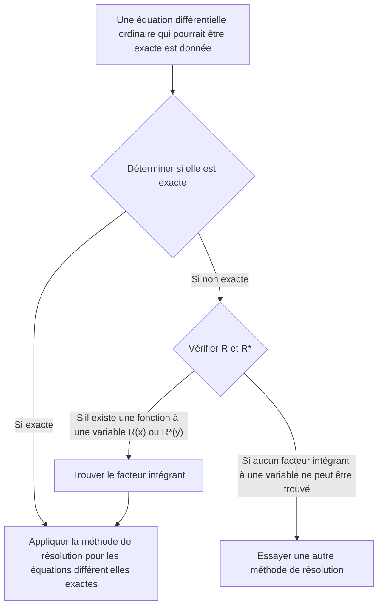

Voici la traduction en français du texte fourni, en préservant le format markdown :

---
title: "Équation différentielle exacte et facteur intégrant"
description: >-
  Nous examinons les méthodes pour déterminer et résoudre les équations différentielles exactes, ainsi que le concept de facteur intégrant.
categories: [Mathématiques, Équation différentielle]
tags: [EDO, EDO du premier ordre]
math: true
mermaid: true
---

## TL;DR

## Équation différentielle exacte
Une équation différentielle ordinaire du premier ordre $M(x,y)+N(x,y)y'=0$ peut être écrite sous la forme :

$$ M(x,y)dx+N(x,y)dy=0 \tag{1} $$

Si 

$$ \exists u(x,y): \frac{\partial u}{\partial x}=M(x,y) \land \frac{\partial u}{\partial y}=N(x,y) \tag{2} $$

alors 

$$ M(x,y)dx+N(x,y)dy=\frac{\partial u}{\partial x}dx+\frac{\partial u}{\partial y}dy=du \tag{3} $$

et dans ce cas, l'équation différentielle ordinaire $M(x,y)dx+N(x,y)dy=0$ est appelée **équation différentielle exacte**. Cette équation différentielle peut alors être écrite sous la forme :

$$ du=0 $$

et en intégrant, on obtient directement la solution générale sous la forme :

$$ u(x,y)=c \tag{4} $$

## Détermination d'une équation différentielle exacte
Supposons que dans le plan $xy$, $M$ et $N$ ainsi que leurs dérivées partielles du premier ordre soient continues sur une région fermée délimitée par une courbe fermée qui ne se croise pas elle-même. En examinant à nouveau la condition (2), on a :

$$ \begin{align*}
\frac {\partial u}{\partial x}&=M(x,y) \tag{2a}
\\ \frac {\partial u}{\partial y}&=N(x,y) \tag{2b}
\end{align*}$$

En dérivant partiellement ces équations, on obtient :

$$ \begin{align*}
\frac {\partial M}{\partial y} &= \frac{\partial^2 u}{\partial y \partial x}
\\ \frac {\partial N}{\partial x} &= \frac{\partial^2 u}{\partial x \partial y}
\end{align*}$$

Comme nous avons supposé la continuité, les deux dérivées partielles secondes sont égales.

$$ \therefore \frac {\partial M}{\partial y}=\frac {\partial N}{\partial x} \tag{5}$$

Par conséquent, on peut voir que la condition (5) est une condition nécessaire pour que l'équation différentielle (1) soit exacte, et bien que nous ne l'ayons pas prouvé ici, c'est en fait aussi une condition suffisante. Ainsi, on peut déterminer si une équation différentielle est exacte en vérifiant si cette condition est satisfaite.

## Résolution d'une équation différentielle exacte
En intégrant l'équation (2a) par rapport à $x$, en considérant $y$ comme une constante, on obtient :

$$ u = \int M(x,y) dx + k(y) \tag{6} $$

Ici, $k(y)$ joue le rôle d'une constante d'intégration, car $y$ est considéré comme une constante. Maintenant, en considérant $x$ comme une constante et en dérivant l'équation (6) par rapport à $y$, on obtient $\partial u/\partial y$ comme suit :

$$ \frac{\partial u}{\partial y} = \frac{\partial}{\partial y}\int M(x,y) dx + \frac{dk}{dy} $$

En comparant cette équation avec l'équation (2b), on peut déterminer $dk/dy$ :

$$ \frac{\partial}{\partial y}\int M(x,y) dx + \frac{dk}{dy} = N(x,y) $$

$$ \frac{dk}{dy} = N(x,y) - \frac{\partial}{\partial y}\int M(x,y) dx $$

Enfin, en intégrant cette équation pour déterminer $k(y)$ et en substituant dans l'équation (6), on peut obtenir la solution implicite $u(x,y)=c$ :

$$ k(y) = \int N(x,y)dy - \int \left(\frac{\partial}{\partial y}\int Mdx\right)dy + c^* $$

$$ \int M(x,y)dx + \int N(x,y)dy - \int \left(\frac{\partial}{\partial y}\int Mdx\right)dy = c $$

> Il est plus important de comprendre le processus de résolution que de mémoriser cette forme de solution générale comme une formule à appliquer.
{: .prompt-tip }

## Facteur intégrant
Supposons qu'une équation différentielle ordinaire inexacte soit donnée :

$$ P(x,y)dx+Q(x,y)dy = 0 \quad \left( \frac {\partial P}{\partial y} \neq \frac {\partial Q}{\partial x} \right) \tag{7} $$

Si

$$ \exists F(x,y): \frac {\partial}{\partial y}(FP) = \frac {\partial}{\partial x}(FQ) \tag{8} $$

alors en multipliant l'équation différentielle donnée (7) par la fonction $F$, on obtient l'équation différentielle exacte suivante :

$$ FP\ dx+FQ\ dy = 0 \tag{9} $$

Dans ce cas, la fonction $F(x,y)$ est appelée **facteur intégrant** de l'équation (7).

## Méthode pour trouver le facteur intégrant
En appliquant la règle du produit à l'équation (8) et en notant les dérivées partielles en indice, on obtient :

$$ F_y P + FP_y = F_x Q + FQ_x $$

Dans de nombreux cas pratiques, il existe un facteur intégrant qui ne dépend que d'une seule variable. Si $F=F(x)$, alors $F_y=0$ et $F_x=F'=dF/dx$, ce qui donne :

$$ FP_y = F'Q + FQ_x $$

En divisant les deux côtés par $FQ$ et en réarrangeant les termes, on obtient :

$$ \begin{align*}
\frac{1}{F} \frac{dF}{dx} &= \frac{P_y}{Q} - \frac{Q_x}{Q}
\\ &= \frac{1}{Q}\left(\frac{\partial P}{\partial y}-\frac{\partial Q}{\partial x} \right)
\end{align*} \tag{10} $$

Par conséquent, on a :

> Pour l'équation différentielle donnée (7), si le côté droit de l'équation (10), $R$, est une fonction de $x$ uniquement, alors l'équation (7) a un facteur intégrant $F=F(x)$.
>
> $$ F(x)=e^{\int R(x)dx}, \quad \text{où }R=\frac{1}{Q}\left(\frac{\partial P}{\partial y}-\frac{\partial Q}{\partial x} \right) \tag{11} $$
{: .prompt-info }

De même, si $F^\*=F^\*(y)$, on obtient à la place de l'équation (10) :

$$ \frac{1}{F^*} \frac{dF^*}{dy} = \frac{1}{P}\left(\frac{\partial Q}{\partial x}-\frac{\partial P}{\partial y} \right) \tag{12} $$

Par conséquent, on a :

> Pour l'équation différentielle donnée (7), si le côté droit de l'équation (12), $R^*$, est une fonction de $y$ uniquement, alors l'équation (7) a un facteur intégrant $F^\*=F^\*(y)$.
>
> $$ F^*(y)=e^{\int R^*(y)dy}, \quad \text{où }R^*=\frac{1}{P}\left(\frac{\partial Q}{\partial x}-\frac{\partial P}{\partial y} \right) \tag{13} $$
{: .prompt-info }