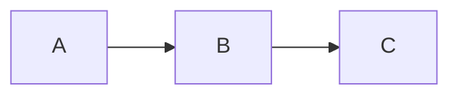

## TL;DR
> **Activité à un temps t arbitraire**
>
> $$\begin{align*}
> \alpha (t) &= \lambda n(t)
> \\ &= \alpha_0 e^{-\lambda t}
> \\ &= \alpha_0 e^{-0.693t/T_{1/2}}
> \end{align*}$$
{: .prompt-info }

> **Relation entre la constante de désintégration, la demi-vie et la durée de vie moyenne**
>
> $$ \begin{align*}
> T_{1/2}&=\frac {\ln 2}{\lambda} = \frac {0.693}{\lambda}
> \\
> \\ \overline{t}&=\frac {1}{\lambda}
> \\ &=\frac {T_{1/2}}{0.693}=1.44T_{1/2}
> \end{align*} $$
{: .prompt-info }

## Constante de désintégration (Decay Constant)
- Probabilité qu'un noyau se désintègre par unité de temps
- Constante indépendante du temps, déterminée uniquement par le type de nucléide
- Notée par le symbole $\lambda$

## Radioactivité (Radioactivity)
Si n(t) est le nombre de noyaux qui ne se sont pas encore désintégrés au temps t, alors en moyenne $\lambda n(t)$ noyaux se désintègrent pendant l'intervalle dt entre t et t+dt. Ce taux de désintégration est appelé *radioactivité* de l'échantillon et est noté par le symbole $\alpha$. Ainsi, la radioactivité à un temps t donné est :

$$ \alpha (t)=\lambda n(t) \tag{1}$$

## Unités de radioactivité
### Curie (Ci)
- Unité traditionnellement utilisée avant l'adoption du becquerel
- Radioactivité de 1g de radium-226
- $3.7\times 10^{10}$ désintégrations nucléaires par seconde ($3.7\times 10^{10}\text{Bq}$)

### Becquerel (Bq)
- Unité du Système International (SI)
- Une désintégration nucléaire par seconde
- $1 \text{Bq} = 2.703\times 10^{-11}\text{Ci} = 27\text{pCi}$

## Calcul de l'évolution de la radioactivité dans le temps
Comme $\lambda n(t)$ noyaux se désintègrent pendant dt, la diminution du nombre de noyaux restants dans l'échantillon pendant dt peut être exprimée comme suit :

$$ -dn(t)=\lambda n(t)dt $$

En intégrant, on obtient :

$$ n(t)=n_0e^{-\lambda t} \tag{2} $$

En multipliant les deux côtés par $\lambda$, la radioactivité devient :

$$ \alpha (t)=\alpha_0e^{-\lambda t} \tag{3} $$

La radioactivité est réduite de moitié pendant la *demi-vie (half-life)*, donc :

$$ \alpha (T_{1/2})=\alpha_0/2 $$

En substituant cela dans l'équation (3) :

$$ \alpha_0/2=\alpha_0e^{-\lambda T_{1/2}} $$

En prenant le logarithme des deux côtés et en résolvant pour la demi-vie $T_{1/2}$ :

$$ T_{1/2}=\frac {\ln 2}{\lambda}=\frac {0.693}{\lambda} \tag{4}$$

En résolvant cette équation pour $\lambda$ et en substituant dans l'équation (3) :

$$ \alpha (t)=\alpha_0e^{-0.693t/T_{1/2}} \tag{5} $$

L'équation (5) est souvent plus pratique à utiliser que l'équation (3) pour les calculs de désintégration radioactive, car la valeur de la demi-vie est plus souvent donnée que la constante de désintégration.

La *durée de vie moyenne (mean-life)* $\overline{t}$ des noyaux radioactifs est l'inverse de la constante de désintégration.

$$ \overline{t}=1/\lambda $$

De l'équation (3), on peut voir que pendant une durée de vie moyenne, la radioactivité tombe à $1/e$ de sa valeur initiale. De l'équation (4), on peut établir la relation suivante entre la durée de vie moyenne et la demi-vie :

$$ \overline{t}=\frac {T_{1/2}}{0.693}=1.44T_{1/2} \tag{6} $$

### ※ Dérivation de la durée de vie moyenne $\overline{t}$

$$ \begin{align*}
\overline{t}&=\frac {\int_0^\infty t\alpha(t)}{\int_0^\infty t} = \frac {\int_0^\infty t\alpha(t)}{n_0}
\\ &= \frac {\int_0^\infty n_0 \lambda te^{-\lambda t}}{n_0}
\\ &= \int_0^\infty \lambda te^{-\lambda t}
\\ &= \left[-te^{-\lambda t}\right]_0^\infty +\int_0^\infty e^{-\lambda t}
\\ &=\left[-\frac {1}{\lambda} e^{-\lambda t}\right]_0^\infty
\\ &=\frac {1}{\lambda}
\end{align*}$$

## Exemple : Chaîne de désintégration radioactive 1
Supposons qu'un radionucléide soit produit à une vitesse de $R$ atomes/s. Ces noyaux commencent à se désintégrer dès leur formation. Calculez la radioactivité de ce nucléide à un temps t arbitraire.

### 1. Établissement du modèle

$$ \text{Taux de variation du nucléide dans le temps} = \text{Taux de production} - \text{Taux de perte} $$

En notation mathématique :

$$ dn/dt = -\lambda n + R $$

### 2. Solution générale
Déplaçons tous les termes en n vers la gauche et multiplions les deux côtés par $e^{\lambda t}$.

$$ \frac {dn}{dt} + \lambda n = R $$

$$ e^{\lambda t}\frac {dn}{dt} + \lambda e^{\lambda t}n = Re^{\lambda t} $$

Comme $\lambda e^{\lambda t}=\frac {d}{dt} e^{\lambda t}$, on peut réarranger comme suit :

$$ e^{\lambda t}\frac {dn}{dt}+\left(\frac {d}{dt} e^{\lambda t}\right)n = Re^{\lambda t} $$

En intégrant les deux côtés, on obtient la solution générale :

$$ e^{\lambda t}n=\frac {R}{\lambda}e^{\lambda t}+c $$

$$ n=ce^{-\lambda t}+\frac {R}{\lambda} $$

### 3. Solution particulière
Supposons que le nombre de ce nucléide soit $n_0$ à t=0 et trouvons la valeur de la constante c.

$$ n(0)=c+\frac {R}{\lambda}=n_0 $$

$$ c=n_0-\frac {R}{\lambda} $$

Donc, la solution particulière pour la situation donnée est :

$$ n = n_0e^{-\lambda t}+\frac {R}{\lambda}(1-e^{-\lambda t}) \tag{7} $$

On peut obtenir la radioactivité de ce nucléide en multipliant les deux côtés de l'équation par $\lambda$.

$$ \alpha = \alpha_0e^{-\lambda t}+R(1-e^{-\lambda t}) \tag{8} $$

Ainsi, quand $t\to\infty$, $\alpha_{\text{max}}=R$, $n_{\text{max}}=R/\lambda$.

## Exemple : Chaîne de désintégration radioactive 2
Calculez la radioactivité du radionucléide B dans la chaîne de désintégration suivante :

### 1. Établissement du modèle

$$ \text{Taux de variation du nombre de noyaux B} = \text{Taux de production par désintégration de A} - \text{Taux de désintégration de B en C} $$

$$ \frac {dn_B}{dt} = -\lambda_B n_B + \lambda_A n_A $$

En substituant l'équation (2) pour $n_A$, on obtient l'équation différentielle suivante pour $n_B$ :

$$  \frac {dn_B}{dt} = -\lambda_B n_B + \lambda_A n_{A0}e^{-\lambda_A t} \tag{9}$$ 

### 2. Solution générale
Pour résoudre l'équation différentielle, déplaçons tous les termes en $n_B$ vers la gauche et multiplions les deux côtés par $e^{\lambda_B t}$.

$$ \frac {dn_B}{dt} + \lambda_B n_B = n_{A0}\lambda_A e^{-\lambda_A t} $$

$$ e^{\lambda_B t}\frac {dn_B}{dt} + \lambda_B e^{\lambda_B t}n_B = n_{A0}\lambda_A e^{(\lambda_B-\lambda_A)t} $$

Comme $\lambda_B e^{\lambda_B t}=\frac {d}{dt} e^{\lambda_b t}$, on peut réarranger comme suit :

$$ e^{\lambda_B t}\frac {dn_B}{dt} + \left(\frac {d}{dt} e^{\lambda_B t}\right)n_B = n_{A0}\lambda_A e^{(\lambda_B-\lambda_A)t} $$

En intégrant les deux côtés :

$$ e^{\lambda_B t}n_B = \frac {n_{A0}\lambda_A}{\lambda_B-\lambda_A}e^{(\lambda_B-\lambda_A)t}+c $$

En divisant les deux côtés par $e^{\lambda_B t}$, on obtient la solution générale :

$$ n_B = \frac {n_{A0}\lambda_A}{\lambda_B-\lambda_A}e^{-\lambda_A t}+ce^{-\lambda_B t} $$

### 3. Solution particulière
Supposons que le nombre d'éléments B soit $n_{B0}$ à t=0 et trouvons la valeur de la constante c.

$$ n_B(0)=\frac {n_{A0}\lambda_A}{\lambda_B-\lambda_A}+c=n_{B0} $$

$$ c=n_{B0}-\frac{n_{A0}\lambda_A}{\lambda_B-\lambda_A} $$

Donc, la solution particulière pour la situation donnée est :

$$ n_B = n_{B0}e^{-\lambda_B t} + \frac {n_{A0}\lambda_A}{\lambda_B - \lambda_A} (e^{-\lambda_A t} - e^{-\lambda_B t}) \tag{10}$$

$$ \therefore \alpha_B = \alpha_{B0} e^{-\lambda_B t} + \frac {\alpha_{A0}\lambda_A}{\lambda_B - \lambda_A} (e^{-\lambda_A t} - e^{-\lambda_B t}) \tag{11}$$