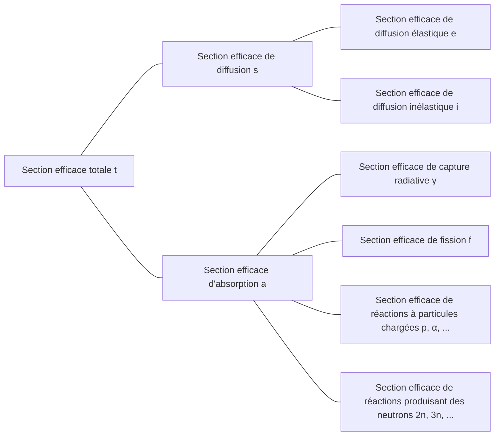

## Section efficace (cross-section) ou section efficace microscopique (microscopic cross-section)
Considérons un faisceau de neutrons monoénergétiques incident sur une cible (très mince) d'épaisseur $\tau$ et de surface $A$, avec un nombre de neutrons incidents par unité de surface et par seconde $I\ \text{neutrons/cm}^2\cdot \text{s}$. Comme le volume occupé par les noyaux atomiques est très petit par rapport au volume total de l'atome, et puisque la cible est très mince, la plupart des neutrons traversent la cible sans interagir avec les noyaux. Le nombre de neutrons par unité de surface et par seconde qui entrent en collision avec les noyaux est proportionnel à l'intensité du faisceau $I$, à l'épaisseur de la cible $\tau$ et à la densité atomique de la cible $N$.

$$ \Delta I \propto I\tau N $$

En introduisant une constante de proportionnalité $\sigma$, on peut écrire :

$$ \Delta I = \sigma I\tau N\ \mathrm{[neutrons/cm^2\cdot s]} \label{eqn:microscopic_cross_section}\tag{1} $$

La proportion de neutrons incidents qui entrent en collision avec les noyaux est :

$$ p = \frac {\Delta I}{I} = \sigma\tau N = \frac {\sigma}{A} A\tau N = \frac {\sigma}{A} N_t \label{eqn:collision_rate}\tag{2} $$

($N_t$ : nombre total d'atomes dans la cible)

Cette équation montre que $\sigma$ a les dimensions d'une surface. Cette constante de proportionnalité $\sigma$ est appelée *section efficace (cross-section)* ou *section efficace microscopique (microscopic cross-section)*. Physiquement, la section efficace représente la surface effective qu'un noyau présente à un neutron pour interagir avec lui.

## Unité de la section efficace microscopique
Le cm$^2$ étant une unité trop grande pour exprimer les sections efficaces microscopiques, on utilise généralement l'unité *barn* (b).

$$ 1\ \text{b} = 10^{-24}\ \text{cm}^2 \label{eqn:barn}\tag{3}$$

## Types de sections efficaces microscopiques
- Section efficace totale : $\sigma_t$
  - Section efficace de diffusion (scattering) : $\sigma_s$
    - Section efficace de diffusion élastique (elastic scattering) : $\sigma_e$
    - Section efficace de diffusion inélastique (inelastic scattering) : $\sigma_i$
  - Section efficace d'absorption (absorption) : $\sigma_a$
    - Section efficace de capture radiative (radiative capture) : $\sigma_\gamma$
    - Section efficace de fission (fission) : $\sigma_f$
    - Section efficace de réactions à particules chargées (charged-particle reactions) : $\sigma_p, \sigma_\alpha, \cdots$
    - Section efficace de réactions produisant des neutrons (neutron-producing reactions) : $\sigma_{2n}, \sigma_{3n}, \cdots$

## Interactions des neutrons
Les neutrons étant électriquement neutres, ils ne sont pas affectés par les forces électriques des électrons ou des charges positives des noyaux. Par conséquent, les neutrons peuvent traverser le nuage électronique et interagir directement avec les noyaux.

### Formation d'un noyau composé
La plupart des interactions entre les neutrons et la matière se déroulent en deux étapes :
1. Le neutron et le noyau fusionnent pour former un noyau composé (compound nucleus)
2. Le noyau composé se désintègre de différentes manières

$$ \begin{align*}
\mathrm{^A Z} + \mathrm{n} \to \left( \mathrm{^{A+1}Z} \right)^*
&\to \mathrm{^A Z} + \mathrm{n} \text{ (diffusion élastique)} \\
&\to \mathrm{^A Z} + \mathrm{n}^\prime \text{ (diffusion inélastique)} \\
&\to \mathrm{^{A+1}Z} + \gamma \text{ (capture radiative)} \\
&\qquad \vdots
\end{align*} $$

Les noyaux possèdent différents niveaux d'énergie quantifiés selon la configuration de leurs nucléons. Lorsque l'énergie du neutron incident correspond à l'un des états excités du noyau cible, la formation du noyau composé est favorisée. Ainsi, pour des neutrons d'énergies spécifiques, la section efficace atteint un maximum. Ce phénomène est appelé *résonance*.

### Diffusion élastique (elastic scattering)
- Le neutron rebondit après collision avec le noyau
- Le noyau reste dans son état fondamental sans changement d'énergie
- Notée $(\mathrm{n}, \mathrm{n})$

La section efficace de diffusion élastique en fonction de l'énergie du neutron incident peut être divisée en trois régions distinctes.

> **Sections efficaces élastique et totale du carbone-12**  
> - Graphique fourni par : Centre de Données Nucléaires de l'Institut de Recherche sur l'Énergie Atomique de Corée (Nuclear Data Center at KAERI), Table of Nuclides (<https://atom.kaeri.re.kr/nuchart/>)

> **Sections efficaces élastique et totale de l'uranium-238**  
> - Graphique fourni par : Centre de Données Nucléaires de l'Institut de Recherche sur l'Énergie Atomique de Corée (Nuclear Data Center at KAERI), Table of Nuclides (<https://atom.kaeri.re.kr/nuchart/>)

#### Région de basse énergie (low-energy region)
Dans cette région, la section efficace de diffusion élastique est approximativement constante. Aucun noyau composé ne se forme, mais le noyau exerce une force sur le neutron qui passe à proximité, provoquant une légère diffusion. Ce phénomène est appelé diffusion potentielle (potential scattering), et la section efficace correspondante est donnée par :

$$ \sigma_e = 4\pi R^2 \label{eqn:potential_scattering}\tag{4}$$

où $R$ est le rayon atomique.

> **Pourquoi la section efficace de diffusion n'est pas constante aux très basses énergies**  
> L'approximation ci-dessus est valable pour le carbone-12 dans la plage d'énergie d'environ 0,02 eV à 0,01 MeV. À des énergies encore plus basses, on observe que $\sigma_e \propto 1/E$ dans les données réelles.
>
> Selon le **modèle de Ramsauer**, la relation entre la section efficace de diffusion et l'énergie des neutrons à basse énergie est :
>
> $$ \sigma(E) \propto \left(R+\lambda(E)\right)^2. $$
>
> D'après [l'équation de la longueur d'onde de de Broglie des neutrons](/posts/Mass-and-Energy-Particles-and-Waves/#en-négligeant-les-effets-relativistes-ex--neutron), $\lambda(E) \propto \cfrac{1}{\sqrt{E}}$. Généralement, $\lambda(E) \ll R$, ce qui permet d'approximer $\sigma(E) \propto R^2$. Cependant, à très basse énergie, le neutron se comporte davantage comme une onde que comme une particule, et sa longueur d'onde de de Broglie devient plus grande que le rayon atomique. Dans ce cas, $\lambda(E)$ devient le terme dominant, et $\sigma(E) \propto \lambda(E)^2 \propto \cfrac{1}{E}$.
{: .prompt-info }

#### Région de résonance (resonance region)
À partir de cette région, le noyau absorbe momentanément le neutron pour former un noyau composé, puis réémet un neutron de même énergie que le neutron incident, produisant une diffusion élastique par résonance (elastic resonance scattering). Comme la résonance se produit pour des neutrons dont l'énergie correspond aux différences entre les niveaux d'énergie du noyau cible, on observe des pics de section efficace à certaines valeurs d'énergie.

Plus le nucléide est lourd, plus la région de résonance apparaît à basse énergie. Pour l'uranium-238, la région de résonance commence à une énergie beaucoup plus basse (environ 6 eV) que pour le carbone-12 et s'étend jusqu'à environ 1 keV.

#### Région de haute énergie (smooth region)
À haute énergie, l'espacement entre les niveaux d'énergie du noyau devient si petit que les résonances individuelles ne sont plus distinguables. Dans cette région, $\sigma_e$ varie lentement et de façon continue avec l'énergie du neutron.

### Diffusion inélastique (inelastic scattering)
- Le neutron rebondit après collision avec le noyau
- Contrairement à la diffusion élastique, le noyau absorbe une partie de l'énergie du neutron et passe à un état excité ([réaction endothermique](/posts/nuclear-reactions-and-binding-energy/#réaction-exothermique--réaction-endothermique))
- Comme les niveaux d'énergie des noyaux sont quantifiés, cette réaction ne peut se produire que si le neutron incident possède une énergie supérieure ou égale à la différence entre deux niveaux d'énergie du noyau
  - Plus le nucléide est lourd, plus ses niveaux d'énergie sont finement divisés, facilitant la diffusion inélastique, tandis que ce phénomène est rare pour les nucléides légers
  - Comme on peut le voir sur les graphiques ci-dessous, l'énergie seuil de diffusion inélastique du carbone est de 4,80 MeV, alors que celle de l'uranium-238 n'est que de 44 keV
- Au-delà de l'énergie seuil, la section efficace de diffusion inélastique $\sigma_i$ est approximativement du même ordre de grandeur que la section efficace de diffusion élastique $\sigma_e$
- Notée $(\mathrm{n}, \mathrm{n}^{\prime})$
- Le noyau excité retourne ensuite à son état fondamental en émettant un rayon gamma, appelé *rayon gamma inélastique (inelastic $\gamma$-ray)*

> **Sections efficaces de diffusion élastique et inélastique du C-12**  
> - Graphique fourni par : Centre de Données Nucléaires de l'Institut de Recherche sur l'Énergie Atomique de Corée (Nuclear Data Center at KAERI), Table of Nuclides (<https://atom.kaeri.re.kr/nuchart/>)

> **Sections efficaces de diffusion élastique et inélastique de l'U-238**  
> - Graphique fourni par : Centre de Données Nucléaires de l'Institut de Recherche sur l'Énergie Atomique de Corée (Nuclear Data Center at KAERI), Table of Nuclides (<https://atom.kaeri.re.kr/nuchart/>)

### Capture radiative (radiative capture)
- Le noyau capture le neutron et émet un ou plusieurs rayons gamma ([réaction exothermique](/posts/nuclear-reactions-and-binding-energy/#réaction-exothermique--réaction-endothermique))
- Notée $(\mathrm{n}, \gamma)$
- Les rayons gamma émis sont appelés *rayons gamma de capture (capture $\gamma$-rays)*
- Le neutron étant absorbé par le noyau, il s'agit d'une réaction d'absorption

Comme pour la [diffusion élastique](#diffusion-élastique-elastic-scattering), la section efficace de capture radiative $\sigma_\gamma$ peut être divisée en trois régions.

> **Section efficace de capture radiative de l'Au-197**  
> - Graphique fourni par : Centre de Données Nucléaires de l'Institut de Recherche sur l'Énergie Atomique de Corée (Nuclear Data Center at KAERI), Table of Nuclides (<https://atom.kaeri.re.kr/nuchart/>)

#### Région de basse énergie (région $1/v$)
Dans la région de basse énergie, la section efficace de capture radiative $\sigma_\gamma$ de la plupart des nucléides est proportionnelle à $1/\sqrt{E}$, c'est-à-dire à $1/v$. On peut observer cette relation linéaire de pente $-1/2$ dans la partie gauche du graphique log-log de la section efficace de capture radiative de l'or-197 ci-dessus.

Certains nucléides importants ne suivent pas exactement ce comportement en $1/v$ dans la région des neutrons de très basse énergie. Ces nucléides sont appelés absorbeurs non-$1/v$ (non-$1/v$ absorbers).

#### Région de résonance
Au-delà de la région $1/v$, on observe une région de résonance dans la même plage d'énergie que pour les réactions de diffusion. Pour une résonance à l'énergie $E_r$, la section efficace de capture radiative $\sigma_\gamma$ au voisinage de cette résonance est donnée par la formule de Breit-Wigner à un niveau :

$$ \sigma_\gamma = \frac{\gamma_r^2 g}{4\pi}\frac{\Gamma_n\Gamma_g}{(E-E_r)^2 + \Gamma^2/4} \label{eqn:breit_wigner}\tag{5}$$

où :
- $\gamma_r$ : longueur d'onde de de Broglie d'un neutron d'énergie $E_r$
- $g$ : *facteur statistique (statistical factor)*, constante
- $\Gamma \ (=\Gamma_n + \Gamma_\gamma)$ : *largeur totale (total width)*, constante
  - $\Gamma_n$ : *largeur neutronique (neutron width)*, constante
  - $\Gamma_\gamma$ : *largeur radiative (radiation width)*, constante

> La largeur de résonance $\Gamma$ correspond à l'écart d'énergie entre les deux points où la section efficace vaut la moitié de sa valeur maximale : $\sigma_\gamma(E_r \pm \Gamma/2) = \cfrac{1}{2}\sigma_\gamma(E_r)$. C'est l'origine du terme *largeur (width)*.
{: .prompt-tip }

#### Région de haute énergie (au-delà de la région de résonance)
Au-delà de la région de résonance, à plus haute énergie (généralement au-dessus de 1 keV pour les nucléides lourds, et à des énergies encore plus élevées pour les nucléides légers), $\sigma_\gamma$ diminue d'abord rapidement puis continue à décroître lentement à des valeurs très faibles.

### Réactions à particules chargées (charged-particle reactions)
- Le noyau capture le neutron et émet une particule chargée comme une particule alpha ($\alpha$) ou un proton ($\mathrm{p}$)
- Notées $(\mathrm{n}, \alpha)$, $(\mathrm{n}, \mathrm{p})$, etc.
- Peuvent être [exothermiques ou endothermiques](/posts/nuclear-reactions-and-binding-energy/#réaction-exothermique--réaction-endothermique) selon les cas, mais sont généralement [endothermiques](/posts/nuclear-reactions-and-binding-energy/#réaction-exothermique--réaction-endothermique)
- Ne se produisent pas en deçà de l'énergie seuil et ont généralement des sections efficaces faibles, surtout pour les noyaux lourds

Malgré ces caractéristiques, certaines réactions à particules chargées impliquant des noyaux légers sont importantes.

#### Réactions exothermiques
##### $^{10}\mathrm{B}(\mathrm{n},\alpha){^7\mathrm{Li}}$

> **Section efficace de la réaction $^{10}\mathrm{B}(\mathrm{n},\alpha){^7\mathrm{Li}}$**  
> - Graphique fourni par : Centre de Données Nucléaires de l'Institut de Recherche sur l'Énergie Atomique de Corée (Nuclear Data Center at KAERI), Table of Nuclides (<https://atom.kaeri.re.kr/nuchart/>)

- On peut observer que $\sigma_\alpha \propto 1/v$ pour les énergies inférieures à $100\ \mathrm{keV}$
- La section efficace $\sigma_\alpha$ est très élevée pour les neutrons de basse énergie, ce qui en fait un matériau couramment utilisé pour absorber les neutrons de faible énergie

> Dans les réacteurs utilisant l'eau comme modérateur et caloporteur, le bore est souvent ajouté au modérateur pour absorber l'excès de neutrons lors du contrôle de la réaction ou pour l'arrêt d'urgence.
{: .prompt-tip }

##### $^{6}\mathrm{Li}(\mathrm{n},\alpha){^3\mathrm{H}}$

> **Section efficace de la réaction $^{6}\mathrm{Li}(\mathrm{n},\alpha){^3\mathrm{H}}$**  
> - Graphique fourni par : Centre de Données Nucléaires de l'Institut de Recherche sur l'Énergie Atomique de Corée (Nuclear Data Center at KAERI), Table of Nuclides (<https://atom.kaeri.re.kr/nuchart/>)

- De même, $\sigma_\alpha \propto 1/v$ pour les énergies inférieures à environ $100\ \mathrm{keV}$
- Utilisée pour produire du tritium ($^3\mathrm{H}$)

> Cette réaction est particulièrement importante dans les couvertures (blankets) des réacteurs à fusion. [Le tritium ayant une demi-vie courte, il est rare à l'état naturel](/posts/Nuclear-Stability-and-Radioactive-Decay/#tritium) et doit être produit dans le réacteur même. La couverture de lithium entourant la chambre de fusion absorbe les neutrons issus de la réaction de fusion, produisant ainsi du tritium qui est ensuite collecté pour servir de combustible.  
> Cette réaction étant exothermique, une partie de l'énergie des neutrons issus de la fusion est convertie en énergie thermique, qui est ensuite transformée en électricité dans les centrales à fusion.
{: .prompt-tip }

#### Réactions endothermiques
##### $^{16}\mathrm{O}(\mathrm{n},\mathrm{p}){^{16}\mathrm{N}}$

> **Section efficace de la réaction $^{16}\mathrm{O}(\mathrm{n},\mathrm{p}){^{16}\mathrm{N}}$**  
> - Graphique fourni par : Centre de Données Nucléaires de l'Institut de Recherche sur l'Énergie Atomique de Corée (Nuclear Data Center at KAERI), Table of Nuclides (<https://atom.kaeri.re.kr/nuchart/>)

- Possède une énergie seuil d'environ 9 MeV, bien supérieure à l'énergie moyenne des neutrons issus de la fission de l'uranium-235 (2-3 MeV), ce qui rend cette réaction relativement rare (environ 1 neutron sur plusieurs milliers)
- Malgré sa rareté, cette réaction est importante car elle constitue la principale source d'activation de l'eau dans les réacteurs utilisant l'eau comme caloporteur et modérateur
  - L'$^{16}\mathrm{O}$ des molécules d'eau se transforme en $^{16}\mathrm{N}$ par cette réaction. Le $^{16}\mathrm{N}$ a une demi-vie d'environ 7 secondes et se désintègre par [désintégration bêta](/posts/Nuclear-Stability-and-Radioactive-Decay/#désintégration-bêta-beta-decay) en émettant également des rayons gamma de 6-7 MeV par [transition isomérique](/posts/Nuclear-Stability-and-Radioactive-Decay/#transition-isomérique-isomeric-transition)

### Réactions produisant des neutrons (neutron-producing reactions)
- Collision entre un neutron de haute énergie et un noyau, produisant deux neutrons ou plus (réaction endothermique)
- Notées (n, 2n), (n, 3n), etc.
- La réaction (n, 2n) est particulièrement importante dans les réacteurs contenant de l'eau lourde ou du béryllium, car les neutrons du $^2\text{H}$ et du $^9\text{Be}$ sont faiblement liés et peuvent être facilement éjectés même par des neutrons de faible énergie

> **Sections efficaces des réactions $\mathrm{D}(\mathrm{n},\mathrm{2n})\mathrm{p}$ et $^{9}\mathrm{Be}(\mathrm{n},\mathrm{2n}){^{8}\mathrm{Be}}$**  
> - Graphique fourni par : Centre de Données Nucléaires de l'Institut de Recherche sur l'Énergie Atomique de Corée (Nuclear Data Center at KAERI), Table of Nuclides (<https://atom.kaeri.re.kr/nuchart/>)

### Fission (fission)
- Un neutron entre en collision avec un noyau et le divise en deux ou plusieurs fragments

> La fission et les sections efficaces de fission feront l'objet d'un article séparé.
{: .prompt-info }

### Section efficace totale
#### Région de basse énergie

$$ \sigma_t = 4\pi R^2 + \frac{C}{\sqrt{E}} \label{eqn:total_cross_section}\tag{6}$$

- Le premier terme représente la [section efficace de diffusion élastique](#région-de-basse-énergie-low-energy-region), et le second terme représente la section efficace de [capture radiative](#région-de-basse-énergie-région-1v) et de toutes les réactions exothermiques possibles à cette énergie
- Si le premier terme est dominant, la section efficace totale sera constante à basse énergie ; si c'est le second terme qui domine, elle suivra un comportement en $1/v$

#### Région de résonance
Elle inclut les résonances observées dans [$\sigma_s$](#région-de-résonance-resonance-region) et [$\sigma_\gamma$](#région-de-résonance), et apparaît dans la même plage d'énergie que ces deux sections efficaces. Plus le nucléide est léger, plus les résonances se produisent à des énergies élevées et sur une large plage d'énergie. À l'inverse, plus le nucléide est lourd, plus les résonances apparaissent à des énergies basses et sur une plage d'énergie étroite.

#### Région de haute énergie
Au-delà de la région de résonance, $\sigma_t$ diminue progressivement avec l'énergie.

## Sections efficaces de l'hydrogène et du deutérium
Les noyaux d'$^1\mathrm{H}$ et de $^2\mathrm{H}$ sont présents en grande quantité dans de nombreux réacteurs* et interagissent avec les neutrons de manière différente des autres noyaux :
- Ils ne forment pas de [noyau composé](#formation-dun-noyau-composé)
- Ils n'ont pas de [région de résonance](#région-de-résonance-1)
  - Leur [section efficace de diffusion élastique est constante](#région-de-basse-énergie-low-energy-region)
  - Leur [section efficace de capture radiative suit un comportement en $1/v$ pour toutes les énergies de neutrons](#région-de-basse-énergie-région-1v)
- En particulier, l'$^1\mathrm{H}$ étant constitué d'un seul proton sans état excité, il ne peut pas subir de [diffusion inélastique](#diffusion-inélastique-inelastic-scattering)

> * Généralement sous forme d'eau légère ($\mathrm{H_2O}$) ou d'eau lourde ($\mathrm{D_2O}$) utilisées comme caloporteur et modérateur dans les réacteurs.
{: .prompt-info }

> **Sections efficaces de H-1**  
> - Graphique fourni par : Centre de Données Nucléaires de l'Institut de Recherche sur l'Énergie Atomique de Corée (Nuclear Data Center at KAERI), Table of Nuclides (<https://atom.kaeri.re.kr/nuchart/>)

> **Sections efficaces de H-2**  
> - Graphique fourni par : Centre de Données Nucléaires de l'Institut de Recherche sur l'Énergie Atomique de Corée (Nuclear Data Center at KAERI), Table of Nuclides (<https://atom.kaeri.re.kr/nuchart/>)

## Section efficace macroscopique (macroscopic cross-section)
À partir de l'équation ($\ref{eqn:collision_rate}$), on peut calculer le taux de collision par unité de distance parcourue par le faisceau de neutrons :

$$ \frac {p}{\tau} = \frac {1}{\tau} \frac {\Delta I}{I} = \sigma N \equiv \Sigma\ \text{[cm}^{-1}\text{]} \label{eqn:macroscopic_cross_section}\tag{7}$$

La *section efficace macroscopique (macroscopic cross-section)* est définie comme le produit de la densité atomique $N$ et de la [section efficace](#section-efficace-cross-section-ou-section-efficace-microscopique-microscopic-cross-section). Physiquement, elle représente le taux de collision des neutrons par unité de distance parcourue dans la cible. Comme pour la section efficace microscopique, on peut la subdiviser :

- Section efficace macroscopique totale $\Sigma_t=N\sigma_t$
  - Section efficace macroscopique de diffusion $\Sigma_s=N\sigma_s$
  - Section efficace macroscopique d'absorption $\Sigma_a=N\sigma_a$

En général, pour toute réaction, la section efficace macroscopique est $\Sigma_{reaction}=N\sigma_{reaction}$.

## Densité de collision (collision density), ou taux de réaction (reaction rate)
La *densité de collision (collision density)* ou *taux de réaction (reaction rate)* représente le nombre de collisions par unité de temps et par unité de volume dans la cible. À partir des équations ($\ref{eqn:microscopic_cross_section}$) et ($\ref{eqn:macroscopic_cross_section}$), on peut la définir comme :

$$ F = \frac {\Delta I}{\tau} = I\sigma N = I\Sigma \label{eqn:reaction_rate}\tag{8} $$
