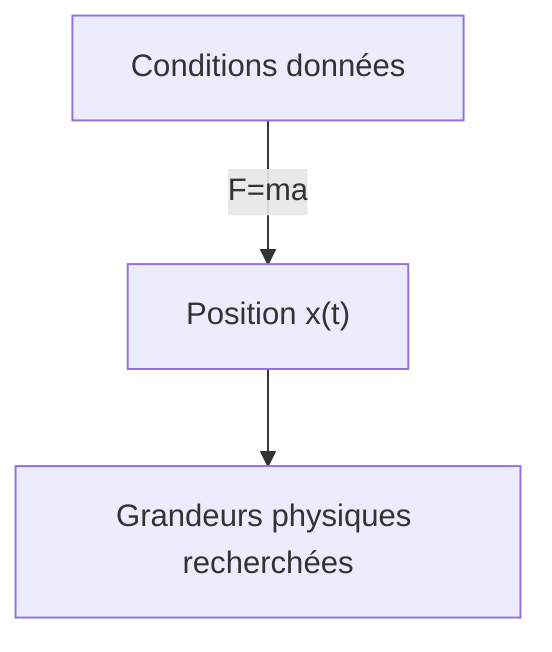
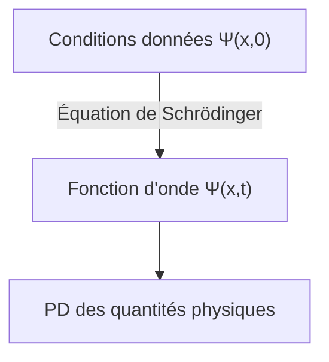

## TL;DR
> - L'équation de Schrödinger (dépendante du temps) : 
>
> $$ i\hbar\frac{\partial \Psi}{\partial t} = - \frac{\hbar^2}{2m}\frac{\partial^2 \Psi}{\partial x^2} + V\Psi $$
>
> - Interprétation statistique de la fonction d'onde $\Psi(x,t)$ (interprétation de Born) : le carré du module de la fonction d'onde $\|\Psi(x,t)\|^2$ est la **fonction de densité de probabilité** de trouver la particule au temps $t$ et à la position $x$.
> - Normalisation de la fonction d'onde :
>   - $\int_{-\infty}^{\infty} \|\Psi(x,t)\|^2 dx = 1$
>   - Si $\Psi(x,t)$ est une solution de l'équation de Schrödinger, alors $A\Psi(x,t)$ est également une solution pour toute constante complexe $A$. La normalisation consiste à déterminer la constante $A$ de manière à satisfaire l'équation ci-dessus.
>   - Les **solutions non normalisables** ne peuvent pas représenter des particules et ne sont donc pas des fonctions d'onde valides. Seules les solutions **de carré intégrable** représentent des états physiquement possibles.
>   - Une fonction d'onde normalisée à un moment donné reste normalisée au fil du temps, même si $\Psi$ évolue.
> - Courant de probabilité :
>   - $J(x,t) \equiv \cfrac{i\hbar}{2m}\left(\Psi\cfrac{\partial \Psi^\*}{\partial x}-\Psi^\*\cfrac{\partial \Psi}{\partial x}\right)$
>   - Représente le flux de probabilité (probabilité par unité de temps) traversant le point $x$
>   - Si $P_{ab}(t)$ est la probabilité de trouver la particule dans la région $a<x<b$ au temps $t$, alors $\cfrac{dP_{ab}}{dt} = J(a,t) - J(b,t)$
{: .prompt-info }

## Prerequisites
- Distributions de probabilité continues et densité de probabilité

## L'équation de Schrödinger (Schrödinger equation)
Considérons une particule de masse $m$ se déplaçant le long de l'axe $x$ sous l'influence d'une force $F(x,t)$.

En mécanique classique, l'objectif principal est de déterminer la position $x(t)$ de la particule à tout moment en appliquant l'équation du mouvement de Newton $F=ma$. Ce processus peut être représenté approximativement par le diagramme suivant :

En mécanique quantique, le même problème est abordé de manière très différente. L'approche quantique consiste à résoudre **l'équation de Schrödinger** suivante pour trouver la **fonction d'onde** $\Psi(x,t)$ de la particule.

$$ \begin{gather*}
i\hbar\frac{\partial \Psi}{\partial t} = - \frac{\hbar^2}{2m}\frac{\partial^2 \Psi}{\partial x^2} + V\Psi. \label{eqn:schrodinger_eqn}\tag{1}\\
\text{(} i=\sqrt{-1}\text{, } \hbar=\frac{h}{2\pi}=1.054573\times10^{-34}\text{, } h\text{: constante de Planck, } V(x)\text{: énergie potentielle)}
\end{gather*} $$

> *Source de l'image*
> - Auteur : utilisateur Wikimedia Xcodexif
> - Licence : [CC BY-SA 4.0](https://creativecommons.org/licenses/by-sa/4.0/)

## Interprétation statistique de la fonction d'onde $\Psi(x,t)$ (interprétation de Born)
Alors qu'en mécanique classique une particule est localisée en un point, en mécanique quantique la fonction d'onde qui représente l'état de la particule est une fonction de $x$ pour un $t$ donné, donc étendue dans l'espace. Comment interpréter cette signification physique ?

Selon l'**interprétation statistique** de Born, le carré du module de la fonction d'onde $\|\Psi(x,t)\|^2$ est la densité de probabilité de trouver la particule au temps $t$ et à la position $x$. Bien que la fonction d'onde $\Psi$ elle-même soit complexe, $\|\Psi\|^2=\Psi^\*\Psi$ (où $\Psi^\*$ est le complexe conjugué de $\Psi$) est un nombre réel positif ou nul, ce qui permet cette interprétation. On peut donc écrire :

$$ \int_a^b |\Psi(x,t)|^2 dx = \text{probabilité de trouver la particule entre }a\text{ et }b\text{ au temps }t. \tag{2}$$

Cette interprétation statistique implique que la mécanique quantique comporte une forme d'**indéterminisme**. Même en connaissant tout sur la particule (sa fonction d'onde), on ne peut connaître que la distribution de probabilité des résultats possibles, sans pouvoir déterminer une valeur précise.

Cette idée étant difficile à accepter intuitivement, on s'est naturellement demandé si cet indéterminisme était dû à une lacune de la mécanique quantique ou s'il s'agissait d'une caractéristique fondamentale de la nature.

## Perspectives sur l'indéterminisme quantique (quantum indeterminacy)
Supposons qu'en mesurant la position d'une particule, on découvre qu'elle se trouve au point $C$. Où était cette particule juste avant la mesure ?

### Position réaliste (realist)

> "Dieu ne joue pas aux dés." ("God does not play dice.")  
> *par Albert Einstein*

La particule était déjà au point $C$ depuis le début. C'est aussi le point de vue d'Einstein et de Schrödinger. Cependant, selon cette perspective, la mécanique quantique est une théorie incomplète puisqu'elle ne peut prédire que la distribution de probabilité de la position d'une particule alors que celle-ci se trouve en réalité exactement au point $C$. Ainsi, selon cette vision, l'indéterminisme n'est pas une caractéristique fondamentale de la nature mais une limitation de la mécanique quantique, et il doit exister des variables cachées supplémentaires au-delà de $\Psi$ qui permettraient de décrire parfaitement la particule.

> Schrödinger était un ancien assistant d'Einstein et a continué à échanger avec lui par la suite. Sa position réaliste et déterministe est très probablement influencée par Einstein.
{: .prompt-info }

### Position orthodoxe (orthodox)

> "Arrêtez de dire à Dieu ce qu'il doit faire avec ses dés." ("Stop telling God what to do with his dice.")  
> *par Niels Bohr, en réponse à la citation précédente d'Einstein*
>
> "L'observation ne se contente pas de perturber ce qui doit être mesuré, elle le produit" ("Observations not only disturb what is to be measured, they produce it")  
> ...  
> "Nous la contraignons à assumer une position définie." ("We compel to assume a definite position.")  
> *par Pascual Jordan*

Jusqu'au moment de la mesure, la particule n'existe que sous forme de distribution de probabilité et n'est nulle part en particulier. C'est seulement l'acte de mesure qui fait apparaître la particule à une position précise. Cette interprétation est appelée **l'interprétation de Copenhague**, proposée à l'Université de Copenhague par Bohr et Heisenberg.

> Il est intéressant de noter que, tout comme la relation entre Einstein et Schrödinger, Heisenberg était également un disciple de Bohr.
{: .prompt-info }

### Position agnostique (agnostic)

> "Comme pour la vieille question de savoir combien d'anges peuvent s'asseoir sur la pointe d'une aiguille, on ne devrait pas se casser la tête sur le problème de savoir si quelque chose dont on ne peut rien savoir existe malgré tout." ("One should no more rack one's brain about the problem of whether something one cannot know anything about exists all the same, than about the ancient question of how many angels are able to sit on the point of a needle.")  
> *par Wolfgang Pauli*

Cette position refuse de répondre. Quelle que soit l'affirmation sur l'état de la particule avant la mesure, si la seule façon de vérifier cette affirmation est de faire une mesure, alors ce n'est plus "avant la mesure". Discuter de quelque chose qui est fondamentalement inconnaissable relève de la métaphysique.

### Consensus actuel
En 11964 de l'ère humaine, John Bell a démontré qu'il existe des différences observables selon que les particules ont ou non des positions précises avant la mesure, ce qui a écarté la position agnostique. Des expériences ultérieures ont favorisé l'interprétation de Copenhague, qui est devenue dominante. Par conséquent, sauf mention contraire, les discussions sur la mécanique quantique présupposent généralement cette interprétation.

> Il existe toujours d'autres interprétations potentiellement valides, comme les théories à variables cachées non locales (nonlocal hidden variable theories) ou l'interprétation des mondes multiples (many worlds interpretation).
{: .prompt-info }

## Mesure et effondrement de la fonction d'onde
La particule n'a pas de position précise jusqu'à ce qu'elle soit mesurée, moment où elle acquiert une position spécifique $C$ (qui, en raison du principe d'incertitude de Heisenberg que nous aborderons dans un autre article, n'est pas parfaitement précise mais comporte une marge d'erreur). Cependant, si l'on effectue immédiatement une deuxième mesure après la première, on obtient toujours le même résultat. Cela s'explique comme suit :

Au moment de la première mesure, la fonction d'onde de l'objet mesuré change radicalement pour se concentrer autour du point $C$, formant un graphe $\|\Psi(x,t)\|^2$ étroit et pointu. On dit que la fonction d'onde s'est **effondrée (collapsed)** au point $C$ en raison de la mesure.

Ainsi, les processus physiques peuvent être divisés en deux types distincts :
- Les processus ordinaires où la fonction d'onde évolue lentement selon l'équation de Schrödinger
- Les processus de mesure où $\Psi$ s'effondre soudainement et de façon discontinue

> Une fonction d'onde qui s'est effondrée suite à une mesure recommence à s'étendre dans l'espace avec le temps, conformément à l'équation de Schrödinger. Pour reproduire le même résultat de mesure, il faut donc effectuer la deuxième mesure immédiatement.
{: .prompt-tip }

## Normalisation de la fonction d'onde (Normalization)
Puisque le carré du module de la fonction d'onde $\|\Psi(x,t)\|^2$ est la densité de probabilité de trouver la particule au temps $t$ et à la position $x$, l'intégrale de $\|\Psi\|^2$ sur tout $x$ doit être égale à 1.

$$ \int_{-\infty}^{\infty} |\Psi(x,t)|^2 dx = 1. \label{eqn:wavefunction_norm}\tag{3} $$

Dans l'équation ($\ref{eqn:schrodinger_eqn}$), si $\Psi(x,t)$ est une solution, alors $A\Psi(x,t)$ est également une solution pour toute constante complexe $A$. Il faut donc déterminer cette constante $A$ pour satisfaire l'équation ($\ref{eqn:wavefunction_norm}$), processus appelé normalisation de la fonction d'onde. Certaines solutions de l'équation de Schrödinger divergent vers l'infini lorsqu'on les intègre, auquel cas il n'existe pas de constante $A$ satisfaisant l'équation ($\ref{eqn:wavefunction_norm}$). Il en va de même pour la solution triviale $\Psi=0$. Ces **solutions non normalisables** ne peuvent pas représenter des particules et ne sont donc pas des fonctions d'onde valides. Les états physiquement possibles correspondent aux solutions **de carré intégrable** de l'équation de Schrödinger.

Une propriété importante de l'équation de Schrödinger est que <u>si une fonction d'onde est normalisée à un moment donné, elle reste normalisée ($\int_{-\infty}^{\infty} |\Psi(x,t)|^2 dx = 1$) au fil du temps, même si $\Psi$ évolue</u>. Si la fonction d'onde devait être normalisée avec différentes valeurs de $A$ à chaque instant, $A$ ne serait plus une constante mais une fonction du temps $t$, ce qui rendrait impossible la résolution de l'équation de Schrödinger. Grâce à cette propriété, la valeur de $A$ utilisée pour normaliser la condition initiale ($t=0$) reste valable indépendamment du temps $t$.

### Démonstration

$$ \frac{d}{dt}\int_{-\infty}^{\infty} |\Psi(x,t)|^2 dx = \int_{-\infty}^{\infty} \frac{\partial}{\partial t}|\Psi(x,t)|^2 dx. \label{eqn:norm_proof_1}\tag{4} $$

> L'intégrale de $\|\Psi\|^2$ par rapport à $x$ est une fonction de $t$ uniquement, donc on utilise la dérivée totale ($d/dt$) dans le membre de gauche, mais $\|\Psi\|^2$ lui-même est une fonction de deux variables $x$ et $t$, donc on utilise la dérivée partielle ($\partial/\partial t$) dans le membre de droite.
{: .prompt-tip }

Selon la règle de dérivation d'un produit, on peut réécrire l'équation ci-dessus comme suit :

$$ \frac{\partial}{\partial t}|\Psi|^2 = \frac{\partial}{\partial t}(\Psi^*\Psi) = \Psi^*\frac{\partial \Psi}{\partial t} + \frac{\partial \Psi^*}{\partial t}\Psi. \label{eqn:norm_proof_2}\tag{5}$$

En multipliant les deux membres de l'équation de Schrödinger ($\ref{eqn:schrodinger_eqn}$) par $-\cfrac{i}{\hbar}$, on obtient :

$$ \frac{\partial \Psi}{\partial t} = \frac{i\hbar}{2m}\frac{\partial^2 \Psi}{\partial x^2}-\frac{i}{\hbar}V\Psi \label{eqn:norm_proof_3}\tag{6}$$

En prenant le complexe conjugué de $\cfrac{\partial \Psi}{\partial t}$ dans l'équation ci-dessus, on obtient :

$$ \frac{\partial \Psi^*}{\partial t} = -\frac{i\hbar}{2m}\frac{\partial^2 \Psi^*}{\partial x^2}+\frac{i}{\hbar}V\Psi^* \label{eqn:norm_proof_4}\tag{7}$$

En substituant ($\ref{eqn:norm_proof_3}$) et ($\ref{eqn:norm_proof_4}$) dans ($\ref{eqn:norm_proof_2}$), on obtient :

$$\begin{align*}
\frac{\partial}{\partial t}|\Psi|^2 &= \frac{i\hbar}{2m}\left(\Psi^*\frac{\partial^2\Psi}{\partial x^2}-\frac{\partial^2\Psi^*}{\partial x^2}\Psi\right) \\
&= \frac{\partial}{\partial x}\left[\frac{i\hbar}{2m}\left(\Psi^*\frac{\partial\Psi}{\partial x}-\frac{\partial\Psi^*}{\partial x}\Psi \right) \right] 
\end{align*} \label{eqn:norm_proof_5}\tag{8}$$

En substituant cela dans le membre de droite de l'équation ($\ref{eqn:norm_proof_1}$), on obtient :

$$ \frac{d}{dt}\int_{-\infty}^{\infty} |\Psi(x,t)|^2 dx = \frac{i\hbar}{2m}\left(\Psi^*\frac{\partial\Psi}{\partial x}-\frac{\partial\Psi^*}{\partial x}\Psi \right)\Bigg|_{-\infty}^{\infty}. \label{eqn:norm_proof_6}\tag{9} $$

Pour qu'une fonction d'onde soit normalisable et physiquement valide, $\Psi(x,t)$ doit tendre vers $0$ lorsque $x$ tend vers $\pm\infty$. Par conséquent :

$$ \frac{d}{dt}\int_{-\infty}^{\infty} |\Psi(x,t)|^2 dx = 0 \label{eqn:norm_proof_fin}\tag{10} $$

Donc, $\int_{-\infty}^{\infty} \|\Psi(x,t)\|^2 dx$ est une constante indépendante du temps.

$$ \therefore \text{Si }\Psi\text{ est normalisée à un moment donné }t\text{, elle reste normalisée pour tout autre moment }t. \blacksquare $$

## Courant de probabilité (probability current)
Considérons maintenant la probabilité $P_{ab}(t)$ de trouver la particule dans la région $a<x<b$ au temps $t$. On a :

$$ P_{ab}(t) = \int_a^b |\Psi(x,t)|^2 dx \tag{11}$$

et,

$$ \begin{align*}
\frac{dP_{ab}}{dt} &= \frac{d}{dt}\int_a^b |\Psi(x,t)|^2 dx \\
&= \int_a^b \frac{\partial}{\partial t}|\Psi(x,t)|^2 dx \quad \text{(voir équation }\ref{eqn:norm_proof_1}\text{)}\\
&= \int_a^b \left(\frac{\partial \Psi^*}{\partial t}\Psi + \Psi^*\frac{\partial \Psi}{\partial t} \right)dx \quad \text{(voir équation }\ref{eqn:norm_proof_2}\text{)} \\
&= \frac{i\hbar}{2m}\int_a^b \left(\Psi^*\frac{\partial^2\Psi}{\partial x^2}-\frac{\partial^2\Psi^*}{\partial x^2}\Psi\right)dx \\
&= \frac{i\hbar}{2m}\int_a^b\frac{\partial}{\partial x}\left(\Psi^*\frac{\partial\Psi}{\partial x}-\frac{\partial\Psi^*}{\partial x}\Psi \right)dx \quad \text{(voir équations }\ref{eqn:norm_proof_3},\ref{eqn:norm_proof_4},\ref{eqn:norm_proof_5}\text{)}\\
&= \frac{i\hbar}{2m}\left(\Psi^*\frac{\partial \Psi}{\partial x}-\frac{\partial \Psi^*}{\partial x}\Psi \right)\Bigg|^b_a \\
&= \frac{i\hbar}{2m}\left(\Psi\frac{\partial \Psi^*}{\partial x}-\Psi^*\frac{\partial \Psi}{\partial x} \right)\Bigg|^a_b
\end{align*} $$

Si l'on définit :

$$ J(x,t) \equiv \frac{i\hbar}{2m}\left(\Psi\frac{\partial \Psi^*}{\partial x}-\Psi^*\frac{\partial \Psi}{\partial x}\right) \label{eqn:probability_current}\tag{12}$$

alors,

$$ \frac{dP_{ab}}{dt} = J(a,t) - J(b,t) \label{eqn:probability_over_time}\tag{13}$$

$J(x,t)$, défini par l'équation ($\ref{eqn:probability_current}$), est appelé **courant de probabilité** et représente le flux de probabilité (probabilité par unité de temps) traversant le point $x$. Selon l'équation ($\ref{eqn:probability_over_time}$), si le courant de probabilité entrant par une extrémité $J(a,t)$ est supérieur au courant sortant par l'autre extrémité $J(b,t)$ à un moment donné $t$, alors $P_{ab}$ augmente, et inversement.

> *On peut considérer cela comme analogue au débit en mécanique des fluides, où la masse ou le volume du fluide est remplacé par la probabilité.
{: .prompt-info }
