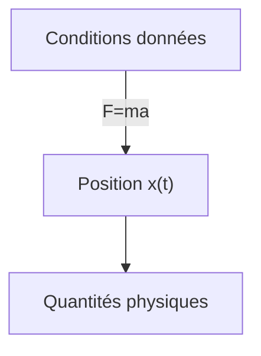
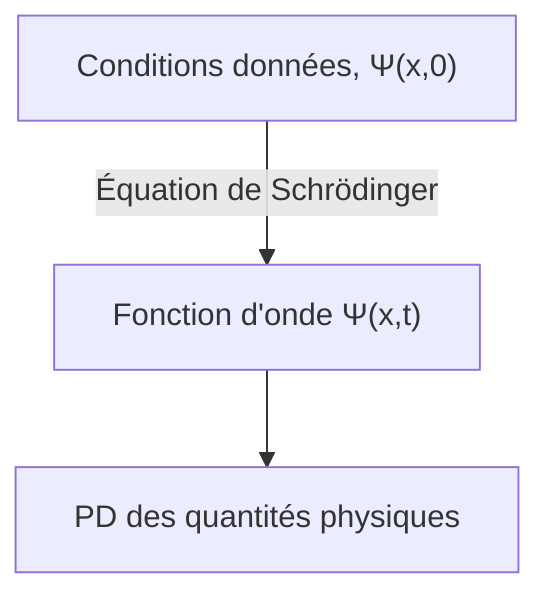

## Prérequis
- Distribution de probabilité continue et densité de probabilité

## L'équation de Schrödinger (Schrödinger equation)
Considérons une particule de masse $m$ se déplaçant sur l'axe $x$ sous l'influence d'une force donnée $F(x,t)$.

En mécanique classique, l'objectif principal est de déterminer la position $x(t)$ de la particule à tout moment en appliquant l'équation du mouvement de Newton $F=ma$. Ce processus peut être représenté approximativement par le diagramme suivant :

En mécanique quantique, le même problème est abordé d'une manière très différente. L'approche de la mécanique quantique consiste à résoudre l'**équation de Schrödinger (Schrödinger equation)** suivante pour trouver la **fonction d'onde** $\Psi(x,t)$ de la particule.

$$ \begin{gather*}
i\hbar\frac{\partial \Psi}{\partial t} = - \frac{\hbar^2}{2m}\frac{\partial^2 \Psi}{\partial x^2} + V\Psi. \label{eqn:schrodinger_eqn}\tag{1}\\
\text{(} i=\sqrt{-1}\text{, } \hbar=\frac{h}{2\pi}=1.054573\times10^{-34}\text{, } h\text{: constante de Planck, } V(x)\text{: énergie potentielle)}
\end{gather*} $$

> *Source de l'image*
> - Auteur : Utilisateur Wikimedia Xcodexif
> - Licence : [CC BY-SA 4.0](https://creativecommons.org/licenses/by-sa/4.0/)

## Interprétation statistique de la fonction d'onde $\Psi(x,t)$ (Interprétation de Born)
Alors qu'en mécanique classique une particule est située en un point, en mécanique quantique, la fonction d'onde représentant l'état de la particule est une fonction de $x$ pour un $t$ donné, c'est-à-dire qu'elle est étendue dans l'espace. Comment interpréter sa signification physique ?

Selon l'**interprétation statistique** de Born, le carré du module de la fonction d'onde $\|\Psi(x,t)\|^2$ est la fonction de densité de probabilité de trouver la particule à la position $x$ au temps $t$. Bien que la fonction d'onde $\Psi$ elle-même soit complexe, $\|\Psi\|^2=\Psi^\*\Psi$ ($\Psi^\*$ est le complexe conjugué de $\Psi$) est un nombre réel non négatif, ce qui permet cette interprétation. On peut l'exprimer comme suit :

$$ \int_a^b |\Psi(x,t)|^2 dx = \text{Probabilité de trouver la particule entre }a\text{ et }b\text{ au temps }t. \tag{2}$$

Cette interprétation statistique implique que la mécanique quantique comporte une certaine **indétermination (indeterminacy)**. Même si on connaît tout sur la particule (la fonction d'onde), on ne peut connaître que la distribution de probabilité des résultats possibles, sans pouvoir déterminer une valeur spécifique.

Comme cela était difficile à accepter intuitivement, des questions ont naturellement été soulevées quant à savoir si cette indétermination était due à un défaut de la mécanique quantique ou s'il s'agissait d'une caractéristique fondamentale de la nature.

## Perspectives sur l'indétermination quantique (quantum indeterminacy)
Supposons que nous ayons mesuré la position d'une particule et découvert qu'elle se trouve au point $C$. Où était la particule juste avant la mesure ?

### Position réaliste (realist)

> "Dieu ne joue pas aux dés." ("God does not play dice.")  
> *par Albert Einstein*

La particule était déjà au point $C$. C'est aussi le point de vue d'Einstein et de Schrödinger. Cependant, de ce point de vue, la mécanique quantique est une théorie incomplète car, bien que la particule soit en réalité exactement au point $C$, les limites de la théorie ne permettent de connaître la position de la particule que sous forme de distribution de probabilité jusqu'à la mesure. Selon cette perspective, l'indétermination n'est pas une caractéristique fondamentale de la nature, mais résulte des limites de la mécanique quantique, et il existe des variables cachées supplémentaires en plus de $\Psi$ qu'il faut connaître pour décrire parfaitement la particule.

> Schrödinger était un élève d'Einstein et a travaillé comme assistant sous sa direction pendant un certain temps, puis a continué à échanger avec Einstein par la suite. Il est probable que la position réaliste et déterministe de Schrödinger soit également influencée par cela.
{: .prompt-info }

### Position orthodoxe (orthodox)

> "Arrêtez de dire à Dieu ce qu'il doit faire avec ses dés." ("Stop telling God what to do with his dice.")  
> *par Niels Bohr, en réponse à la citation précédente d'Einstein*
>
> "Les observations non seulement perturbent ce qui doit être mesuré, elles le produisent" ("Observations not only disturb what is to be measured, they produce it")  
> ...  
> "Nous le contraignons à assumer une position définie." ("We compel to assume a definite position.")  
> *par Pascual Jordan*

Jusqu'à la mesure, la particule n'existe que sous forme de distribution de probabilité et n'est nulle part, et ce n'est que lorsque l'acte de mesure est effectué que la particule apparaît à une position spécifique. Cette interprétation est appelée **interprétation de Copenhague**, proposée par Bohr et Heisenberg à l'Université de Copenhague.

> Il est intéressant de noter que, tout comme la relation entre Einstein et Schrödinger, Heisenberg était également un élève de Bohr.
{: .prompt-info }

### Position agnostique (agnostic)

> "On ne devrait pas plus se creuser la tête sur le problème de savoir si quelque chose dont on ne peut rien savoir existe malgré tout, que sur l'ancienne question de savoir combien d'anges peuvent s'asseoir sur la pointe d'une aiguille." ("One should no more rack one's brain about the problem of whether something one cannot know anything about exists all the same, than about the ancient question of how many angels are able to sit on the point of a needle.")  
> *par Wolfgang Pauli*

Refuse de répondre. Quelle que soit l'affirmation sur l'état de la particule avant la mesure, si la seule façon de vérifier cette affirmation est la mesure, alors ce n'est plus "avant la mesure", alors quel sens cela a-t-il ? Ce n'est que de la métaphysique qui spécule sur quelque chose qui est fondamentalement invérifiable et inconnaissable.

### Consensus actuel
En 1964, John Bell a prouvé qu'il y avait une différence observable selon que la particule existe ou non à une position précise avant ou après la mesure, excluant ainsi la position agnostique. Par la suite, des expériences ont conduit à l'adoption majoritaire de l'interprétation de Copenhague. Par conséquent, sauf mention contraire, on suppose généralement cette interprétation de Copenhague lorsqu'on traite de mécanique quantique.

> Il existe toujours d'autres interprétations potentiellement valables autres que l'interprétation de Copenhague, comme les théories à variables cachées non locales (nonlocal hidden variable theories) ou l'interprétation des mondes multiples (many worlds interpretation).
{: .prompt-info }

## Mesure et effondrement de la fonction d'onde
La particule n'a pas de position précise jusqu'à la mesure, et c'est seulement par la mesure qu'elle acquiert une position spécifique $C$ (en fait, en raison du principe d'incertitude de Heisenberg, que nous aborderons dans un autre article, même cette position n'est pas une valeur parfaitement précise mais a une certaine marge d'erreur). Cependant, si une mesure supplémentaire est effectuée immédiatement après cette première mesure, on obtient toujours le même résultat à chaque mesure. Cela s'explique comme suit :

Au moment de la première mesure, la fonction d'onde de l'objet mesuré change brusquement pour former un graphe de $\|\Psi(x,t)\|^2$ étroit et pointu concentré autour du point $C$. On dit que la fonction d'onde s'est **effondrée (collapsed)** au point $C$ en raison de la mesure.

Ainsi, on peut diviser les processus physiques en deux types distincts :
- Le processus ordinaire où la fonction d'onde change lentement selon l'équation de Schrödinger
- Le processus de mesure où $\Psi$ s'effondre soudainement et de manière discontinue

> La fonction d'onde effondrée par la mesure se propage à nouveau spatialement avec le temps selon l'équation de Schrödinger. Par conséquent, pour reproduire le même résultat de mesure, la deuxième mesure doit être effectuée immédiatement.
{: .prompt-tip }

## Normalisation de la fonction d'onde (Normalization)
Comme le carré du module de la fonction d'onde $\|\Psi(x,t)\|^2$ est la densité de probabilité de trouver la particule à la position $x$ au temps $t$, l'intégrale de $\|\Psi\|^2$ sur tous les $x$ doit être égale à 1.

$$ \int_{-\infty}^{\infty} |\Psi(x,t)|^2 dx = 1. \label{eqn:wavefunction_norm}\tag{3} $$

On peut voir dans l'équation ($\ref{eqn:schrodinger_eqn}$) que si $\Psi(x,t)$ est une solution, alors $A\Psi(x,t)$ est aussi une solution pour toute constante complexe $A$. Par conséquent, il faut déterminer ce $A$ pour satisfaire l'équation ($\ref{eqn:wavefunction_norm}$), et ce processus est appelé normalisation de la fonction d'onde. Certaines solutions de l'équation de Schrödinger divergent vers l'infini lorsqu'on les intègre, et dans ce cas, il n'existe pas de constante $A$ satisfaisant l'équation ($\ref{eqn:wavefunction_norm}$). C'est également le cas pour la solution triviale $\Psi=0$. Ces **solutions non normalisables (non-normalizable solutions)** ne peuvent pas représenter une particule et ne sont donc pas des fonctions d'onde valides. Les états physiquement possibles correspondent aux solutions **de carré intégrable (square-integrable)** de l'équation de Schrödinger.

De plus, une propriété importante de l'équation de Schrödinger est que <u>une fonction d'onde normalisée à un moment donné reste normalisée ($\int_{-\infty}^{\infty} |\Psi(x,t)|^2 dx = 1$) au fil du temps, même si $\Psi$ change</u>. Si la fonction d'onde devait être normalisée avec une valeur $A$ différente à chaque instant, $A$ ne serait plus une constante mais une fonction du temps $t$, et il ne serait plus possible de trouver une solution à l'équation de Schrödinger. Cependant, grâce à cette propriété, la valeur $A$ normalisée dans les conditions initiales ($t=0$) est conservée indépendamment du temps $t$.

### Démonstration

$$ \frac{d}{dt}\int_{-\infty}^{\infty} |\Psi(x,t)|^2 dx = \int_{-\infty}^{\infty} \frac{\partial}{\partial t}|\Psi(x,t)|^2 dx. \label{eqn:norm_proof_1}\tag{4} $$

> Le résultat de l'intégration de $\|\Psi\|^2$ par rapport à $x$ est une fonction de $t$ uniquement, donc on utilise la dérivée totale ($d/dt$) dans le membre de gauche, mais $\|\Psi\|^2$ lui-même est une fonction de deux variables $x$ et $t$, donc on utilise la dérivée partielle ($\partial/\partial t$) dans le membre de droite.
{: .prompt-tip }

On peut réécrire l'équation ci-dessus selon la règle de dérivation du produit comme suit :

$$ \frac{\partial}{\partial t}|\Psi|^2 = \frac{\partial}{\partial t}(\Psi^*\Psi) = \Psi^*\frac{\partial \Psi}{\partial t} + \frac{\partial \Psi^*}{\partial t}\Psi. \label{eqn:norm_proof_2}\tag{5}$$

Si on multiplie les deux côtés de l'équation de Schrödinger ($\ref{eqn:schrodinger_eqn}$) par $-\cfrac{i}{\hbar}$, on obtient

$$ \frac{\partial \Psi}{\partial t} = \frac{i\hbar}{2m}\frac{\partial^2 \Psi}{\partial x^2}-\frac{i}{\hbar}V\Psi \label{eqn:norm_proof_3}\tag{6}$$

et en prenant le complexe conjugué de $\cfrac{\partial \Psi}{\partial t}$ dans l'équation ci-dessus, on obtient

$$ \frac{\partial \Psi^*}{\partial t} = -\frac{i\hbar}{2m}\frac{\partial^2 \Psi^*}{\partial x^2}+\frac{i}{\hbar}V\Psi^* \label{eqn:norm_proof_4}\tag{7}$$

Maintenant, en substituant ($\ref{eqn:norm_proof_3}$) et ($\ref{eqn:norm_proof_4}$) dans l'équation ($\ref{eqn:norm_proof_2}$), on obtient

$$\begin{align*}
\frac{\partial}{\partial t}|\Psi|^2 &= \frac{i\hbar}{2m}\left(\Psi^*\frac{\partial^2\Psi}{\partial x^2}-\frac{\partial^2\Psi^*}{\partial x^2}\Psi\right) \\
&= \frac{\partial}{\partial x}\left[\frac{i\hbar}{2m}\left(\Psi^*\frac{\partial\Psi}{\partial x}-\frac{\partial\Psi^*}{\partial x}\Psi \right) \right] 
\end{align*} \label{eqn:norm_proof_5}\tag{8}$$

et en substituant cela dans le membre de droite de l'équation initiale ($\ref{eqn:norm_proof_1}$), on obtient

$$ \frac{d}{dt}\int_{-\infty}^{\infty} |\Psi(x,t)|^2 dx = \frac{i\hbar}{2m}\left(\Psi^*\frac{\partial\Psi}{\partial x}-\frac{\partial\Psi^*}{\partial x}\Psi \right)\Bigg|_{-\infty}^{\infty}. \label{eqn:norm_proof_6}\tag{9} $$

Cependant, pour que la fonction d'onde soit normalisée et physiquement valide, $\Psi(x,t)$ doit converger vers 0 lorsque $x$ tend vers $\pm\infty$. Par conséquent,

$$ \frac{d}{dt}\int_{-\infty}^{\infty} |\Psi(x,t)|^2 dx = 0 \label{eqn:norm_proof_fin}\tag{10} $$

donc $\int_{-\infty}^{\infty} \|\Psi(x,t)\|^2 dx$ est une constante indépendante du temps.

$$ \therefore \text{Si }\Psi\text{ est normalisée à un instant }t\text{ donné, elle reste normalisée pour tout autre instant }t. \blacksquare $$
