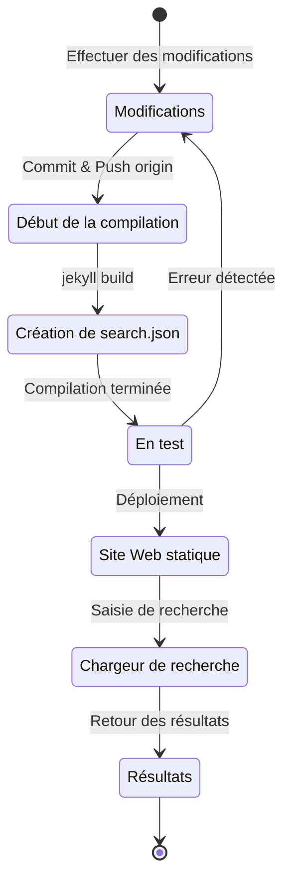

## Aperçu
Il y a environ 4 mois, début juillet 2024, j'ai ajouté le support multilingue à ce blog hébergé sur GitHub Pages et basé sur Jekyll en appliquant le plugin [Polyglot](https://github.com/untra/polyglot).
Cette série partage les bugs rencontrés lors de l'application du plugin Polyglot au thème Chirpy, leur processus de résolution, ainsi que la méthode pour écrire les en-têtes HTML et le sitemap.xml en tenant compte du SEO.
La série se compose de deux articles, et celui que vous lisez est le deuxième de la série.
- Partie 1 : [Application du plugin Polyglot & implémentation des balises alt hreflang, du sitemap et du bouton de sélection de langue](/posts/how-to-support-multi-language-on-jekyll-blog-with-polyglot-1)
- Partie 2 : Dépannage des erreurs de compilation du thème Chirpy et de la fonction de recherche (cet article)

## Exigences
- [x] Le résultat de la compilation (pages web) doit pouvoir être fourni en distinguant les chemins par langue (ex. `/posts/ko/`{: .filepath}, `/posts/ja/`{: .filepath}).
- [x] Pour minimiser le temps et l'effort supplémentaires nécessaires au support multilingue, la langue doit pouvoir être automatiquement reconnue lors de la compilation en fonction du chemin local où se trouve le fichier original Markdown (ex. `/_posts/ko/`{: .filepath}, `/_posts/ja/`{: .filepath}), sans avoir à spécifier manuellement les balises 'lang' et 'permalink' dans le YAML front matter du fichier Markdown écrit.
- [x] L'en-tête de chaque page du site doit inclure les balises méta Content-Language appropriées et les balises alternatives hreflang pour répondre aux directives SEO de Google pour la recherche multilingue.
- [x] Le `sitemap.xml` doit pouvoir fournir tous les liens des pages prenant en charge chaque langue sur le site sans omission, et le `sitemap.xml` lui-même ne doit exister qu'une seule fois dans le chemin racine sans duplication.
- [x] Toutes les fonctionnalités fournies par le [thème Chirpy](https://github.com/cotes2020/jekyll-theme-chirpy) doivent fonctionner normalement sur chaque page de langue, et si ce n'est pas le cas, elles doivent être modifiées pour fonctionner correctement.
  - [x] Fonctionnement normal des fonctions 'Recently Updated', 'Trending Tags'
  - [x] Pas d'erreur lors du processus de compilation utilisant GitHub Actions
  - [x] Fonctionnement normal de la fonction de recherche de posts en haut à droite du blog

## Avant de commencer
Cet article fait suite à la [partie 1](/posts/how-to-support-multi-language-on-jekyll-blog-with-polyglot-1), donc si vous ne l'avez pas encore lue, il est recommandé de la lire d'abord.

## Dépannage ('relative_url_regex': target of repeat operator is not specified)
Après avoir terminé les étapes précédentes, lorsque j'ai exécuté la commande `bundle exec jekyll serve` pour tester la compilation, la compilation a échoué avec l'erreur `'relative_url_regex': target of repeat operator is not specified`.

```shell
...(début omis)
                    ------------------------------------------------
      Jekyll 4.3.4   Please append `--trace` to the `serve` command 
                     for any additional information or backtrace. 
                    ------------------------------------------------
/Users/yunseo/.gem/ruby/3.2.2/gems/jekyll-polyglot-1.8.1/lib/jekyll/polyglot/
patches/jekyll/site.rb:234:in `relative_url_regex': target of repeat operator 
is not specified: /href="?\/((?:(?!*.gem)(?!*.gemspec)(?!tools)(?!README.md)(
?!LICENSE)(?!*.config.js)(?!rollup.config.js)(?!package*.json)(?!.sass-cache)
(?!.jekyll-cache)(?!gemfiles)(?!Gemfile)(?!Gemfile.lock)(?!node_modules)(?!ve
ndor\/bundle\/)(?!vendor\/cache\/)(?!vendor\/gems\/)(?!vendor\/ruby\/)(?!en\/
)(?!ko\/)(?!es\/)(?!pt-BR\/)(?!ja\/)(?!fr\/)(?!de\/)[^,'"\s\/?.]+\.?)*(?:\/[^
\]\[)("'\s]*)?)"/ (RegexpError)

...(fin omise)
```

Après avoir recherché si un problème similaire avait déjà été signalé, j'ai trouvé [exactement le même problème](https://github.com/untra/polyglot/issues/204) enregistré dans le dépôt Polyglot, avec une solution existante.

Le fichier `_config.yml` du [thème Chirpy](https://github.com/cotes2020/jekyll-theme-chirpy/blob/master/_config.yml) appliqué à ce blog contient la clause suivante :

```yml
exclude:
  - "*.gem"
  - "*.gemspec"
  - docs
  - tools
  - README.md
  - LICENSE
  - "*.config.js"
  - package*.json
```
{: file='_config.yml'}

La cause du problème réside dans le fait que les expressions régulières des deux fonctions suivantes incluses dans le fichier [`site.rb` de Polyglot](https://github.com/untra/polyglot/blob/master/lib/jekyll/polyglot/patches/jekyll/site.rb) ne traitent pas correctement les motifs de globbing (globbing patterns) contenant des jokers comme `"*.gem"`, `"*.gemspec"`, `"*.config.js"` ci-dessus.


```ruby
    # a regex that matches relative urls in a html document
    # matches href="baseurl/foo/bar-baz" href="/foo/bar-baz" and others like it
    # avoids matching excluded files.  prepare makes sure
    # that all @exclude dirs have a trailing slash.
    def relative_url_regex(disabled = false)
      regex = ''
      unless disabled
        @exclude.each do |x|
          regex += "(?!#{x})"
        end
        @languages.each do |x|
          regex += "(?!#{x}\/)"
        end
      end
      start = disabled ? 'ferh' : 'href'
      %r{#{start}="?#{@baseurl}/((?:#{regex}[^,'"\s/?.]+\.?)*(?:/[^\]\[)("'\s]*)?)"}
    end

    # a regex that matches absolute urls in a html document
    # matches href="http://baseurl/foo/bar-baz" and others like it
    # avoids matching excluded files.  prepare makes sure
    # that all @exclude dirs have a trailing slash.
    def absolute_url_regex(url, disabled = false)
      regex = ''
      unless disabled
        @exclude.each do |x|
          regex += "(?!#{x})"
        end
        @languages.each do |x|
          regex += "(?!#{x}\/)"
        end
      end
      start = disabled ? 'ferh' : 'href'
      %r{(?<!hreflang="#{@default_lang}" )#{start}="?#{url}#{@baseurl}/((?:#{regex}[^,'"\s/?.]+\.?)*(?:/[^\]\[)("'\s]*)?)"}
    end
```
{: file='(polyglot root path)/lib/jekyll/polyglot/patches/jekyll/site.rb'}


Il existe deux façons de résoudre ce problème.

### 1. Forker Polyglot, modifier la partie problématique et l'utiliser
Au moment de la rédaction de cet article (novembre 2024), la [documentation officielle de Jekyll](https://jekyllrb.com/docs/configuration/options/#global-configuration) indique que le paramètre `exclude` prend en charge l'utilisation de motifs de globbing (globbing patterns).

>"This configuration option supports Ruby's File.fnmatch filename globbing patterns to match multiple entries to exclude."

En d'autres termes, la cause du problème ne réside pas dans le thème Chirpy mais dans les deux fonctions `relative_url_regex()` et `absolute_url_regex()` de Polyglot, donc la solution fondamentale consiste à les modifier pour qu'elles ne posent plus problème.

Comme ce bug n'a pas encore été résolu dans Polyglot, vous pouvez forker le dépôt Polyglot en vous référant à [cet article de blog](https://hionpu.com/posts/github_blog_4#4-polyglot-%EC%9D%98%EC%A1%B4%EC%84%B1-%EB%AC%B8%EC%A0%9C) et à [la réponse donnée au problème GitHub précédent](https://github.com/untra/polyglot/issues/204#issuecomment-2143270322), puis modifier la partie problématique comme suit et l'utiliser à la place du Polyglot original.


```ruby
    def relative_url_regex(disabled = false)
      regex = ''
      unless disabled
        @exclude.each do |x|
          escaped_x = Regexp.escape(x)
          regex += "(?!#{escaped_x})"
        end
        @languages.each do |x|
          escaped_x = Regexp.escape(x)
          regex += "(?!#{escaped_x}\/)"
        end
      end
      start = disabled ? 'ferh' : 'href'
      %r{#{start}="?#{@baseurl}/((?:#{regex}[^,'"\s/?.]+\.?)*(?:/[^\]\[)("'\s]*)?)"}
    end

    def absolute_url_regex(url, disabled = false)
      regex = ''
      unless disabled
        @exclude.each do |x|
          escaped_x = Regexp.escape(x)
          regex += "(?!#{escaped_x})"
        end
        @languages.each do |x|
          escaped_x = Regexp.escape(x)
          regex += "(?!#{escaped_x}\/)"
        end
      end
      start = disabled ? 'ferh' : 'href'
      %r{(?<!hreflang="#{@default_lang}" )#{start}="?#{url}#{@baseurl}/((?:#{regex}[^,'"\s/?.]+\.?)*(?:/[^\]\[)("'\s]*)?)"}
    end
```
{: file='(polyglot root path)/lib/jekyll/polyglot/patches/jekyll/site.rb'}


### 2. Remplacer les motifs de globbing par des noms de fichiers exacts dans le fichier de configuration `_config.yml` du thème Chirpy
En réalité, la méthode orthodoxe et idéale serait que le correctif ci-dessus soit intégré au flux principal de Polyglot. Cependant, en attendant, il faudrait utiliser la version forkée à la place, ce qui serait fastidieux car il faudrait suivre et refléter chaque mise à jour du flux amont de Polyglot sans les manquer à chaque fois que la version est mise à jour. C'est pourquoi j'ai utilisé une autre méthode.

Si l'on vérifie les fichiers situés dans le chemin racine du projet dans le [dépôt du thème Chirpy](https://github.com/cotes2020/jekyll-theme-chirpy) correspondant aux motifs `"*.gem"`, `"*.gemspec"`, `"*.config.js"`, il n'y en a de toute façon que 3 :
- `jekyll-theme-chirpy.gemspec`
- `purgecss.config.js`
- `rollup.config.js`

Par conséquent, si l'on supprime les motifs de globbing dans la clause `exclude` du fichier `_config.yml` et qu'on les remplace comme suit, Polyglot pourra les traiter sans problème.

```yml
exclude: # Modifié en référence au problème https://github.com/untra/polyglot/issues/204.
  # - "*.gem"
  - jekyll-theme-chirpy.gemspec # - "*.gemspec"
  - tools
  - README.md
  - LICENSE
  - purgecss.config.js # - "*.config.js"
  - rollup.config.js
  - package*.json
```

## Modification de la fonction de recherche
Après avoir terminé les étapes précédentes, presque toutes les fonctionnalités du site fonctionnaient de manière satisfaisante comme prévu. Cependant, j'ai découvert tardivement que la barre de recherche située en haut à droite de la page utilisant le thème Chirpy n'indexait pas les pages dans des langues autres que `site.default_lang` (dans le cas de ce blog, l'anglais), et affichait les pages en anglais comme résultats de recherche même lors d'une recherche dans d'autres langues que l'anglais.

Pour comprendre la cause, examinons quels sont les fichiers impliqués dans la fonction de recherche et où le problème se produit parmi eux.

### '_layouts/default.html'
En vérifiant le fichier [`_layouts/default.html`](https://github.com/cotes2020/jekyll-theme-chirpy/blob/master/_layouts/default.html) qui constitue le cadre de toutes les pages du blog, on peut constater que le contenu de `search-results.html` et `search-loader.html` est chargé à l'intérieur de l'élément `<body>`.


```liquid
  <body>
    

    <div id="main-wrapper" class="d-flex justify-content-center">
      <div class="container d-flex flex-column px-xxl-5">
        
        (...omission...)

        
      </div>

      <aside aria-label="Scroll to Top">
        <button id="back-to-top" type="button" class="btn btn-lg btn-box-shadow">
          <i class="fas fa-angle-up"></i>
        </button>
      </aside>
    </div>

    (...omission...)

    
  </body>
```
{: file='_layouts/default.html'}


### '_includes/search-result.html'
[`_includes/search-result.html`](https://github.com/cotes2020/jekyll-theme-chirpy/blob/master/_includes/search-results.html) constitue le conteneur `search-results` pour stocker les résultats de recherche pour le mot-clé saisi lors de la saisie dans la barre de recherche.


```html
<!-- The Search results -->

<div id="search-result-wrapper" class="d-flex justify-content-center d-none">
  <div class="col-11 content">
    <div id="search-hints">
      
    </div>
    <div id="search-results" class="d-flex flex-wrap justify-content-center text-muted mt-3"></div>
  </div>
</div>
```
{: file='_includes/search-result.html'}


### '_includes/search-loader.html'
[`_includes/search-loader.html`](https://github.com/cotes2020/jekyll-theme-chirpy/blob/master/_includes/search-loader.html) est la partie centrale qui implémente la recherche basée sur la bibliothèque [Simple-Jekyll-Search](https://github.com/christian-fei/Simple-Jekyll-Search). On peut voir qu'elle fonctionne côté client en exécutant JavaScript dans le navigateur du visiteur pour trouver les parties correspondant au mot-clé saisi dans le contenu du fichier d'index [`search.json`](https://github.com/cotes2020/jekyll-theme-chirpy/blob/master/assets/js/data/search.json) et renvoyer le lien du post correspondant sous forme d'élément `<article>`.


```js

  <article class="px-1 px-sm-2 px-lg-4 px-xl-0">
    <header>
      <h2><a href="{url}">{title}</a></h2>
      <div class="post-meta d-flex flex-column flex-sm-row text-muted mt-1 mb-1">
        {categories}
        {tags}
      </div>
    </header>
    <p>{snippet}</p>
  </article>


<p class="mt-5">{{ site.data.locales[include.lang].search.no_results }}</p>

<script>
   Note: dependent library will be loaded in `js-selector.html` 
  document.addEventListener('DOMContentLoaded', () => {
    SimpleJekyllSearch({
      searchInput: document.getElementById('search-input'),
      resultsContainer: document.getElementById('search-results'),
      json: '{{ '/assets/js/data/search.json' | relative_url }}',
      searchResultTemplate: '{{ result_elem | strip_newlines }}',
      noResultsText: '{{ not_found }}',
      templateMiddleware: function(prop, value, template) {
        if (prop === 'categories') {
          if (value === '') {
            return `${value}`;
          } else {
            return `<div class="me-sm-4"><i class="far fa-folder fa-fw"></i>${value}</div>`;
          }
        }

        if (prop === 'tags') {
          if (value === '') {
            return `${value}`;
          } else {
            return `<div><i class="fa fa-tag fa-fw"></i>${value}</div>`;
          }
        }
      }
    });
  });
</script>
```
{: file='_includes/search-loader.html'}


### Structure de fonctionnement de la fonction de recherche et identification de la partie problématique
En résumé, lors de l'hébergement du thème Chirpy sur GitHub Pages, la fonction de recherche fonctionne selon le processus suivant :



J'ai confirmé ici que `search.json` est bien généré pour chaque langue par Polyglot comme suit :
- /assets/js/data/search.json
- /ko/assets/js/data/search.json
- /es/assets/js/data/search.json
- /pt-BR/assets/js/data/search.json
- /ja/assets/js/data/search.json
- /fr/assets/js/data/search.json
- /de/assets/js/data/search.json

Par conséquent, la partie à l'origine du problème est le "Chargeur de recherche". Le problème de non-recherche des pages dans des langues autres que l'anglais se produit parce que `_includes/search-loader.html` charge statiquement uniquement le fichier d'index en anglais (`/assets/js/data/search.json`), indépendamment de la langue de la page actuellement visitée.

### Résolution du problème
Pour résoudre ce problème, il suffit de modifier le contenu de `_includes/search-loader.html` comme suit :


```js
(début omis...)

<script>
   Note: dependent library will be loaded in `js-selector.html` 
  document.addEventListener('DOMContentLoaded', () => {
    // Obtenir la langue actuelle
    const lang = "{{site.active_lang}}";

    // Construire le chemin JSON de recherche approprié
    const searchJsonPath = lang === "{{site.default_lang}}"
      ? '{{ "/assets/js/data/search.json" | relative_url }}'
      : `{{ "/" | relative_url }}${lang}/assets/js/data/search.json`;

    // Initialiser Simple Jekyll Search
    SimpleJekyllSearch({
      searchInput: document.getElementById('search-input'),
      resultsContainer: document.getElementById('search-results'),
      json: searchJsonPath, // Utiliser le chemin dynamique basé sur la langue
      searchResultTemplate: '{{ result_elem | strip_newlines }}',
      noResultsText: '{{ not_found }}',

(...fin omise)
```
{: file='_includes/search-loader.html'}


J'ai modifié le code JavaScript pour charger dynamiquement `searchJsonPath` en comparant la langue actuelle (`{{site.active_lang}}`) et la langue par défaut du site (`{{site.default_lang}}`). Si elles sont identiques, il charge le chemin par défaut ("/assets/js/data/search.json"), sinon il charge `${lang}/assets/js/data/search.json`. Après avoir effectué cette modification et recompilé le site web, j'ai confirmé que les résultats de recherche s'affichent correctement pour chaque langue.
